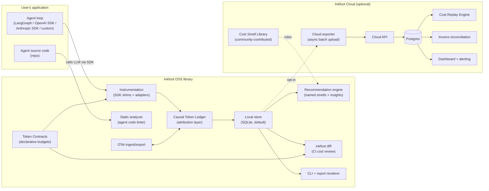
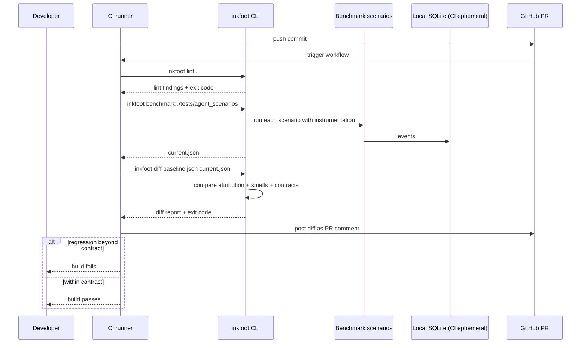

# Architecture — Inkfoot (Causal Token Economics for Agents)

> **Inkfoot — Find the hidden cost trail in every AI agent run.**

**Status:** approved design; not yet implemented.
**Product name:** Inkfoot.
**Scope:** the OSS instrumentation library, the Causal Token Ledger, the
recommendation engine, Token Contracts, the Cost Replay Engine, the
static analysis subsystem, and the SaaS analytics layer that sits on
top.
**Companion doc:** [roadmap-inkfoot.md](roadmap-inkfoot.md) — the
strategic phasing this architecture supports.

---

## 1. Context

The cost of running LLM agents in production grows silently. A team
ships an agent; three weeks later their LLM bill has tripled and
nobody can attribute the increase. Was it the new tool, the prompt
prefix changing, the model upgrade, retries spiraling, the loop
running twice as long? Existing observability tools (Langfuse,
LangSmith, Helicone) record per-call cost. Existing gateways
(LiteLLM, Bifrost, Portkey) aggregate spend. **Neither tells you
which part of the agent loop caused waste, whether it affected
outcome quality, or how to prevent it before the next run.**

The category is real and emerging, not empty. The honest competitive
picture as of mid-2026:

- **Langfuse** — closest direct competitor; observability with cost
  tracking; framework-agnostic; mature.
- **LangSmith** — cost tracking, but framework-locked to LangChain.
- **AgentCost, AgentMeter, FinOps LLM** — early-stage agent cost
  trackers; positioning overlaps; execution still thin.
- **TensorZero, Portkey, Bifrost** — gateway-first; cost is one of
  many concerns; positioned differently than us.

What none of them has is **causal token attribution**: the ability
to say "42% of this run's cost was unstable tool schema churn
introduced by node `search_customer_history` after turn 3" and *prove
the attribution from raw events*. That gap is where Inkfoot lives.

The product premise:

> **Causal token economics for agents: classify where tokens came
> from, explain why they were spent, enforce contracts before waste
> happens, and prove savings against outcome quality and provider
> invoices.**

Each of the four verbs corresponds to a phase. Classify (Phase 0) is
the data foundation. Explain (Phase 1) is the recommendation engine
and CI integration. Enforce (Phase 2) is Token Contracts. Prove
(Phase 3) is outcome tracking, replay, and invoice reconciliation.

## 2. Goals & non-goals

### Goals

- **Causal attribution by default.** Every token billed is attributed
  to a category (system prompt, tool schema, tool result, retrieved
  context, retry overhead, summariser, …). Reports surface category
  shares, not just totals.
- **Instrument, don't replace.** A team using LangGraph today can
  `pip install inkfoot` and get a per-run cost attribution in 15
  minutes without rewriting their agent. No framework lock-in.
- **Local-only by default.** OSS users get a complete profiler with
  no network calls, no signup, no telemetry. Local storage; CLI for
  reports.
- **Cost per *successful* outcome, not just cost.** Outcome tracking
  is a first-class primitive. The product surfaces
  `cost_per_success`, not just `total_cost`. Minimising spend by
  doing less work is not a win.
- **Token Contracts.** Teams declare per-task budgets, runtime
  ceilings, and cache-hit targets as YAML. Inkfoot enforces in
  runtime *and* CI.
- **Provider-native cache accounting.** Anthropic explicit markers,
  OpenAI automatic cached_tokens, Gemini context caching — each has
  different price ratios and different fields. The Causal Token
  Ledger preserves the differences, doesn't collapse them.
- **OpenTelemetry compatibility.** OTel ingest and export with
  mapping to the GenAI semantic conventions. Extend OTel with our
  cost attribution categories; don't be an isolated telemetry
  island.
- **Optional managed backend.** Teams who want team dashboards,
  alerting, cross-team rollup, invoice reconciliation, and long
  retention push events to Inkfoot Cloud. OSS is the wedge; Cloud
  is monetisable.

### Non-goals

- **Building another LLM gateway.** LiteLLM, Bifrost, Portkey already
  do that. Inkfoot instruments calls going *through* these
  gateways or *direct* to vendor SDKs.
- **A new agent framework.** LangGraph, OpenAI Agents SDK, Pydantic
  AI, Anthropic Agent SDK all exist. Inkfoot is *additive* to
  them.
- **Pure counterfactual simulation.** "What would this run have cost
  with caching enabled?" is a research-grade problem if attempted
  via modelling. Inkfoot solves the adjacent problem via the
  **Cost Replay Engine** — re-running the LLM turns with recorded
  tool fixtures, producing real LLM cost numbers, not estimates.
- **Inference platform / fine-tuning / RAG.** Out of scope. We track
  cost regardless of what the agent *does*; what it does is not our
  concern.
- **Browser-side LLM instrumentation.** Python first; TypeScript in
  Phase 4.

### Out of scope (explicit)

- Embedding/RAG cost attribution beyond a `retrieved_context` token
  category — RAG-specific tooling is a different product.
- Image/video token cost — text and tool-use cost only in v1.
- Multi-modal cost analytics.
- An LLM/agent benchmarking suite (we measure cost of *your*
  workloads, not synthetic benchmarks).
- A general-purpose APM. A team that needs general application
  metrics already has Datadog.

---

## 3. High-level shape



Six layers, each with a distinct responsibility:

1. **Instrumentation layer** — vendor SDK shims and framework
   adapters that capture every LLM call without requiring the user to
   rewrite their agent.
2. **Causal Token Ledger** — the load-bearing data model. Every
   billed token is attributed to one of 13 categories (see §4.2).
   Vendor-specific shapes are translated into this neutral schema at
   the boundary.
3. **Recommendation engine** — pattern-matches the event stream for
   named cost smells (unstable prompt prefix, runaway retry, oversized
   tool result, expensive-model-for-low-entropy-step, recurring cache
   writes, …). Produces actionable insights, not just charts.
4. **Token Contracts + CI integration** — declarative budgets per
   task, enforced both at runtime and via `inkfoot diff` in CI.
5. **Static analyzer** — read-only analysis of the agent's source
   code to detect cost-smells *before* runtime (changing tool
   schemas mid-conversation, mutable prompt prefixes, etc.).
6. **Cost Replay Engine (Cloud)** — re-run the LLM turns of a
   recorded run with a different policy stack, using recorded tool
   results as fixtures. Real LLM calls, real cost numbers, not
   modelled estimates.

The cloud layer is a thin SaaS over the same event schema: batch
upload, query, dashboard. The wire format is the same event log the
OSS library writes locally — no second schema.

---

## 4. Components

### 4.1 Instrumentation layer

Three integration patterns, in order of intrusiveness:

**Pattern A — SDK shim (zero-line integration).** A monkey-patch on
the vendor SDK:

```python
import inkfoot
inkfoot.instrument()  # patches anthropic, openai, google.generativeai
                        # auto-detects installed SDKs
```

Pattern A is the 15-second wedge. It supports **observation policies**
(see §4.5 capability matrix) but not modification policies.

**Pattern B — decorator on the agent function.** Groups calls into
logical runs:

```python
@inkfoot.agent_run(task="customer-support-triage")
def handle_ticket(ticket_id):
    ...
```

**Pattern C — framework adapter.** Unlocks the richer policies and
finer-grained attribution. One adapter per framework:

- `inkfoot.langgraph.instrument(graph)`
- `inkfoot.openai_agents.instrument()`
- `inkfoot.anthropic_agent.instrument()`
- `inkfoot.pydantic_ai.instrument()`
- `inkfoot.crewai.instrument()`

Pattern A is enough for cost observation and BudgetCap/RetryThrottle
policies. Patterns B and C unlock the rest of the policy matrix. The
honest matrix lives in §4.5.

### 4.2 Causal Token Ledger

**This is the load-bearing differentiator of the entire product.**
Every billed token is attributed to one of 13 categories. Reports
surface category shares, not just totals.

```python
@dataclass(frozen=True)
class CausalTokenLedger:
    # Static prompt content — system prompt or instructions that don't
    # change across runs. Should be 100% cached after first call.
    system_static_tokens: int = 0

    # System content that varies per run (timestamps, user-specific
    # context injected into the system block). Often the unintended
    # cache-killer.
    system_dynamic_tokens: int = 0

    # The actual user question / input for this run.
    user_input_tokens: int = 0

    # Tool schema serialised into the prompt. Often forgotten as a
    # cost driver.
    tool_schema_tokens: int = 0

    # Tool call results fed back to the model. Tool results that
    # change shape across turns are a common cache-killer.
    tool_result_tokens: int = 0

    # Retrieved context (RAG, memory recall, document attachments).
    retrieved_context_tokens: int = 0

    # Conversational memory from prior turns within this run.
    memory_tokens: int = 0

    # Tokens consumed by retries (transient errors, rate limits,
    # provider-side retries that we observed and counted).
    retry_overhead_tokens: int = 0

    # Tokens consumed by the cheap-model summariser (CheapSummariser
    # policy compressing oversized tool results before re-feeding).
    summariser_tokens: int = 0

    # Hidden reasoning tokens (OpenAI o-series, Anthropic thinking
    # blocks). Billed but not user-visible.
    reasoning_tokens: int = 0

    # Tokens consumed by guardrail / safety / moderation calls.
    guardrail_tokens: int = 0

    # Tokens *charged for* writing to the prompt cache
    # (Anthropic-style; 0 on providers without write economics).
    cache_creation_tokens: int = 0

    # Tokens *read from* the prompt cache. The amount that benefits
    # from the cache discount.
    cache_read_tokens: int = 0

    # Output tokens generated by the model.
    output_tokens: int = 0
```

**How attribution works.** Each token category has a deterministic
recipe at the instrumentation boundary:

- `system_static_tokens` / `system_dynamic_tokens` — split by stable
  vs unstable prefix detection. The instrumentation tracks the
  longest stable prefix of the system block across calls in a run;
  the unstable suffix is "dynamic."
- `tool_schema_tokens` — re-tokenise the serialised tools array with
  the appropriate tokeniser. Estimated when the provider doesn't
  expose it separately; flag clearly as estimate.
- `tool_result_tokens` — sum tokens of all tool result messages in
  the prompt of this call.
- `retrieved_context_tokens` — opt-in tag
  (`inkfoot.tag_retrieval(...)`) marks content the user identifies
  as retrieval; otherwise 0.
- `cache_creation_tokens` / `cache_read_tokens` — read directly from
  the provider's usage response, translated to the neutral shape.
- Others are direct from the response or 0.

The ledger is the difference between "this run cost $0.38" and "42%
of this run's cost was unstable tool schema churn introduced after
turn 3."

Each `NeutralCall` carries one ledger; each `Run` has aggregate
ledgers (projections).

```python
@dataclass(frozen=True)
class NeutralCall:
    provider: str
    model: str
    started_at: datetime
    ended_at: datetime
    ledger: CausalTokenLedger
    estimated_nanodollars: int       # see ADR-008
    tools_offered: list[str]
    tools_called: list[str]
    error: NeutralError | None
    cache_status: Literal["hit", "partial", "miss", "n/a"]
    parent_run_id: str | None
    sequence: int                    # ordinal within the run
    estimation_flags: list[str]      # which ledger fields are estimated
```

Branching by provider lives in *one* module (`inkfoot/normalise/`)
and not anywhere else.

### 4.3 Storage layer

Local default: SQLite at `~/.inkfoot/runs.db`. Schema mirrors
Sleuth's run/event split, with the ledger as JSON inside the event
payload.

```sql
CREATE TABLE runs (
  id TEXT PRIMARY KEY,                    -- ULID
  task TEXT,
  agent_kind TEXT,                        -- 'langgraph'|'openai_agents'|'raw'|...
  started_at INTEGER NOT NULL,
  ended_at INTEGER,
  status TEXT NOT NULL,                   -- 'running'|'complete'|'error'
  outcome TEXT,                           -- 'success'|'failure'|'human_escalated'|null
  quality_score REAL,                     -- 0..1, opt-in
  -- Cached projections (see ADR-003). Eventually consistent with the event log.
  total_nanodollars INTEGER NOT NULL DEFAULT 0,
  total_input_tokens INTEGER NOT NULL DEFAULT 0,
  total_output_tokens INTEGER NOT NULL DEFAULT 0,
  total_cache_read_tokens INTEGER NOT NULL DEFAULT 0,
  total_cache_creation_tokens INTEGER NOT NULL DEFAULT 0,
  aggregates_dirty INTEGER NOT NULL DEFAULT 0,
  metadata_json TEXT
);

CREATE TABLE events (
  id TEXT PRIMARY KEY,
  run_id TEXT NOT NULL REFERENCES runs(id),
  kind TEXT NOT NULL,                     -- see EventKind in §5
  occurred_at INTEGER NOT NULL,
  payload_json TEXT NOT NULL,             -- includes CausalTokenLedger for llm_call kind
  sequence INTEGER NOT NULL
);

CREATE INDEX events_run_seq ON events(run_id, sequence);
CREATE INDEX runs_started ON runs(started_at DESC);
CREATE INDEX runs_task_started ON runs(task, started_at DESC);
```

**Two-tier write semantics** (see ADR-003):

1. `runs.status` is written **synchronously, fail-fast** at start
   and end. It's the "is this run done?" flag, not a projection.
   No run can exist without a definite status.
2. `runs.total_*` aggregates are **eventually consistent projections**
   computed by a write-behind aggregator. `aggregates_dirty=1` marks
   rows where projections may lag the event log. `inkfoot
   rebuild-aggregates` recomputes from events as a recovery
   mechanism.

This resolves the contradiction in earlier drafts: status and
aggregates are *both* on `runs`, but with different consistency
semantics. The event log is the source of truth for aggregates; the
`status` is its own field.

Storage is pluggable via the `Storage` interface (`SQLiteStorage`,
`PostgresStorage`, `CloudStorage`). Migration between backends is
mechanical because the schema is identical.

### 4.4 Recommendation engine — named cost smells

Ships in Phase 0 with five built-in smells. The engine pattern-matches
the event stream of a run (or a window of runs) against rules. Each
rule is data, not code:

```python
@dataclass
class CostSmell:
    id: str                          # 'unstable-prompt-prefix'
    title: str
    description: str
    severity: Literal["info", "warn", "critical"]
    detect: Callable[[Run | Sequence[Run]], DetectionResult | None]
    recommendation: str              # plain-language fix
    suggested_policy: str | None     # name of a policy that would help
    evidence_query: str              # SQL/jsonpath proving the smell
```

The five Phase-0 smells:

| Smell ID | What triggers it | Recommendation |
|---|---|---|
| `unstable-prompt-prefix` | Stable prefix of system block changes across calls in a run | Stabilise system block ordering; move dynamic content to user messages |
| `runaway-retry-loop` | Same tool called >5× with same args within a run | Enable `RetryThrottle` policy |
| `oversized-tool-result-recycled` | Tool result >2000 tokens reused across ≥3 turns | Enable `CheapSummariser` policy on tool outputs |
| `expensive-model-low-entropy` | Run uses Opus/GPT-4o but reasoning_tokens=0 and output is short | Try Sonnet or Haiku for this task |
| `recurring-cache-writes` | Anthropic-style cache_creation_tokens > 0 on every turn | Cache marker placed at unstable boundary; stabilise prefix |

This list grows by community contribution in Phase 4 (the **Cost
Smell Library**, see §4.16).

### 4.5 Policy engine and the honest capability matrix

Policies attach at the instrumentation boundary. Each policy
implements the `Policy` interface:

```python
class Policy(ABC):
    def before_call(self, ctx: CallContext) -> PolicyDecision: ...
    def after_call(self, ctx: CallContext, response: Any) -> None: ...
```

**Capability matrix** — which policies work with which integration
patterns. This is the honest version; earlier drafts implied all
policies worked everywhere, which is wrong:

| Policy | SDK shim (Pattern A) | Decorator (Pattern B) | Framework adapter (Pattern C) |
|---|:---:|:---:|:---:|
| `BudgetCap` | ✅ | ✅ | ✅ |
| `RetryThrottle` | ⚠️ partial — sees retries that go through the SDK; misses framework-level retries | ⚠️ partial | ✅ |
| `CacheControlPlacer` | ⚠️ partial — can add markers but can't move dynamic content out of system block | ⚠️ partial | ✅ |
| `LazyToolExposure` | ❌ — SDK shim cannot reliably mutate the tools list per turn | ❌ | ✅ |
| `CheapSummariser` | ❌ — needs to intercept tool results before they're appended to the prompt | ⚠️ if user threads explicitly | ✅ |

The library is honest about this in docs and at runtime:

```python
import inkfoot
from inkfoot.policy import LazyToolExposure

# Raises PolicyNotSupported at registration if you're on Pattern A.
inkfoot.instrument(policies=[LazyToolExposure(stale_after_turns=3)])
# → PolicyNotSupported: LazyToolExposure requires a framework adapter (Pattern C).
#   Install inkfoot[langgraph] and use inkfoot.langgraph.instrument().
```

Failing-loudly-at-registration is the right behaviour. Silent
degradation would erode trust six months in.

### 4.6 Token Contracts

A YAML-defined declaration of expected economics per task, enforced
in runtime *and* in CI:

```yaml
# .inkfoot/contracts/customer-support-triage.yaml
task: customer-support-triage
budget:
  max_nanodollars: 50_000_000     # $0.05
  max_llm_calls: 8
  max_tool_result_tokens: 1500
  cache_hit_rate_min: 0.70
  max_run_duration_seconds: 30
degrade:
  at_80_percent_budget:
    action: warn
  at_90_percent_budget:
    action: switch_to_cheap_model
  at_100_percent_budget:
    action: block
outcome:
  required_success_rate: 0.95
  measure_window_runs: 100
```

**Contract draft generation.** Writing contracts from scratch is
hard. Inkfoot generates a draft from observed history:

```
$ inkfoot contract draft --task customer-support-triage --window 30d

  Based on 412 runs over 30 days, suggested contract:
    budget:
      max_nanodollars: 41_000_000  (p95 + 10% headroom)
      max_llm_calls: 6
      max_tool_result_tokens: 1200
      cache_hit_rate_min: 0.72

  Outliers above this budget: 3 runs (0.7%)
  See: inkfoot report --task customer-support-triage --above-budget
```

Customer reviews, edits, commits to the repo. The contract is now
load-bearing in two places:

- **Runtime**: `BudgetCap` and friends enforce the contract during
  execution. Violations produce `contract_violation` events.
- **CI**: `inkfoot diff` (§4.8) compares the contract to measured
  behaviour from `inkfoot benchmark` and fails the build on
  regression.

This is the **switching-cost moat**: once a team has 50 contracts
declared per-agent, per-task, per-tier, leaving Inkfoot means
re-implementing those contracts in a competitor's DSL.

### 4.7 Outcome tracking

Cost without outcome is dangerous. Cost-minimising agents that fail
their task aren't a win. Outcome tracking is a Phase-0 primitive:

```python
@inkfoot.agent_run(task="customer-support-triage")
def handle_ticket(ticket_id):
    answer = run_agent(ticket_id)
    if answer.is_satisfactory():
        inkfoot.set_outcome("success", quality_score=0.94)
    elif answer.escalated_to_human:
        inkfoot.set_outcome("human_escalated", quality_score=0.0)
    else:
        inkfoot.set_outcome("failure", quality_score=0.2)
    return answer
```

This unlocks a different report dimension. Instead of "task X costs
$0.04 per run," Inkfoot can say:

```
task: customer-support-triage
  · 412 runs over 30 days
  · avg cost: $0.041  ·  p95 cost: $0.083
  · success rate: 93.2%  (24 human-escalated, 4 failed)
  · cost per SUCCESS: $0.044
  · cost per ACCEPTED ANSWER: $0.048
```

The **cost-per-success** metric is the headline number, not raw
spend. Phase 0 captures the outcome tag; Phase 2 builds the
reporting; Phase 3 surfaces it in Cloud dashboards.

### 4.8 `inkfoot diff` and CI integration

`inkfoot diff` compares two benchmark runs and surfaces cost
deltas. Ships in **Phase 1**, not Phase 2 (earlier drafts had this
wrong).

```bash
# In CI on every PR
inkfoot benchmark ./tests/agent_scenarios --output current.json
inkfoot diff baseline.json current.json
```

The output is structured for two consumers — a human reading it in a
PR comment, and a CI gate reading exit code + JSON:

```
$ inkfoot diff baseline.json current.json

  Scenarios: 8/8 ran; 8 succeeded
  Aggregate cost: $0.184 → $0.241  (+31% ⚠️)

  Regressions:
    customer-support-triage (p95)
      · cost: $0.041 → $0.054  (+31.7%)
      · cache hit rate: 0.82 → 0.47  (-43%)
      · avg LLM calls: 4.1 → 6.2  (+51%)
      · likely cause: unstable-prompt-prefix smell appeared 4× in this scenario

  Contract violations:
    customer-support-triage:
      · cache_hit_rate_min: 0.70 → measured 0.47 ❌
      · max_llm_calls: 8 → measured 6.2 OK

  Verdict: contract violation; PR should not merge.

  CI exit code: 2
```

A GitHub Action wrapper (`inkfoot/diff-action`) turns this into a
PR comment automatically.

This is the workflow lock-in. Once teams have CI gates on agent
cost, *every PR* touches Inkfoot. The diff output is the
most-seen artifact of the product.

### 4.9 Cost Replay Engine (Cloud — Phase 2/3)

The Replay Engine answers the "what would this have cost
differently" question — *honestly*, without modelled estimates. It
works because the recorded event log captures the full message
stream, the tools, and the tool results.

**Mechanism.** For a chosen recorded run, the engine:

1. Loads the original event sequence.
2. Applies the *new* policy stack the user wants to evaluate.
3. Re-runs the *LLM turns*, using the recorded tool results as
   fixtures (does *not* re-call the tools).
4. Records the replay as a new run with `parent_run_id` pointing at
   the original.
5. Compares ledgers, costs, outcomes side-by-side.

```
$ inkfoot replay 01HZX...  \
    --with-policy LazyToolExposure(stale_after_turns=2) \
    --with-policy CheapSummariser(threshold_tokens=1200)

  Replaying run 01HZX... (customer-support-triage)
  Original cost: $0.054
  Policy changes:
    + LazyToolExposure(stale_after_turns=2)
    + CheapSummariser(threshold_tokens=1200)

  Replay results:
    cost:           $0.054 → $0.029  (-46%)
    cache hit rate: 0.47  → 0.81
    LLM calls:      6     → 5
    tool calls:     11    → 11  (unchanged — same fixtures)
    outcome:        success → success
    diverged:       no  (agent picked same tools, produced same answer)
```

**Divergence detection.** The replay engine watches whether the LLM,
under the new policy stack, picks the same tools in the same order.
If it diverges, the replay is marked `diverged=true` and the
comparison is presented with that caveat. We don't pretend a
diverged replay proves anything about the new policy — we just show
the user what happened.

**Why this is hard for competitors to copy.**

- Requires the event log to be detailed enough to support replay
  (full message stream + tool results). Most observability tools
  store summaries; they can't replay without rebuilding their data
  model.
- Requires policy implementations that work both *online* (in
  customer code) and in *replay* mode (in Cloud infrastructure).
  Architectural commitment from day one (Phase 0 design).
- Requires the customer to trust Inkfoot with replay credentials.
  Trust takes time; this is itself a moat.

The Cost Replay Engine is one of two structural USPs. See ADR-009.

### 4.10 Static analyzer — agent code linter (Phase 3)

The Replay Engine answers "what happened?" and "what would have
happened differently?" The static analyzer answers a third
question: **"what will happen?"** — before the code is even run.

The analyzer reads the agent's source code and detects cost smells
that show up *in the code*, not just in the event log:

- Tool schema construction inside the agent loop (cache-breaker)
- System prompt built with `f"system message at {time.time()}"`
  (timestamp in cached region)
- Tool result passed back to the model without size check
- Model parameter that varies based on user input (cache-breaker)
- Tools added/removed mid-conversation
- Retry loops without exponential backoff or cap

It runs as a linter:

```
$ inkfoot lint backend/agents/
  backend/agents/triage.py:42  WARN  unstable-prompt-prefix
    System prompt includes f-string with time.time(). This will
    invalidate the prompt cache on every call.

  backend/agents/triage.py:78  CRITICAL  tool-schema-in-loop
    `build_tools()` is called inside the while-loop body. Tool
    definitions in the prompt prefix will change every iteration,
    preventing any cache benefit.
```

And as a CI gate alongside `inkfoot diff`:

```yaml
# In CI
- run: inkfoot lint --max-severity warn .
- run: inkfoot benchmark ./tests/agent_scenarios
- run: inkfoot diff baseline.json current.json
```

**Why this is the second structural USP.**

The **union** of static analysis + runtime instrumentation + replay
is a position no current competitor occupies:

- Static-only tools (none in this space) don't see runtime behaviour.
- Runtime-only tools (everyone — Langfuse, Helicone, LangSmith) don't
  see code.
- Inkfoot sitting in *both* lets it answer "your code change will
  cost $X more" *before* the code merges, grounded in real measured
  cost from runtime plus real linting from code.

This is the position competitors structurally can't reach without
rebuilding their product. See ADR-010.

### 4.11 OpenTelemetry compatibility

Inkfoot is *not* a closed telemetry island. The library both
ingests and exports OTel events, mapped to the OpenTelemetry GenAI
semantic conventions, extended with the Causal Token Ledger as
additional attributes.

**Ingest.** Customers already running OTel collectors can send GenAI
events to Inkfoot instead of (or in addition to) installing the
SDK shim:

```yaml
# OTel collector exporter
exporters:
  inkfoot:
    endpoint: https://api.inkfoot.dev/v1/otel
    api_key: ${INKFOOT_API_KEY}
```

**Export.** Inkfoot can forward its events to any OTel-compatible
backend — Datadog, Honeycomb, Grafana, New Relic — so teams already
using one of those don't have to migrate their general observability
to use Inkfoot's specific value:

```python
inkfoot.instrument(otel_export_endpoint="otel-collector:4317")
```

**Why this matters strategically.** Closed data models lose against
open ones, eventually. Committing to OTel compatibility from Phase 1
positions Inkfoot as "the agent-cost layer that fits your existing
telemetry pipeline" rather than "yet another telemetry silo."

### 4.12 Report renderer (CLI)

`inkfoot report` reads local storage and prints attribution
breakdowns:

```
$ inkfoot report --last 7d --group-by task

  task                          runs   avg_$    p95_$    success%  cost/success
  customer-support-triage        412   $0.041   $0.083    93.2%    $0.044
  email-summary                  138   $0.083   $0.291    97.1%    $0.085
  pricing-research                22   $0.412   $1.180    81.8%    $0.504

$ inkfoot report --run 01HZX...

  Run 01HZX... · customer-support-triage · 18s · $0.054 · success

  Causal attribution:
    system_static          12.4%  ████░░░░░░░░  $0.007
    system_dynamic         18.2%  ██████░░░░░░  $0.010  ⚠️  cache-breaker
    user_input              2.1%  █░░░░░░░░░░░  $0.001
    tool_schema             7.8%  ██░░░░░░░░░░  $0.004
    tool_result            34.6%  ███████████░  $0.019  ⚠️  oversized
    retrieved_context       0.0%  ░░░░░░░░░░░░  $0.000
    memory                  8.1%  ██░░░░░░░░░░  $0.004
    cache_creation          5.4%  █░░░░░░░░░░░  $0.003
    cache_read              0.0%  ░░░░░░░░░░░░  $0.000  ⚠️  no cache hits
    output                 11.4%  ███░░░░░░░░░  $0.006

  Smells detected (2):
    · unstable-prompt-prefix (system_dynamic is 18% of cost)
      → Move time-varying content out of system block.
    · oversized-tool-result-recycled
      → Enable CheapSummariser(threshold_tokens=1500).

  Suggested savings: ~$0.023/run (-43%) if both smells fixed.
  Replay this run with policies applied:
    inkfoot replay 01HZX... --with-policy CheapSummariser(1500)
```

The attribution bar chart is the most distinctive surface of the
product. It's the first thing a new user sees, and it's what no
competitor produces today.

### 4.13 Cloud exporter

A background thread that batches events and POSTs them to the
Inkfoot Cloud API every 5s or 100 events, whichever comes first.
Fails open — if Cloud is unreachable, events stay in local storage
and the next successful flush catches up. **Never blocks the agent
thread.**

```python
inkfoot.instrument(cloud_api_key="tw_...")
```

Wire format: JSON Lines of the same neutral event shape stored
locally. No schema translation.

### 4.14 Cloud backend (managed SaaS)

The Cloud backend reuses Sleuth's architecture patterns (FastAPI +
Postgres + workers + Redis) but the domain is different:

- **Ingestion service** — accepts `POST /api/v1/events`, validates,
  writes to Postgres. Per-tenant API keys.
- **Query API** — aggregations for the dashboard.
- **Dashboard frontend** — causal attribution, cost per task, per
  agent, per customer attribute, time series, cost-driver
  attribution.
- **Cost Replay Engine** — see §4.9.
- **Invoice Reconciliation service** — see §4.15.
- **Cost Smell Library** — see §4.16.
- **Alerts** — threshold-based and anomaly-based.

### 4.15 Invoice reconciliation (Cloud — Phase 3)

The product's first finance-facing capability. Pulls provider
invoice data and reconciles against the per-event spend Inkfoot
observed:

| Provider | Source | Mechanism |
|---|---|---|
| Anthropic | Anthropic Usage API | Pull line items, match by date + workspace |
| OpenAI | OpenAI Usage API | Pull line items, match by API key |
| AWS Bedrock | AWS Cost Explorer | Pull by tag |
| Gemini | Google Cloud Billing | Pull by project |

Output:

- **Matched spend** — events Inkfoot observed and matched to
  invoice line items.
- **Unattributed invoice spend** — provider charges Inkfoot did
  NOT observe (agent calls bypassing instrumentation; misconfigured
  tracking).
- **Unobserved spend** — Inkfoot events not appearing on the
  invoice (test runs against mock providers; deduplication gaps).
- **FOCUS-spec export** — finance-grade CSV/Parquet in the FinOps
  FOCUS format (https://focus.finops.org/), ready for ingest into
  Apptio, Vantage, CloudHealth, etc.

This is the **finance-grade conversion** — the capability that
takes Inkfoot Cloud from "engineering tool" to "thing the finance
director signs off on." It's a Phase-3 deliverable, not Phase-5,
because it's the killer feature converting Cloud Pro to Cloud Team.

### 4.16 Cost Smell Library (Cloud — Phase 4)

Community-contributed cost smell definitions, verified against
real-world data. Each smell has:

- A detection rule (SQL/jsonpath over the event log)
- A recommendation
- A suggested policy
- **Verification data**: across N opted-in customer runs that fired
  this smell, applying the recommendation saved X% on average

The verification layer is the moat. Anyone can copy a single rule;
nobody else has the run corpus to verify the rule's impact.

Library distribution:

- OSS installs ship with built-in smells (the Phase-0 five plus
  Phase-2 additions).
- Cloud installs auto-pull verified community smells from
  `library.inkfoot.dev`.
- Customers can author private smells for their own use.

See ADR-011.

---

## 5. Data model — neutral event types

A single event log models everything. Each event has a kind; payload
schema is keyed on kind. Append-only.

```python
class EventKind(StrEnum):
    LLM_CALL = "llm_call"               # carries the ledger
    TOOL_CALL = "tool_call"
    TOOL_RESULT = "tool_result"
    CACHE_HIT = "cache_hit"
    RETRY = "retry"
    SUMMARISE = "summarise"
    POLICY_BLOCK = "policy_block"
    POLICY_DEGRADE = "policy_degrade"   # e.g. switched-to-cheap-model
    CONTRACT_VIOLATION = "contract_violation"
    OUTCOME = "outcome"                 # inkfoot.set_outcome(...)
    RUN_START = "run_start"
    RUN_END = "run_end"
    USER_TAG = "user_tag"               # inkfoot.tag(...)
```

Two design decisions:

- **Append-only.** Events are immutable. Corrections produce new
  events referencing the original via `corrected_by`.
- **Cached projections on `runs`.** `runs.total_*` aggregates and
  `runs.outcome` are projections, recomputable from events.
  `aggregates_dirty=1` marks rows where projections may lag.
  `runs.status` is *not* a projection; it's a primary fact with
  synchronous write semantics.

---

## 6. Interfaces

### 6.1 Public Python API

```python
# Setup
inkfoot.instrument(
    sdks: list[str] | None = None,
    policies: list[Policy] | None = None,
    contracts: list[str] | None = None,         # paths to contract YAMLs
    storage: Storage | None = None,
    cloud_api_key: str | None = None,
    otel_export_endpoint: str | None = None,
)

# Run scoping
@inkfoot.agent_run(task: str, metadata: dict | None = None)
with inkfoot.agent_run(task="..."): ...

# Inside a run
inkfoot.tag(key, value)
inkfoot.tag_retrieval(text)             # mark text as retrieved context
inkfoot.set_outcome(outcome, quality_score=None)
inkfoot.report_cost() -> Decimal        # current run cost so far

# Policies
from inkfoot.policy import (
    BudgetCap, RetryThrottle, CacheControlPlacer,
    LazyToolExposure, CheapSummariser,
)

# Custom policy
class MyPolicy(inkfoot.Policy):
    def before_call(self, ctx): ...
    def after_call(self, ctx, response): ...
```

Public surface: ~12 names. Stable across releases.

### 6.2 CLI

```
inkfoot instrument <command...>       # run a command with auto-instrumentation
inkfoot report [--last] [--group-by] [--run] [--task] [--by-category]
inkfoot tail                           # live event tail
inkfoot diff <baseline> <current>      # CI cost review
inkfoot benchmark <scenarios>          # run benchmarks; emit JSON
inkfoot replay <run-id> --with-policy ...  # Cost Replay Engine (Cloud required)
inkfoot lint <path>                    # static analyzer (Phase 3)
inkfoot contract draft --task ...      # generate contract from history
inkfoot contract check <contract.yaml> --against <baseline>
inkfoot export [--format json|csv|focus]
inkfoot rebuild-aggregates
inkfoot migrate [--to postgres|cloud]
```

### 6.3 Cloud API (v1)

| Method | Path | Purpose |
|---|---|---|
| POST | `/api/v1/events` | Ingest a batch |
| POST | `/api/v1/otel` | OTel ingest endpoint |
| GET  | `/api/v1/runs` | List runs |
| GET  | `/api/v1/runs/{id}` | Run detail |
| GET  | `/api/v1/runs/{id}/events` | Event timeline |
| GET  | `/api/v1/aggregates` | Time-series + group-by |
| POST | `/api/v1/replay` | Trigger a replay |
| GET  | `/api/v1/replay/{id}` | Poll replay status + results |
| GET  | `/api/v1/invoices/reconcile` | Reconciliation report |
| GET  | `/api/v1/library/smells` | List verified community smells |
| POST | `/api/v1/alerts` | Create alert |

### 6.4 Framework adapter contract

```python
class FrameworkAdapter(Protocol):
    name: str
    def detect(self) -> bool: ...
    def instrument(self, **kwargs) -> Instrumentation: ...
    def supported_policies(self) -> set[type[Policy]]: ...
    def shutdown(self) -> None: ...
```

`supported_policies()` is the runtime expression of the capability
matrix in §4.5. The instrumentation layer rejects unsupported
policies at registration.

---

## 7. Critical flows

### 7.1 Run with attribution and contract enforcement

```mermaid
sequenceDiagram
  participant U as User code
  participant Run as RunContext
  participant Contract as Token Contract
  participant SDK as LLM SDK
  participant Ledger as Causal Token Ledger
  participant DB as SQLite

  U->>Run: @agent_run(task="triage")
  Run->>DB: INSERT runs (status='running')  [synchronous, fail-fast]
  Run->>Contract: load contract for "triage"
  loop each LLM call
    SDK->>Contract: before_call (check budget)
    alt within budget
      Contract-->>SDK: allow
      SDK->>SDK: API call
      SDK->>Ledger: attribute usage into 13 categories
      Ledger->>DB: INSERT llm_call event with ledger
      DB-->>Ledger: queued for projection update
    else over budget
      Contract->>DB: INSERT contract_violation event
      Contract-->>SDK: action per contract (warn/degrade/block)
      alt action=block
        SDK-->>U: PolicyBlocked
      else action=switch_to_cheap_model
        SDK->>SDK: retry with cheap model
      end
    end
  end
  U->>Run: inkfoot.set_outcome("success", 0.94)
  Run->>DB: INSERT outcome event
  Run->>DB: UPDATE runs (status='complete', aggregates_dirty=1)  [synchronous]
  Note over DB: Aggregator picks up dirty rows;<br/>recomputes total_nanodollars etc.<br/>from events; sets dirty=0.
```

### 7.2 CI cost review



### 7.3 Cost replay

```mermaid
sequenceDiagram
  participant U as Customer
  participant API as Cloud API
  participant Engine as Replay Engine
  participant Cred as Customer LLM credentials
  participant DB as Cloud Postgres

  U->>API: POST /api/v1/replay {run_id, policies}
  API->>DB: SELECT events FROM run
  API->>Engine: replay job
  Engine->>Engine: load events; build replay context
  loop each LLM turn in original run
    Engine->>Engine: apply new policy stack to message state
    Engine->>Cred: call LLM with modified state
    Cred-->>Engine: response (real cost, real tokens)
    Engine->>Engine: check divergence vs original tool calls
    Engine->>DB: INSERT replay event (parent_run_id=original)
  end
  Engine->>DB: write replay run summary
  API-->>U: replay complete: cost comparison + divergence flag
```

---

## 8. Architectural Decisions

### ADR-001: Instrument existing frameworks, don't build our own

**Status:** Accepted.
**Decision:** Inkfoot is a library that instruments existing agent
frameworks. Not a new framework.
**Why:** Adoption barrier for "switch frameworks" is enormous; the
incumbents (LangChain, OpenAI, Anthropic, Pydantic) are funded.

### ADR-002: Local SQLite as the default storage

**Status:** Accepted.
**Decision:** Default storage is SQLite. Pluggable to Postgres or
Cloud.
**Why:** Zero-config OSS adoption; identical schema across backends
makes migration mechanical.

### ADR-003: Append-only events with eventually-consistent projections; status is synchronous

**Status:** Accepted.
**Context:** Earlier drafts were ambiguous about whether `runs.*`
columns were primary facts or projections of the event log. The
inconsistency: status was written synchronously at end-of-run, which
a reader could interpret as "runs is the source of truth."
**Decision:** Two-tier write semantics on `runs`:
1. `runs.status` is a **primary fact** written synchronously at run
   start and end. Fail-fast on write failure (matches the
   anchor-row semantics from Sleuth's persistence design).
2. `runs.total_*` aggregates and `runs.outcome` are **eventually
   consistent projections** of the event log. `aggregates_dirty=1`
   flags lag. `inkfoot rebuild-aggregates` rebuilds from events.
**Alternatives considered:**
- *All-on-runs.* Loses re-derivation; new metrics require
  reprocessing data we no longer have.
- *Pure event log.* Every list query recomputes aggregates from
  millions of events. Too slow.
**Consequences:** Slight complexity in the write path; a recovery
mechanism exists for projection drift. Worth it for the
"add-new-metric-rebuild-from-history" property.

### ADR-004: Causal Token Ledger as the load-bearing data model

**Status:** Accepted.
**Context:** Earlier drafts had a 5-field `NeutralUsage` model. A
review pointed out (correctly) that this is commoditised by every
gateway and observability tool. The differentiator is *attribution*,
not aggregation.
**Decision:** 13-category Causal Token Ledger (§4.2) replaces
`NeutralUsage` as the primary cost data shape. Every billed token is
attributed to a category. Reports surface category breakdowns
prominently.
**Alternatives considered:**
- *Three or four broad categories.* Easier to compute but loses
  diagnostic value. Doesn't answer "which 42% of cost is fixable?"
- *Fewer categories with sub-tagging.* Complicates queries without
  gaining anything.
**Consequences:** Some categories require estimation (token-counting
the tool schema rather than reading from the response). Estimation
is flagged explicitly in `NeutralCall.estimation_flags`. The
categories also evolve as providers ship new features (reasoning
tokens were a 2024 addition; expect more).

### ADR-005: Ship the recommendation engine in Phase 0, not Phase 2

**Status:** Accepted.
**Context:** Earlier drafts deferred the recommendation engine to
Phase 2. The review's argument — "instrumentation alone is commodity;
the wedge is the first 'aha' report" — is correct.
**Decision:** Five built-in smells ship in Phase 0 alongside the
instrumentation. The Cost Smell Library (community extensions) is
Phase 4.
**Consequences:** Phase 0 scope grows by ~1 engineer-week. The
Phase-1 launch story changes from "we observed our agents and looked
at the numbers" to "we observed our agents and Inkfoot told us X,
Y, Z automatically" — a meaningfully stronger validation signal.

### ADR-006: Provider-native cache accounting, not aggregated

**Status:** Accepted.
**Decision:** Keep `cache_creation_tokens` and `cache_read_tokens`
as separate categories in the ledger. Don't collapse them.
**Why:** Anthropic charges 1.25× on cache writes; OpenAI doesn't.
Customers on Anthropic need to see whether read amplification
justifies the write premium. Collapsing destroys that question.

### ADR-007: API key authentication for Cloud v1; full IAM in Phase 5

**Status:** Accepted.
**Decision:** Cloud v1 = per-tenant API keys. Phase 5 = full
multi-tenant IAM borrowed from Sleuth's IAM design.

### ADR-008: Nanodollars for storage and computation; never floats

**Status:** Accepted.
**Context:** Earlier drafts proposed `_usd_cents` columns. LLM token
costs are routinely below a cent (Anthropic Haiku output is $4/Mtok
= 0.0004 cents/token). Storing cents loses precision per-token, and
errors compound across millions of tokens.
**Decision:** All monetary values stored as **integer nanodollars**
(10⁻⁹ USD). A 64-bit integer holds ~$9.2 billion in nanodollars —
ample headroom. In-memory math uses `decimal.Decimal` with
`ROUND_HALF_EVEN` where precision matters.
**Alternatives considered:**
- *Integer cents.* Precision loss per-token; compounds.
- *Floats.* Industry-standard wrong answer for money.
- *Integer microdollars (10⁻⁶).* Acceptable but less headroom;
  nanodollars is conservative.
**Consequences:** Display logic converts to human-readable. CLI
shows USD with 4 decimals per-run and 2 decimals for aggregates.
Worth it forever.

### ADR-009: The Cost Replay Engine is a structural USP, not a feature

**Status:** Accepted.
**Context:** The market expects "counterfactual cost simulation."
The honest version is hard (modelling LLM behaviour under changed
inputs is research-grade). The dishonest version (predict with
heuristics, claim accuracy we can't deliver) erodes trust.
**Decision:** Ship the **Cost Replay Engine** — re-run the LLM turns
of a recorded run with a different policy stack, using recorded tool
results as fixtures. Real LLM calls, real cost numbers, divergence
flagged honestly.
**Alternatives considered:**
- *Pure heuristic simulation.* Easy to ship, often wrong.
- *No counterfactual feature at all.* Loses to marketing-driven
  competitors who claim simulation.
- *Full agent replay including tool re-calls.* Costs the customer
  real money on tool side effects; only acceptable for opt-in
  diagnostic runs.
**Consequences:** Requires the event log to store full message
streams and tool results. Phase 0 must commit to that shape. Replay
infrastructure is non-trivial — credential management, rate limits,
cost attribution for replays themselves. Worth it because it's a
position competitors with summary-only data models can't reach.

### ADR-010: Static analysis + runtime instrumentation as a combined moat

**Status:** Accepted.
**Decision:** Phase 3 ships the static analyzer (`inkfoot lint`).
The union of static analysis + runtime instrumentation + replay is
a position no current competitor occupies.
**Why:** Static-only tools don't see runtime behaviour. Runtime-only
tools (every observability competitor) don't see code. Inkfoot
sitting in both lets it answer "your code change will cost $X more"
before the code merges — grounded in real measured cost (runtime)
plus real linting (code).
**Consequences:** Building robust static analysis for multiple agent
frameworks is real work. Phase 3 scope is meaningful. Acceptable
because this is the position that compounds.

### ADR-011: Cost Smell Library with verification as the OSS-mindshare moat

**Status:** Accepted.
**Decision:** Phase 4 ships a community-contributed Cost Smell
Library. Each smell carries verification data (across N runs,
applying the recommendation saved X%).
**Why:** Verification data is only computable across many
customers' runs — Inkfoot Cloud is positioned to do this; nobody
else can. Competitors can copy individual smells but cannot
replicate the verification mechanism.
**Consequences:** Open governance, contribution guidelines, smell
review process. Investment in Phase 4 community work. Worth it for
the ESLint/Semgrep/dbt-package OSS-moat pattern.

### ADR-012: OpenTelemetry compatibility from Phase 1

**Status:** Accepted.
**Decision:** Ingest and export OTel events mapped to the GenAI
semantic conventions, extended with Causal Token Ledger attributes.
**Why:** Closed telemetry data models lose against open ones over
time. Inkfoot positioned as "OTel-compatible with the agent-cost
layer on top" is friendlier than "our own format" and removes
adoption friction for OTel-using customers.
**Consequences:** Mapping work is ~2 engineer-weeks. Inkfoot's
ledger categories that don't map to current OTel conventions are
added as `inkfoot.*` attributes; we contribute upstream to OTel
GenAI conventions over time.

### ADR-013: Honest policy capability matrix at registration time

**Status:** Accepted.
**Context:** Earlier drafts implied all policies worked with all
integration patterns. The reviewer pointed out (correctly) that
`LazyToolExposure` and `CheapSummariser` cannot work from a
monkey-patched SDK alone — they need framework-level control.
**Decision:** Each policy declares which integration patterns
support it (the matrix in §4.5). Registering an unsupported policy
raises `PolicyNotSupported` immediately with a clear remediation
message.
**Alternatives considered:**
- *Silent degradation.* "Best effort" — but customers don't know
  what's happening. Trust collapses six months in.
- *Always require framework adapter.* Loses the 15-second wedge.
**Consequences:** The marketing message is "install in 15 minutes
for observation; add the framework adapter for enforcement." This is
the honest framing.

---

## 9. Cross-cutting concerns

### 9.1 Performance

- **Per-call overhead at SDK boundary:** < 100 µs at p95.
- **Local SQLite write:** < 1 ms at p95 (WAL mode, batched).
- **Cloud exporter:** never blocks the agent thread; bounded queue
  (10k events); overflow drops oldest + emits metric.

Benchmarks are part of CI; regressions fail the build.

### 9.2 Reliability

- The instrumentation layer **never raises into the user's code.**
  Every hook is wrapped in try/except.
- The Cloud exporter fails open; local SQLite is the canonical
  record.
- The local SQLite store survives unclean shutdown via WAL.

### 9.3 Privacy

- **No prompt/response content uploaded by default.** Metadata only
  (token counts, ledger attribution, model names, errors, timings).
  Actual text stays local unless explicitly opted in
  (`inkfoot.instrument(upload_content=True)`).
- Regex redaction floor applied at the exporter boundary when
  content upload is enabled (the same redaction floor pattern from
  Sleuth's persistence design).
- The Cost Replay Engine necessarily handles message streams. When
  using replay, the customer authorises Cloud to access stored
  message content for that workspace.

### 9.4 Pricing data freshness

Versioned pricing table keyed by `(provider, model, effective_from)`.
OSS library bundles a snapshot; Cloud installs fetch the latest on
startup. Quarterly review; CI watch on provider pricing pages.

### 9.5 OTel semantic conventions evolution

The OTel GenAI conventions are evolving. Inkfoot maps to current
versions and tracks upstream changes. Where the ledger categories
exceed current conventions, we add `inkfoot.*` attributes and
contribute upstream proposals over time.

### 9.6 Versioning and stability

- **OSS library:** SemVer. `1.0.0` lands at Phase 2; the public API
  surface in §6.1 is the stable surface.
- **Event schema:** separately versioned. Cloud accepts current and
  N-1. Breaking schema changes require a 6-month deprecation
  window.
- **Smell rules:** stable identifiers (`unstable-prompt-prefix`
  never changes meaning). New rules get new IDs. Deprecated rules
  emit warnings in reports for two minor versions.

---

## 10. Deployment

### 10.1 OSS library

- PyPI: `pip install inkfoot`
- Extras: `inkfoot[langgraph]`, `inkfoot[openai-agents]`,
  `inkfoot[anthropic]`, `inkfoot[pydantic-ai]`,
  `inkfoot[crewai]`, `inkfoot[postgres]`, `inkfoot[cloud]`,
  `inkfoot[lint]` (static analyzer; heavier deps),
  `inkfoot[all]`.
- TypeScript port (`@inkfoot/sdk`) in Phase 4.

### 10.2 Cloud (managed)

- FastAPI + Postgres + Redis + workers.
- Reuses Sleuth's worker/queue architecture for aggregation, replay
  execution, alerting.
- Reuses Sleuth's IAM in Phase 5.
- Initial region: us-east; EU (Frankfurt or Ireland) in Phase 5.
- Multi-tenancy enforced in application code; Postgres RLS as
  defense-in-depth (Phase 5).

### 10.3 Self-hosted Cloud (Phase 5)

Same Docker Compose / Helm as managed Cloud, runnable in customer
VPC. Same code, same schema, same API.

---

## 11. Risks and unknowns

- **Attribution accuracy.** Several ledger categories require
  estimation (`tool_schema_tokens`, `system_static` vs
  `system_dynamic`). If estimates are wrong by >10%, customers lose
  trust. Mitigation: tokeniser-accurate counts where possible;
  explicit `estimation_flags`; large-corpus validation in Phase 0
  internal use.
- **Phase 0 internal usage signal.** If our own agents don't reveal
  meaningful cost smells, the product premise is weaker than we
  think. We commit to abandoning if Phase 0 doesn't surface ≥ 3
  real issues in our own data (per roadmap §2).
- **Static analyzer scope creep.** Building robust static analysis
  for Python agent code across multiple frameworks is a real
  research effort. Phase 3 scope is meaningful and may slip.
  Mitigation: ship 5 well-tuned lint rules first, not 50 mediocre
  ones.
- **Replay Engine credential management.** Replay requires customer
  LLM credentials. Cloud must store these securely. Mitigation:
  per-tenant key vault (envelope encryption); never log keys;
  per-replay audit trail. Borrows Sleuth's IAM credential design.
- **OTel mapping drift.** OTel GenAI conventions are still in flux.
  Mappings will need adjustment. Mitigation: version mapping logic;
  test against upstream conformance suites.
- **Provider invoice API instability.** Anthropic, OpenAI, Bedrock,
  Gemini all expose billing differently. Reconciliation depends on
  these APIs continuing to work. Mitigation: graceful degradation
  (show "could not reconcile" rather than break); contract tests
  against each provider weekly.
- **Cost Smell Library coordination cost.** Community contribution
  requires review, verification, curation. Without dedicated effort
  the library either stays small or admits low-quality smells.
  Mitigation: budget a part-time community manager from Phase 4
  onward.
- **OSS-to-SaaS conversion rate.** The category history is mixed —
  some OSS observability tools convert well to SaaS (Sentry,
  Grafana, dbt Labs), some don't. Inkfoot must offer something
  Cloud-only that's worth paying for. Replay + reconciliation +
  team dashboards are the answer; if they don't drive conversion,
  the business hypothesis is wrong.

---

## 12. Impact on other docs

This is a separate codebase from Sleuth but inherits patterns:

- **Run + event log shape** — from `architecture-runs-persistence.md`.
- **Append-only with cached projections** — same pattern; updated
  here with explicit two-tier write semantics (ADR-003).
- **Worker/queue for async aggregation, replay execution, alerts** —
  Cloud reuses Sleuth's worker design.
- **IAM in Phase 5** — borrows Sleuth's IAM design.
- **Nanodollars + Decimal money** — established here; portable back
  to Sleuth if Sleuth gains cost reporting.
- **Provider abstraction** — informed by Sleuth's
  `architecture-multi-provider.md`, but Inkfoot is the *consumer*
  of multi-provider abstractions (it observes calls from other
  people's provider abstractions); it does not implement one
  itself.

---

## 13. Glossary

| Term | Meaning |
|---|---|
| **Run** | A logical agent task. May contain many LLM calls. |
| **Event** | An atomic thing that happened — one LLM call, one tool call, one cache hit, one policy block, one contract violation, one outcome. |
| **Causal Token Ledger** | The 13-category attribution of every billed token. The product's load-bearing data model. |
| **Smell** | A named pattern in the event log that indicates avoidable cost (e.g. `unstable-prompt-prefix`). |
| **Token Contract** | A YAML-declared budget and quality target per task, enforced in runtime and CI. |
| **Cost Replay Engine** | The Cloud feature that re-runs the LLM turns of a recorded run with different policies, using recorded tool results as fixtures. |
| **Static analyzer** | The Phase-3 component that lints agent source code for cost smells before runtime. |
| **Cost Smell Library** | Community-contributed cost smell definitions with verified savings data. |
| **Invoice reconciliation** | The Phase-3 capability matching provider invoice line items against observed Inkfoot spend. |
| **Outcome** | A user-set classification of run result: success / failure / human_escalated, with optional quality_score. |
| **Cost per success** | Total cost divided by count of successful outcomes. The headline product metric. |
| **Divergence** | In replay: when the agent under a new policy stack picks different tools than the original. The replay is shown but flagged as not directly comparable. |

---

## 14. Out of scope (restated)

- An agent framework. We instrument others.
- An LLM gateway. We sit alongside or outside of gateways.
- Inference / training / RAG / fine-tuning.
- A general-purpose APM.
- Pure modelled cost simulation. We replay instead.
- Browser-side LLM instrumentation. Python first.
- Multi-modal cost tracking in v1.

---

## 15. Open questions

- **Tokeniser parity across providers.** `tool_schema_tokens` and
  `system_static_tokens` rely on tokeniser-accurate counts.
  `tiktoken` covers OpenAI well; Anthropic and Gemini are
  best-effort. Acceptable? Proposed default: yes, with explicit
  estimation flags.
- **Outcome-tracking adoption friction.** Customers must call
  `inkfoot.set_outcome(...)` explicitly. Adoption may be partial.
  Proposed mitigation: surface "uninstrumented runs" in reports as
  a separate bucket so the gap is visible.
- **Cloud pricing tiers and per-event volume.** The roadmap proposes
  per-event + per-seat billing. Final numbers wait on design-partner
  conversations.
- **TypeScript port priority.** A meaningful share of agent apps are
  TS/JS. Phase 4 timing assumes Python validates first.
- **Open governance posture.** Apache 2.0 from day one. Foundation
  question deferred until Phase 4.
- **Smell Library contribution standard.** What does the contribution
  workflow look like? Review by whom? Verification corpus access?
  Deferred to Phase 4 design.

---

## Assumptions

- Python 3.10+. Older Pythons are <5% of the agent market.
- Server-side agents primarily. Browser-side agents are a future
  market.
- LiteLLM / Bifrost / Portkey continue to dominate the gateway
  layer; we don't try to displace them.
- The metadata-only-by-default privacy posture is tolerated by the
  target market. If customers uniformly demand content uploads, the
  privacy story changes (but our defaults stay metadata-only).
- LLM provider pricing remains the dominant cost driver for agent
  workloads. Severe inference-cost deflation would weaken the
  FinOps premise — but probably not eliminate it (relative cost
  attribution is still useful even when absolute cost is low).
