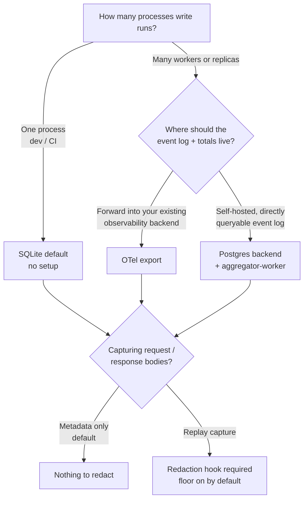

# Services & multi-replica deployments

Inkfoot's defaults are tuned for a developer's laptop and CI: one
process, one SQLite file, zero setup. A long-running service —
gunicorn with several workers, a Celery fleet, a Kubernetes
deployment scaled past one replica — needs two decisions made
deliberately:

1. **Where do run totals live** once more than one process is writing?
2. **Is full request/response capture on**, and if so, **what stops
   secrets reaching disk**?

This page answers both.



## SQLite is for development and CI only

The default backend opens `~/.inkfoot/runs.db` and runs an in-process
thread that keeps run totals current. That model assumes **one
writer**. SQLite's WAL mode tolerates concurrent readers, but a fleet
of processes each opening the same file — especially over a network
filesystem — is not a configuration Inkfoot supports for production.
Each process would also run its own aggregator thread, racing to
project the same rows.

Use SQLite when a single process owns the database: local
development, a one-shot batch job, CI cost review. For anything that
scales horizontally, pick one of the two options below.

See [Storage & Configuration](../concepts/storage.md) for the file
layout and environment variables.

## OTel export for services (recommended)

If you already run an OpenTelemetry collector, this is the lightest
path. Inkfoot keeps writing run *status* to its local store, and
mirrors every `llm_call` event — plus smells and outcomes — to your
collector as OTLP/JSON over HTTP. The fleet's data lands in the
backend you already operate (Honeycomb, Grafana, Datadog, an
OTel-native warehouse), so there is no second database to run.

```python
import inkfoot

inkfoot.instrument(
    otel_export_endpoint="http://otel-collector.local:4318",
)
```

Each replica exports independently; the collector fans the streams
into one backend. There is no cross-process coordination to manage
and no aggregator daemon to keep alive.

A starting collector config is in
[`sample-configs/otel-collector.yaml`](sample-configs/otel-collector.yaml).
The full export/ingest reference is on the
[OpenTelemetry](../concepts/otel.md) page.

## Postgres backend when you need self-hosted aggregation

Reach for Postgres when you want one **directly queryable** event log
for the whole fleet — every run, event, and (with replay on) every
body in one database you control, with no external observability
vendor in the path.

Point every process at the shared server and run a single aggregator
daemon beside the app:

```python
import inkfoot
from inkfoot.storage import PostgresStorage

inkfoot.instrument(
    storage=PostgresStorage(dsn="postgresql://app@db.internal/inkfoot"),
)
```

```bash
# One per deployment — projects run totals for the whole fleet.
inkfoot aggregator-worker --dsn postgresql://app@db.internal/inkfoot
```

Aggregation moves out of process on this backend: the app replicas
stop running their own aggregator thread, and the `aggregator-worker`
sweeps instead. Multiple workers are safe to run for availability —
each sweep is wrapped in a **Postgres advisory lock**, so exactly one
worker projects at a time and the others stand by.

A ready-to-edit connection + daemon snippet is in
[`sample-configs/postgres-fleet.env`](sample-configs/postgres-fleet.env).
For setup, pool sizing, and the health probe see the
[Postgres Backend](../concepts/postgres.md) page; to move an existing
SQLite event log across, follow the
[Postgres migration runbook](postgres-migration.md).

## Redaction is required before replay capture in services

By default Inkfoot captures **metadata only** — token counts, model,
timing — and no prompt or response text touches disk. That is safe to
run anywhere.

`capture_mode="replay"` changes that: it persists full request and
response bodies so a run can be replayed. In a service handling real
user traffic those bodies routinely contain secrets — API keys,
bearer tokens, personal data in prompts. **Do not enable replay
capture in a service without a redaction hook.**

A redaction hook runs at the storage boundary every capture surface
shares — unary calls, streamed calls, and every provider shim — so
content is masked once, before it is written, regardless of where it
came from. When replay capture is on, a built-in **regex floor**
always runs. It masks the shapes that must never be persisted:

- email addresses,
- the common provider API-key prefixes (`sk-…`, `sk-ant-…`),
- JWTs.

```python
import inkfoot

# The floor runs automatically in replay mode.
inkfoot.instrument(capture_mode="replay")
```

The floor is a floor, not a ceiling. Pass your own hook to mask
organisation-specific shapes; it runs in front of the floor and
both apply, so a custom hook can mask *more* but never less than the
guaranteed minimum:

```python
import re
import inkfoot

_ACCOUNT = re.compile(r"ACME-\d{6}")


class AccountTokenRedactor:
    """Mask an internal account-token shape the floor doesn't know."""

    def __call__(self, payload, ctx):
        return {key: self._scrub(value) for key, value in payload.items()}

    def _scrub(self, value):
        if isinstance(value, str):
            return _ACCOUNT.sub("[ACCOUNT]", value)
        if isinstance(value, dict):
            return {k: self._scrub(v) for k, v in value.items()}
        if isinstance(value, list):
            return [self._scrub(v) for v in value]
        return value


inkfoot.instrument(
    capture_mode="replay",
    redaction_hook=AccountTokenRedactor(),
)
```

The hook receives the deserialised content as a mapping with
`"request"`, `"response"`, and `"tool_result"` keys and returns a
masked copy of the same shape. Implement the
[`RedactionHook`](../reference/api.md) protocol from
`inkfoot.storage.redaction`. A hook that raises or returns the wrong
shape **fails closed** — the body is dropped rather than written
unredacted.

The floor scans string *values* (recursively, inside lists and nested
objects), not dictionary *keys* — in an LLM body the keys are field
names like `role` and `content`. If your payloads can carry secrets in
keys, add a custom hook to mask them.

!!! tip "Turn on the redaction audit trail"

    Each redaction pass logs a **counts-only** `redaction_audit` line
    on the `inkfoot.redaction` logger — how many of each shape were
    masked, never the matched text. It is emitted at `INFO`, so raise
    the log level to record the trail:

    ```python
    import logging

    logging.getLogger("inkfoot.redaction").setLevel(logging.INFO)
    ```

### Redaction works the same for streamed calls

A streamed call's content is only complete at stream-close, but it is
written through the same storage boundary as a unary call. The hook
runs on it identically, once per stored row — there is nothing extra
to configure for streaming.

## Putting it together

| You have… | Use | Replay capture |
|---|---|---|
| One process (dev, CI, batch) | SQLite default | Optional; floor still applies |
| Many replicas + existing OTel stack | `otel_export_endpoint=…` | Add a redaction hook before enabling |
| Many replicas + self-hosted event log | `PostgresStorage` + `aggregator-worker` | Add a redaction hook before enabling |

Sample configurations:

- [`sample-configs/otel-collector.yaml`](sample-configs/otel-collector.yaml)
- [`sample-configs/postgres-fleet.env`](sample-configs/postgres-fleet.env)
