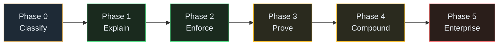

# Inkfoot — Phases

This folder holds **one architecture-per-phase document** of the
[Inkfoot roadmap](../roadmap-inkfoot.md). Each phase doc is a
self-contained design spec for that slice: context, goals, a
high-level diagram for the phase's surface, detailed component
internals, data-model deltas, sequence diagrams for the critical
flows, phase-specific ADRs, risks, definition of done, the go/no-go
signal that determines whether the next phase begins, and a
suggested epic breakdown.

Phase docs are deliberately **not** restatements of
[architecture-inkfoot.md](../architecture-inkfoot.md) — they zoom in
on what's actually built in their slice and reference the main
architecture for shared design.

Epics for each phase will be drafted later in companion files
(`epics-phase-N-<slug>.md`). The phase docs are the bridge from
roadmap intent to those epics — they should be specific enough that
an epic breakdown writes itself from each.

## Phase index

| Phase | Theme | Doc | Roadmap §  | Weeks |
|---|---|---|---|---|
| **0** | Classify | [phase-0-classify.md](phase-0-classify.md) | §2 | 0–8 |
| **1** | Explain | [phase-1-explain.md](phase-1-explain.md) | §3 | 8–20 |
| **2** | Enforce | [phase-2-enforce.md](phase-2-enforce.md) | §4 | 20–32 |
| **3** | Prove | [phase-3-prove.md](phase-3-prove.md) | §5 | 32–48 |
| **4** | Compound | [phase-4-compound.md](phase-4-compound.md) | §6 | 48–64 |
| **5** | Enterprise | [phase-5-enterprise.md](phase-5-enterprise.md) | §7 | 64+ |

## Dependency graph

The phases are strictly sequential — each one's go/no-go signal gates
the next. There is no parallel-able structure inside the roadmap. The
phases get larger over time both in scope and in team size; see the
roadmap's §9 resource model for the assumed team shape per phase.

## Three rules these phase docs follow

Borrowed from the [architect skill's phases convention](https://anthropic.com)
(see Sleuth's `docs/plans/` for the same pattern applied to other
streams):

1. **Each phase ends with something usable.** Not a stage gate; a real
   thing a real reader can hold. Phase 0 ends with our own agents
   running on Inkfoot for 6 weeks; Phase 1 ends with a public OSS
   release; Phase 3 ends with a paying customer.
2. **Phases are ordered by dependency, not by team.** The Causal Token
   Ledger has to land before anything else can attribute against it;
   Token Contracts need attribution; Cloud needs runtime maturity;
   Enterprise needs Cloud GA.
3. **Risk-first.** The single biggest risk — that causal attribution
   doesn't surface meaningful smells in real-world data — is taken in
   Phase 0 by running on our own agents. We learn early whether the
   product premise is right before paying the cost of a public
   launch.

## Naming convention for future epics

Once a phase is approved for execution, its epic breakdown lands as
`epics-phase-N-<slug>.md` in this folder, following the prefix table
below. The two-letter epic-ID prefix is chosen per phase so a backlog
across phases doesn't collide:

| Phase | Suggested epic prefix | Example |
|---|---|---|
| Phase 0 — Classify | `CL` | `CL1` Causal Token Ledger, `CL2` Smell engine |
| Phase 1 — Explain | `EX` | `EX1` LangGraph adapter, `EX5` `inkfoot diff` |
| Phase 2 — Enforce | `EN` | `EN1` Token Contract YAML, `EN3` `CheapSummariser` |
| Phase 3 — Prove | `PR` | `PR1` Cloud ingestion, `PR4` Replay Engine |
| Phase 4 — Compound | `CO` | `CO1` TypeScript port, `CO3` Smell Library |
| Phase 5 — Enterprise | `EE` | `EE1` SSO, `EE3` Self-hosted Cloud |

Pick the prefix when starting the phase's epic breakdown; document the
final choice in the phase doc.
