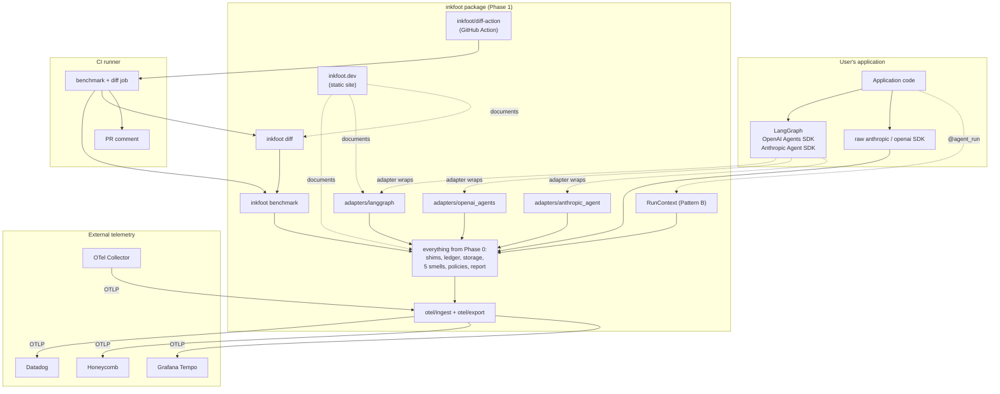
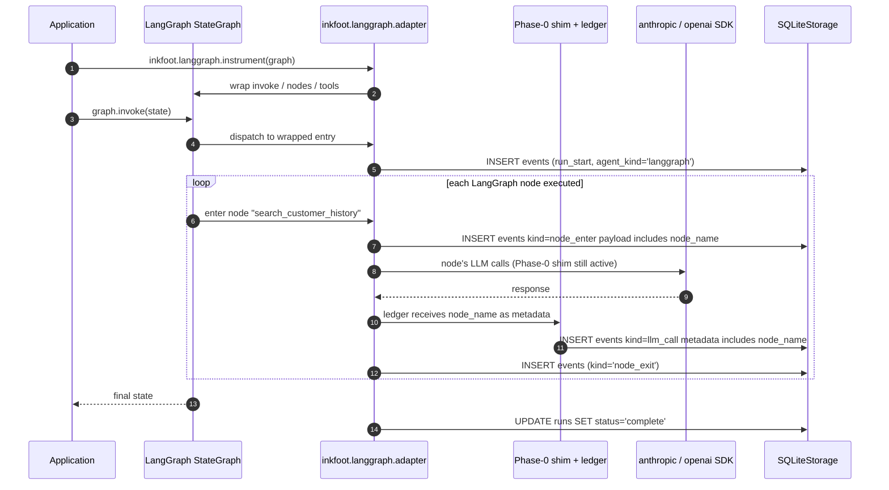
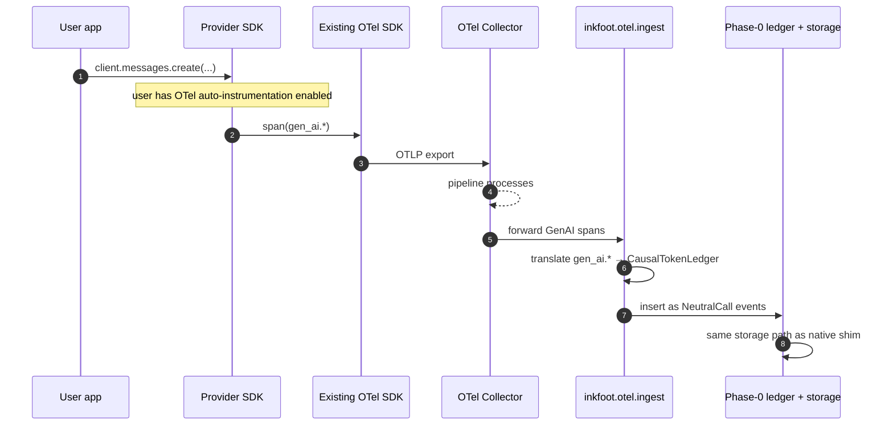
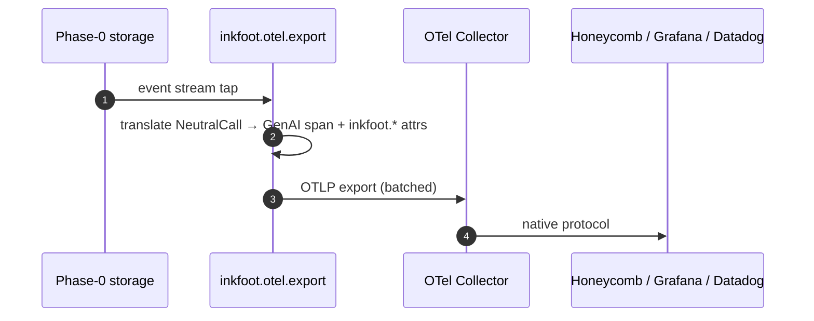
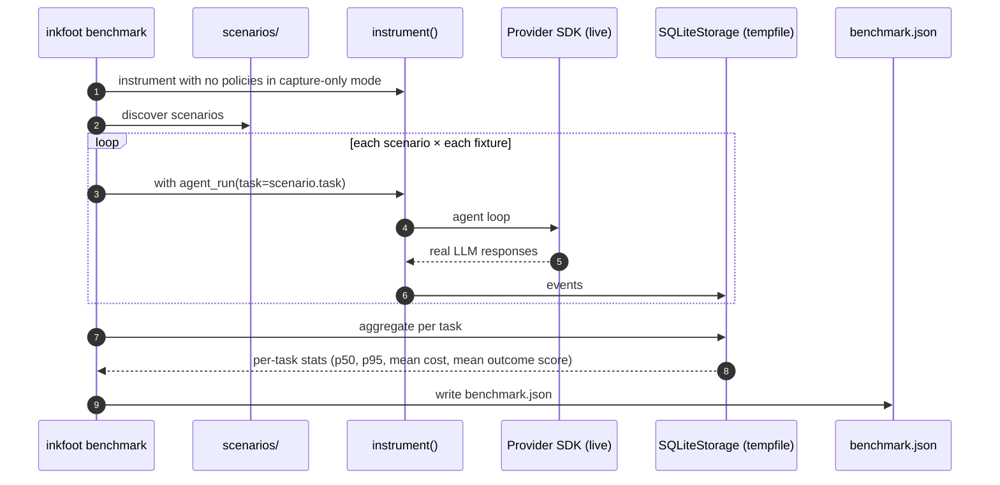
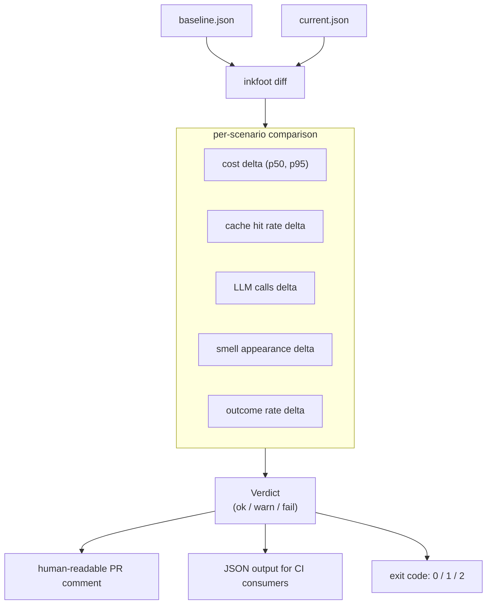
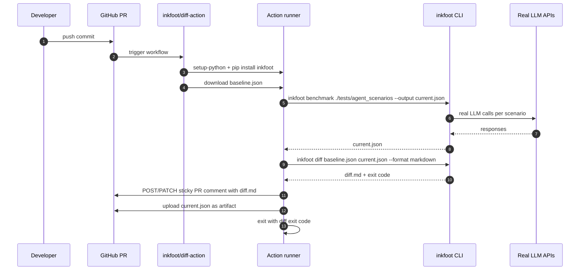
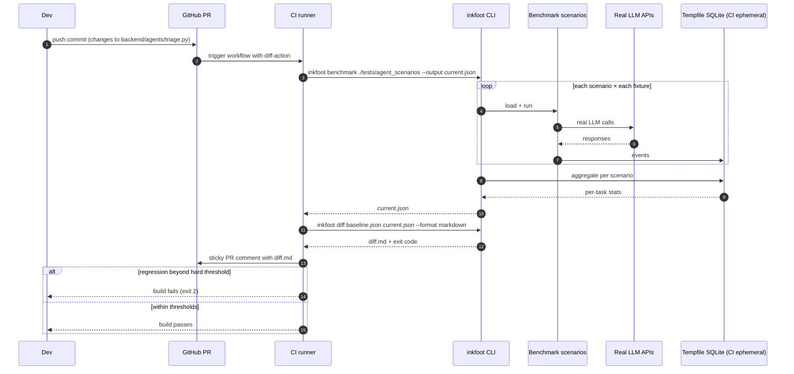
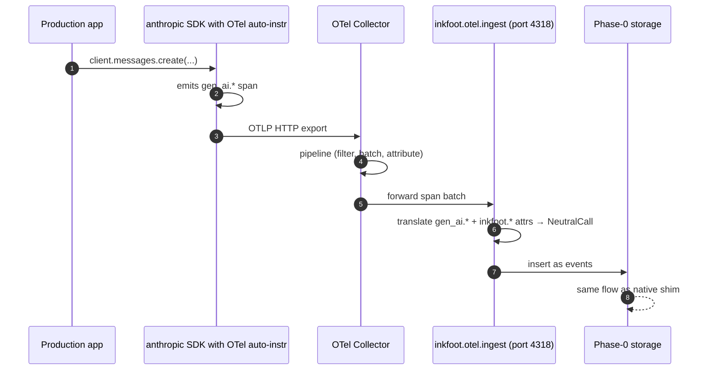

# Phase 1 — Explain (detailed design)

**Theme:** *Explain why every token was spent. Ship to the world.*
**Status:** approved scope; entered only after Phase 0 go-signal.
**Weeks:** 8–20 (12 weeks).
**Companion docs:**
- [Roadmap §3](../roadmap-inkfoot.md#3-phase-1--explain-weeks-820)
- [Architecture §4.1, §4.4, §4.8, §4.11, §4.12](../architecture-inkfoot.md)
- [Phase 0 detailed design](phase-0-classify.md) — the foundation
  this phase extends.

---

## 1. Context

Phase 0 produced a working local profiler that we use on our own
agents and that has surfaced ≥ 3 real cost smells. Phase 1 turns
that into a **publicly usable product**: framework adapters for the
agents people actually run; OpenTelemetry ingest/export so we're not
a closed telemetry island; **`inkfoot diff`** for CI cost review;
docs and a launch.

The Phase 1 narrative beat is: *"We measured our own agents in
Phase 0 and found X. Here's a library that lets you do the same in
under 15 minutes."*

What changes architecturally:

- **Pattern B** (`@agent_run` decorator) and **Pattern C** (framework
  adapters) join Pattern A from Phase 0. The capability matrix in
  Phase 0 was forward-looking; Phase 1 actually exercises it.
- **OpenTelemetry** ingest accepts GenAI-conventions-shaped events
  and translates them into our event log; export emits Inkfoot
  events to any OTel collector.
- **`inkfoot benchmark`** runs scenario suites; **`inkfoot diff`**
  compares two benchmark outputs and surfaces regressions in a
  CI-friendly format. A **GitHub Action** wraps it for one-line
  integration.
- The recommendation engine from Phase 0 now surfaces smells *inline*
  in `inkfoot report` (Phase 0 produced the engine; Phase 1 promotes
  it to the headline UX).
- Public docs site, launch blog post, OSS hygiene.

## 2. Goals & non-goals (phase-scoped)

### Goals

- **Four framework adapters land:** LangGraph, OpenAI Agents SDK,
  Anthropic Agent SDK, raw-SDK decorator usage. These cover the
  vast majority of mid-2026 Python agent code.
- **OTel becomes a peer of native instrumentation.** A team running
  OTel collectors today can wire Inkfoot in via the OTel pipeline
  without installing the SDK shim.
- **CI cost review is one line.** `uses:
  inkfoot/diff-action@v1` is the entry point; the docs show this
  before they show how to install the library.
- **The launch is honest.** The blog post leads with *what we found
  in our own data*, not with abstract pitching.
- **External users adopt.** At least three external users have
  recorded runs > 7 days after install by the end of the phase.

### Non-goals (deferred to later phases)

- Token Contracts — Phase 2.
- Modification policies (`LazyToolExposure`, `CheapSummariser`) —
  Phase 2.
- Cloud — Phase 3.
- Cost Replay Engine, static analyzer, invoice reconciliation —
  Phase 3.
- TypeScript port — Phase 4.
- Pydantic AI / CrewAI adapters — Phase 2.
- Gemini / Bedrock / OpenAI-compatible providers — Phase 2.

## 3. High-level shape — Phase 1 only



What's new in this diagram vs Phase 0:

| New component | Responsibility |
|---|---|
| Framework adapters (`adapters/langgraph`, `openai_agents`, `anthropic_agent`) | Pattern C — wrap the framework's graph/run structure to capture richer attribution and to unblock future Phase-2 modification policies |
| `RunContext` Pattern B | `@agent_run` decorator becomes the public, supported way to scope runs (Phase 0 had this internally but didn't ship it as the headline integration shape) |
| `otel/ingest` + `otel/export` | Map between GenAI semantic conventions and our `NeutralCall` / event log |
| `inkfoot benchmark` | Scenario runner; deterministic-as-possible execution; emits a benchmark JSON artefact |
| `inkfoot diff` | Compares two benchmark JSONs; outputs a structured + human-readable report; CI-friendly exit codes |
| `inkfoot/diff-action` | GitHub Action wrapper; one-line CI integration |
| `inkfoot.dev` | Static docs site |

---

## 4. Components — detailed design

### 4.1 Framework adapters (Pattern C)

A framework adapter implements:

```python
class FrameworkAdapter(Protocol):
    name: str
    def detect(self) -> bool: ...
    def instrument(self, target: Any, **kwargs) -> Instrumentation: ...
    def supported_policies(self) -> set[type[Policy]]: ...
    def shutdown(self) -> None: ...
```

`supported_policies()` is the runtime expression of the Phase 0
capability matrix. The instrumentation layer rejects unsupported
policies at registration *based on the adapter that's actually
installed*, not Pattern A alone.

#### 4.1.1 LangGraph adapter

LangGraph exposes a `StateGraph` with named nodes and explicit edges.
The adapter:

1. Wraps the graph's `invoke` / `ainvoke` / `stream` / `astream`
   entry points to scope a `RunContext` around the whole execution.
2. Wraps each node function so per-node attribution is possible —
   the ledger learns to attribute tokens to the LangGraph node that
   produced the call.
3. Captures the graph's `tools` registry once and exposes a stable
   "tool list fingerprint" the ledger uses for cache-detection.
4. Adds two LangGraph-specific event kinds:
   `node_enter` and `node_exit` (carrying the node name).



Per-node attribution is a key Phase-1 deliverable. `inkfoot report
--run <id> --group-by node` slices the ledger by LangGraph node,
which is the question LangGraph teams will ask first.

#### 4.1.2 OpenAI Agents SDK adapter

The OpenAI Agents SDK has a tighter abstraction: an `Agent` runs in
a loop, calling tools and producing assistant messages. The adapter
wraps `Agent.run` / `Agent.run_async` and the tool-dispatch layer.

Per-tool attribution comes naturally because the SDK names tools
explicitly. The adapter contributes a `tool_dispatched` event with
the tool name and dispatch latency.

#### 4.1.3 Anthropic Agent SDK adapter

Similar shape to the OpenAI one. Anthropic's Agent SDK is newer (as
of mid-2026); the adapter pins against the latest stable.

#### 4.1.4 Raw-SDK Pattern B

For users who don't use a framework, the `@agent_run` decorator from
Phase 0 becomes the canonical integration shape. Phase 1 promotes
its documentation and adds a few ergonomic features:

- `inkfoot.tag_node(name)` — manual analogue of LangGraph node
  attribution, for users who structure their agents with explicit
  "phases."
- `inkfoot.checkpoint(label)` — emit a `checkpoint` event so reports
  can show time spent between checkpoints.

### 4.2 OpenTelemetry ingest + export

Inkfoot mirrors the OTel GenAI semantic conventions and extends them
with `inkfoot.*` attributes carrying the Causal Token Ledger.

#### 4.2.1 Mapping table

| OTel GenAI attribute | Inkfoot field |
|---|---|
| `gen_ai.system` | `NeutralCall.provider` |
| `gen_ai.request.model` | `NeutralCall.model` |
| `gen_ai.usage.input_tokens` | Sum of the 13 input-side ledger categories: `system_static_tokens + system_dynamic_tokens + user_input_tokens + tool_schema_tokens + tool_result_tokens + retrieved_context_tokens + memory_tokens + retry_overhead_tokens + summariser_tokens + reasoning_tokens + guardrail_tokens + cache_creation_tokens + cache_read_tokens` (all `*_tokens` per the Phase-0 ledger). |
| `gen_ai.usage.output_tokens` | `ledger.output_tokens` |
| `gen_ai.response.id` | event id |
| `gen_ai.operation.name` | `chat` / `completion` / `tool_use` |
| `inkfoot.cause.system_static_tokens` | `ledger.system_static_tokens` |
| `inkfoot.cause.system_dynamic_tokens` | `ledger.system_dynamic_tokens` |
| `inkfoot.cause.tool_schema_tokens` | `ledger.tool_schema_tokens` |
| `inkfoot.cause.tool_result_tokens` | `ledger.tool_result_tokens` |
| `inkfoot.cause.retrieved_context_tokens` | `ledger.retrieved_context_tokens` |
| `inkfoot.cause.memory_tokens` | `ledger.memory_tokens` |
| `inkfoot.cause.retry_overhead_tokens` | `ledger.retry_overhead_tokens` |
| `inkfoot.cause.summariser_tokens` | `ledger.summariser_tokens` |
| `inkfoot.cause.reasoning_tokens` | `ledger.reasoning_tokens` |
| `inkfoot.cause.guardrail_tokens` | `ledger.guardrail_tokens` |
| `inkfoot.cause.cache_creation_tokens` | `ledger.cache_creation_tokens` |
| `inkfoot.cause.cache_read_tokens` | `ledger.cache_read_tokens` |
| `inkfoot.estimation_flags` | `NeutralCall.estimation_flags` (csv) |
| `inkfoot.estimated_nanodollars` | `NeutralCall.estimated_nanodollars` |

#### 4.2.2 Ingest path



OTel ingest gives a customer who's already running an OTel pipeline
a "no-SDK-install" path to Inkfoot value. They reconfigure their
collector to send GenAI spans to our local ingest endpoint
(or, in Phase 3, the Cloud one); we map and store.

A subtle point: when OTel ingest is used **alongside** the SDK shim
(both active), de-duplication is needed. Phase 1 ships a simple
"trust the shim, ignore OTel duplicates" rule keyed on
`(span_id, gen_ai.response.id)`.

#### 4.2.3 Export path



Export is enabled by an `otel_export_endpoint` kwarg on
`inkfoot.instrument(...)`. When set, every event with `kind=llm_call`
is mirrored as an OTel span. Other event kinds (smells, outcomes)
become OTel logs.

### 4.3 `inkfoot benchmark`

A scenario runner that executes a directory of `.py` scenarios under
instrumentation, captures the events, and emits a JSON artefact:

```
tests/agent_scenarios/
├── customer_support_triage.py
├── email_summary.py
└── conftest.py
```

Each scenario is a Python file exporting:

```python
INKFOOT_SCENARIO = {
    "task": "customer-support-triage",
    "fixtures": ["fixtures/ticket-1.json", "fixtures/ticket-2.json", ...],
    "expected_outcome": "success",
    "runs_per_fixture": 1,
}

def run(fixture: dict) -> dict:
    """Returns whatever the agent returns; benchmark records cost + outcome."""
```



The JSON shape:

```json
{
  "inkfoot_version": "1.0.0",
  "schema_version": "1",
  "captured_at": "2026-05-25T12:00:00Z",
  "scenarios": [
    {
      "task": "customer-support-triage",
      "runs": 8,
      "successes": 8,
      "p50_nanodollars": 41_000_000,
      "p95_nanodollars": 83_000_000,
      "mean_llm_calls": 4.1,
      "mean_cache_hit_rate": 0.82,
      "smells_seen": [
        {"id": "unstable-prompt-prefix", "count": 0},
        {"id": "oversized-tool-result-recycled", "count": 0}
      ]
    }
  ]
}
```

The schema is stable from Phase 1; `inkfoot diff` consumes it.

### 4.4 `inkfoot diff`

The structural diff between two benchmark JSONs is the most-seen
artefact of the product (every PR touches it once CI is wired up).



Verdict thresholds:

| Verdict | Threshold | Exit code |
|---|---|---|
| `ok` | All scenarios within configured tolerance | 0 |
| `warn` | Some scenario exceeds soft threshold (defaults: cost +20%, cache-hit -10%) | 1 |
| `fail` | Any scenario exceeds hard threshold (defaults: cost +50%, cache-hit -25%) OR new critical smell appearing | 2 |

Phase 1 uses these defaults. Phase 2's Token Contracts override
them per-task.

The human-readable PR comment matches the architecture's §4.8
example. The JSON shape mirrors the benchmark JSON, with a `delta`
section added per scenario.

### 4.5 GitHub Action wrapper

`inkfoot/diff-action` is a thin Composite Action:

```yaml
# .github/workflows/cost-review.yml (consumer-side example)
on: pull_request

jobs:
  cost:
    runs-on: ubuntu-latest
    steps:
      - uses: actions/checkout@v4
      - uses: actions/setup-python@v5
        with: { python-version: "3.12" }
      - uses: inkfoot/diff-action@v1
        with:
          scenarios: ./tests/agent_scenarios
          baseline-artifact: baseline.json
          fail-threshold: hard
        env:
          ANTHROPIC_API_KEY: ${{ secrets.ANTHROPIC_API_KEY }}
          OPENAI_API_KEY: ${{ secrets.OPENAI_API_KEY }}
```

Internally the action:

1. Installs `inkfoot[all]` (matching the action's tag).
2. Downloads the `baseline-artifact` from the most recent main-branch
   build (or from a release asset, configurable).
3. Runs `inkfoot benchmark ./tests/agent_scenarios --output
   current.json`.
4. Runs `inkfoot diff baseline.json current.json --format json
   --format markdown`.
5. Posts the markdown to the PR as a sticky comment (one comment per
   PR, updated on push).
6. Uploads `current.json` as a build artefact for future baselines.
7. Exits with the inkfoot-diff exit code, failing the build on `fail`.



### 4.6 Smells surface inline in `inkfoot report`

Phase 0 had the smell engine but rendered hits only when explicitly
asked (`--show-smells`). Phase 1 promotes inline rendering: every
`inkfoot report --run <id>` invocation evaluates and displays
detected smells right under the attribution bar chart, as the sample
in [Phase 0 §5.10](phase-0-classify.md#510-inkfoot-report-rendering-pipeline)
shows.

Aggregate-level smell detection (`SmellEngine.evaluate_aggregate`)
also lands here: `inkfoot report --task <name> --last 30d` surfaces
smells observed across many runs.

### 4.7 Docs site

`inkfoot.dev` is statically generated from a `docs/` directory in
the OSS repo. Tooling: `mkdocs-material` or equivalent (decision in
ADR-1-3 below).

Required pages at launch:

1. **Home** — value prop in 3 sentences; "what we found in our own
   agents" link to launch blog post; install command above the fold.
2. **Quickstart** — `pip install inkfoot` → 5 lines of code → first
   report. Should take an unfamiliar user < 5 minutes.
3. **Concepts: Causal Token Ledger** — the 13 categories explained
   with examples.
4. **Concepts: Cost Smells** — each Phase-0 smell with trigger,
   detection logic, remediation.
5. **Recipes**:
   - "Find your most expensive agent"
   - "Spot cache-miss patterns"
   - "Set up CI cost review with GitHub Actions"
6. **Framework guides** — one per adapter (LangGraph, OpenAI Agents
   SDK, Anthropic Agent SDK, raw SDK).
7. **OTel integration** — how to wire collector ingest; how to
   forward to existing OTel backends.
8. **CLI reference** — every command + flag.
9. **Python API reference** — auto-generated from docstrings.
10. **Pricing data and accuracy** — the honesty page that explains
    what's exact and what's estimated.

The launch blog post lives at `inkfoot.dev/blog/we-measured-our-own-agents/`.

---

## 5. Module structure delta vs Phase 0

```
inkfoot/
├── ... (Phase 0 unchanged) ...
├── adapters/
│   ├── __init__.py
│   ├── base.py                 # FrameworkAdapter Protocol
│   ├── langgraph.py
│   ├── openai_agents.py
│   └── anthropic_agent.py
├── otel/
│   ├── __init__.py
│   ├── ingest.py               # OTLP receiver translating GenAI spans
│   ├── export.py               # OTLP exporter (NeutralCall → spans)
│   ├── mapping.py              # the attribute mapping table from §4.2.1
│   └── conventions.py          # version-pinned OTel GenAI conventions
├── benchmark/
│   ├── __init__.py
│   ├── runner.py               # inkfoot benchmark
│   ├── scenario.py             # scenario discovery + loading
│   └── schema.py               # benchmark JSON schema
├── diff/
│   ├── __init__.py
│   ├── compare.py              # the comparison core
│   ├── render_markdown.py      # PR-comment formatter
│   ├── render_json.py
│   └── thresholds.py
└── cli/
    ├── ... (Phase 0 entries) ...
    ├── benchmark.py
    ├── diff.py
    └── tail.py                 # bonus — live event tail (small, ergonomic win)
```

Plus the GitHub Action lives in its own repo: `inkfoot/diff-action`,
referencing a pinned `inkfoot` version.

---

## 6. Public API surface (Phase 1 additions)

```python
# Existing Phase 0 surface unchanged.

# New: Pattern C adapters
import inkfoot.langgraph
inkfoot.langgraph.instrument(graph, **kwargs)

import inkfoot.openai_agents
inkfoot.openai_agents.instrument(**kwargs)

import inkfoot.anthropic_agent
inkfoot.anthropic_agent.instrument(**kwargs)

# New: OTel integration
inkfoot.instrument(
    ...,
    otel_export_endpoint: str | None = None,
    otel_ingest_port: int | None = None,   # local ingest listener
)

# New: ergonomic Pattern B helpers
inkfoot.tag_node(name: str)               # manual node attribution
inkfoot.checkpoint(label: str)            # checkpoint event
```

CLI additions in Phase 1:

```
inkfoot benchmark <scenarios-dir> [--output PATH] [--scenarios-only NAME]
inkfoot diff <baseline.json> <current.json> [--format json|markdown] [--thresholds tight|default|loose]
inkfoot tail [--task NAME] [--since 10m]
```

---

## 7. Critical end-to-end flows

### 7.1 LangGraph adapter end-to-end

(See the sequence diagram in §4.1.1 above.)

### 7.2 CI cost review flow



### 7.3 OTel ingest from an existing pipeline



---

## 8. ADRs — Phase 1

### ADR-1-1: Per-node attribution lives in metadata, not as separate ledger fields

**Status:** Accepted.
**Context:** LangGraph-style frameworks have named nodes; per-node
attribution is high-value but it doesn't map onto a fixed set of
ledger categories (every team has different node names).
**Decision:** Per-node attribution lives in
`NeutralCall.metadata["node_name"]` (free-form string). Aggregation
in reports uses `--group-by node`. The 13 ledger categories stay
fixed.
**Alternatives considered:**
- *Variable-schema ledger (`per_node: dict[str, int]`).* Breaks the
  flat 13-field shape; complicates aggregation.
- *Per-framework custom ledger.* Loses cross-framework comparability.
**Consequences:** Reports can slice by node only when adapters set
the metadata. Documented per-adapter.

### ADR-1-2: OTel ingest de-duplicates against the native shim by `(span_id, response_id)`

**Status:** Accepted.
**Context:** A user might enable OTel auto-instrumentation *and*
install our SDK shim. Both capture the same call.
**Decision:** When the same `(span_id, response_id)` pair lands twice,
keep the shim's event and discard the OTel one. The shim has richer
data (full request, our ledger logic); OTel is a fallback for
non-shim paths.
**Alternatives considered:**
- *Merge attributes.* Complex; provenance becomes muddy.
- *Refuse to start when both active.* User-hostile in mixed
  pipelines.
**Consequences:** A small bookkeeping table tracking seen
`(span_id, response_id)` pairs per run. Trivial.

### ADR-1-3: Static documentation site with mkdocs-material

**Status:** Accepted.
**Decision:** `inkfoot.dev` is statically generated with
`mkdocs-material`. Content lives in `docs/` in the OSS repo;
deployed via GitHub Pages or Cloudflare Pages.
**Alternatives considered:**
- *Docusaurus.* Heavier; React-based; gives us nothing we need.
- *Custom Next.js.* Premature; rebuilds on every commit are cheap
  with mkdocs.
- *Read-the-docs.* Branding constraints; less control of layout.
**Consequences:** All documentation is plain Markdown; contributors
add docs with normal PRs.

### ADR-1-4: Benchmark scenarios are real LLM calls, not recordings

**Status:** Accepted.
**Context:** A benchmark could use recorded fixtures (replay) or
make real LLM calls each time. Recorded is faster and deterministic;
live measures actual cost.
**Decision:** **Live LLM calls.** Recorded fixtures would defeat the
purpose: we want to measure *real* per-PR cost. Cost variance from
LLM non-determinism is part of what the diff exposes.
**Alternatives considered:**
- *Recorded fixtures.* Makes CI deterministic but loses the
  cost-measurement value.
- *Hybrid (record + occasional re-record).* The "occasional"
  policy is the new failure mode.
**Consequences:** CI burns real LLM money. Mitigation: scenarios are
small (3–5 fixtures); CI runs them only on PRs touching agent code
(path filter); cost-per-PR budget surfaced in the diff output.

### ADR-1-5: GitHub Action as the first-class CI integration; others by CLI

**Status:** Accepted.
**Context:** Multiple CI systems (GitHub Actions, GitLab CI,
Bitbucket Pipelines, CircleCI, Buildkite). Building first-class
actions for each is unbounded work.
**Decision:** GitHub Actions only as a published artefact. Other CI
systems use the CLI directly; we document copy-paste snippets for
GitLab and CircleCI in the docs.
**Alternatives considered:**
- *No GitHub Action, CLI-only.* Loses the one-line value
  proposition.
- *Multiple first-class actions.* Maintenance burden out of
  proportion to value.
**Consequences:** GitLab / Bitbucket users get docs-only support.
Acceptable until customer demand surfaces.

### ADR-1-6: PR comments are sticky (one comment per PR, updated on push)

**Status:** Accepted.
**Decision:** The GitHub Action posts exactly one comment per PR,
identified by a hidden HTML marker, and updates it on each subsequent
push. Comment history pollution is the worst CI-bot experience;
avoid it from day one.
**Consequences:** The action needs `pull-requests: write` permission
in the workflow. Documented.

---

## 9. Cross-cutting concerns

### 9.1 Performance budgets

Phase 1 inherits Phase 0's hot-path budgets unchanged. New components
have their own budgets:

| Operation | Budget (p95) |
|---|---|
| Framework adapter overhead per node entry/exit | < 50 µs |
| OTel ingest translation per span | < 200 µs |
| `inkfoot benchmark` overhead (vs raw scenario) | < 5% |
| `inkfoot diff` end-to-end on 10-scenario JSONs | < 100 ms |

### 9.2 Compatibility matrix tests

CI matrix across Python 3.10 / 3.11 / 3.12 × {LangGraph, OpenAI
Agents SDK, Anthropic Agent SDK} × {Anthropic SDK, OpenAI SDK}. Live
LLM tests are marked and run weekly (not on every PR — too expensive).

### 9.3 Privacy

Same posture as Phase 0: no content captured by default. The OTel
export path inherits this — Inkfoot's exporter writes only the
attribute set defined in §4.2.1, never message content.

### 9.4 Versioning and stability

Phase 1 lands `1.0.0`. The public Python API in §6 above is the
stable surface; SemVer rules apply. The OTel mapping (§4.2.1) is
versioned separately; breaking changes to it require a major bump
**and** a 6-month deprecation window.

The benchmark JSON schema (§4.3) is versioned via `schema_version`
in the file; `inkfoot diff` accepts current and N-1.

---

## 10. Risks & mitigations

| Risk | Likelihood | Impact | Mitigation |
|---|---|---|---|
| **Launch doesn't get traction.** | Medium | High | Pre-line up 4+ launch channels (blog, HN, framework community, conference talk); pivot positioning if first wave is flat |
| **Framework adapter scope creep.** Four adapters at quality, not 50 at half-quality. | Medium | Medium | Ship LangGraph + OpenAI Agents SDK first at quality; Anthropic SDK + raw-SDK as second wave inside the phase |
| **OTel mapping drift.** GenAI conventions are still in flux. | Medium | Medium | Pin to a specific OTel spec version; track upstream changes; `inkfoot.*` namespace gives us room to extend without breaking |
| **CI integration breaks on non-GitHub.** | Low | Low | GitHub-first; document CLI for others; promise nothing we don't ship |
| **An incumbent ships causal attribution mid-Phase 1.** | Medium | Medium | Speed; lean into Phase 2/3 USPs (Token Contracts + Replay + lint) as the harder-to-copy combination; the "we ran on our own agents for six weeks first" trust signal |
| **Docs forgettable** — quickstart works but the why isn't compelling enough. | Medium | High | Launch blog post is the front door, not the docs; the docs are reference; the blog post is the narrative |
| **Live-LLM CI cost surprises users.** A noisy PR triggers $5 of LLM spend. | Medium | Low | Path-filter the workflow to PRs that touch agent code; default to small scenario sets; surface CI cost prominently in diff output |

---

## 11. Definition of done

- [ ] `pip install inkfoot` from **public** PyPI.
- [ ] Docs site live; quickstart works for a first-time user without
      help.
- [ ] Launch blog post published.
- [ ] LangGraph + OpenAI Agents SDK + Anthropic Agent SDK + raw-SDK
      adapters all working end-to-end on at least one fixture each.
- [ ] OTel ingest validated against a reference OpenTelemetry
      collector + at least one external backend (Honeycomb or
      Grafana Tempo).
- [ ] At least one significant external reach event (HN front-page,
      LangChain roundup mention, Anthropic blog signal, or
      conference talk acceptance).
- [ ] Public GitHub mirror with Apache 2.0 license, contribution
      guide, CoC, issue templates.
- [ ] **Three external users** outside our team with runs recorded
      > 7 days after install.
- [ ] `inkfoot benchmark` + `inkfoot diff` integrated as a CI gate
      in this repo and in one external reference repo.
- [ ] GitHub Action `inkfoot/diff-action` published on the
      Marketplace with an end-to-end test in a sample agent repo.
- [ ] CI matrix across Python 3.10/3.11/3.12 green.

## 12. Go/no-go signal — Phase 1 → Phase 2

Phase 1 → Phase 2 at the 8-week mark post-launch if **at least one**
of:

- ≥ 500 GitHub stars, **OR**
- ≥ 100 unique PyPI installs/day, **OR**
- ≥ 5 external contributors with real issue threads.

Hitting one is the bar. Hitting two is healthy. Hitting none means
the wedge isn't landing — reshape before continuing.

## 13. Suggested epic breakdown — prefix `EX`

| Epic | Title | Notes |
|---|---|---|
| **EX1** | LangGraph framework adapter | Pattern C; per-node attribution; node-named metadata |
| **EX2** | OpenAI Agents SDK framework adapter | Pattern C; tool-dispatch hook |
| **EX3** | Anthropic Agent SDK framework adapter | Pattern C; pinned latest stable |
| **EX4** | Raw-SDK Pattern B promotion | Polish `@agent_run` + `tag_node` + `checkpoint`; ship as the documented integration shape |
| **EX5** | `inkfoot benchmark` runner | Scenario discovery; JSON output; live LLM calls |
| **EX6** | `inkfoot diff` | Compare benchmark JSONs; thresholds; markdown + JSON output; exit-code contract |
| **EX7** | `inkfoot/diff-action` GitHub Action | Composite action; sticky PR comment; marketplace publish |
| **EX8** | OTel ingest | Local HTTP listener; GenAI mapping; deduplication |
| **EX9** | OTel export | NeutralCall → OTel span/log; OTLP exporter |
| **EX10** | Docs site (`inkfoot.dev`) | mkdocs-material; required pages from §4.7; auto-deploy on merge |
| **EX11** | Launch blog post | "We measured our own agents and learned X" |
| **EX12** | OSS hygiene | LICENSE, CoC, contribution guide, issue templates, CI matrix |
| **EX13** | Adoption telemetry | Privacy-preserving install pings; opt-in only |
| **EX14** | Smell rendering inline in `inkfoot report` | Promote from `--show-smells` flag to default; aggregate-level smell evaluation |
| **EX15** | `inkfoot tail` | Live event tail; ergonomic win |

EX1 + EX2 + EX5 + EX6 + EX10 + EX11 are the load-bearing minimum
slice. EX7 is the highest-leverage CI piece; ship inside Phase 1 even
if EX3 / EX4 slip into Phase 2.

## 14. Open questions

- **Which CI ecosystem gets the first-class action?** GitHub first
  per ADR-1-5; revisit if customer asks pile up for GitLab.
- **mkdocs-material theme or fully-custom?** Default: theme +
  minimal CSS overrides; revisit when brand identity stabilises.
- **Privacy posture for adoption telemetry.** Opt-in or opt-out?
  Default: opt-in (matches our metadata-only-by-default posture).
  Cost: less visibility on adoption trajectory.
- **Apache 2.0 vs MIT vs source-available.** Default: Apache 2.0.
  The data moat (smell-verification corpus) is the defence, not the
  code.
- **OTel ingest port.** Default 4318 (OTel HTTP); configurable.
  Phase 3 Cloud exposes the same shape over TLS at
  `api.inkfoot.dev/v1/otel`.
- **Live-LLM CI cost limit.** Should the action enforce a soft cap
  ($X per PR run)? Default: no enforcement in Phase 1; surface the
  number prominently and let teams set their own conventions.
