# Phase 4 — Compound (detailed design)

**Theme:** *Make the moats compound. TypeScript port, community Smell Library, Cloud GA.*
**Status:** approved scope; entered only after Phase 3 go-signal.
**Weeks:** 48–64 (16 weeks).
**Companion docs:**
- [Roadmap §6](../roadmap-inkfoot.md#6-phase-4--compound-weeks-4864)
- [Architecture §4.16](../architecture-inkfoot.md)
- [Phase 3 detailed design](phase-3-prove.md) — the Cloud foundation
  Phase 4 grows.

---

## 1. Context

Phase 3 took Cloud from theory to one paying customer + 5–10 design
partners. Phase 4 takes Cloud from beta to **publicly available**,
adds a **second language ecosystem** (TypeScript), and opens the
**Cost Smell Library** to community contribution — the OSS-mindshare
moat that compounds over time.

The narrative beat: Phases 0–3 built the product. Phase 4 turns it
into a **platform** — the place where the agent-FinOps community
agrees on cost smells, with **estimated-savings data** Inkfoot Cloud
uniquely computes across opt-in customer runs (see ADR-4-8 for why
"estimated", not "verified").

What changes architecturally:

- **TypeScript SDK** mirroring Python's Pattern A + B + Pattern C
  adapters for Vercel AI SDK and one second TS framework adapter.
- **Cost Smell Library** at `library.inkfoot.dev`: community-
  contributed smells with **estimated-savings data** (per ADR-4-8)
  computed across opted-in customer runs. Cloud auto-pulls
  evidence-bearing smells; customers can
  author private smells.
- **Anomaly-based alerting** complementing Phase 3's threshold-based
  alerts.
- **Slack + PagerDuty** alert delivery.
- **Cloud cost-attribution v2**: per-customer-attribute rollups,
  cohort analysis, percentile breakdowns.
- **`inkfoot.dev/insights`** — anonymised case studies.
- **Invoice reconciliation** extended to **AWS Bedrock + Gemini**
  (Phase 3 covered Anthropic + OpenAI).
- **Static analyzer** extended to TypeScript.
- **Self-serve signup** (no sales conversation needed for Pro).

## 2. Goals & non-goals

### Goals

- **TypeScript SDK on npm** with parity to Python's Pattern A + B.
- **At least two TS framework adapters** — Vercel AI SDK + one other
  (LangChain.js or Mastra, design-partner-driven choice).
- **Cost Smell Library** at `library.inkfoot.dev` with **≥ 20
  community-contributed smells** with estimated-savings data.
- **≥ 15 paying customers** across Pro / Team tiers.
- **$20k+ MRR.**
- **Anomaly-based alerting** firing correctly with < 5% false-positive
  rate.
- **Self-serve signup** end-to-end; new users go from landing page
  to first event without a sales call.
- **Invoice reconciliation** parity across Anthropic + OpenAI +
  Bedrock + Gemini.

### Non-goals

- **Full multi-tenant IAM** — Phase 5.
- **SSO / SAML / RBAC** — Phase 5.
- **SOC 2 Type 2** — Phase 5.
- **Self-hosted Cloud distribution** — Phase 5.
- **EU data residency** — Phase 5.
- **Annual / invoiced billing flow** — Phase 5 (Stripe self-serve
  continues).
- **Postgres RLS** — Phase 5 defense-in-depth.

## 3. High-level shape — Phase 4 only

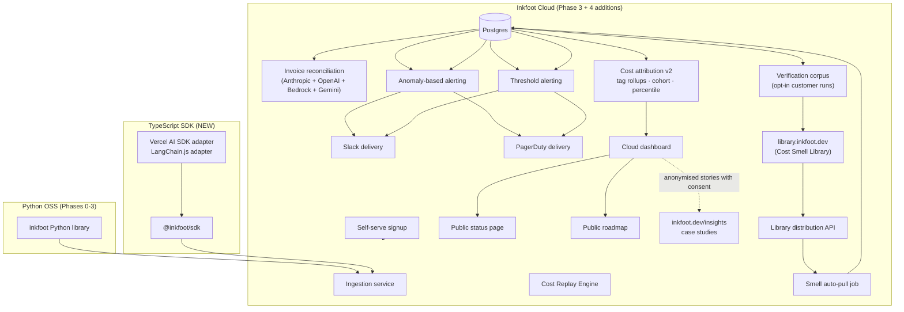

What's new vs Phase 3:

| New component | Responsibility |
|---|---|
| `@inkfoot/sdk` (TypeScript) | Pattern A + B in TS; mirrors Python's surface |
| TS framework adapters | Vercel AI SDK + LangChain.js (Pattern C) |
| `library.inkfoot.dev` + library API | Community Cost Smell Library distribution |
| Verification corpus | Computes savings impact across opted-in customer runs; the moat |
| Smell auto-pull job | Cloud syncs evidence-bearing smells (per ADR-4-8) into the smell engine |
| Anomaly-based alerting | Per-tenant baseline; 3σ deviation detector |
| Slack + PagerDuty delivery | Alert channels |
| Cost attribution v2 | Tag rollups, cohort analysis, percentile breakdowns |
| Self-serve signup | Stripe + email verification; no sales call |
| Public status page | Standard SaaS hygiene |
| Public roadmap | Votable; OSS + Cloud user visibility |
| `inkfoot.dev/insights` | Anonymised case studies with consent |
| Bedrock + Gemini invoice reconciliation | Extends Phase 3's Anthropic + OpenAI work |
| TypeScript static analyzer | Extends `inkfoot lint` to TS |

---

## 4. Components — detailed design

### 4.1 TypeScript SDK (`@inkfoot/sdk`)

The TS SDK is a **mirror** of the Python library, not a rewrite. The
neutral event shape, the Causal Token Ledger semantics, the policy
patterns — all carry over.

#### 4.1.1 Mirror architecture

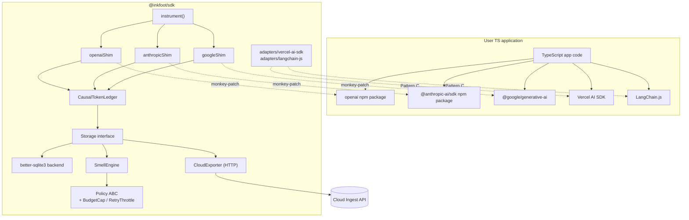

The TS SDK is **deliberately scoped to Pattern A + B + the two TS
framework adapters**. Pattern A + B covers the bulk of TS agent
adoption. The framework adapter list is intentionally smaller than
Python's — Phase 4 prioritises mirror parity over framework
breadth.

#### 4.1.2 Storage choice

`better-sqlite3` (synchronous SQLite for Node.js). Alternatives:

| Option | Why or why not |
|---|---|
| `better-sqlite3` | Sync API maps cleanly to our event-write pattern; mature; widely deployed |
| `sqlite3` (callback-based) | Async hot-path is more complex; we don't need it for our write pattern |
| Pure-JS SQLite (sql.js) | Slower; no WAL mode in some builds |
| LMDB | Different paradigm; not the same schema as Python's SQLite |

We accept the binary-dependency cost of `better-sqlite3` for the
clean sync API.

#### 4.1.3 Public TS surface

```typescript
// Public surface
import inkfoot, {
  agent_run,
  set_outcome,
  tag,
  tag_retrieval,
  BudgetCap,
  RetryThrottle,
} from "@inkfoot/sdk";

inkfoot.instrument({
  sdks: ["openai", "anthropic", "google"],   // auto-detect by default
  policies: [new BudgetCap({ max_nanodollars: 50_000_000n })],
  cloudApiKey: process.env.INKFOOT_API_KEY,
});

await agent_run({ task: "customer-support-triage" }, async () => {
  const res = await openai.chat.completions.create({...});
  inkfoot.set_outcome("success", { quality_score: 0.94 });
  return res;
});

// Vercel AI SDK adapter
import { instrument as instrumentVercel } from "@inkfoot/sdk/vercel";
instrumentVercel();
```

The mirror keeps the names exact across languages: `agent_run`,
`set_outcome`, `tag`, `tag_retrieval`. A user fluent in Python's
Inkfoot reads TypeScript Inkfoot with zero ramp-up.

#### 4.1.4 Wire-format compatibility

The TS SDK emits the **same event JSON shape** as the Python SDK.
Cloud's ingest endpoint can't tell which language produced a batch.
This is enforced by the `schema_version` field and contract-tested:
the same event fixture must round-trip through Python serialise → JS
deserialise → JS serialise → Python deserialise.

### 4.2 Cost Smell Library

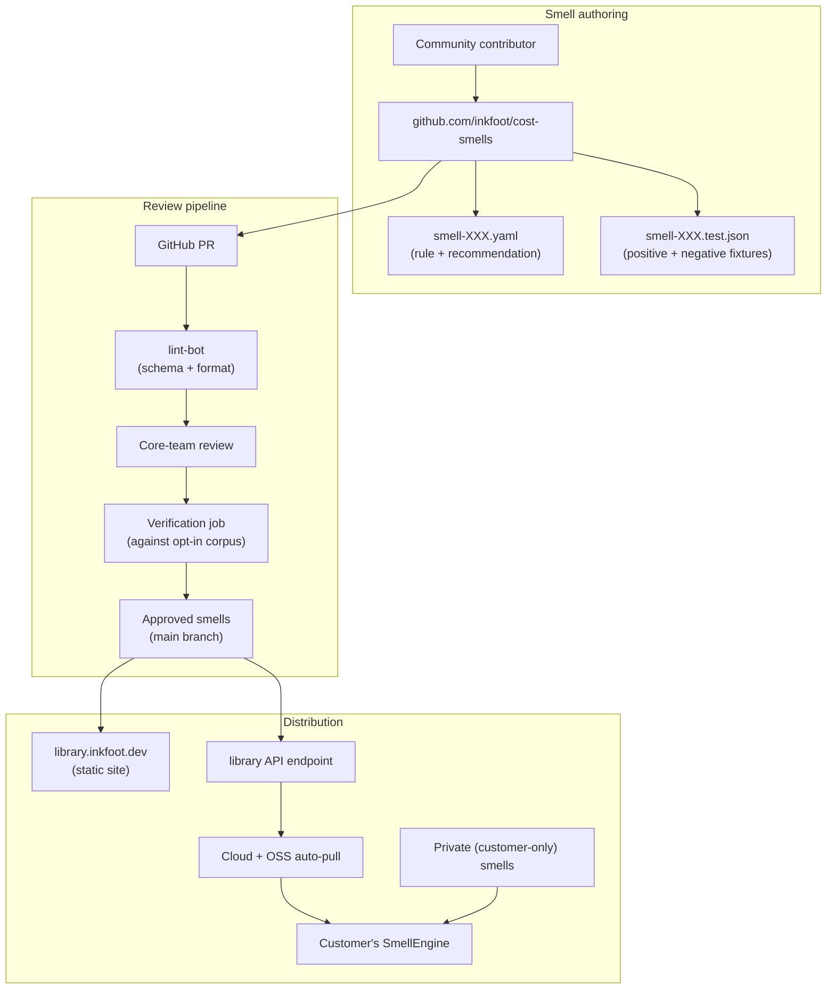

#### 4.2.1 Smell definition format

```yaml
# library.inkfoot.dev/smells/unstable-prompt-prefix.yaml
id: unstable-prompt-prefix
title: Unstable prompt prefix
severity: warn
description: >
  The stable prefix of the system block changes across calls within
  a run, defeating prompt caching and inflating per-call cost.

detection:
  language: jsonpath
  query: |
    $..ledger.system_dynamic_tokens / ledger.total_input_tokens
  trigger_condition: "value > 0.10"

recommendation: |
  Move time-varying content out of the system block and into user
  messages. Build the system prompt once, outside the agent loop.

suggested_policy: CacheControlPlacer

estimated_savings:
  corpus_runs: 8412
  triggered_in: 1240
  estimated_potential_saved_avg_percent: 18.7
  estimated_potential_saved_nanodollars_per_run: 4_300_000
  evidence_kind: simulation     # see §4.2.2.1
  confidence: medium
  last_computed: 2026-09-15
```

**Naming honesty — read this carefully.** Earlier drafts called this
field `verification` and the per-smell numbers "verified savings." A
review pointed out (correctly) that Phase 4's corpus only stores
anonymised ledger shapes and *simulates* the recommendation against
them — it doesn't actually run before/after pairs. Calling that
"verified" overclaims the evidence. The accurate framing for
Phase 4 is **estimated potential savings**: the per-smell number
represents what the savings *would be* if the smell's recommendation
were applied and the agent's behaviour didn't otherwise change.

`evidence_kind` is the load-bearing field:

| Value | Meaning | Phase that produces it |
|---|---|---|
| `simulation` | Anonymised ledger shapes + heuristic recomputation of the corrected ledger. The default for Phase 4. | Phase 4 verification worker |
| `replay_pair` | Real Cost Replay runs producing before/after measurements on the same input. Stronger evidence. | Phase 5+ (requires the replay engine on opted-in customer runs at scale) |
| `production_pair` | Customer-provided before/after production runs (manual contribution). Strongest evidence. | Community-contributed, manually verified |

The library distinguishes the three in the per-smell UI; customers
see whether a smell's number is `simulation`, `replay_pair`, or
`production_pair` and can filter accordingly. This is the
follow-through on the reviewer's point: we don't pretend simulation
is verification.

#### 4.2.2 Verification corpus

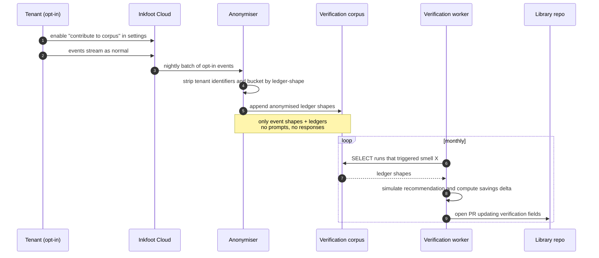

**Anonymisation invariants:**

- No tenant id in the corpus.
- No prompt/response content (Phase 0's "metadata only" posture
  applies — content was never uploaded in the first place unless the
  tenant opted in for Cost Replay).
- Aggregation at the **ledger shape** level — the 13 category
  fractions + the run metadata (model, task name optional, agent
  kind).
- k-anonymity floor: an estimated-savings number is published only
  when **≥ 20 distinct contributing tenants** have ledger shapes
  matching the smell.

**The k-anonymity floor and Phase 4 timing.** Earlier drafts set the
floor at ≥ 50 distinct tenants. Phase 4's DoD requires ≥ 15 paying
customers; combined with opted-in OSS users, ≥ 50 is plausible by
late Phase 4 but not guaranteed at launch. We lower the floor to
**≥ 20 distinct contributing tenants** (still preserving meaningful
k-anonymity at the small-scale end) so the library has publishable
numbers at Phase 4 launch rather than waiting for late-phase or
Phase 5. Smells with fewer than 20 contributing tenants show
`evidence_kind: simulation` with `confidence: low` and no aggregate
saving number; the per-tenant detail is never exposed.

ADR-4-8 (added below) records this floor.

This is the moat. Anyone can copy a smell rule; nobody else has the
ledger corpus to estimate the savings impact at scale.

#### 4.2.3 Distribution

| Surface | Mechanism |
|---|---|
| OSS library | Pulls the bundled snapshot at install time; updates on `pip install --upgrade inkfoot` |
| Cloud | Auto-pulls evidence-bearing smells (any with `estimated_savings` populated above the k-anonymity floor) from `library.inkfoot.dev` API on startup; refreshes daily |
| Private smells | Customer authors YAML in their Cloud workspace UI; stored per-tenant; never published |
| Library site | Static site rendered from the repo; each smell has its own page with estimated-savings stats + `evidence_kind` |

#### 4.2.4 Smell contribution workflow

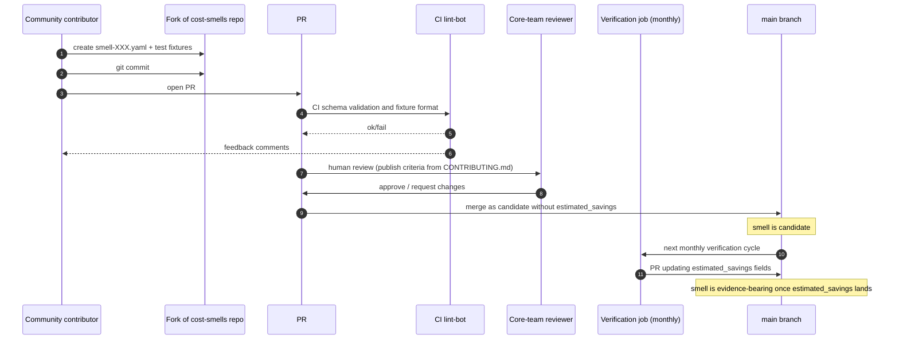

The publish criteria (from `CONTRIBUTING.md` in the cost-smells
repo):

1. Detection query terminates in O(events × constant); no
   pathological cross-joins.
2. At least 3 positive + 3 negative fixture tests.
3. Recommendation is actionable in one sentence.
4. `suggested_policy` references a real Inkfoot policy (or `null`
   if no policy fix exists yet).

### 4.3 Anomaly-based alerting

Phase 3 shipped threshold alerts ("cost-per-task > $X"). Phase 4
adds anomaly alerts ("cost-per-task is 3σ above its baseline").

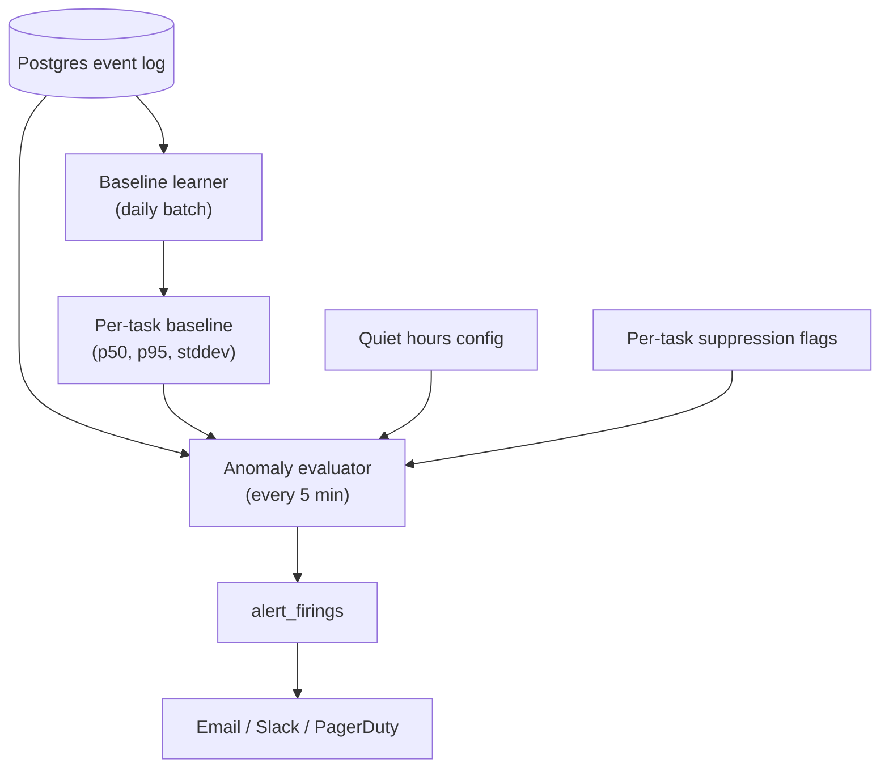

The baseline learner runs nightly:

- For each `(tenant, task)`, compute rolling p50, p95, and stddev of
  cost over the prior 28 days (excluding the most-recent 24h).
- Store as `task_baselines (tenant_id, task, period, p50_nd, p95_nd, stddev_nd, updated_at)`.

The anomaly evaluator runs every 5 minutes:

- For each `(tenant, task)` with traffic in the last 5 minutes,
  compare current p95 to `baseline.p95 + 3 × baseline.stddev`.
- Fire an alert if exceeded, respecting:
  - **Cooldown** (no more than 1 alert per task per hour).
  - **Quiet hours** (per-tenant config: 22:00–08:00 local time).
  - **Suppression** (a task can be flagged "noisy"; alerts are
    suppressed).

#### 4.3.1 False-positive control

Anomaly alerts have a reputation for being noisy. The Phase 4
target: < 5% false-positive rate in design-partner usage.

Controls:

1. **Trailing 28-day baseline window.** Smooths transient spikes.
2. **3σ threshold** — conservative; tighten to 2σ only per-tenant
   opt-in.
3. **Task volume gate** — don't alert on tasks with < 50 runs in
   the baseline window. Statistically unreliable. **Tasks below
   this threshold use Phase 3's threshold-based alerts only**;
   anomaly evaluation skips them entirely and the dashboard
   surfaces "Anomaly alerts on this task will activate once 50
   baseline runs accumulate."
4. **Sustained-trigger requirement** — current p95 must exceed the
   threshold for 2 consecutive 5-minute windows before firing.
5. **Manual suppression UI** — when an alert is dismissed as
   not-actionable, the user can mark the task "noisy"; future
   anomaly alerts for that task auto-suppress.

The publicly-tracked metric is `(alerts_acted_on / total_alerts_fired)`
over a 30-day window. Anomaly tuning continues into Phase 5 if the
ratio falls below 0.5.

### 4.4 Alert delivery — Slack + PagerDuty

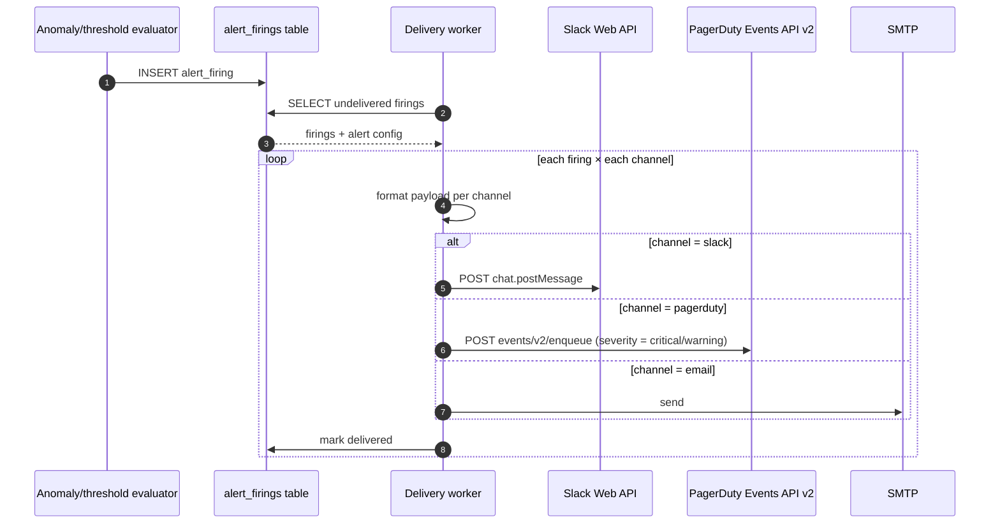

Slack and PagerDuty integrations are configured per-tenant in the
dashboard:

- **Slack:** OAuth flow installs the Inkfoot Slack app to the
  customer's workspace; the customer picks a channel per alert
  rule.
- **PagerDuty:** the customer pastes a routing key from their
  PagerDuty integration into the alert rule's config; severity
  maps based on the alert's "severity" field.

### 4.5 Cost attribution v2 — tag rollups + cohort analysis

Phase 3's dashboard showed cost-by-task. Phase 4 adds:

#### 4.5.1 Tag rollups

```
GET /api/v1/aggregates?group_by=tag.customer_tier&period=30d
```

Returns:

| tag.customer_tier | runs | avg_$ | p95_$ | success% | cost/success |
|---|---|---|---|---|---|
| enterprise | 1240 | $0.082 | $0.180 | 96.4% | $0.085 |
| pro | 8412 | $0.041 | $0.083 | 93.2% | $0.044 |
| free | 28140 | $0.018 | $0.041 | 91.0% | $0.020 |

Tags come from `inkfoot.tag(key, value)` calls inside the run. Any
tag a customer sets becomes a groupable dimension.

#### 4.5.2 Cohort analysis

```
GET /api/v1/aggregates?cohort=signup_week&period=12w&measure=cost_per_success
```

Plots cohorts (e.g., users who signed up week-of-2026-04-05) over
time. The cohort dimension is whatever tag the customer sets.

#### 4.5.3 Percentile breakdowns

Every metric in the dashboard now supports per-percentile slicing:

| Metric | Default percentile |
|---|---|
| cost | p50, p95, p99 |
| LLM calls | p50, p95 |
| run duration | p50, p95, p99 |
| cache hit rate | p25 (lower percentiles matter for cache; higher is fine) |

### 4.6 Invoice reconciliation for Bedrock + Gemini

The Phase 3 reconciliation framework extends to two new providers.

| Provider | Source API | Notes |
|---|---|---|
| AWS Bedrock | AWS Cost Explorer API | Pull by `Tag = inkfoot:tenant` or by linked-account; AWS bills aggregate by model-family-day |
| Gemini | Google Cloud Billing API | Pull by project; line items are per-model-day |

Same matching algorithm as Phase 3 (`(api_key_hash | tag, day, model)`).
Same FOCUS-spec export.

The Bedrock path is more invasive: customers must tag their Bedrock
usage with `inkfoot:tenant=<id>` for reconciliation to work cleanly.
Documented in the operator guide.

### 4.7 Self-serve signup

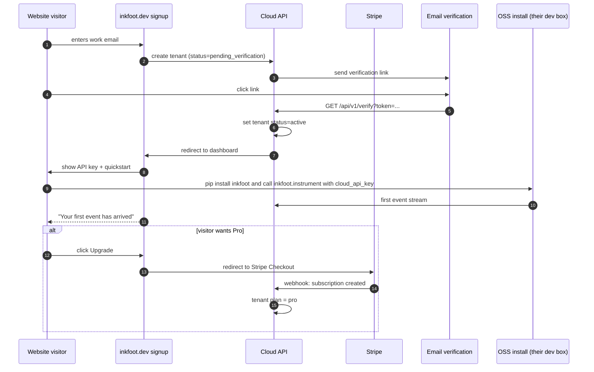

Quota enforcement enforced from event 1; Free tier defaults; the
upgrade flow is one click.

#### 4.7.1 Minimum users + credentials schema

Self-serve signup is the **first** path that creates a user record
that is *not* the workspace owner of a Phase-3 single-user
workspace. Phase 4 therefore ships a small users / credentials
table — kept deliberately narrow because the full IAM model
(memberships, identities, sessions) arrives in Phase 5:

```sql
CREATE TABLE users (
  id              TEXT PRIMARY KEY,            -- ULID
  email           TEXT UNIQUE NOT NULL,
  email_verified  BOOLEAN NOT NULL DEFAULT 0,
  password_hash   TEXT NOT NULL,               -- argon2id; format includes parameters
  display_name    TEXT,
  tenant_id       TEXT NOT NULL REFERENCES tenants(id),
  created_at      INTEGER NOT NULL,
  last_login_at   INTEGER
);

CREATE INDEX users_tenant ON users(tenant_id);
```

Constraints:

- **One user per workspace in Phase 4.** The `tenant_id` column is
  `NOT NULL` and there's no membership table yet. A self-serve
  signup creates exactly one (tenant, user) pair atomically. Adding
  more users to a tenant is a Phase-5 feature (requires the
  `memberships` table).
- **`password_hash` is argon2id** with the same parameters used by
  Inkfoot Cloud password operations (`memory_cost=64 MiB`,
  `time_cost=3`, `parallelism=4`; the standard recommended defaults
  as of 2026). The full hash string includes parameters so future
  Phase-5 migrations can verify without re-hashing.
- **API keys still exist alongside.** Phase-3-style API keys remain
  the programmatic-access path; self-serve users authenticate via
  email + password to the dashboard and mint API keys from there.
  The two coexist; Phase 5 IAM unifies them into the `identities`
  table.
- **No SSO.** Self-serve is password-only in Phase 4. SSO is Phase 5.

This schema is what Phase 5 §4.1.2 migrates from — the argon2id
hash format and parameter set are deliberately compatible with the
Phase-5 `identities` table's `kind='password'` rows. No password
reset is forced on existing self-serve users during the Phase 5
migration because the hash format already matches.

### 4.8 Public status page + roadmap + insights

| Surface | Purpose |
|---|---|
| `status.inkfoot.dev` | Third-party hosted (e.g., StatusPage); uptime + incident history; mandatory before enterprise sales in Phase 5 |
| `inkfoot.dev/roadmap` | Public; votable; OSS + Cloud users see what's planned |
| `inkfoot.dev/insights` | Anonymised case studies with per-customer consent; the marketing surface |

#### 4.8.1 Insights consent flow

Anonymised case studies are powerful marketing but a real privacy
attack surface. Phase 4's posture:

1. **Per-post consent.** A case study based on customer X's data
   requires explicit per-post written consent from customer X.
2. **k-anonymity floor.** A published number that aggregates across
   tenants is only published if ≥ 5 distinct tenants contributed.
3. **No prompts or responses.** Same posture as everywhere else;
   case studies use ledger shapes + qualitative quotes (with
   permission).
4. **Tenant veto.** Tenants can withdraw consent retroactively; the
   case study comes down within 24 hours.

### 4.9 TypeScript static analyzer

Mirrors Python's `inkfoot lint` over TS AST. Same rules where they
apply; new rules for TS-specific patterns (e.g., `useEffect` with an
agent loop inside is the React-equivalent of `tool-schema-in-loop`).

Uses `@typescript-eslint/parser` AST. Ships as both a CLI
(`inkfoot lint`) and an ESLint plugin (`eslint-plugin-inkfoot`) for
integration with existing TS lint setups.

---

## 5. Module structure delta

```
# New repo: @inkfoot/sdk (TypeScript)
inkfoot-ts/
├── packages/
│   ├── sdk/                       # @inkfoot/sdk core (Pattern A + B)
│   │   ├── src/
│   │   │   ├── instrument.ts
│   │   │   ├── shims/
│   │   │   │   ├── openai.ts
│   │   │   │   ├── anthropic.ts
│   │   │   │   └── google.ts
│   │   │   ├── ledger.ts
│   │   │   ├── storage/
│   │   │   │   └── sqlite.ts
│   │   │   ├── smells/
│   │   │   ├── policy/
│   │   │   └── cloud_exporter.ts
│   │   └── package.json
│   ├── vercel/                    # @inkfoot/sdk-vercel
│   │   └── src/index.ts
│   ├── langchain-js/              # @inkfoot/sdk-langchain
│   │   └── src/index.ts
│   └── eslint-plugin/             # eslint-plugin-inkfoot
│       └── src/rules/

# OSS Python additions
inkfoot/
├── ... (Phase 0+1+2+3 unchanged) ...
├── library/
│   ├── pull.py                    # auto-pull evidence-bearing smells
│   ├── private_smells.py          # per-workspace authoring
│   └── verification_client.py     # reports back to verification corpus (opt-in)
└── lint/
    ├── ts/                        # TypeScript AST rules
    │   ├── runner.py
    │   └── rules/

# Cloud additions
inkfoot-cloud/
├── ... (Phase 3 unchanged) ...
├── library/
│   ├── api.py                     # library distribution API
│   ├── pull_worker.py             # syncs evidence-bearing smells into all tenants
│   ├── verification_worker.py     # nightly verification jobs
│   └── corpus.py                  # anonymised corpus access layer
├── alerts/
│   ├── anomaly_evaluator.py
│   ├── baseline_learner.py
│   ├── slack.py
│   └── pagerduty.py
├── attribution_v2/
│   ├── tag_rollup.py
│   ├── cohort.py
│   └── percentiles.py
├── pricing/
│   ├── bedrock_usage.py
│   └── gemini_usage.py
└── self_serve/
    ├── email_verify.py
    └── stripe_webhooks.py

# New repo: cost-smells (community)
cost-smells/
├── README.md
├── CONTRIBUTING.md
├── smells/
│   ├── unstable-prompt-prefix.yaml
│   ├── runaway-retry-loop.yaml
│   └── ... (community PRs land here)
├── tests/
│   └── ... (positive + negative fixtures)
└── .github/workflows/
    └── lint-bot.yml
```

---

## 6. Public interfaces

### 6.1 TS SDK

(See §4.1.3.)

### 6.2 Cloud API additions

| Method | Path | Purpose |
|---|---|---|
| `GET` | `/api/v1/library/smells` | List community smells with estimated-savings data |
| `GET` | `/api/v1/library/smells/{id}` | Smell detail + estimated-savings stats + `evidence_kind` |
| `POST` | `/api/v1/library/smells/private` | Author private smell |
| `GET` | `/api/v1/aggregates?group_by=tag.<name>` | Tag rollup |
| `GET` | `/api/v1/aggregates?cohort=<tag>` | Cohort analysis |
| `POST` | `/api/v1/alerts` (extended) | Anomaly-mode rule |
| `POST` | `/api/v1/integrations/slack` | OAuth-installed Slack workspace |
| `POST` | `/api/v1/integrations/pagerduty` | PagerDuty routing key |
| `POST` | `/api/v1/invoices/reconcile/bedrock` | Trigger Bedrock reconciliation |
| `POST` | `/api/v1/invoices/reconcile/gemini` | Trigger Gemini reconciliation |

---

## 7. Critical end-to-end flows

### 7.1 Community smell from PR to deployment

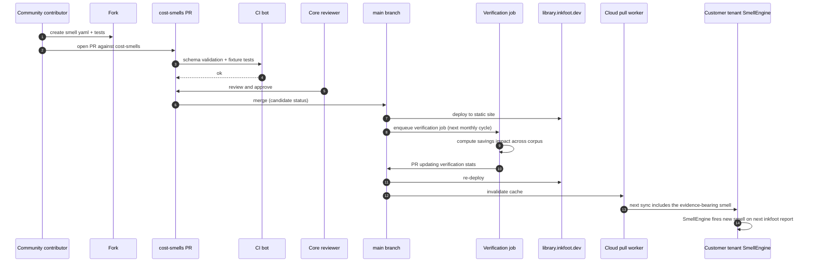

### 7.2 Anomaly alert firing

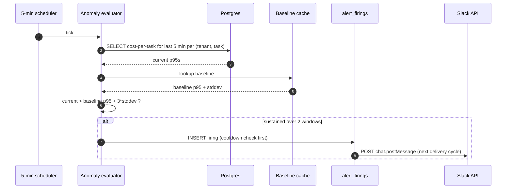

### 7.3 TypeScript SDK first event

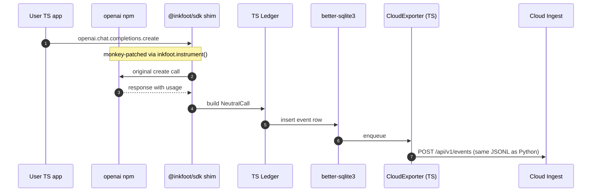

---

## 8. ADRs — Phase 4

### ADR-4-1: TS SDK is a mirror, not a port

**Status:** Accepted.
**Decision:** The TS SDK preserves Python's API names exactly
(`agent_run`, `set_outcome`, etc.) and emits the identical wire
format. It is not a re-imagining for TS idioms.
**Why:** A team mixing Python and TS in their stack wants identical
mental models across languages. Inkfoot Cloud's ingest accepts the
same shape regardless of source language.
**Consequences:** Some TS idioms (Promises everywhere; type
constraints) feel less native than a from-scratch TS design would.
Acceptable tradeoff for cross-language consistency.

### ADR-4-2: Estimated-savings data is the moat, not the rule set

**Status:** Accepted (terminology updated per ADR-4-8; previously
titled "Verification data is the moat").
**Context:** Anyone can copy a smell rule. The hard-to-replicate
asset is the *estimated-savings impact* across customer runs (with
explicit `evidence_kind` calibration; never claimed as "verified"
unless `evidence_kind=replay_pair` or `production_pair`).
**Decision:** The Cost Smell Library is open (rules in a public
repo). The verification corpus (the internal computation mechanism)
is **Cloud-only** — only Inkfoot Cloud computes the estimated-
savings impact, because only Inkfoot Cloud has the opt-in corpus.
**Alternatives considered:**
- *Closed rule set.* Drives competitors to fork; the moat erodes via
  community contribution to a competitor's library.
- *Open corpus.* GDPR-impossible; would require customer-by-customer
  data-sharing agreements.
**Consequences:** Competitors can replicate the rules; replicating
the estimated-savings computation requires building a multi-tenant Cloud with opt-in
corpus participation. 18–36 month catch-up.

### ADR-4-3: Anomaly alerts require sustained-trigger plus baseline volume gate

**Status:** Accepted.
**Decision:** A task's anomaly threshold fires only if both:
1. Current p95 > `baseline.p95 + 3 × baseline.stddev` for 2
   consecutive 5-minute windows.
2. Baseline window had ≥ 50 runs for that task.
**Why:** False-positive control. Anomaly alerts have a reputation
problem; we trade a small amount of sensitivity for substantial
specificity.
**Consequences:** New tasks (< 50 baseline runs) don't get anomaly
alerts. The threshold-based alert path from Phase 3 covers them
until enough data accumulates.

### ADR-4-4: Slack via OAuth app, not webhook URLs

**Status:** Accepted.
**Decision:** Slack delivery requires installing the official Inkfoot
Slack app via OAuth, not pasting webhook URLs.
**Why:** OAuth installation gives us a stable workspace token that
survives channel renames and supports multiple channels per
workspace. Webhook URLs are per-channel, harder to rotate, and the
UX is fragile.
**Consequences:** A Slack-app submission process (review by Slack).
Worth it for the long-term UX.

### ADR-4-5: Insights case studies with per-post consent + k-anonymity

**Status:** Accepted.
**Decision:** Every anonymised case study requires per-post written
consent from the customer; aggregated numbers require ≥ 5 tenants.
**Why:** Anonymisation correlation attacks are real. Per-post
consent is verifiable; aggregation alone is not.
**Consequences:** Slower cadence on insights publication. Acceptable
tradeoff; insights are marketing surface, not the headline product.

### ADR-4-6: Bedrock reconciliation requires customer-side tagging

**Status:** Accepted.
**Decision:** AWS Bedrock reconciliation works by reading Cost
Explorer tag-filtered queries. The customer is responsible for
tagging their Bedrock usage with `inkfoot:tenant=<id>`.
**Why:** AWS doesn't expose a per-API-key billing dimension natively;
tag-based attribution is the available mechanism.
**Consequences:** Operator docs include the tag-setup runbook;
reconciliation reports surface "untagged Bedrock spend" as a known
gap until the customer fixes their tagging.

### ADR-4-7: TypeScript static analyzer ships as both CLI and ESLint plugin

**Status:** Accepted.
**Decision:** TS users get `inkfoot lint <path>` and
`eslint-plugin-inkfoot` for use within their existing ESLint
configs.
**Why:** TS teams already run ESLint; integrating into the existing
pipeline drives adoption.
**Consequences:** Two surfaces to maintain. Rule logic shared; only
the entry points differ.

### ADR-4-8: Estimated potential savings, not verified savings

**Status:** Accepted.
**Context:** Reviewers flagged that calling the Smell Library's
per-smell savings numbers "verified" overclaims the evidence —
Phase 4's verification corpus stores only anonymised ledger shapes
and simulates the recommendation, not actually running before/after
pairs.
**Decision:** Phase 4 ships the field as `estimated_savings` (was
`verification`), with an `evidence_kind` enum recording how the
number was produced: `simulation` (Phase 4 default), `replay_pair`
(Phase 5+ once replay is widespread), `production_pair`
(community-contributed, manually verified). Smells with fewer than
20 contributing tenants don't publish a savings number.
**Alternatives considered:**
- *Keep the "verified" label.* Defensible only with paired
  before/after runs, which Phase 4 doesn't have.
- *Don't publish any number until Phase 5.* Loses the moat at the
  exact moment we're trying to build it.
**Consequences:** The library UI surfaces `evidence_kind` per
smell; customers see what kind of evidence supports each number.
Smells can be promoted from `simulation` → `replay_pair` over time
as the corpus matures.

---

## 9. Cross-cutting concerns

### 9.1 Performance budgets

The TS SDK targets the same per-call overhead as Python:

| Operation (TS) | Budget (p95) |
|---|---|
| Shim wrapper overhead | < 200 µs (slightly higher than Python's 100 µs due to V8 startup costs) |
| better-sqlite3 event insert | < 1.5 ms |
| Cloud upload (background) | non-blocking |

Cloud-side anomaly evaluation: < 30 s per 5-min cycle across all
active tenants. Scales with tenant count; revisit at Phase-5
enterprise scale.

### 9.2 Verification corpus governance

The corpus contains anonymised ledger shapes from opted-in tenants.
Governance:

- **Opt-in by default off.** Free tier doesn't auto-opt-in.
- **Per-tenant audit log** of corpus contributions visible in
  dashboard.
- **Right to withdraw.** Tenant can opt out; their previously-
  contributed ledgers are removed from the corpus within 30 days.
- **k-anonymity floor** applies before any estimated-savings number is
  published.

### 9.3 Versioning and stability

- TS SDK: `1.0.0` at Phase 4 launch; SemVer follows Python's surface.
- Cost-smells repo: every smell file has its own version; smells are
  immutable once published (new versions get new file names).
- Library API: `v1`; schema changes follow the existing
  Cloud-API deprecation window.

---

## 10. Risks & mitigations

| Risk | Likelihood | Impact | Mitigation |
|---|---|---|---|
| **Cost Smell Library coordination cost.** | High | Medium | Part-time community manager from Phase 4; rubric in `CONTRIBUTING.md`; reject low-quality contributions early to set the bar |
| **TS SDK priority vs Python depth.** | Medium | Medium | Phase 4 timing already gates this; Python is validated through Phase 3 before TS work begins; Pattern A + B + 2 adapters is the launch slice |
| **Insights privacy attack.** | Medium | High | Per-post consent; k-anonymity ≥ 5; legal review on the consent policy; opt-out flow tested before first insights post |
| **Anomaly alert false-positive flood.** | Medium | Medium | ADR-4-3 sustained-trigger + volume gate; per-tenant tuning; published `acted_on/fired` ratio |
| **Self-serve signup abuse.** | Medium | Low | Email verification; per-IP signup rate limit; auto-delete inactive free workspaces after 90 days; the metadata-only privacy posture limits abuse anyway |
| **Incumbent ships a Smell Library.** | Medium | Medium | Estimated-savings data is the moat (per ADR-4-2 + ADR-4-8); lean on "estimated savings backed by `evidence_kind`" as the headline framing — never claim "verified" without paired before/after evidence |
| **Bedrock reconciliation gap.** | High | Low | Documented as customer-side tagging; surface untagged spend as a known bucket |

---

## 11. Definition of done

- [ ] TypeScript SDK on npm with Pattern A + B parity to Python.
- [ ] At least two TS framework adapters (Vercel AI SDK + one other).
- [ ] Cost Smell Library has **≥ 20 community-contributed smells**
      with `estimated_savings` data populated (per ADR-4-8;
      `evidence_kind` field surfaced on each).
- [ ] **≥ 15 paying customers** across Pro / Team.
- [ ] **$20k+ MRR.**
- [ ] Inkfoot cited in at least one external article or
      conference talk we didn't write or organise.
- [ ] OSS adoption ≥ 200 weekly active installs.
- [ ] Anomaly alerting fires correctly on synthetic fixtures;
      design-partner false-positive rate < 5%.
- [ ] Invoice reconciliation for Bedrock + Gemini at parity with
      Phase-3 Anthropic + OpenAI.
- [ ] Public status page live; uptime over Phase 4 ≥ 99.9%.

## 12. Go/no-go signal — Phase 4 → Phase 5

Phase 4 → Phase 5 if all of:

- MRR growing MoM at ≥ 15%, **AND**
- ≥ 1 customer at Team tier for ≥ 3 consecutive months, **AND**
- Sales conversations include enterprise-adjacent companies
  (Series B+ with > 30 engineers, or Fortune-2000 LOBs).

If growth is flat: stay self-serve; deepen product. Phase 5's
enterprise investment doesn't pay off without growth velocity.

If growth is strong and enterprises ask: Phase 5 is justified.

## 13. Suggested epic breakdown — prefix `CO`

| Epic | Title |
|---|---|
| **CO1** | TS SDK Pattern A (shims for openai / anthropic / google) |
| **CO2** | TS SDK Pattern B (decorator + run-scoping in JS/TS idioms) |
| **CO3** | TS Vercel AI SDK adapter |
| **CO4** | TS second framework adapter (LangChain.js or Mastra) |
| **CO5** | Cost Smell Library distribution (`library.inkfoot.dev`) |
| **CO6** | Smell contribution workflow (PR-based; CI bot; review checklist) |
| **CO7** | Verification corpus + worker |
| **CO8** | Private smells (per-workspace authoring) |
| **CO9** | Anomaly-based alerting |
| **CO10** | Slack delivery (OAuth app) |
| **CO11** | PagerDuty delivery |
| **CO12** | Cost attribution v2 (tag rollups + cohort + percentiles) |
| **CO13** | Bedrock invoice reconciliation |
| **CO14** | Gemini invoice reconciliation |
| **CO15** | TypeScript static analyzer (CLI + ESLint plugin) |
| **CO16** | Self-serve signup (Stripe + email verify) |
| **CO17** | Public status page |
| **CO18** | Public roadmap site |
| **CO19** | `inkfoot.dev/insights` + consent flow |
| **CO20** | Inbound marketing blog (5 posts) |

## 14. Open questions

- **TS framework #2 choice.** LangChain.js, Mastra, or Vercel-only?
  Design-partner data from Phase 3 drives the pick.
- **`evidence_kind` upgrade path: `simulation` → `replay_pair`.**
  ADR-4-8 commits to the three-tier evidence ladder but doesn't
  design the *mechanism* by which a smell gets promoted from
  `simulation` to `replay_pair`. The natural fit is the Cost Replay
  Engine from Phase 3 running over opt-in customer runs at scale —
  for each candidate promotion, a sample of triggered runs is
  replayed *with* the recommended fix applied (e.g., a stabilised
  prompt prefix) and the cost delta becomes the replay-pair evidence.
  This is **not designed in Phase 4** because (a) the replay-corpus
  scale needed for statistically meaningful results doesn't exist
  until Phase 5+, and (b) the consent model for replaying customer
  runs for *library* benefit is a separate policy decision. Flagged
  here so it surfaces during Phase 5 planning rather than being
  rediscovered as a surprise in 18 months. The library UI already
  exposes `evidence_kind` per smell so customers can filter on it;
  smells naturally promote one rule at a time as the mechanism
  lands.
- **Smell Library license.** Apache 2.0 for the rule definitions
  (matches the rest of the OSS). Confirm pre-launch.
- **Smell Library governance.** Foundation-style (Apache, OpenJS) or
  core-team-reviewed? Default: core-team for Phase 4; foundation
  question revisited in Phase 5.
- **Insights cadence.** Monthly or as-it-happens? Default: monthly.
  Burns less editorial cost; less attack surface for de-anonymisation.
- **Public roadmap vote weighting.** All votes equal vs paying-
  customer-weighted? Default: all equal; surface the breakdown
  transparently.
- **Bedrock tagging requirement.** Document or build a guided
  setup wizard? Default: document for Phase 4; wizard if friction
  is real.
