# Phase 5 — Enterprise (detailed design)

**Theme:** *Become a credible enterprise procurement candidate.*
**Status:** approved scope; entered only after Phase 4 go-signal.
**Weeks:** 64+ (ongoing).
**Companion docs:**
- [Roadmap §7](../roadmap-inkfoot.md#7-phase-5--enterprise-weeks-64)
- [Architecture §10.3, ADR-007](../architecture-inkfoot.md)
- [Phase 4 detailed design](phase-4-compound.md) — the Cloud-GA
  foundation Phase 5 makes procurement-ready.

---

## 1. Context

Phases 0–4 built and scaled a product the individual engineer chose.
Phase 5 builds the things **procurement, IT security, compliance, and
legal** require before that engineer's choice lands on a corporate
invoice. The honest framing: this is the longest, most operational
phase, and it transitions into normal SaaS scale-up operations once
the procurement-readiness milestones are met.

What changes architecturally:

- **Full multi-tenant IAM**: tenants, memberships, identities,
  sessions. Borrowed from Sleuth's IAM design at full fidelity.
- **SSO via OIDC** (Google, Azure Entra, Okta) and **SAML** for
  Enterprise.
- **RBAC**: Owner / Admin / Member / Viewer per workspace.
- **Audit log** (Cloud-side): compliance-grade, ≥ 1 year retention.
- **SOC 2 Type 2**: the single biggest enterprise SaaS gate.
- **Self-hosted Cloud distribution**: Docker Compose + Helm; runs in
  customer VPC.
- **EU data residency**: Frankfurt-first; Ireland as follow-up.
- **Postgres RLS**: defense-in-depth on tenant isolation.
- **SCIM provisioning**: for larger directory-managed customers.
- **Annual contract billing**: invoiced, not Stripe-self-serve.
- **HIPAA BAA**: on request, narrow scope.

## 2. Goals & non-goals

### Goals

- **SSO works end-to-end** with Google, Azure Entra, Okta (OIDC) and
  at least one SAML IdP integration tested against a real customer's
  IdP.
- **RBAC enforced** with the four-role split actually used by two
  enterprise customers in production.
- **Audit log** complete, ≥ 1 year retention, exportable.
- **Self-hosted Cloud** shipped to ≥ 2 customers in production.
- **EU region live**; data residency selectable at workspace
  creation; cross-region transfer prohibited at app + DB layer.
- **SOC 2 Type 2** audit passed.
- **At least one customer at ≥ $100k ARR** or three customers at ≥
  $30k each.
- **Annual contract billing** flow tested end-to-end (procurement →
  contract → invoice → revenue recognition).

### Non-goals (Phase 5 is demand-driven, not feature-driven)

- Anything not yet asked for by an actual paying enterprise prospect.
  The list in §2 above is the *most-asked* procurement set;
  subsequent additions follow specific asks with revenue
  commitment.
- A separate "Enterprise" product fork. Same codebase; Enterprise
  features are flag-gated.
- Public roadmap for Enterprise features. Account managers carry
  the roadmap to specific customers.

## 3. High-level shape — Phase 5 only

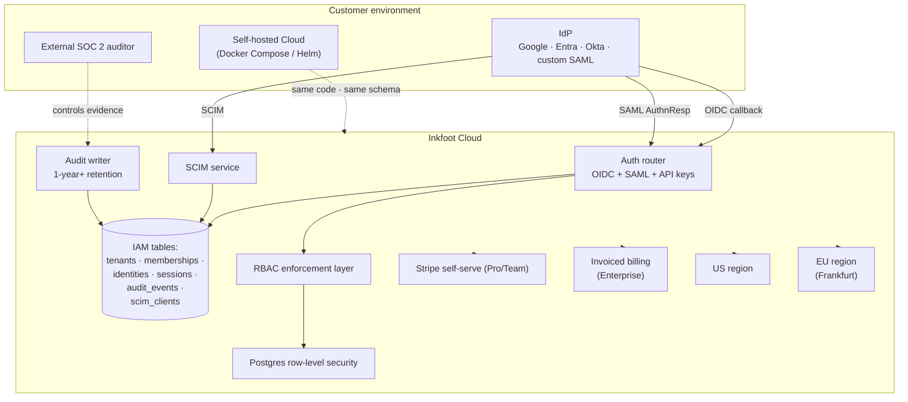

The architecture **mostly doesn't change** — Phase 5 is operational
hardening, IAM, and packaging:

| New component | Responsibility |
|---|---|
| `auth/` router | OIDC + SAML + session cookies + RBAC dependencies |
| IAM schema migration | Tenants, memberships, identities, sessions, audit_events, scim_clients |
| RBAC enforcement | `Depends(RequireRole(...))` becomes real (was no-op in Phase 3-4) |
| SCIM service | Provisioning endpoints for IdP-driven user lifecycle |
| Audit writer | Compliance-grade event capture for every privileged action |
| Self-hosted distribution | Docker Compose + Helm; same code as managed |
| EU region | Independent deployment; data residency at tenant creation |
| Postgres RLS | DB-enforced tenant isolation as defense-in-depth |
| Invoiced billing | Annual contracts; not Stripe-self-serve |

---

## 4. Components — detailed design

### 4.1 IAM schema migration

Borrowed in spirit from Sleuth's IAM design — same tables, adapted
to Inkfoot's terminology:

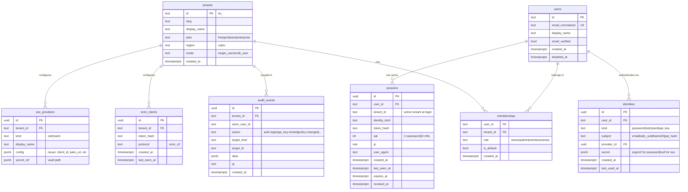

#### 4.1.1 Migration from Phase-3 API-key auth

Phase 3 stored API keys in `api_keys` (a flat per-tenant table).
Phase 5 keeps `api_keys` working — they become one valid identity
kind alongside `password`, `oidc`, and `saml`. The migration:

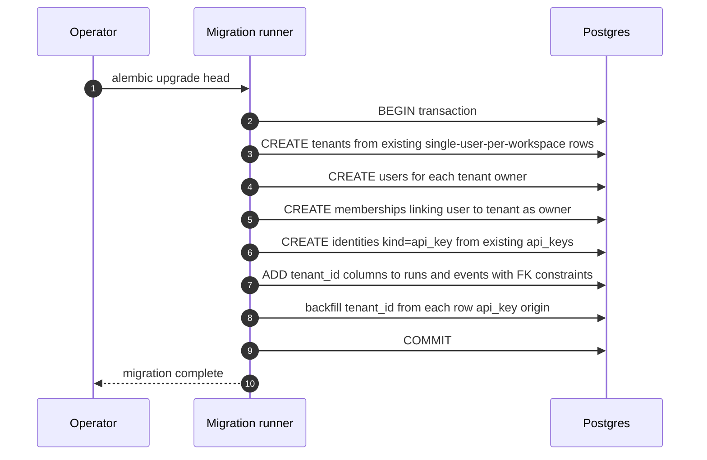

Existing API keys continue to work; they're now formally identities
of the workspace owner. Adding more users, RBAC, and SSO are
additive.

### 4.2 SSO — OIDC flow

```mermaid
sequenceDiagram
  autonumber
  participant User
  participant Browser
  participant Cloud as Cloud auth router
  participant IdP as OIDC IdP
  participant PG

  User->>Browser: visit inkfoot.dev/sso/<tenant>
  Browser->>Cloud: GET /auth/sso/start
  Cloud->>Cloud: generate state and nonce
  Cloud->>PG: store state with tenant id and return url
  Cloud-->>Browser: 302 to IdP authorize URL
  Browser->>IdP: login
  IdP-->>Browser: 302 back to /auth/sso/callback with code and state
  Browser->>Cloud: GET /auth/sso/callback
  Cloud->>PG: lookup state
  Cloud->>IdP: POST token exchange code for tokens
  IdP-->>Cloud: id_token and access_token
  Cloud->>Cloud: verify id_token via jwks
  Cloud->>PG: find identity with kind=oidc and subject=sub
  alt identity exists
    Cloud->>PG: load user and tenant
  else identity is new
    alt user with same email_normalized exists
      Cloud->>PG: INSERT identity for that user
    else first-time user
      Cloud->>PG: INSERT user and identity
      Cloud->>PG: INSERT membership if invitation policy permits
    end
  end
  Cloud->>PG: INSERT session row
  Cloud-->>Browser: Set-Cookie session and redirect to return url
```

Identity-linking rules (mirrors Sleuth's IAM ADR-003): auto-link
only when the IdP returns `email_verified=true` and the verified
email matches an existing user. Otherwise, the flow either creates a
new user (allowed) or refuses to link (the user must log in with
their existing credential and manually link the OIDC identity from
Settings).

### 4.3 SAML SSO

Similar shape to OIDC but with the SAML-specific dance:

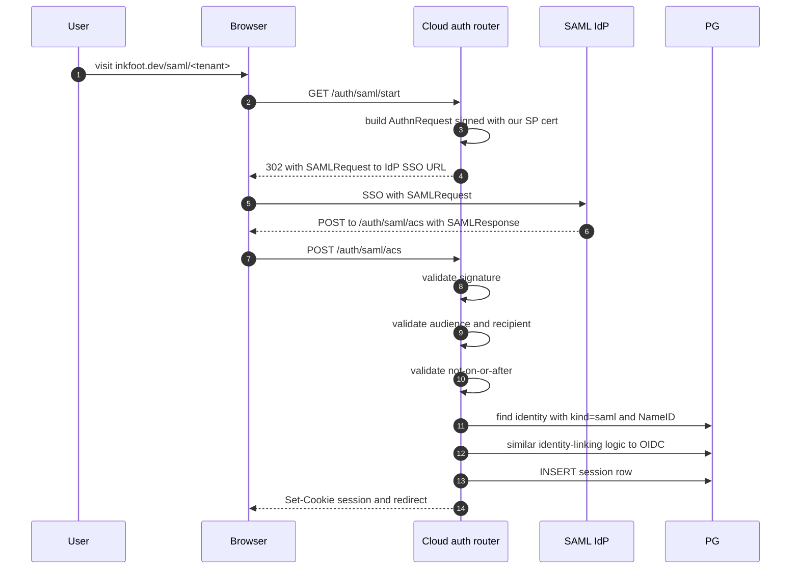

SAML's complexity lives at the boundary: signed AuthnRequest,
validated SAMLResponse, NameID handling. Inside Cloud, the result is
identical to OIDC — a verified `(provider_id, subject)` pair → user
lookup → session.

### 4.4 RBAC enforcement

Phases 3 and 4 had `Depends(RequireRole(...))` as a no-op stub.
Phase 5 makes it real.

```python
def RequireRole(role: str):
    def dep(
        request: Request,
        user: Principal = Depends(CurrentUser),
        tenant: Tenant = Depends(ActiveTenant),
    ) -> None:
        membership = lookup_membership(user.id, tenant.id)
        if membership is None:
            raise HTTPException(403, "not a member of this tenant")
        if not role_satisfies(membership.role, role):
            raise HTTPException(403, f"requires {role} role; you have {membership.role}")
        return  # passes through
    return dep
```

Role permissions table:

| Permission | owner | admin | member | viewer |
|---|:-:|:-:|:-:|:-:|
| View runs / events | ✅ | ✅ | ✅ | ✅ |
| Trigger replay | ✅ | ✅ | ✅ | ❌ |
| Author smells / contracts | ✅ | ✅ | ✅ | ❌ |
| View invoice reconciliation | ✅ | ✅ | ❌ | ❌ |
| Invite users / SCIM provisioning | ✅ | ✅ | ❌ | ❌ |
| Configure SSO providers | ✅ | ❌ | ❌ | ❌ |
| Change billing / cancel subscription | ✅ | ❌ | ❌ | ❌ |
| Delete tenant | ✅ | ❌ | ❌ | ❌ |

The permissions table is **data in code** — a Python dict; not a DB
table. Adding a new permission is one line + a `Depends(RequireRole(...))`
on the route.

### 4.5 SCIM provisioning

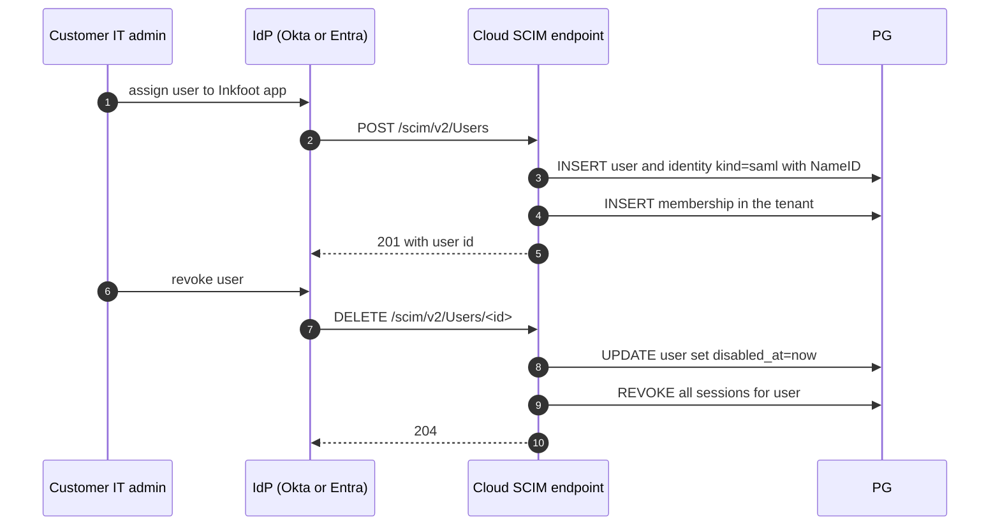

Inkfoot supports the SCIM 2.0 user-lifecycle operations:

| SCIM op | Inkfoot effect |
|---|---|
| `POST /Users` | Create user + identity + membership in mapped tenant |
| `PATCH /Users/<id>` | Update display name / email (re-verification required for email) |
| `DELETE /Users/<id>` | Soft-delete user (`disabled_at`); revoke all sessions |
| `GET /Users` | List users in the tenant; supports `filter` per spec |
| `POST /Groups` | Map IdP groups to roles (config in dashboard) |

The SCIM endpoint authenticates via a Bearer token (one per IdP
connection); the token is stored hashed in `scim_clients`.

### 4.6 Audit log

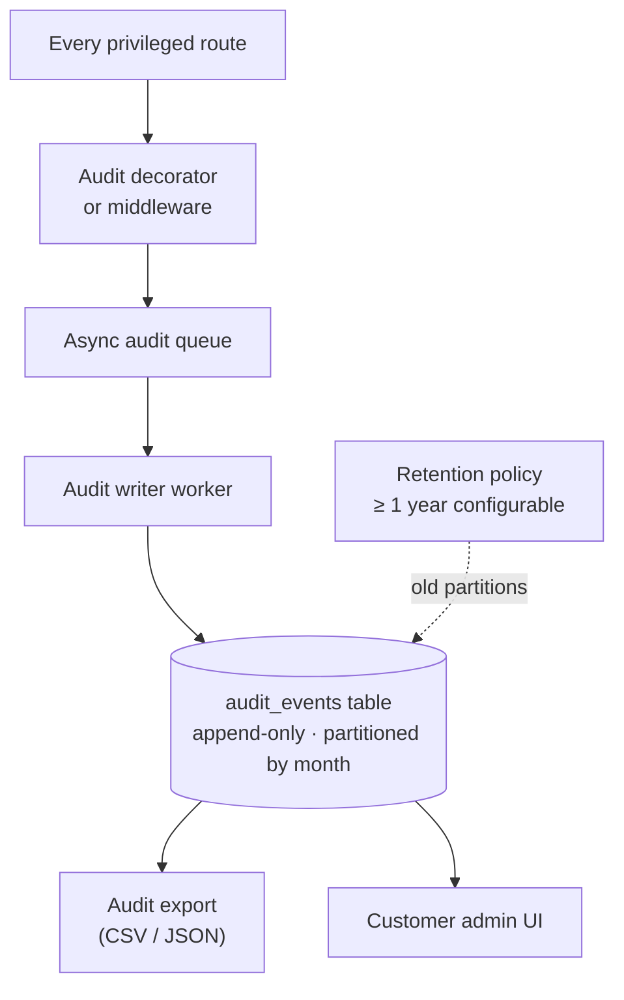

Every privileged action emits an `audit_events` row:

- `auth.login.ok` / `auth.login.failure`
- `auth.logout`
- `auth.session.revoked`
- `auth.password.reset.requested` / `auth.password.reset.completed`
- `iam.user.invited` / `iam.user.role_changed` / `iam.user.removed`
- `iam.sso_provider.configured` / `iam.sso_provider.removed`
- `iam.scim_client.created` / `iam.scim_client.revoked`
- `billing.subscription_changed`
- `policy.contract.created` / `policy.contract.modified`
- `policy.smell.private.created`
- `data.export.requested`
- `data.tenant.deletion.requested` / `data.tenant.deletion.completed`

Each row carries: tenant_id, actor_user_id (nullable for system
actions), action, target_kind, target_id, before/after data (JSONB),
source IP, user agent, timestamp.

Audit writes are **async best-effort** in the hot path: the
privileged action returns immediately; the audit row is written by
the audit worker. A persistent queue (Redis) absorbs bursts; the
audit worker is at-least-once with deduplication on event id.

### 4.7 Self-hosted Cloud distribution

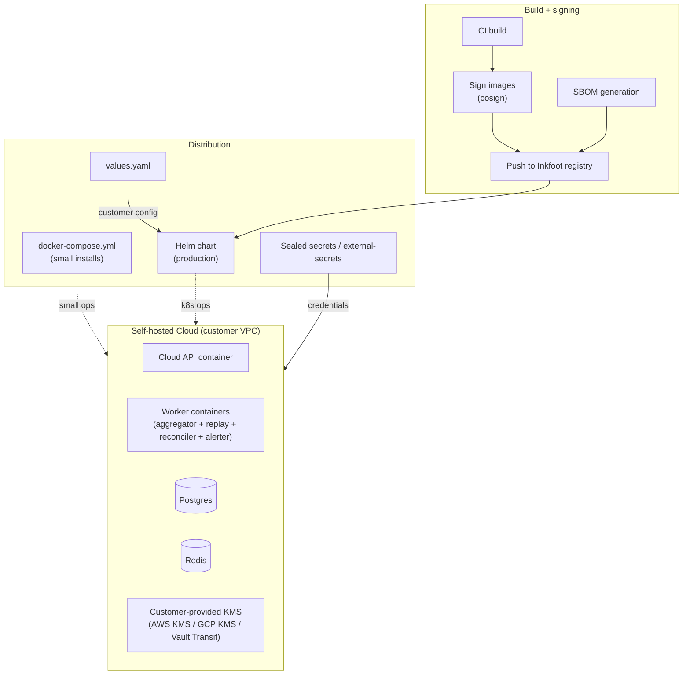

#### 4.7.1 Distribution invariants

1. **Same code as managed Cloud.** Self-hosted uses the same Docker
   images; flag-gated features turn on / off based on the customer's
   license.
2. **Customer-owned KMS.** Self-hosted customers point Inkfoot at
   their own KMS (AWS KMS, GCP KMS, HashiCorp Vault Transit).
   Inkfoot never holds a self-hosted customer's secrets.
3. **No phone-home by default.** Self-hosted installs don't report
   to Inkfoot Cloud unless the customer opts in (e.g., for the
   verified Smell Library; that opt-in is per-tenant in their config).
4. **Signed images.** Every container image is signed with cosign;
   the Helm chart's `imagePullPolicy` verifies signatures via
   sigstore.
5. **SBOM published.** Each release publishes a Software Bill of
   Materials (CycloneDX or SPDX) alongside the image for customer
   security review.

#### 4.7.2 Release cadence

Self-hosted releases lag managed Cloud by one minor version (so the
first ~2 weeks of bugs land for managed customers before self-hosted
customers see them). Release artefacts:

- Signed Docker images
- Helm chart (versioned)
- Docker Compose file
- Release notes including breaking changes + migration steps
- SBOM

### 4.8 EU region

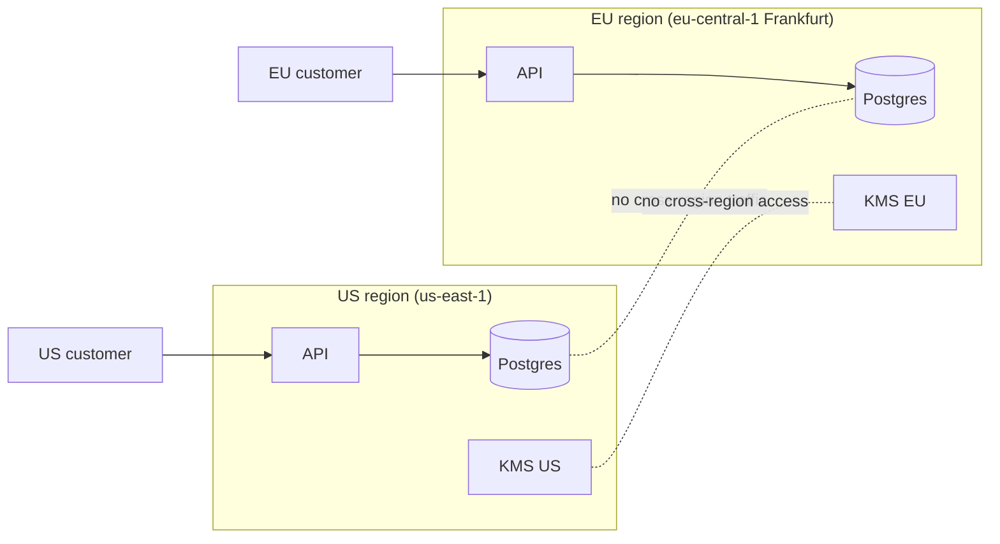

**Invariants:**

- Region selected at workspace creation; **immutable** for the life
  of the tenant.
- No cross-region data transfer at any layer (DB replication
  intra-region only; KMS instance per region; logs per region).
- Customer's domain remains `app.inkfoot.dev` — DNS-based routing
  to the right region based on the tenant slug.
- The application code is regional-aware via `INKFOOT_REGION` env;
  refuses to start if the region doesn't match the configured
  database.

The migration story for an existing US tenant wanting to move to
EU: there isn't one in Phase 5. They'd create a new EU workspace
and re-instrument. Documented as a known limitation.

### 4.9 Postgres row-level security

Phase 3 used application-code scoping (every query has `WHERE
tenant_id = ?`). Phase 5 adds Postgres RLS as **defense in depth**.

```sql
-- Apply to every tenanted table
ALTER TABLE runs ENABLE ROW LEVEL SECURITY;
CREATE POLICY tenant_isolation ON runs
  USING (tenant_id = current_setting('app.tenant_id')::text);

-- Set the variable at the start of every connection acquisition
SET app.tenant_id = 'tw_xxx';
```

The application gains a tiny piece of middleware: on every request,
after authentication, before any DB query, it sets the
`app.tenant_id` variable on the connection. Misconfigured queries
that forget the tenant filter now fail at the DB layer too.

RLS is **additive**, not a replacement for application-code scoping.
Both run; both must be correct.

### 4.10 Invoiced billing flow

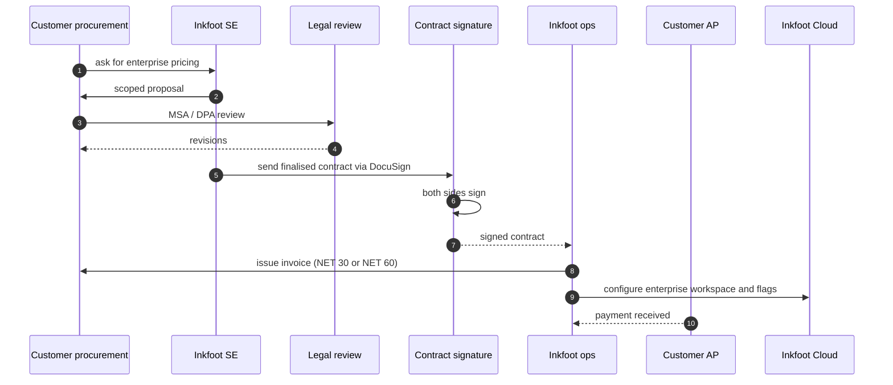

The SaaS-side primitive: tenants have `plan='enterprise'` plus a
`stripe_customer_id = null` (or a marker indicating invoice-billed).
Quota enforcement is contractual, not automated; ops manually
monitors usage and flags overages to the SE.

### 4.11 SOC 2 Type 2

SOC 2 is a **process and evidence audit**, not a feature. Phase 5
ships the controls Inkfoot needs to pass:

| Control area | Specific implementation |
|---|---|
| Logical access | SSO + RBAC + MFA enforcement for Inkfoot employees |
| Change management | Tagged releases; signed commits; PR review required for prod |
| System monitoring | Public status page; on-call rotation; incident playbook |
| Data classification | Per-tenant data classification policy; PII never logged |
| Vulnerability management | Dependabot + monthly third-party pentest budget |
| Backup + DR | Automated nightly backups; quarterly restore drills |
| Incident response | Documented runbook; customer notification SLA in MSA |
| Vendor management | SOC 2 reviews of all subprocessors (Stripe, Postgres host, KMS) |

The audit process:

1. **Readiness assessment** (~3 months pre-audit) — gap analysis
   against the chosen controls.
2. **Type 1 audit** (point-in-time): "are the controls designed
   appropriately?"
3. **Type 2 audit** (6-month observation period): "did the controls
   operate effectively?"

Type 2 is the enterprise-blocker; Type 1 is a 3-month earlier
unlock for some opportunities.

---

## 5. Module structure delta

```
inkfoot-cloud/
├── ... (Phase 3+4 unchanged) ...
├── auth/
│   ├── oidc.py
│   ├── saml.py
│   ├── session.py
│   ├── rbac.py
│   └── current_user.py
├── scim/
│   ├── routes.py
│   ├── adapters/
│   │   ├── okta.py
│   │   └── entra.py
│   └── group_mapping.py
├── audit/
│   ├── writer.py
│   ├── decorator.py
│   └── export.py
├── iam/
│   ├── migration_phase5.py    # alembic migration
│   ├── tenant_provisioning.py
│   └── role_mapper.py
├── regions/
│   ├── router.py              # DNS-based region routing
│   └── config.py              # region-specific config
├── kms/
│   ├── aws.py
│   ├── gcp.py
│   ├── vault.py
│   └── client.py              # interface
├── self_hosted/
│   ├── compose/
│   ├── helm/
│   ├── values.yaml.example
│   └── docs/
└── billing/
    ├── stripe_client.py        # existing
    └── invoiced.py             # NEW — enterprise contract tracking
```

---

## 6. Public interfaces

### 6.1 Cloud API additions

| Method | Path | Purpose | Auth |
|---|---|---|---|
| `GET` | `/auth/sso/start` | OIDC redirect | none |
| `GET` | `/auth/sso/callback` | OIDC callback | OIDC state |
| `GET` | `/auth/saml/start` | SAML redirect | none |
| `POST` | `/auth/saml/acs` | SAML assertion consumer | SAML signature |
| `POST` | `/auth/login` | Password (kept) | none |
| `POST` | `/auth/logout` | Logout | cookie |
| `GET` | `/auth/me` | Current principal | cookie or API key |
| `POST` | `/api/v1/tenants/<id>/invitations` | Invite user | cookie + admin |
| `POST` | `/api/v1/tenants/<id>/memberships/<id>/role` | Change role | cookie + admin |
| `POST` | `/api/v1/tenants/<id>/sso_providers` | Configure OIDC/SAML | cookie + owner |
| `POST` | `/scim/v2/Users` | SCIM user create | SCIM bearer |
| `PATCH` | `/scim/v2/Users/<id>` | SCIM user update | SCIM bearer |
| `DELETE` | `/scim/v2/Users/<id>` | SCIM user disable | SCIM bearer |
| `GET` | `/api/v1/audit` | Audit log query | cookie + admin |
| `GET` | `/api/v1/audit/export` | Audit log CSV/JSON export | cookie + admin |
| `POST` | `/api/v1/tenants/<id>/data_export` | Tenant data export | cookie + owner |
| `DELETE` | `/api/v1/tenants/<id>` | Tenant deletion | cookie + owner |

### 6.2 Self-hosted operator surface

```yaml
# values.yaml (Helm)
inkfoot:
  region: us | eu | self-hosted
  license_key: "ink_ent_..."
  kms:
    type: aws | gcp | vault
    endpoint: ...
  postgres:
    url: postgres://...
  redis:
    url: redis://...
  smtp:
    url: smtps://...
  sso:
    enabled: true
    providers:
      - kind: oidc
        name: company-google
        issuer: https://accounts.google.com
        client_id: ...
        client_secret_ref: vault://...
  retention:
    audit_log_days: 365
    events_days: 90
```

The license key is checked at startup against a public verification
key Inkfoot ships in the image; expired licenses still start the
service in read-only mode (don't shoot the customer's foot off, but
they can't ingest new events).

---

## 7. Critical end-to-end flows

### 7.1 First Enterprise customer onboarding

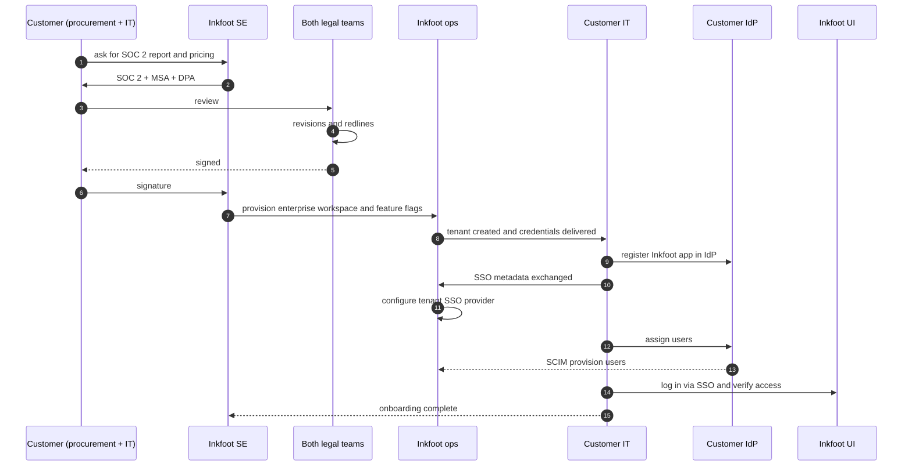

### 7.2 Audit-log review flow (customer self-serve)

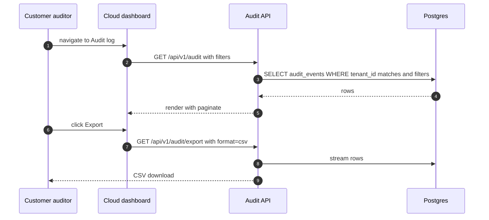

### 7.3 Self-hosted deployment + license check

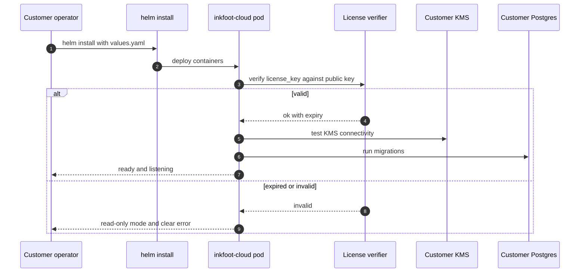

---

## 8. ADRs — Phase 5

### ADR-5-1: Same codebase for managed and self-hosted Cloud

**Status:** Accepted.
**Decision:** Self-hosted Cloud is the same code as managed Cloud,
feature-flagged. No separate fork.
**Why:** A fork drifts. Within 12 months we'd have two products,
both half-broken, with overlapping but incompatible patches.
**Alternatives considered:**
- *Separate "enterprise edition" fork.* Industry-standard but
  guaranteed long-term pain.
**Consequences:** All features are flag-gated for self-hosted; some
features (the verified Smell Library, the verification corpus
contribution path) are explicitly disabled in self-hosted unless
the customer opts in.

### ADR-5-2: Postgres RLS as defense-in-depth, not replacement

**Status:** Accepted.
**Decision:** Phase 5 adds Postgres row-level security on every
tenanted table. Application-code scoping from Phase 3 stays. Both
must be correct.
**Why:** A bug in application-code scoping is one of the most
common multi-tenant failure modes (forgot to filter; cross-tenant
read). RLS catches it at the DB. The cost is a small middleware
hook setting `app.tenant_id` per connection.
**Consequences:** Slight perf hit on every query (RLS predicate
evaluation); negligible at our scale. Tests must cover both layers.

### ADR-5-3: SCIM Group → Role mapping is per-tenant config, not hardcoded

**Status:** Accepted.
**Decision:** Each tenant configures a mapping from IdP-supplied
groups to Inkfoot roles (e.g., `inkfoot-admins` → `admin`). Not
hardcoded.
**Why:** Customer IdP group names vary; auto-mapping by name is
fragile.
**Consequences:** Admin UI requirement for the group-to-role
mapping; one-time setup per tenant; documented in onboarding.

### ADR-5-4: EU region is independent — no cross-region transfer

**Status:** Accepted.
**Decision:** EU and US regions are independent deployments with no
data transfer between them, including for backups and replication.
**Why:** GDPR compliance and customer trust; the cost of getting
this wrong is unbounded.
**Consequences:** Customers cannot migrate between regions. We
publish this explicitly. Phase 6 (or never) addresses migration if
it becomes a real customer ask.

### ADR-5-5: SOC 2 Type 2 over ISO 27001 first

**Status:** Accepted.
**Decision:** Pursue SOC 2 Type 2 first; ISO 27001 only if a
specific customer requires it.
**Why:** US customer base; SOC 2 is the bigger unlock per dollar
of audit cost. ISO 27001 lags in US enterprise procurement.
**Consequences:** Some EU customers may prefer ISO 27001; we
explain on a case-by-case basis. Re-evaluate as the EU customer
base grows.

### ADR-5-6: License keys are public-key signed, not online-validated

**Status:** Accepted.
**Decision:** Self-hosted licenses are signed by Inkfoot with our
private key; the pod verifies offline against the bundled public
key. No phone-home for validation.
**Why:** Customer environments are sometimes air-gapped; online
validation creates a single point of failure.
**Consequences:** Compromised license keys can't be revoked
remotely; mitigation is short-duration licenses (annual) with
renewal-based rotation. Theft tolerance is one year worst-case.

### ADR-5-7: Audit log is at-least-once async write, not synchronous

**Status:** Accepted.
**Decision:** Audit writes don't block the user request; they're
queued and persisted by a background worker.
**Why:** Audit shouldn't slow privileged actions; queue persistence
gives durability without latency.
**Alternatives considered:**
- *Synchronous write.* Adds 5–20 ms to every privileged action.
  Negligible per-request but adds up at scale.
- *Best-effort drop on queue full.* Loses audit data; bad
  compliance posture.
**Consequences:** Audit may lag by seconds. Acceptable; auditors
look at audit logs hours / days later.

### ADR-5-8: SCIM Group provisioning is opt-in per tenant

**Status:** Accepted.
**Decision:** SCIM Group operations (create/update/delete groups
mapped to roles) only fire when the tenant explicitly enables SCIM
group sync. Default: only User operations.
**Why:** Many customers want SCIM for user lifecycle but manage
roles manually in our dashboard. Automated group-to-role can
surprise admins.
**Consequences:** Documentation explains the choice; SCIM-Groups
opt-in is part of the SCIM client setup wizard.

---

## 9. Cross-cutting concerns

### 9.1 Performance budgets

The new IAM layer adds overhead:

| Operation | Budget (p95) |
|---|---|
| Session lookup (cookie → user) | < 5 ms (DB query + cache) |
| RBAC check (role lookup) | < 2 ms (in-memory after session) |
| RLS predicate overhead | < 1 ms per query |
| Audit write (async) | non-blocking |
| SSO callback (OIDC token exchange) | < 500 ms (network-bound) |
| SAML response validation | < 100 ms |

### 9.2 Reliability invariants

1. **Session loss never crashes the app.** If the session cache is
   unavailable, fall back to DB lookup with a slow-path counter.
2. **SSO failures are surfaced honestly.** Customer admins see a
   detailed error when SSO callback fails; the customer never sees a
   silent infinite redirect.
3. **Audit writes are at-least-once.** Better to have a duplicate
   audit row than a missing one.
4. **RLS is enforced; never disable in code paths.** Tests verify
   `current_setting('app.tenant_id')` is set on every transaction.

### 9.3 Privacy

The privacy posture remains "metadata only by default" (Phase 0
established). Phase 5 hardens it:

- **Tenant data export** ("give me everything you have on us") is a
  Phase 5 endpoint; turnaround SLA is 30 days per GDPR.
- **Tenant deletion** is a Phase 5 endpoint; data is hard-deleted
  within 30 days of the request (90 days for backups).
- **Audit log retention** is configurable per tenant (≥ 1 year
  default).
- **PII handling** documented in the privacy policy; no PII in logs;
  audit-events are tenant-isolated.

### 9.4 Compliance

| Standard | Status by end-of-Phase-5 |
|---|---|
| SOC 2 Type 2 | Audited and passed (one annual renewal cycle) |
| GDPR | Compliant; DPA available; data export + deletion work |
| HIPAA | BAA available on request; narrow scope (metadata only) |
| CCPA | Inherits GDPR posture |
| ISO 27001 | Not pursued in Phase 5 (revisit Phase 6 based on EU customer demand) |

---

## 10. Risks & mitigations

| Risk | Likelihood | Impact | Mitigation |
|---|---|---|---|
| **SOC 2 audit slips** | Medium | High | Engage auditor at Phase 5 week 0; pre-audit readiness; document evidence collection from Phase 3 forward |
| **Self-hosted code diverges from managed** | Medium | High | Same codebase; flag-gated; CI tests both deploy shapes; quarterly internal self-host install drill |
| **SSO integration edge cases** | High | Medium | Start with Google (cleanest); validate Azure Entra + Okta against real customer IdP before broader launch |
| **EU operational complexity** | Medium | Medium | EU is fully independent (no cross-region traffic); customer picks at creation; no migration path between regions |
| **Pricing power vs procurement negotiation** | High | Medium | Tie Enterprise pricing to invoice-reconciled savings; the customer's CFO sees the savings |
| **HIPAA scope creep** | Medium | High | Privacy posture (metadata only) makes BAA scope narrow; refuse PHI-bearing feature requests |
| **License-key theft** | Low | Medium | Annual licenses; renewal-based rotation; one year worst-case loss |
| **SCIM group-to-role mis-mapping** | Medium | Medium | Opt-in per tenant; setup wizard with explicit confirmation; audit-log every group change |

---

## 11. Definition of done (multi-milestone)

### Procurement readiness

- [ ] SSO works end-to-end with Google, Azure Entra, Okta (OIDC).
- [ ] SAML SSO with at least one major IdP integration tested.
- [ ] RBAC enforced; four-role split actually used by two
      enterprise customers.
- [ ] Audit log complete; ≥ 1 year retention; exportable.

### Operational readiness

- [ ] Self-hosted Cloud shipped to ≥ 2 customers in production.
- [ ] EU region live; data residency selectable.
- [ ] SOC 2 Type 2 audit passed.
- [ ] HIPAA BAA template signed with at least one healthcare-
      adjacent customer (if applicable).

### Business readiness

- [ ] ≥ 1 customer paying ≥ $100k/year, OR three customers ≥
      $30k/year.
- [ ] Annual contract billing tested end-to-end.
- [ ] Dedicated solutions engineer playbook documented.
- [ ] Per-tenant data export tested.

## 12. Go/no-go signal — Phase 5 and beyond

By Phase 5, **standard SaaS scale-up signals** drive continued
investment:

- Net revenue retention (NRR ≥ 110% is healthy).
- Sales efficiency (LTV / CAC).
- Magic number (new ARR per dollar spent on S&M).

**Healthy:** raise Series A or sustain organic growth. The acquirer
landscape from roadmap §12 ranks Datadog, Langfuse/Helicone,
LangChain Inc. as the top candidates.

**Flat:** optimise for profitability. Phase 5 features (SSO,
self-hosted, SOC 2) make Inkfoot acquisition-attractive whether or
not standalone growth continues.

## 13. Suggested epic breakdown — prefix `EE`

| Epic | Title |
|---|---|
| **EE1** | IAM schema migration (tenants, memberships, identities, sessions, audit_events) |
| **EE2** | OIDC SSO (Google + Azure Entra + Okta) |
| **EE3** | RBAC enforcement (real `RequireRole`; four-role split) |
| **EE4** | Audit log writer + query API + export |
| **EE5** | SAML SSO + SCIM provisioning |
| **EE6** | Self-hosted Cloud distribution (Docker Compose + Helm; license verifier) |
| **EE7** | EU region (independent deployment; data-residency enforcement) |
| **EE8** | Postgres RLS (per-tenant policies; defense-in-depth) |
| **EE9** | SOC 2 Type 2 (controls catalogue; evidence pipeline; auditor engagement) |
| **EE10** | Annual / invoiced billing flow |
| **EE11** | Per-tenant data export (GDPR-aligned) |
| **EE12** | HIPAA BAA template + scoping doc |
| **EE13** | Dedicated SE playbook (onboarding, pricing, contract templates) |
| **EE14** | Enterprise reference customers (published case studies that unlock subsequent procurement) |

EE1–EE4 are the IAM core. EE6 + EE9 are the most operationally
heavy. EE10 + EE13 are commercial enablers, not engineering
deliverables.

## 14. Open questions

- **Acquirer engagement.** Phase 5 raises the acquisition price.
  Do we engage proactively or respond only to inbound? Default:
  inbound-only; let SaaS metrics speak.
- **Self-hosted licensing model.** OSS code is Apache 2.0; Cloud
  code in self-hosted form is **source-available** (proposal:
  ELv2 / BUSL). Confirm with legal counsel pre-Phase 5.
- **HIPAA scope.** BAA scope is narrow (metadata only); refuse
  PHI-bearing feature requests unless commercial commitment justifies
  the compliance investment.
- **Per-customer feature flags.** Tenant-level settings rows are
  acceptable; per-customer code branches are not.
- **EU region selection.** Frankfurt first; Ireland as follow-up if
  Irish-specific compliance demands materialise.
- **The "Sleuth relationship".** Pre-Phase-5 decision point on
  whether Inkfoot is a standalone company, a Sleuth product, or an
  OSS project Sleuth maintains as strategic asset. This affects
  funding, branding, and contract signature.
