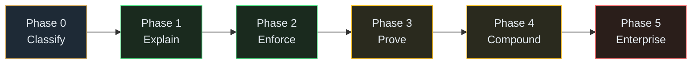

# Inkfoot — Planned Phases

This folder holds the **planned but not yet released** phases of the
[Inkfoot roadmap](../roadmap-inkfoot.md). Each `phaseN/` subfolder has
two documents: an architecture spec for the slice and a development
epics breakdown that drives execution.

When a phase ships, its `phaseN/` folder moves to `../released/`,
preserving both documents as the historical record.

Phase docs are deliberately **not** restatements of
[architecture-inkfoot.md](../architecture-inkfoot.md) — they zoom in
on what's actually built in their slice and reference the main
architecture for shared design.

## Phase index

| Phase | Theme | Architecture | Development Epics | Weeks |
|---|---|---|---|---|
| **0** | Classify *(E1 in progress)* | [phase-0-classify.md](phase0/phase-0-classify.md) | [Phase 0 epics](phase0/inkfoot_phase0_development_epics.md) | 0–8 |
| **1** | Explain | [phase-1-explain.md](phase1/phase-1-explain.md) | [Phase 1 epics](phase1/inkfoot_phase1_development_epics.md) | 8–20 |
| **2** | Enforce | [phase-2-enforce.md](phase2/phase-2-enforce.md) | [Phase 2 epics](phase2/inkfoot_phase2_development_epics.md) | 20–32 |
| **3** | Prove | [phase-3-prove.md](phase3/phase-3-prove.md) | [Phase 3 epics](phase3/inkfoot_phase3_development_epics.md) | 32–48 |
| **4** | Compound | [phase-4-compound.md](phase4/phase-4-compound.md) | [Phase 4 epics](phase4/inkfoot_phase4_development_epics.md) | 48–64 |
| **5** | Enterprise | [phase-5-enterprise.md](phase5/phase-5-enterprise.md) | [Phase 5 epics](phase5/inkfoot_phase5_development_epics.md) | 64+ |

Each phase folder contains two documents:
- **Phase architecture** (`phase-N-*.md`) — the design spec for the
  slice: context, goals, high-level diagram, detailed component
  internals, data-model deltas, sequence diagrams, phase-specific
  ADRs, risks, DoD, and the go/no-go signal.
- **Development epics** (`inkfoot_phaseN_development_epics.md`) — the
  epic + story breakdown an implementer drives from, following the
  FauxBase template (epic overview Mermaid + Gantt → story points →
  per-epic stories with tasks tables + acceptance criteria → summary
  → risks → out-of-scope).

## Capability matrix — the authoritative phase placement

This table is the source of truth when phase docs disagree. Reviewers
caught a few drift points (outcome tracking, threshold alerting,
invoice reconciliation, modification policies). When the body text
of any phase doc conflicts with this table, **the table wins**;
fix the prose.

| Capability | Phase 0 | Phase 1 | Phase 2 | Phase 3 | Phase 4 | Phase 5 |
|---|:-:|:-:|:-:|:-:|:-:|:-:|
| Pattern A SDK shims (Anthropic + OpenAI) | ✅ | — | — | — | — | — |
| Pattern B + Pattern C framework adapters[^adapters] | — | ✅ | ✅ | — | ✅ | — |
| Causal Token Ledger (13 input cause + output_tokens) | ✅ | — | — | — | — | — |
| Replay-capture mode (schema lands; opt-in default off) | ✅ | — | — | — | — | — |
| Local SQLite storage | ✅ | — | — | — | — | — |
| Postgres storage backend | — | — | ✅ | — | — | — |
| 5 built-in cost smells | ✅ | — | — | — | — | — |
| +5 smells (10 total) | — | — | ✅ | — | — | — |
| Outcome tagging (`set_outcome`) — capture | ✅ | — | — | — | — | — |
| Cost-per-success — headline reporting | — | — | ✅ | — | — | — |
| Observation policies (BudgetCap, RetryThrottle, CacheControlPlacer) | ✅ | — | — | — | — | — |
| Modification policies (LazyToolExposure, CheapSummariser) | — | — | ✅ | — | — | — |
| `inkfoot benchmark` + `inkfoot diff` + GitHub Action | — | ✅ | — | — | — | — |
| Token Contracts (runtime + `contract check` CI) | — | — | ✅ | — | — | — |
| Contract outcome clauses — runtime advisory | — | — | ✅ (advisory) | — | — | — |
| OTel ingest + export | — | ✅ | — | — | — | — |
| Provider expansion (Gemini, Bedrock, OpenAI-compat) | — | — | ✅ | — | — | — |
| Cloud ingestion + Postgres + workers | — | — | — | ✅ | — | — |
| Cost Replay Engine | — | — | — | ✅ | — | — |
| Static analyzer `inkfoot lint` (Python) | — | — | — | ✅ | — | — |
| Static analyzer `inkfoot lint` (TypeScript) | — | — | — | — | ✅ | — |
| Invoice reconciliation (Anthropic + OpenAI) | — | — | — | ✅ | — | — |
| Invoice reconciliation (Bedrock + Gemini) | — | — | — | — | ✅ | — |
| FOCUS-spec export | — | — | — | ✅ | — | — |
| **Threshold alerts** (Slack/PagerDuty/email delivery) | — | — | — | ✅ (email only) | ✅ (+ Slack, PagerDuty) | — |
| **Anomaly alerts** (3σ baseline) | — | — | — | — | ✅ | — |
| TypeScript SDK | — | — | — | — | ✅ | — |
| Cost Smell Library (community-contributed, estimated savings) | — | — | — | — | ✅ | — |
| Self-serve signup | — | — | — | — | ✅ | — |
| Full IAM (tenants, memberships, identities, sessions) | — | — | — | — | — | ✅ |
| SSO (OIDC + SAML) | — | — | — | — | — | ✅ |
| RBAC enforcement (Owner/Admin/Member/Viewer) | — | — | — | — | — | ✅ |
| Audit log (compliance-grade, ≥ 1 year retention) | — | — | — | — | — | ✅ |
| Self-hosted Cloud distribution | — | — | — | — | — | ✅ |
| EU region | — | — | — | — | — | ✅ |
| SOC 2 Type 2 | — | — | — | — | — | ✅ |
| Postgres RLS | — | — | — | — | — | ✅ |

[^adapters]: The framework-adapter ✅ rows cover three distinct
delivery slices:
- **Phase 1 (Python):** LangGraph + OpenAI Agents SDK + Anthropic
  Agent SDK + raw-SDK Pattern B.
- **Phase 2 (Python):** adds Pydantic AI + CrewAI adapters and the
  modification policies (`LazyToolExposure`, `CheapSummariser`) that
  Pattern C unlocks.
- **Phase 4 (TypeScript):** mirrors Pattern A + B in TS with Vercel
  AI SDK + LangChain.js adapters as Pattern C. Wire format is
  identical to Python's; Cloud ingest can't tell which language
  produced a batch.

Static analyzer ✅ rows (Python vs TypeScript) are kept on separate
matrix rows for the same reason; the framework-adapter row is
collapsed because the Python adapters are continuous across Phase 1
and Phase 2, and pulling them apart visually would make the matrix
harder to scan.

**Multi-user / seats / multiple workspaces:** the Phase 3 and Phase
4 pricing tiers (Pro, Team) operate as **single-user-per-workspace**
at every Cloud tier. Multi-user, seats, and multiple workspaces per
organisation are **Enterprise-tier features that ship with the
Phase 5 IAM stack**, not Phase 3/4. Phase 3's pricing table reflects
this; the roadmap was corrected to match.

## Dependency graph

The phases are strictly sequential — each one's go/no-go signal gates
the next. There is no parallel-able structure inside the roadmap. The
phases get larger over time both in scope and in team size; see the
roadmap's §9 resource model for the assumed team shape per phase.

## Three rules these phase docs follow

Borrowed from the [architect skill's phases convention](https://anthropic.com)
(see Sleuth's `docs/plans/` for the same pattern applied to other
streams):

1. **Each phase ends with something usable.** Not a stage gate; a real
   thing a real reader can hold. Phase 0 ends with our own agents
   running on Inkfoot for 6 weeks; Phase 1 ends with a public OSS
   release; Phase 3 ends with a paying customer.
2. **Phases are ordered by dependency, not by team.** The Causal Token
   Ledger has to land before anything else can attribute against it;
   Token Contracts need attribution; Cloud needs runtime maturity;
   Enterprise needs Cloud GA.
3. **Risk-first.** The single biggest risk — that causal attribution
   doesn't surface meaningful smells in real-world data — is taken in
   Phase 0 by running on our own agents. We learn early whether the
   product premise is right before paying the cost of a public
   launch.

## Naming convention for future epics

Once a phase is approved for execution, its epic breakdown lands as
`epics-phase-N-<slug>.md` in this folder, following the prefix table
below. The two-letter epic-ID prefix is chosen per phase so a backlog
across phases doesn't collide:

| Phase | Suggested epic prefix | Example |
|---|---|---|
| Phase 0 — Classify | `CL` | `CL3` Causal Token Ledger, `CL7` Smell engine |
| Phase 1 — Explain | `EX` | `EX1` LangGraph adapter, `EX6` `inkfoot diff` |
| Phase 2 — Enforce | `EN` | `EN1` Token Contract YAML, `EN6` `CheapSummariser` |
| Phase 3 — Prove | `PR` | `PR1` Cloud ingestion, `PR4` Replay Engine |
| Phase 4 — Compound | `CO` | `CO1` TypeScript port, `CO5` Smell Library |
| Phase 5 — Enterprise | `EE` | `EE2` OIDC SSO, `EE6` Self-hosted Cloud |

Examples reference the actual epic IDs from each phase doc's
"Suggested epic breakdown" section.

Pick the prefix when starting the phase's epic breakdown; document the
final choice in the phase doc.
