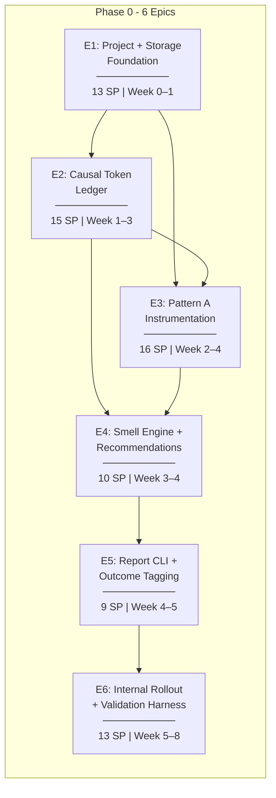
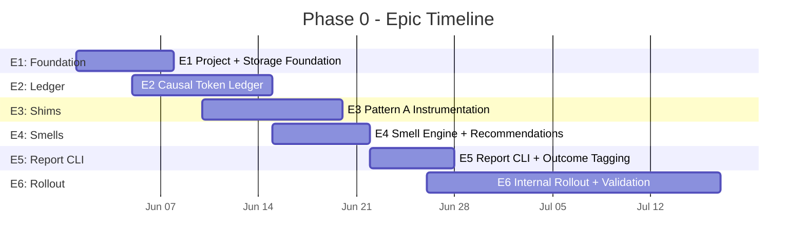
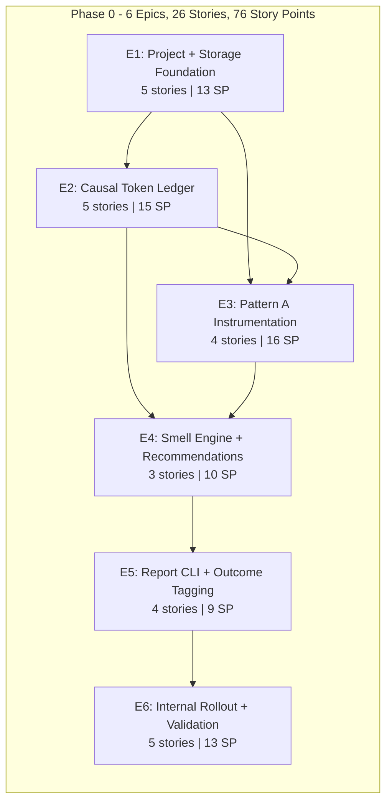

# Inkfoot — Phase 0: Development Epics

> **Phase:** 0 — Classify
> **Theme:** Classify where every billed token came from. Run on our own agents.
> **Timeline:** Weeks 0–8 (40 working days)
> **Total Story Points:** 76
> **Document Version:** 1.1
> **Last Updated:** 2026-05-25
> **Aligned With:** `phase-0-classify.md` (per-phase architecture)
>
> **Outcome gate:** internal use only — no public release until Phase 1.
> Phase 0 → Phase 1 transition is contingent on the go/no-go signal at
> the 6-week internal-usage mark (see §11 below).

---

## Epic Overview

> **Unit convention.** Gantt bar durations (`Nd`) are **calendar days**;
> per-epic "Sprint" headers below (e.g. "Week 5–8 (Days 21–40)") are
> **working days** at 5/week. The two are deliberately not unified —
> calendar dates anchor the schedule on the chart, working days anchor
> effort estimates in the prose. Both reconcile against the Story Point
> totals.

---

## Story Point Scale

| Points | Effort | Example |
|---|---|---|
| 1 | Trivial (< 1 hour) | Add a config field, write a single test |
| 2 | Small (1–3 hours) | Implement a single utility function with tests |
| 3 | Medium (3–6 hours) | Implement a class with 3–5 methods and unit tests |
| 5 | Large (1–1.5 days) | Build a full module with multiple classes and tests |
| 8 | XL (1.5–2.5 days) | Complex feature with edge cases, integration test setup |
| 13 | XXL (3–4 days) | Multi-file feature with significant complexity |

---

## E1: Project + Storage Foundation

**Status:** ✅ shipped — see branch
`anirban/CL-E1-project-storage-foundation`. Unit tests (incl. a real
`kill -9` WAL durability test) + storage hot-path benchmark + 50-row
aggregator drain benchmark green; `inkfoot rebuild-aggregates` CLI
installed via the `inkfoot` entry point. Code:
`inkfoot/{money,storage,cli}.py`.

**Goal:** Stand up the Python package skeleton, the nanodollar money type, the SQLite storage layer with WAL + two-tier write semantics, the aggregator worker, and the `inkfoot rebuild-aggregates` recovery command. After this epic, the rest of Phase 0 has a place to write to.

**Total Story Points:** 13
**Sprint:** Week 0–1 (Days 1–7)
**Dependencies:** none (this is the foundation)

---

### E1-S1: Python Package Skeleton + Public Surface

**Story:** As a developer, I need an installable `inkfoot` package with stable public re-exports and a SemVer skeleton so future stories add modules behind a frozen import surface.

**Story Points:** 2

**Tasks:**

| # | Task | File(s) | Details |
|---|---|---|---|
| T1 | Create package layout | `inkfoot/__init__.py`, `pyproject.toml` | `inkfoot/` per phase-0-classify.md §4 module-structure. `pyproject.toml` declares `[project]` with `name='inkfoot'`, `requires-python='>=3.10'`, dynamic version. |
| T2 | Public re-exports | `inkfoot/__init__.py` | Re-export `instrument`, `agent_run`, `set_outcome`, `tag`, `tag_retrieval`, `report_cost`. Underscore-prefixed modules are private. |
| T3 | Version + license | `inkfoot/_version.py`, `LICENSE` | Apache 2.0 (per architecture-inkfoot §15). `_version.py` reads from package metadata. |
| T4 | PyPI name reservation | (operational) | Reserve `inkfoot` on PyPI; reserve `inkfoot.dev` domain. Document in `README.md` operator notes. |
| T5 | Unit tests | `tests/unit/test_public_surface.py` | Asserts the public surface (~12 names) and that underscore modules don't leak via `from inkfoot import *`. |

**Acceptance Criteria:**
- [ ] `pip install -e .` from a fresh clone installs the package and `python -c "import inkfoot; print(inkfoot.__version__)"` works.
- [ ] `from inkfoot import *` exposes exactly the documented surface; no `_` names leak.
- [ ] `LICENSE` file present at repo root.

---

### E1-S2: Nanodollar Money Type

**Story:** As a developer, I need an integer-nanodollar money type so token cost math is precise and float drift never accumulates.

**Story Points:** 2

**Tasks:**

| # | Task | File(s) | Details |
|---|---|---|---|
| T1 | `Nanodollar` type | `inkfoot/money.py` | Integer alias `Nanodollar = NewType("Nanodollar", int)`. 10⁻⁹ USD per unit (ADR-0-4). |
| T2 | Conversion helpers | `inkfoot/money.py` | `usd_to_nd(decimal_or_float)`, `nd_to_usd(int)` → `Decimal`, `format_usd(nd, decimals=4)` for display. |
| T3 | Arithmetic invariants | `inkfoot/money.py` | All math accepts and returns `int`; helpers raise on float inputs (typed mistakes only). |
| T4 | Unit tests | `tests/unit/test_money.py` | Round-trip USD → nd → USD lossless for representable values; sum across 10⁵ rows is exact; refuses floats. |

**Acceptance Criteria:**
- [ ] `usd_to_nd(Decimal("0.0004"))` returns `400000`.
- [ ] `nd_to_usd(400000)` returns `Decimal("0.000400")`.
- [ ] Summing 1,000,000 random `Nanodollar` values produces a value identical to the equivalent `Decimal` sum.
- [ ] `usd_to_nd(0.0004)` (float input) raises `TypeError`.

---

### E1-S3: SQLite Storage — Schema + Two-Tier Writes

**Story:** As the persistence layer, I need a SQLite schema (per phase-0-classify §5.5) with WAL mode, both consistency tiers, and the partial `runs_dirty` index so writes are fast and recoverable.

**Story Points:** 5

**Tasks:**

| # | Task | File(s) | Details |
|---|---|---|---|
| T1 | `Storage` Protocol + `SQLiteStorage` | `inkfoot/storage/__init__.py`, `inkfoot/storage/sqlite.py` | Protocol declares `connect`, `insert_event`, `mark_dirty`, `read_dirty`, `update_aggregates`. SQLite impl uses one connection per thread + threadlocal. |
| T2 | Migrations | `inkfoot/storage/migrations.py` | Forward-only DDL list. v1 = full schema from phase-0-classify §5.5 + §5.5.1 (runs + events tables, `parent_run_id`, `run_kind`, `divergence_flag`, `total_cache_*` columns, `aggregates_dirty`, `events.capture_mode TEXT NOT NULL DEFAULT 'metadata'`, and the `event_contents` sibling table per ADR-0-9). Apply on first `connect`. |
| T3 | Per-connection pragmas | `inkfoot/storage/sqlite.py` | `journal_mode=WAL`, `synchronous=NORMAL`, `busy_timeout=5000`, `temp_store=MEMORY`, `mmap_size=128MiB`. |
| T4 | Two-tier write helper | `inkfoot/storage/sqlite.py` | `insert_event(run_id, kind, payload)` writes the event row + sets `aggregates_dirty=1` in a single transaction. Defaults `capture_mode='metadata'`; `event_contents` rows are written only when `capture_mode='replay'` (see E3-S2). |
| T5 | Indexes | `inkfoot/storage/sqlite.py` | `events_run_seq`, `runs_started`, `runs_task_started`, partial `runs_dirty` (where dirty=1), `runs_parent` (where parent_run_id is not null). |
| T6 | Unit tests | `tests/unit/test_storage_sqlite.py` | Schema migration applies cleanly; write hot-path under 1 ms p95 on tempfile DB; dirty flag toggles correctly; WAL survives `kill -9` (subprocess test); `event_contents` table exists post-migration with the columns from §5.5.1. |

**Acceptance Criteria:**
- [ ] `SQLiteStorage` exposes the full Storage Protocol surface; passes contract tests against an in-memory + tempfile DB.
- [ ] `insert_event` p95 < 1 ms on the CI machine (tempfile WAL).
- [ ] `kill -9` mid-write recovery test: child process kill after `INSERT` but before commit leaves the DB intact and re-openable.
- [ ] `runs_dirty` partial index exists and is non-empty after a write.
- [ ] `events.capture_mode` column exists post-migration with default value `'metadata'`; `PRAGMA table_info(events)` includes it.
- [ ] `event_contents` table exists post-migration with the columns from phase-0-classify §5.5.1 (`event_id` PK, `request_json`, `response_json`, `tool_result_json`, `content_redacted`); foreign-key cascade from `events` is enforced.

---

### E1-S4: Aggregator Worker + `inkfoot rebuild-aggregates`

**Story:** As the persistence layer, I need a background worker that drains the dirty queue every 500 ms (configurable) and recomputes `runs.total_*` from the event log, plus a CLI command to recover after a crash.

**Story Points:** 3

**Tasks:**

| # | Task | File(s) | Details |
|---|---|---|---|
| T1 | `AggregatorWorker` | `inkfoot/storage/aggregator.py` | Background thread; polls `aggregates_dirty=1` rows in batches of 50; recomputes 14 ledger field totals + outcome from event stream; updates the row + clears dirty flag in a single transaction. Tunable via `INKFOOT_AGGREGATOR_INTERVAL_MS`. |
| T2 | Idempotent recompute | `inkfoot/storage/aggregator.py` | Re-running aggregation on already-clean rows is a no-op. Uses the conditional `WHERE id=? AND dirty=1` pattern to avoid lost updates. |
| T3 | `inkfoot rebuild-aggregates` | `inkfoot/cli/rebuild_aggregates.py` | Marks every run dirty and runs the aggregator to drain. Useful after a crash or after adding a new column. |
| T4 | Unit tests | `tests/unit/test_aggregator.py` | Dirty rows get aggregated within 1s of poll interval; corrupted projection (manually edited total) is repaired by `rebuild-aggregates`; mid-aggregator new event arriving leaves the row dirty for next pass. |

**Acceptance Criteria:**
- [ ] Aggregator drains 50 dirty rows in < 50 ms (CI benchmark).
- [ ] Re-running `inkfoot rebuild-aggregates` after corrupting `runs.total_input_tokens` restores the value to match the event log.
- [ ] No "lost update" — concurrent new-event-insertion during a sweep leaves the row dirty=1 (verified by integration test).

---

### E1-S5: Storage Layer Tests + Benchmark Suite

**Story:** As CI, I need a benchmark suite that fails the build when the storage hot path regresses past its budget.

**Story Points:** 1

**Tasks:**

| # | Task | File(s) | Details |
|---|---|---|---|
| T1 | `pytest-benchmark` setup | `tests/benchmarks/`, `pyproject.toml` | Add `pytest-benchmark` to dev deps. |
| T2 | Hot-path benchmark | `tests/benchmarks/test_storage_perf.py` | Insert 10,000 events; assert p95 < 1 ms; fails if mean > 0.5 ms. |
| T3 | CI integration | `.github/workflows/ci.yml` | Runs benchmarks on every PR; uploads JSON report as artefact. |

**Acceptance Criteria:**
- [ ] CI runs the benchmark on every PR and fails the build when p95 > 1 ms.
- [ ] Benchmark output is uploaded as a CI artefact for trend tracking.

---

## E2: Causal Token Ledger

**Goal:** Implement the 14-field ledger (13 input-side cause categories + `output_tokens`), the per-provider attribution recipes for Anthropic and OpenAI, the tokeniser layer with estimation flags, and the `NeutralCall` / `Run` payloads. This epic is the load-bearing diagnostic surface of the entire product.

**Total Story Points:** 15
**Sprint:** Week 1–3 (Days 5–15)
**Dependencies:** E1 (Storage Protocol, money type)

---

### E2-S1: `CausalTokenLedger` Dataclass + Validation Invariants

**Story:** As a developer, I need a frozen dataclass with the 14 ledger fields and the validation invariant from phase-0-classify §5.3 so attribution is precise and auditable.

**Story Points:** 3

**Tasks:**

| # | Task | File(s) | Details |
|---|---|---|---|
| T1 | `CausalTokenLedger` dataclass | `inkfoot/ledger.py` | `frozen=True`. 14 `int` fields per phase-0-classify §5.3: system_static, system_dynamic, user_input, tool_schema, tool_result, retrieved_context, memory, retry_overhead, summariser, reasoning, guardrail, cache_creation, cache_read, output. All default 0. |
| T2 | `input_total` + `output_total` helpers | `inkfoot/ledger.py` | `input_total` sums the 13 input-side fields; `output_total` is `output_tokens`. Used in invariant checks + reporting. |
| T3 | Validation invariant | `inkfoot/ledger.py` | `validate_against_usage(ledger, raw_input, raw_output)`: assert `abs(ledger.input_total - raw_input) / raw_input < 0.02` (2% tokeniser slop). `output_total == raw_output` exactly. |
| T4 | Unit tests | `tests/unit/test_ledger.py` | Defaults; sum invariants; invariant with slop tolerance; output-exact assertion; frozen-ness. |

**Acceptance Criteria:**
- [ ] `CausalTokenLedger()` returns an all-zeros instance.
- [ ] `ledger.input_total` excludes `output_tokens`.
- [ ] `validate_against_usage` accepts a 2% input mismatch; rejects a 5% mismatch.
- [ ] Assignment to any field after construction raises `dataclasses.FrozenInstanceError`.

---

### E2-S2: `NeutralCall` + `Run` + `InMemoryRunState`

**Story:** As a developer, I need the neutral event-payload dataclasses (NeutralCall, Run, InMemoryRunState) so per-provider translators have a single target shape.

**Story Points:** 3

**Tasks:**

| # | Task | File(s) | Details |
|---|---|---|---|
| T1 | `NeutralCall` | `inkfoot/normalise/__init__.py` | `frozen=True`. Fields per phase-0-classify §5.4: provider, model, started_at, ended_at, ledger, estimated_nanodollars, tools_offered, tools_called, error, cache_status, parent_run_id, sequence, estimation_flags. |
| T2 | `Run` (persistence shape) | `inkfoot/run.py` | Fields match the SQLite `runs` table exactly: id, task, agent_kind, parent_run_id, run_kind, divergence_flag, started_at, ended_at, status, outcome, quality_score, total_input_tokens, total_output_tokens, total_cache_read_tokens, total_cache_creation_tokens, total_nanodollars, aggregates_dirty, metadata. |
| T3 | `InMemoryRunState` | `inkfoot/run.py` | `stable_system_prefix: str`, `recent_calls: list`, `retry_counts: dict`. Explicit "not persisted" docstring; lives only in process memory for the lifetime of the run. |
| T4 | Unit tests | `tests/unit/test_run_payloads.py` | Frozen-ness; serialisation round-trip via `dataclasses.asdict`; explicit assertion that `InMemoryRunState` has no DB-persistence helpers. |

**Acceptance Criteria:**
- [ ] Every `Run` field maps 1:1 to a SQLite `runs` column (verified via reflection test).
- [ ] `InMemoryRunState` is not referenced by any storage module.
- [ ] `NeutralCall` round-trips through `dataclasses.asdict` + `dict_to_neutral_call` losslessly.

---

### E2-S3: Tokeniser Layer (`tiktoken` + Anthropic Fallback)

**Story:** As a developer, I need a tokeniser layer that uses `tiktoken` (exact) for OpenAI and best-effort Anthropic with explicit estimation flags, so the ledger knows what's exact vs estimated.

**Story Points:** 3

**Tasks:**

| # | Task | File(s) | Details |
|---|---|---|---|
| T1 | `tokenise(text, model)` | `inkfoot/tokenisers.py` | Dispatches by model prefix: OpenAI → `tiktoken.encoding_for_model(model)`; Anthropic → `anthropic.tokenize` if importable else `tiktoken o200k_base` fallback. Returns `(token_count, estimation_flag: bool)`. |
| T2 | Estimation flag propagation | `inkfoot/tokenisers.py` | `tokenise_with_flags(text, model) → TokenCount(value, estimated)` so callers can lift the flag into `NeutralCall.estimation_flags`. |
| T3 | Tool-schema tokenisation | `inkfoot/tokenisers.py` | `tokenise_tools(tools_array, model)` — serialises the array (per-provider format), tokenises, returns the count. |
| T4 | Unit tests | `tests/unit/test_tokenisers.py` | Exact counts for OpenAI fixtures; fallback flag set when Anthropic tokeniser unavailable; tool-schema counts within ±5% of provider-reported on a Datadog tools fixture. |

**Acceptance Criteria:**
- [ ] `tokenise("hello", "gpt-4o").value` returns exactly the `tiktoken` count.
- [ ] When `anthropic.tokenize` is unimportable (mocked), the Anthropic path returns `estimated=True`.
- [ ] Tool-schema tokenisation completes in < 10 ms for a typical 5-tool array.

---

### E2-S4: Per-Provider Attribution Recipes

**Story:** As a developer, I need the per-provider translators (Anthropic + OpenAI) that turn a raw response + request into a `CausalTokenLedger` populated across all 14 fields.

**Story Points:** 5

**Tasks:**

| # | Task | File(s) | Details |
|---|---|---|---|
| T1 | `AnthropicTranslator` | `inkfoot/normalise/anthropic.py` | Builds the ledger from `response.usage` + the original request. Direct fields: `output_tokens`, `reasoning_tokens` (thinking blocks), `cache_creation_tokens`, `cache_read_tokens`. Tokenised: system_static / system_dynamic (longest-stable-prefix detection from `InMemoryRunState`), user_input, tool_schema, tool_result, memory, retrieved_context. |
| T2 | `OpenAITranslator` | `inkfoot/normalise/openai.py` | Mirror of Anthropic translator for OpenAI's `usage` shape. Maps `cached_tokens` to `cache_read_tokens`; `cache_creation_tokens=0` since OpenAI doesn't bill writes. `reasoning_tokens` from o-series models when present. |
| T3 | Stable-prefix detector | `inkfoot/normalise/__init__.py` | `update_stable_prefix(current_prefix, new_system_block) → new_prefix` shortening-only algorithm. Lives on `InMemoryRunState`. |
| T4 | Estimation flags | `inkfoot/normalise/anthropic.py`, `inkfoot/normalise/openai.py` | Lift the tokeniser's `estimated` flag into `NeutralCall.estimation_flags` (`["tool_schema_tokens", "system_dynamic_tokens"]` etc.). |
| T5 | Cost estimation | `inkfoot/normalise/__init__.py` | `estimate_nanodollars(provider, model, ledger)` → `Nanodollar`. Uses the per-Mtok pricing dict from E2-S5. |
| T6 | Unit tests | `tests/unit/test_anthropic_translator.py`, `tests/unit/test_openai_translator.py` | Against recorded API-response fixtures: every ledger field populates correctly; estimation flags surface; validation invariant passes; system_static/system_dynamic split tracks across a 4-turn run. |

**Acceptance Criteria:**
- [ ] For a 4-turn Anthropic investigation, ledger fields sum to within 2% of `usage.input_tokens` on every turn.
- [ ] `system_static_tokens` is monotonically non-increasing across a run (prefix can only shorten).
- [ ] OpenAI's `cached_tokens` lands on `cache_read_tokens`; `cache_creation_tokens` is 0 for OpenAI.
- [ ] Estimation flags appear when the Anthropic fallback tokeniser is used.

---

### E2-S5: Pricing Table + Cost Estimation

**Story:** As a developer, I need a versioned per-(provider, model) pricing table in integer nanodollars so cost estimation is deterministic and updates flow cleanly.

**Story Points:** 1

**Tasks:**

| # | Task | File(s) | Details |
|---|---|---|---|
| T1 | `PRICING_ND_PER_TOKEN` | `inkfoot/pricing.py` | Dict keyed by `(provider, model)` → `PriceRow(input, output, cache_read, cache_write)`. Initial entries per phase-0-classify §5.11. Includes `PRICING_TABLE_REVISION` constant + `effective_from` date. |
| T2 | `estimate_nanodollars(provider, model, ledger)` | `inkfoot/pricing.py` | Sums each ledger field × its price; returns `Nanodollar`. Unknown (provider, model) returns `None` so reports show "tokens only, no $". |
| T3 | Unit tests | `tests/unit/test_pricing.py` | Known fixture → expected nanodollars; unknown model → `None`; revision constant is a valid ISO date. |

**Acceptance Criteria:**
- [ ] `estimate_nanodollars("anthropic", "claude-sonnet-4-6", ledger_with_1000_input)` returns exactly `3_000_000` (1000 × $3/Mtok = $0.003 = 3M nd).
- [ ] Unknown model returns `None`, not an error.
- [ ] `PRICING_TABLE_REVISION` parses as an ISO date.

---

## E3: Pattern A Instrumentation

**Goal:** Monkey-patch the Anthropic and OpenAI SDKs (Pattern A) with hook-isolation guarantees, the `Policy` ABC + capability matrix, the three observation policies (`BudgetCap`, `RetryThrottle`, `CacheControlPlacer`), and `PolicyNotSupported` registration-time enforcement. The shims also wire the conditional `event_contents` write so that `capture_mode="replay"` records full request/response bodies (per ADR-0-9). After this epic, an instrumented agent produces events end-to-end.

**Total Story Points:** 16
**Sprint:** Week 2–4 (Days 8–18)
**Dependencies:** E1 (storage, including `event_contents` table from E1-S3), E2 (ledger + translators)

---

### E3-S1: `inkfoot.instrument()` Entry Point + SDK Detection

**Story:** As a developer, I need an idempotent `inkfoot.instrument()` function that detects installed SDKs and installs the right shims so the wedge is one line of code.

**Story Points:** 3

**Tasks:**

| # | Task | File(s) | Details |
|---|---|---|---|
| T1 | `instrument()` signature + dispatcher | `inkfoot/instrument.py` | Args per phase-0-classify §5.1: `sdks`, `policies`, `storage`, `log_level`, `capture_mode` ("metadata" | "replay"). Idempotent — guarded by a module-level `_INSTRUMENTED` flag. |
| T2 | SDK detection | `inkfoot/_shim_install.py` | If `anthropic` or `openai` imports succeed, install their shims. Don't crash on missing SDK. |
| T3 | Atexit hook | `inkfoot/instrument.py` | Register `atexit.register(_shutdown)` that flushes the aggregator and closes the DB. |
| T4 | `capture_mode` enforcement | `inkfoot/instrument.py` | Per ADR-0-9: store the mode on a module-level constant the shim reads; default `"metadata"`. |
| T5 | Unit tests | `tests/unit/test_instrument.py` | Idempotent (call twice, no double-patch); detects only what's installed; atexit hook runs the shutdown sequence; `capture_mode="replay"` is propagated. |

**Acceptance Criteria:**
- [ ] Calling `inkfoot.instrument()` twice in the same process is a no-op on the second call.
- [ ] With only `anthropic` installed, only `AnthropicShim` is registered.
- [ ] `inkfoot.instrument(capture_mode="replay")` enables content capture (verified via E6 integration test).
- [ ] Shutdown hook flushes the aggregator within the process-exit window.

---

### E3-S2: Anthropic + OpenAI SDK Shims (sync + async, with replay-mode capture)

**Story:** As a developer, I need monkey-patches on `anthropic.Messages.create` (sync + async) and `openai.Completions.create` (sync + async) that capture every call without changing user-visible behaviour, and that conditionally persist full request/response bodies into `event_contents` when `capture_mode="replay"` is enabled.

**Story Points:** 8

**Tasks:**

| # | Task | File(s) | Details |
|---|---|---|---|
| T1 | `AnthropicShim` | `inkfoot/shims/anthropic.py` | Wraps `anthropic.resources.messages.Messages.create` and `AsyncMessages.create`. Calls `policy.before_call`, invokes original, builds `NeutralCall` via the translator, calls `policy.after_call`, emits the event, returns the **unmodified** original response. |
| T2 | `OpenAIShim` | `inkfoot/shims/openai.py` | Mirror of Anthropic shim for `openai.resources.chat.completions.Completions.create` + `AsyncCompletions.create`. |
| T3 | Hook isolation invariant (ADR-0-3) | `inkfoot/shims/_isolation.py` | Decorator `@isolated_hook` wraps every callback in `try/except Exception` with a WARN log to `inkfoot.errors`; *always returns control to the original SDK path*. |
| T4 | Async support | `inkfoot/shims/anthropic.py`, `inkfoot/shims/openai.py` | Detect async at install time via `inspect.iscoroutinefunction`; the wrapper is `async def` accordingly. |
| T5 | Unit tests | `tests/unit/test_anthropic_shim.py`, `tests/unit/test_openai_shim.py` | Stub SDKs; the shim invokes the original; emits one event per call; hook exception doesn't propagate; async variants work; uninstall restores the original callable. |
| T6 | Fuzz test for isolation | `tests/unit/test_hook_isolation.py` | Inject random exceptions into every hook point; assert the user's call always completes with the original response. |
| T7 | Replay-mode content write | `inkfoot/shims/anthropic.py`, `inkfoot/shims/openai.py`, `inkfoot/storage/sqlite.py` | When the module-level `capture_mode == "replay"` (set by `instrument()` per E3-S1 T4), in the same transaction as the `llm_call` event insert, write an `event_contents` row with the serialised request (messages + tools + model kwargs at call time) and response (assistant text + tool calls + raw usage). Default `capture_mode="metadata"` writes nothing — the row is suppressed at the storage layer, not in the shim, so both shims share one write path. Apply the Phase 7 redaction floor when configured (set `content_redacted=1` on any matched row). |
| T8 | Unit tests for replay-mode write | `tests/unit/test_anthropic_shim.py`, `tests/unit/test_openai_shim.py` | With `capture_mode="metadata"` (default): N calls produce zero `event_contents` rows. With `capture_mode="replay"`: N calls produce exactly N `event_contents` rows with non-null `request_json` + `response_json`, each joined 1:1 to its `events` row by `event_id`. The `events` row count is identical in both modes. |

**Acceptance Criteria:**
- [ ] After `instrument()`, `anthropic.resources.messages.Messages.create` is the shim; the original is recoverable via the unbind mechanism.
- [ ] One emit per call: `events` table grows by exactly N after N calls.
- [ ] Hook-isolation fuzz test passes 1000 random exception injections — none reach user code.
- [ ] Async shim works under `asyncio.run` + `anyio` event loops.
- [ ] With `capture_mode="replay"`, an `event_contents` row is written per LLM-call event with `request_json` + `response_json` populated and `event_id` joining 1:1 to the `events` row; with the default `capture_mode="metadata"`, zero `event_contents` rows are written for the same workload.
- [ ] For `tool_result` events emitted by the shim, the `event_contents.tool_result_json` column is populated when `capture_mode="replay"` and null otherwise.

---

### E3-S3: `Policy` ABC + Capability Matrix + `PolicyNotSupported`

**Story:** As a developer, I need the `Policy` ABC with declared `SUPPORTED_PATTERNS`, the registry, and the registration-time enforcement that refuses unsupported policies with a clear remediation message.

**Story Points:** 3

**Tasks:**

| # | Task | File(s) | Details |
|---|---|---|---|
| T1 | `Policy` ABC + `Capabilities` enum | `inkfoot/policy/__init__.py` | Per phase-0-classify §5.8. `IntegrationPattern = Enum("A", "B", "C")`. `SUPPORTED_PATTERNS: ClassVar[set]` defaults to all three. Methods: `before_call`, `after_call`. |
| T2 | `PolicyRegistry` | `inkfoot/policy/registry.py` | Global registry; `instrument()` populates; shim dispatches `before_call`/`after_call` to every registered policy. |
| T3 | `PolicyNotSupported` exception | `inkfoot/errors.py` | Raised at registration with a remediation hint pointing at the docs URL for the requested policy. |
| T4 | Capability check | `inkfoot/policy/__init__.py` | `_check_supports(policy, active_pattern)` runs at registration; raises `PolicyNotSupported` on mismatch. |
| T5 | Unit tests | `tests/unit/test_policy_registration.py` | Pattern-A policies register cleanly; Pattern-C-only policy raises with the remediation message; registry dispatches to all registered policies. |

**Acceptance Criteria:**
- [ ] Registering a Pattern-C-only policy on Pattern-A `instrument()` raises `PolicyNotSupported` with a docs URL.
- [ ] Two policies of the same type can register without conflict.
- [ ] Shim calls every registered policy's `before_call` and `after_call`.

---

### E3-S4: Observation Policies — `BudgetCap`, `RetryThrottle`, `CacheControlPlacer`

**Story:** As a developer, I need the three Phase-0 observation policies wired into the registry so my agent emits budget warnings, retry-throttle warnings, and cache-control advice events.

**Story Points:** 2

**Tasks:**

| # | Task | File(s) | Details |
|---|---|---|---|
| T1 | `BudgetCap(max_nd)` | `inkfoot/policy/budget_cap.py` | `before_call`: estimate the call's cost; if cumulative > max_nd, emit `budget_warning` event + return `PolicyDecision(action="warn")`. Phase 0 is observe-only (per ADR-0-2 deferral); enforcement lives in Phase 2. |
| T2 | `RetryThrottle(window_s, max)` | `inkfoot/policy/retry_throttle.py` | Tracks retry counts in `InMemoryRunState.retry_counts`; emits `retry_throttle` event when count exceeds threshold. |
| T3 | `CacheControlPlacer` | `inkfoot/policy/cache_control_placer.py` | Anthropic-only Phase 0 behaviour: inject `cache_control` markers on the system block + tool list if absent. (Per ADR-2-5, full multi-provider implementation lands in Phase 2; Phase 0 is Anthropic-only.) |
| T4 | Unit tests | `tests/unit/test_policies.py` | Each policy fires its event under the right conditions; no event under non-trigger conditions. |

**Acceptance Criteria:**
- [ ] `BudgetCap(max_nd=10_000_000)` emits a `budget_warning` event when cumulative cost passes the threshold.
- [ ] `RetryThrottle(window_s=60, max=3)` emits its event on the fourth retry within 60 s.
- [ ] `CacheControlPlacer` adds cache markers to an Anthropic request that doesn't already have them.

---

## E4: Smell Engine + Recommendations

**Goal:** Build the rule-based smell engine, the five Phase-0 cost smells with their detection signatures + recommendations + cost-impact estimates, and the per-run + per-corpus evaluation API. This is the **wedge** — instrumentation alone is commodity; the first "aha" report is what makes Phase 0 valuable.

**Total Story Points:** 10
**Sprint:** Week 3–4 (Days 12–20)
**Dependencies:** E2 (ledger + translators), E3 (event emission)

---

### E4-S1: `CostSmell` Dataclass + `SmellEngine`

**Story:** As a developer, I need a frozen `CostSmell` dataclass and a `SmellEngine` that pattern-matches rules against a run's event stream.

**Story Points:** 3

**Tasks:**

| # | Task | File(s) | Details |
|---|---|---|---|
| T1 | `CostSmell` dataclass | `inkfoot/smells/__init__.py` | Per phase-0-classify §5.9: id, title, description, severity (info/warn/critical), detect callable, recommendation, suggested_policy, evidence_query. Frozen. |
| T2 | `DetectionResult` | `inkfoot/smells/__init__.py` | Smell + triggered_at_sequence + severity + evidence (dict) + estimated_cost_impact_nd. |
| T3 | `SmellEngine` | `inkfoot/smells/engine.py` | `evaluate(run, events) → list[DetectionResult]` (per-run); `evaluate_aggregate(runs) → list[DetectionResult]` (cross-run). Lazy evaluation — not on the hot path. |
| T4 | Unit tests | `tests/unit/test_smell_engine.py` | Empty rule set → empty results; rule that always fires → one result per run; rules see frozen events (mutation-safe). |

**Acceptance Criteria:**
- [ ] `SmellEngine([]).evaluate(run, events)` returns `[]`.
- [ ] A smell whose `detect` always returns a `DetectionResult` fires exactly once per call.
- [ ] `evaluate_aggregate` accepts a list of (Run, events) tuples and emits cross-run findings.

---

### E4-S2: Five Built-In Cost Smells

**Story:** As an on-call engineer reading the report, I need the five Phase-0 smells to fire on real conditions and produce actionable recommendations.

**Story Points:** 5

**Tasks:**

| # | Task | File(s) | Details |
|---|---|---|---|
| T1 | `unstable-prompt-prefix` | `inkfoot/smells/unstable_prompt_prefix.py` | Trigger: `system_dynamic / (system_static + system_dynamic) > 0.10`. Evidence: stable prefix length + first divergence character offset. Cost impact: `system_dynamic_tokens × cache_read_price`. |
| T2 | `runaway-retry-loop` | `inkfoot/smells/runaway_retry_loop.py` | Trigger: same `(tool_name, args_hash)` called > 5 times within a run. Evidence: tool name + args + retry count. Cost: `sum(retry_overhead_tokens)`. |
| T3 | `oversized-tool-result-recycled` | `inkfoot/smells/oversized_tool_result_recycled.py` | Trigger: a tool result of > 2000 tokens appears in `tool_result_tokens` across ≥ 3 turns. Evidence: tool name + size + turn count. Cost: `tool_result_tokens × (turns - 1) × input_price`. |
| T4 | `expensive-model-low-entropy` | `inkfoot/smells/expensive_model_low_entropy.py` | Trigger: model is Opus / gpt-4o / o1 AND `reasoning_tokens == 0` AND `output_tokens < 200`. Evidence: model + output_tokens. Cost: `output_tokens × (model_price - haiku_price)`. |
| T5 | `recurring-cache-writes` | `inkfoot/smells/recurring_cache_writes.py` | Trigger: `cache_creation_tokens > 0` on > 80% of calls in the run. Evidence: cache_creation per call. Cost: `sum(cache_creation_tokens) × cache_write_premium`. |
| T6 | Unit tests + fixtures | `tests/unit/test_smells/`, `tests/fixtures/smells/` | Per-smell: positive fixture fires the smell; negative fixture doesn't. |

**Acceptance Criteria:**
- [ ] All five smells fire on their respective positive fixtures.
- [ ] All five smells stay silent on the negative fixtures.
- [ ] Cost-impact estimates round-trip through `Nanodollar`.

---

### E4-S3: Smell Registry + Default Set

**Story:** As `inkfoot report`, I need a default smell registry so I can `from inkfoot.smells import DEFAULT_SMELLS` and evaluate them in one line.

**Story Points:** 2

**Tasks:**

| # | Task | File(s) | Details |
|---|---|---|---|
| T1 | `DEFAULT_SMELLS` list | `inkfoot/smells/__init__.py` | The five Phase-0 smells re-exported as a list. |
| T2 | Smell registry helpers | `inkfoot/smells/__init__.py` | `register_smell(smell)`, `get_smell(id)`, `list_smells()` for future community contributions (the Phase-4 Cost Smell Library plugs in here). |
| T3 | Unit tests | `tests/unit/test_smell_registry.py` | `DEFAULT_SMELLS` has exactly 5 entries; `register_smell` is idempotent. |

**Acceptance Criteria:**
- [ ] `len(DEFAULT_SMELLS) == 5`.
- [ ] `register_smell` on an existing smell-id is rejected.
- [ ] `get_smell("unstable-prompt-prefix")` returns the corresponding smell.

---

## E5: Report CLI + Outcome Tagging

**Goal:** Ship `inkfoot report` with the attribution bar chart, the inline smell renderings, and the run-scoping API (`@agent_run`, `set_outcome`, `tag`, `tag_retrieval`). The CLI is the entire Phase-0 user-facing surface.

**Total Story Points:** 9
**Sprint:** Week 4–5 (Days 18–25)
**Dependencies:** E2 (ledger), E3 (events), E4 (smells)

---

### E5-S1: `RunContext` + Decorator + Context Manager

**Story:** As an instrumented agent, I need `@agent_run` as a decorator and a context-manager so the user picks whichever fits.

**Story Points:** 3

**Tasks:**

| # | Task | File(s) | Details |
|---|---|---|---|
| T1 | `RunContext` core | `inkfoot/run.py` | Thread-local current-run via `contextvars.ContextVar`. State machine per phase-0-classify §5.7 (Created → Running → Complete/Errored/Abandoned). |
| T2 | `@agent_run` decorator | `inkfoot/run.py` | Wraps the function in a `RunContext`; on entry inserts the `running` row + `run_start` event; on exit transitions to `complete` (no exception) or `error`. |
| T3 | Context manager | `inkfoot/run.py` | `with inkfoot.agent_run(task="..."):` form, same semantics. |
| T4 | Atexit-abandoned detection | `inkfoot/run.py` | The atexit hook from E3-S1 marks any `running` row with no `run_end` event as `error` + `error_message="abandoned"`. |
| T5 | Unit tests | `tests/unit/test_run_context.py` | Decorator + ctx-manager both work; exception path marks `error`; abandonment is detected; current-run is correct under async. |

**Acceptance Criteria:**
- [ ] `@agent_run(task="x")` decorator on a function inserts a `running` row before the function runs and a `complete` row after.
- [ ] `with inkfoot.agent_run(task="x"):` has identical persistence semantics.
- [ ] Setting outcome outside a run raises a clear error.
- [ ] async-correct: nested coroutines see the same current-run via `contextvars`.

---

### E5-S2: `set_outcome`, `tag`, `tag_retrieval`

**Story:** As an instrumented agent, I need three lightweight API calls to attach outcome + structured metadata to the current run.

**Story Points:** 2

**Tasks:**

| # | Task | File(s) | Details |
|---|---|---|---|
| T1 | `inkfoot.set_outcome(outcome, quality_score)` | `inkfoot/run.py` | Emits an `outcome` event. Outcome is `"success" \| "failure" \| "human_escalated"`. `quality_score` is `float` in `[0,1]` or `None`. |
| T2 | `inkfoot.tag(key, value)` | `inkfoot/run.py` | Emits a `user_tag` event with the (key, value). Value must be JSON-serialisable scalar. |
| T3 | `inkfoot.tag_retrieval(text)` | `inkfoot/run.py` | Tokenises `text` against the active model; adds the count to `InMemoryRunState.pending_retrieved_context_tokens` so the next ledger pulls it into `retrieved_context_tokens`. |
| T4 | Unit tests | `tests/unit/test_run_api.py` | Each call emits exactly one event; `set_outcome` outside a run errors; `tag_retrieval` shows up on the next call's ledger. |

**Acceptance Criteria:**
- [ ] `set_outcome("success", 0.94)` produces an `outcome` event with the right payload.
- [ ] `tag("user_tier", "enterprise")` produces a `user_tag` event.
- [ ] `tag_retrieval("…")` increments `retrieved_context_tokens` on the next LLM call's ledger.

---

### E5-S3: `inkfoot report` CLI — Attribution Bar Chart + Smells

**Story:** As an engineer on call, I need `inkfoot report --run <id>` to render the per-run attribution bar chart with smells inline, exactly as in phase-0-classify §5.10.

**Story Points:** 3

**Tasks:**

| # | Task | File(s) | Details |
|---|---|---|---|
| T1 | CLI scaffold | `inkfoot/cli/main.py` | `typer`-based; subcommands `report`, `rebuild-aggregates`, `tag`. |
| T2 | `inkfoot report` subcommand | `inkfoot/cli/report.py` | Args: `--run <id>`, `--last <duration>`, `--group-by <field>`, `--task <name>`, `--show-zero` (default off). |
| T3 | Renderer | `inkfoot/cli/report.py` | Pure function `(run, ledger_totals, smells) → str`. 12-column bar, severity-coloured, sorted by absolute cost desc. Zero rows hidden unless `--show-zero`. |
| T4 | Inline smell rendering | `inkfoot/cli/report.py` | Each smell becomes a stanza under "Smells detected (N):" with the recommendation. Estimated-savings line at the bottom. |
| T5 | Unit tests | `tests/unit/test_report_renderer.py` | Snapshot-style tests against fixture runs; smell rendering matches expected format; `--show-zero` produces 14 rows. |

**Acceptance Criteria:**
- [ ] `inkfoot report --run <id>` matches the sample in phase-0-classify §5.10 byte-for-byte (modulo numbers).
- [ ] `--show-zero` includes `summariser` and `guardrail` rows even when zero.
- [ ] Aggregate view `--last 7d --group-by task` renders a table with `runs, avg_$, p95_$, success%, cost/success`.

---

### E5-S4: `inkfoot tag` CLI for Late Tagging

**Story:** As a developer, I need `inkfoot tag <run-id> <key> <value>` so I can attach metadata to a run that finished without the right tags.

**Story Points:** 1

**Tasks:**

| # | Task | File(s) | Details |
|---|---|---|---|
| T1 | `inkfoot tag` subcommand | `inkfoot/cli/tag.py` | Args: `<run-id> <key> <value>`. Inserts a `user_tag` event into the existing run. |
| T2 | Unit tests | `tests/unit/test_cli_tag.py` | Tag is persisted; aggregator picks it up; visible in next `inkfoot report --run <id>`. |

**Acceptance Criteria:**
- [ ] `inkfoot tag 01HZX... region us-east` adds the tag to the existing run.
- [ ] The tag appears in `inkfoot report --run 01HZX...` after aggregation lag.

---

## E6: Internal Rollout + Validation Harness

**Goal:** Six weeks of production exposure on our own agents (Sleuth investigations + internal tooling) plus a hand-labelled validation corpus that proves per-category attribution accuracy < 10% error. This is the Phase-0 go/no-go gate; everything in E1–E5 exists to make this epic possible.

**Total Story Points:** 13
**Sprint:** Week 5–8 (Days 21–40)
**Dependencies:** E1–E5

---

### E6-S1: Instrument Sleuth + Internal Tooling

**Story:** As the Inkfoot team, I need our own agents running on Inkfoot in production so we discover the smells *in our own data* before showing anyone else.

**Story Points:** 3

**Tasks:**

| # | Task | File(s) | Details |
|---|---|---|---|
| T1 | Sleuth integration | (Sleuth repo) | Add `inkfoot.instrument()` to `backend/src/server.py` startup; wrap investigation entry points with `@inkfoot.agent_run(task="sleuth-investigation")`. |
| T2 | Internal-tooling integration | (tooling repos) | Wrap the in-house agent loops with `@inkfoot.agent_run`; set outcomes via `inkfoot.set_outcome`. |
| T3 | Production rollout plan | `docs/internal/rollout-plan.md` | Phased rollout — dev → staging → production over 5 days; rollback procedure. |
| T4 | Daily fixture extraction | `inkfoot-internal/fixtures/extract.py` | Cron job that exports the prior day's runs as JSON fixtures; lands in `tests/fixtures/internal/` with `gitignore`d row content (metadata only by default). |

**Acceptance Criteria:**
- [ ] Sleuth + internal tooling have run on Inkfoot for ≥ 42 consecutive days in production before the go/no-go decision.
- [ ] Daily fixture extraction runs without manual intervention; failures are alerted.
- [ ] Rollback procedure tested at least once (staging-only).

---

### E6-S2: Hand-Labelled Validation Corpus

**Story:** As Inkfoot's claim "≥ 90% attribution accuracy" stands or falls on, I need a hand-labelled corpus of ≥ 50 runs across providers + models with ground-truth per-category counts.

**Story Points:** 5

**Tasks:**

| # | Task | File(s) | Details |
|---|---|---|---|
| T1 | Corpus collection | `tests/fixtures/validation/` | 50+ runs: 25 Anthropic (mix of Sonnet, Haiku, Opus), 25 OpenAI (mix of 4o, mini, o1). Diverse: short / long, tool-heavy / no-tools, cache hits / no cache. |
| T2 | Hand-labelling | `tests/fixtures/validation/labels.yaml` | Per run: provider, model, expected per-category counts. Labels produced by a careful manual pass against the raw API requests/responses + provider tokenisers. Two-engineer cross-check. |
| T3 | Validation script | `scripts/validate_attribution.py` | Loads corpus + labels; runs the translator; computes per-category error; emits a report. |
| T4 | CI gate | `.github/workflows/ci.yml` | Runs the validation script on every PR; fails if per-category mean error > 10%. |

**Acceptance Criteria:**
- [ ] Corpus has ≥ 50 runs covering both providers and ≥ 4 models per provider.
- [ ] Each label has been cross-checked by two engineers.
- [ ] CI runs the validation script and fails the build at > 10% per-category error.
- [ ] Current run produces ≤ 10% mean error across all 13 input categories.

---

### E6-S3: Internal Smell-Discovery Logbook

**Story:** As the Phase-0 go/no-go gate requires "≥ 3 real cost smells found in our own data," I need a logbook of every smell we encountered with the run-id evidence preserved.

**Story Points:** 2

**Tasks:**

| # | Task | File(s) | Details |
|---|---|---|---|
| T1 | Smell logbook template | `docs/internal/smells-encountered.md` | Per smell: short description, run-id, ledger evidence, recommendation we applied, observed savings. Append-only. |
| T2 | Weekly review | (process) | One 30-minute meeting per week reviewing the prior week's runs for new smells. Owner: rotating engineer. |
| T3 | Logbook fixture preservation | `tests/fixtures/internal-smells/` | Each smell entry has a matching fixture run preserved (metadata only by default; full content when explicitly captured). |

**Acceptance Criteria:**
- [ ] Logbook contains ≥ 3 distinct smells by the 6-week mark.
- [ ] Each logbook entry has a preserved fixture.
- [ ] Weekly review meeting has happened at least 6 times.

---

### E6-S4: Performance Benchmarks (Phase-0 budgets)

**Story:** As CI, I need a benchmark suite that asserts all Phase-0 hot-path budgets so regressions are caught on PR.

**Story Points:** 2

**Tasks:**

| # | Task | File(s) | Details |
|---|---|---|---|
| T1 | Shim overhead benchmark | `tests/benchmarks/test_shim_perf.py` | `inkfoot.instrument()` + a stubbed SDK call; p95 < 100 µs. |
| T2 | Storage write benchmark | `tests/benchmarks/test_storage_perf.py` | Already added in E1-S5; reaffirm budget < 1 ms p95. |
| T3 | Aggregator benchmark | `tests/benchmarks/test_aggregator_perf.py` | Drain 50 dirty rows in < 50 ms. |
| T4 | Report render benchmark | `tests/benchmarks/test_report_perf.py` | `inkfoot report --run <id>` for a 50-event run in < 200 ms. |
| T5 | Smell evaluation benchmark | `tests/benchmarks/test_smells_perf.py` | All 5 smells against a 50-event run in < 10 ms. |

**Acceptance Criteria:**
- [ ] All five benchmarks run in CI on every PR.
- [ ] Each benchmark fails the build when its budget is breached.
- [ ] Baseline JSON is committed for trend tracking.

---

### E6-S5: Go/No-Go Decision Doc

**Story:** As the Phase-0 → Phase-1 transition, I need a written go/no-go decision doc filled in at the 6-week mark answering the two questions from phase-0-classify §12 honestly.

**Story Points:** 1

**Tasks:**

| # | Task | File(s) | Details |
|---|---|---|---|
| T1 | Decision template | `docs/internal/phase-0-go-no-go.md` | Two questions per phase-0-classify §12: (1) Has Inkfoot surfaced ≥ 3 real cost issues we wouldn't have found otherwise? (2) Does the team voluntarily reach for `inkfoot report`? Each question requires a yes/no + supporting evidence. |
| T2 | Sign-off | (process) | Two-engineer sign-off (founders or tech leads). |
| T3 | Phase-1 trigger or pivot | (process) | If both questions yes → Phase 1 epic doc unlocked. If one or neither → reshape or abandon decision recorded. |

**Acceptance Criteria:**
- [ ] Decision doc is filled in by the end of week 6 (the 6-week internal-usage mark).
- [ ] Sign-off recorded.
- [ ] If go: Phase 1 epic doc moves from draft to active.
- [ ] If no-go: a written "what we learned" memo and the next-step decision (reshape / abandon).

---

## Architecture-epic ↔ implementation-epic mapping

This doc's `E1`–`E6` consolidate the architecture's ten `CL*` epics
(see `phase-0-classify.md` §13). Use this table to trace from the
phase architecture into the implementation breakdown:

| This doc | Covers (from `phase-0-classify.md` §13) |
|---|---|
| **E1: Project + Storage Foundation** | `CL1` (project scaffolding) + `CL2` (storage foundation) |
| **E2: Causal Token Ledger** | `CL3` (13-category ledger + per-provider attribution) |
| **E3: Pattern A Instrumentation** | `CL4` (SDK shims) + `CL5` (policy engine + capability matrix) |
| **E4: Smell Engine + Recommendations** | `CL7` (recommendation engine + 5 built-in smells) |
| **E5: Report CLI + Outcome Tagging** | `CL6` (outcome tracking) + `CL8` (`inkfoot report` CLI) |
| **E6: Internal Rollout + Validation Harness** | `CL9` (internal-use rollout) + `CL10` (validation harness) |

---

## Summary

| Epic | Stories | Story Points | Weeks | Key Deliverable |
|---|---|---|---|---|
| E1: Project + Storage Foundation | 5 | 13 | 0–1 | Package skeleton, nanodollar type, SQLite + WAL, aggregator |
| E2: Causal Token Ledger | 5 | 15 | 1–3 | 14-field ledger, per-provider translators, tokeniser layer, pricing |
| E3: Pattern A Instrumentation | 4 | 16 | 2–4 | SDK shims (with replay-mode content write), policy ABC, capability matrix, 3 observation policies |
| E4: Smell Engine + Recommendations | 3 | 10 | 3–4 | Engine, 5 built-in smells, registry |
| E5: Report CLI + Outcome Tagging | 4 | 9 | 4–5 | `@agent_run`, `set_outcome`, `inkfoot report` with bar chart |
| E6: Internal Rollout + Validation | 5 | 13 | 5–8 | Sleuth+tooling instrumented, validation corpus, smell logbook, go/no-go |
| **Total** | **26** | **76** | **8 weeks** | **Phase 0 complete — internal use only, ready for go/no-go** |

---

## Risks & Trade-offs (Phase 0-wide)

| Risk | Affected Epic | Mitigation |
|---|---|---|
| Anthropic tokeniser unavailable; `tiktoken` fallback error > 10% | E2-S3 | Validation corpus (E6-S2) catches this on every PR; estimation flags surface in reports; abandon Phase 0 if accuracy stays low after tuning |
| Hook-isolation bug crashes a user's agent | E3-S2 | Every wrapper enclosed in `try/except`; fuzz test injects 1000 random exceptions (E3-S2 T6); manual review on every PR touching `shims/` |
| Six weeks of internal use produces zero new smells | E6-S1, E6-S3 | "≥ 3 smells" is a pre-defined criterion; "found nothing interesting" is a valid (cheap) Phase-0 outcome; commit to abandoning if not met |
| SQLite WAL contention under concurrent agents | E1-S3 | Single-process aggregator assumption documented; Postgres backend in Phase 2 lifts the constraint |
| Anthropic / OpenAI SDK churn mid-phase | E3-S2 | Pin SDK versions; SDK upgrade is its own small project per minor version |
| Outcome-tagging adoption friction internally | E5-S2, E6-S1 | Reports surface "uninstrumented runs" as a separate bucket; the gap is visible, not hidden |
| Validation corpus labelling is more work than budgeted | E6-S2 | Two-engineer cross-check; if labelling slips, narrow the corpus to 30 runs (single-engineer-week) and adjust the go/no-go bar |

---

## Out-of-Scope Reminders (deferred to later phases)

- **Framework adapters** (LangGraph, OpenAI Agents SDK, Anthropic Agent SDK, raw-SDK Pattern B) — **Phase 1**.
- **`inkfoot diff` and `inkfoot benchmark`** — **Phase 1**.
- **OpenTelemetry ingest + export** — **Phase 1**.
- **Token Contracts (YAML + CI gate)** — **Phase 2**.
- **Modification policies** (`LazyToolExposure`, `CheapSummariser`) — **Phase 2** (their registration is correctly refused in Phase 0; the surface stays consistent).
- **Provider expansion** (Gemini, Bedrock, OpenAI-compat) — **Phase 2**.
- **Postgres storage backend + migration** — **Phase 2**.
- **Cloud exporter, ingestion, dashboard** — **Phase 3**.
- **Cost Replay Engine** — **Phase 3** (the `event_contents` schema + `capture_mode='replay'` flag *do* ship in Phase 0 per ADR-0-9, but no replay reads happen until Phase 3).
- **Static analyzer (`inkfoot lint`)** — **Phase 3**.
- **Invoice reconciliation** — **Phase 3**.
- **TypeScript SDK** — **Phase 4**.
- **Cost Smell Library (community contributions + estimated savings)** — **Phase 4**.
- **IAM / SSO / SOC 2 / self-hosted Cloud / EU region** — **Phase 5**.

---

*Phase 1 expands the audience from "us" to "the world" — public OSS launch with framework adapters, OTel, CI cost-review tooling, and a docs site. Phase 1 epic doc unlocks only after Phase 0's go/no-go gate passes.*
