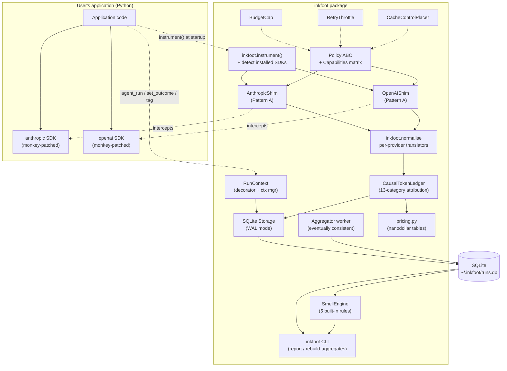
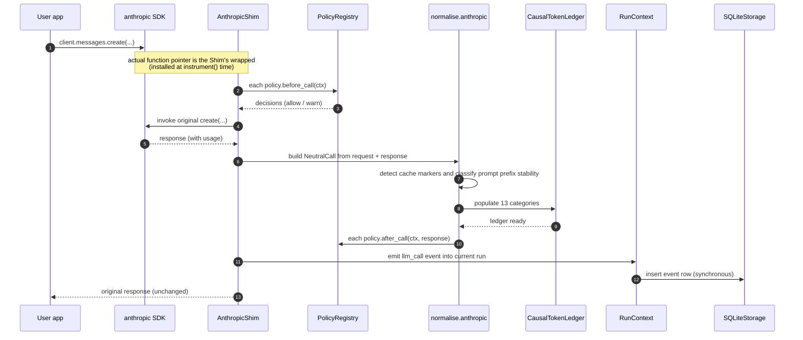
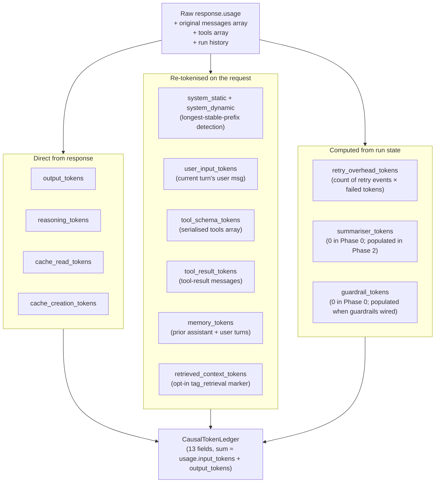
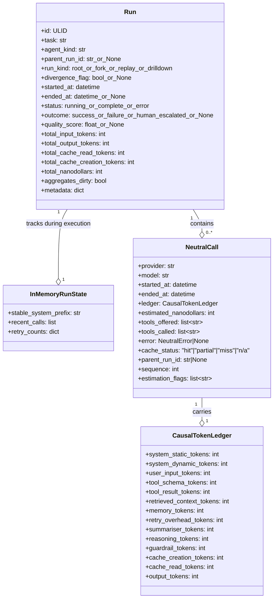
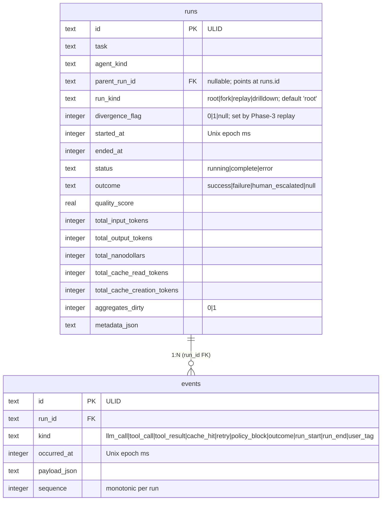
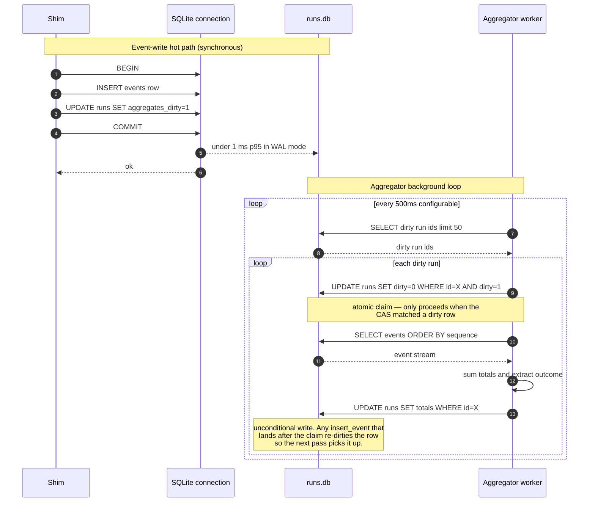
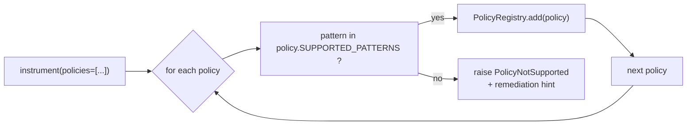
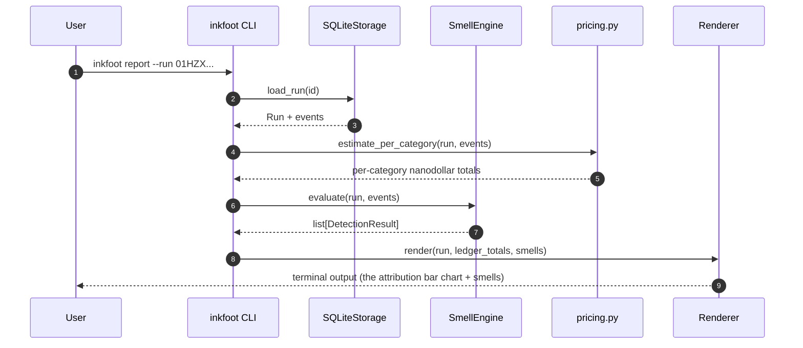
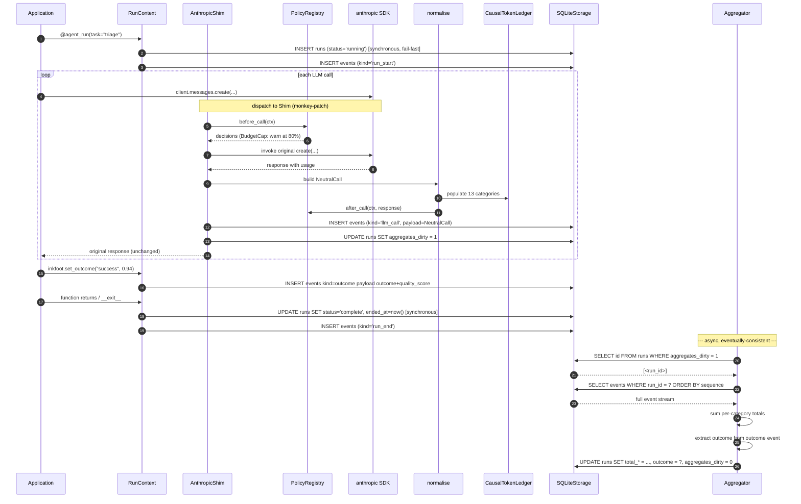

# Phase 0 — Classify (detailed design)

**Theme:** *Classify where every billed token came from. Run on our own agents.*
**Status:** approved scope; first phase of execution.
**Weeks:** 0–8.
**Companion docs:**
- [Roadmap §2](../../roadmap-inkfoot.md#2-phase-0--classify-weeks-08)
- [Architecture §4.1–§4.7, §4.12](../../architecture-inkfoot.md) — the
  full design this phase implements a slice of.

This document is a **per-phase architecture doc**: it specifies *what
gets built in Phase 0*, with internal design detail, sequence
diagrams, ER schema, ADRs, and risks. It does not restate the main
architecture doc; it elaborates the slice this phase actually delivers.

---

## 1. Context

The repository is empty. The pricing table, the SDK choice, the
package shape, the ledger semantics — none of these exist yet. Phase
0 is the first commit; the next several weeks are the foundation
everything else stands on.

Phase 0 is also the only phase with **no external users**. We ship
nothing publicly. The success criterion is honest internal use: our
own agents instrumented with Inkfoot for six weeks, and a written list
of cost smells we encountered in our own data. The product premise is
"causal attribution surfaces real waste" — Phase 0 is the proof or
disproof of that premise at the cheapest cost (our own data only).

Concretely, after Phase 0 we have:

- A `pip install inkfoot` (private index) that monkey-patches the
  Anthropic and OpenAI SDKs and writes structured events to local
  SQLite.
- An `inkfoot report` CLI that surfaces a per-run 13-category cost
  attribution chart.
- Five built-in cost smells firing automatically.
- Outcome tagging (`set_outcome("success", quality_score=0.94)`)
  captured.
- Three observation policies (`BudgetCap`, `RetryThrottle`,
  `CacheControlPlacer`) working.
- A capability matrix that fails loudly when a user asks for a
  modification policy (`LazyToolExposure`, `CheapSummariser`) on
  Pattern A (those need framework adapters, which arrive in Phase 1).

## 2. Goals & non-goals (phase-scoped)

### Goals

- **Causal attribution accuracy ≥ 90%** per-category on
  hand-labelled validation runs. Without this the product premise
  doesn't hold.
- **Zero user-code changes** beyond `inkfoot.instrument()`. The
  monkey-patch must be invisible to existing applications.
- **Instrumentation is unkillable.** Every hook is wrapped; if our
  code raises, the user's call still completes. This is
  non-negotiable for trust.
- **Storage is fast and durable.** SQLite WAL mode; < 1 ms p95 write
  latency at the per-event hot path; survives unclean shutdown.
- **The smell engine produces actionable output.** Each smell carries
  a plain-language recommendation and points at the policy that
  would fix it.
- **The CLI is the artifact.** No web UI in Phase 0; everything we
  ship is exercisable from a terminal.

### Non-goals (deferred to later phases)

- No framework adapters (Pattern C) — Phase 1.
- No `inkfoot diff` / `inkfoot benchmark` — Phase 1.
- No OpenTelemetry — Phase 1.
- No Token Contracts — Phase 2.
- No `LazyToolExposure` / `CheapSummariser` — Phase 2 (capability
  matrix refuses them at registration in Phase 0).
- No Cloud — Phase 3.
- No Cost Replay Engine, static analyzer, invoice reconciliation —
  Phase 3.
- No TypeScript — Phase 4.
- No SSO / multi-tenancy — Phase 5.

## 3. High-level shape — Phase 0 only



Component responsibility, in one sentence each:

| Component | Responsibility |
|---|---|
| `inkfoot.instrument()` | Detect installed LLM SDKs; install monkey-patches; register policies |
| `AnthropicShim` / `OpenAIShim` | Wrap each SDK's `messages.create` / `chat.completions.create` callable |
| `inkfoot.normalise` | Per-provider translation from native usage + response shapes into the neutral `CausalTokenLedger` |
| `CausalTokenLedger` | The 13-category attribution dataclass (architecture §4.2) |
| `RunContext` | Decorator + context manager that groups calls into a logical run; owns outcome tagging |
| `Policy` ABC + `Capabilities` matrix | Declares which integration pattern each policy supports; raises `PolicyNotSupported` on mismatch |
| `BudgetCap` / `RetryThrottle` / `CacheControlPlacer` | The three Phase-0 observation policies |
| `SmellEngine` | Pattern-matches a run's event stream against five built-in rules; produces `SmellHit`s |
| `SQLite Storage` | Persists events + run rows; WAL mode; thread-safe |
| `Aggregator worker` | Background thread that rebuilds `runs.total_*` projections from the event log |
| `pricing.py` | Per-(provider, model) prices as integer nanodollars; cost estimation |
| `inkfoot` CLI | `report`, `rebuild-aggregates`, `tag` from the command line |

The arrows on the diagram are important: **the application never
calls into Inkfoot directly except for `instrument()`, `agent_run`,
`set_outcome`, and `tag`.** Every LLM call lands in our shims via
monkey-patching; the user doesn't change how they call the SDK. That
is the Pattern A wedge.

---

## 4. Module structure

The Python package layout that ships at end-of-Phase-0:

```
inkfoot/
├── __init__.py                 # public re-exports
├── instrument.py               # inkfoot.instrument()
├── _shim_install.py            # monkey-patch installer; idempotent
├── run.py                      # @agent_run / with agent_run / set_outcome / tag
├── policy/
│   ├── __init__.py             # Policy ABC, Capabilities
│   ├── budget_cap.py
│   ├── retry_throttle.py
│   └── cache_control_placer.py
├── shims/
│   ├── __init__.py
│   ├── anthropic.py            # AnthropicShim
│   └── openai.py               # OpenAIShim
├── normalise/
│   ├── __init__.py             # neutral dataclasses (NeutralCall, etc.)
│   ├── anthropic.py            # translator
│   └── openai.py               # translator
├── ledger.py                   # CausalTokenLedger + attribution recipes
├── tokenisers.py               # tiktoken + best-effort fallback
├── storage/
│   ├── __init__.py             # Storage Protocol
│   ├── sqlite.py               # SQLiteStorage
│   ├── aggregator.py           # AggregatorWorker
│   └── migrations.py           # forward-only DDL
├── smells/
│   ├── __init__.py             # CostSmell, SmellEngine, SmellHit
│   ├── unstable_prompt_prefix.py
│   ├── runaway_retry_loop.py
│   ├── oversized_tool_result_recycled.py
│   ├── expensive_model_low_entropy.py
│   └── recurring_cache_writes.py
├── pricing.py                  # nanodollar tables; estimate_nd()
├── money.py                    # Nanodollar type
├── cli/
│   ├── __init__.py
│   ├── main.py                 # argparse / typer entry
│   ├── report.py
│   ├── rebuild_aggregates.py
│   └── tag.py
└── errors.py                   # PolicyNotSupported, InkfootError, ...

tests/
├── unit/
├── integration/                # against fake SDKs + real SQLite
└── live/                       # @pytest.mark.live_anthropic | live_openai (skipped without API keys)
```

Public surface (what end-users import) is constrained to:

```python
import inkfoot
from inkfoot.policy import BudgetCap, RetryThrottle, CacheControlPlacer
```

Everything else is private; the underscore-prefixed modules are not
part of the SemVer contract.

---

## 5. Components — detailed design

### 5.1 `inkfoot.instrument()` — entry point

```python
def instrument(
    sdks: list[str] | None = None,
    policies: list[Policy] | None = None,
    storage: Storage | None = None,
    log_level: str = "WARNING",
) -> None:
    """Idempotent. Safe to call multiple times.

    Behaviour:
      1. Detect installed SDKs (or use the explicit list).
      2. For each detected SDK, install its shim (monkey-patch).
         Already-installed shims are a no-op.
      3. Resolve storage (default: SQLiteStorage at ~/.inkfoot/runs.db).
      4. Validate every policy against the active integration pattern's
         capability matrix; raise PolicyNotSupported on mismatch.
      5. Register policies in the global PolicyRegistry.
      6. Start the AggregatorWorker thread.
      7. Install atexit hook to flush the aggregator + close the DB.
    """
```

Three things matter about this function:

**It is idempotent.** Calling it twice doesn't install the shims
twice. Importing `inkfoot` and calling `instrument()` in both the
main process and a child thread is safe.

**It detects rather than requires.** If `anthropic` is installed but
`openai` is not, only the Anthropic shim is installed. We never crash
because an SDK is missing.

**It fails loudly on bad policy registration.** Calling
`instrument(policies=[LazyToolExposure(...)])` raises
`PolicyNotSupported` immediately with a remediation message. This is
**not silent degradation**; the user must opt into the broken
behaviour. See ADR-0-3.

### 5.2 SDK shims (Pattern A) — the monkey-patch



**Hook isolation invariant.** Every step inside the shim that is
*our code* runs inside a `try / except Exception`. The exception
handler logs to `inkfoot.errors` at WARNING and **returns control to
the original SDK path**. The user's call always completes with the
unmodified provider response. This is the trust contract: Inkfoot
never breaks the agent.

**What the shim wraps.** Specifically:

| SDK | Method patched | Async variant |
|---|---|---|
| `anthropic` | `anthropic.resources.messages.Messages.create` | `AsyncMessages.create` |
| `openai` | `openai.resources.chat.completions.Completions.create` | `AsyncCompletions.create` |

For each method, we capture the original via `functools.wraps`,
install a wrapper that takes the same `*args, **kwargs`, and rely on
the SDKs' own type hints for argument inspection.

**Async variants** — Phase 0 must handle async because both SDKs
expose async APIs and many agents use them. The wrapper detects sync
vs async at install time (the original is either a function or a
coroutine function); the wrapper is shaped accordingly.

### 5.3 `CausalTokenLedger` — the 13 categories

The dataclass is the same one from architecture §4.2; this section
specifies the **attribution recipes** — how each field gets
populated. Recipes are per-provider; the implementations live in
`inkfoot/normalise/<provider>.py`.



**Stable-prefix detection** (for `system_static` vs
`system_dynamic`): within a run, the longest character-level common
prefix across all observed system blocks is treated as "static." The
rest of the system block on any given call is "dynamic." This catches
the timestamp / user-context cache-killer pattern. Implementation:
maintain the longest stable prefix as a string on `RunContext`;
update it monotonically (only shorten) on each new call.

**Tokeniser selection:**

| Provider | Tokeniser | Estimation flag |
|---|---|---|
| OpenAI | `tiktoken` (exact) | not flagged |
| Anthropic | `anthropic.tokenize` if available else best-effort tiktoken with the o200k_base encoding | flagged when fallback used |

Every `NeutralCall` carries `estimation_flags: list[str]` listing
which ledger fields were estimated. `inkfoot report` surfaces this
prominently so the reader knows what's exact vs approximate.

**Categories vs total — read this carefully.** The ledger has **14
fields** total: 13 *input-side cause* categories that account for
billed *input* tokens, plus `output_tokens` which is the model's
emitted output billed separately. We say "13 causal categories"
throughout the docs to refer to the *input attribution* — the
diagnostic surface ("which 42% of cost is fixable?"). The
`output_tokens` field is billed and tracked but is not a cause
category — you don't "fix" output, you measure it.

**Validation invariant (revised):**

- Sum of the 13 input-side categories ≈ `usage.input_tokens ± 2%`
  (small slop for tokeniser disagreement at the boundary).
- `ledger.output_tokens` ≈ `usage.output_tokens` exactly (no
  estimation involved — read from the response).

Phase 0 includes a CI test asserting both against a corpus of
fixtures.

### 5.4 `NeutralCall` and `Run` — the event payloads



`NeutralCall` is what flows through the event log; the ledger is its
attribution. `Run` is the per-task grouping populated by the
`RunContext` decorator / context manager.

### 5.5 Storage layer — SQLite schema



Indexes:

```sql
CREATE INDEX events_run_seq    ON events(run_id, sequence);
CREATE INDEX runs_started      ON runs(started_at DESC);
CREATE INDEX runs_task_started ON runs(task, started_at DESC);
CREATE INDEX runs_dirty        ON runs(aggregates_dirty) WHERE aggregates_dirty = 1;
CREATE INDEX runs_parent       ON runs(parent_run_id) WHERE parent_run_id IS NOT NULL;
```

The partial index `runs_dirty` is what the aggregator worker scans;
it stays tiny because most rows have `aggregates_dirty = 0`.

**Pragmas (set on each connection):**

```sql
PRAGMA journal_mode = WAL;
PRAGMA synchronous = NORMAL;
PRAGMA busy_timeout = 5000;
PRAGMA temp_store = MEMORY;
PRAGMA mmap_size = 134217728;  -- 128 MiB
```

WAL is non-negotiable: it allows concurrent reads during writes and
survives unclean shutdown cleanly. `synchronous=NORMAL` is the
conventional safety-vs-throughput tradeoff for WAL mode.

### 5.5.1 Capture modes — metadata vs replay-capable

A Phase-3 follow-up (Cost Replay Engine) requires re-running the
LLM turns of a recorded run with a different policy stack, which
requires the full request shape (messages, tools, model params) and
the recorded tool results as fixtures. That's content, not just
metadata. The Phase-0 default is **metadata-only** — no prompts or
responses stored. This is the privacy-first posture (architecture
§9.3) and is what Phase 0 ships.

To make Phase 3's Replay Engine possible without a retroactive
schema migration, Phase 0 commits to two capture modes from day
one:

```python
inkfoot.instrument(capture_mode="metadata")    # default — privacy-first
inkfoot.instrument(capture_mode="replay")      # opt-in — stores enough to replay
```

Schema impact in Phase 0:

```sql
-- Additive to the events table:
ALTER TABLE events ADD COLUMN capture_mode TEXT NOT NULL DEFAULT 'metadata';
-- For replay-mode events only, a sibling table keyed 1:1 to events:
CREATE TABLE event_contents (
  event_id TEXT PRIMARY KEY REFERENCES events(id) ON DELETE CASCADE,
  request_json TEXT,           -- messages, tools, model params at call time
  response_json TEXT,          -- assistant text + tool calls + raw usage
  tool_result_json TEXT,       -- for tool_result events: the tool output
  content_redacted BOOLEAN NOT NULL DEFAULT 0
);
```

Behaviour:

- **`capture_mode="metadata"` (default).** Events table populated as
  designed; `event_contents` rows are **not** written. Replay is
  unavailable for these runs. Reporting, smells, contracts all work.
- **`capture_mode="replay"`.** Events table populated as before, *and*
  `event_contents` row written per LLM-call / tool-result event with
  the full content. The Phase 7 redaction floor (regex-based) is
  applied at write time when configured; `content_redacted=1` flags
  any row that had a pattern match.

**Why ship the table now even though Phase 0 doesn't write to it.**
Phase 3's Cost Replay Engine assumes this shape (per ADR-0-9
below). Adding the column + table later via migration is possible
but risks reading older `capture_mode="metadata"` runs and being
unable to replay them. The honest answer to Phase 3 customers is
**"replay only works for runs recorded after capture-mode was
enabled."** Saying so requires the field to exist from Phase 0.

Cost on disk: `event_contents` is empty for default-mode runs (zero
bytes), so the Phase-0-default-user pays nothing. Replay-mode users
trade disk for the Phase 3 capability.

The privacy-transition UX (what happens the first time a customer
enables `capture_mode="replay"`) is a Phase 3 concern — see Phase 3
§9.3 for the workspace-level confirm-and-acknowledge gate that
wraps this flag for Cloud users.

### 5.6 Two-tier write semantics

The contradiction in earlier drafts was about whether `runs.*` was a
primary fact or a projection. The resolution (ADR-0-1):

| Field | Semantics | Write timing |
|---|---|---|
| `runs.status` | Primary fact | Synchronous at run start (`running`) and end (`complete` / `error`); fail-fast |
| `runs.outcome` | Projection of the `outcome` event | Set by aggregator |
| `runs.total_*` | Projections of the event log | Set by aggregator |
| `runs.aggregates_dirty` | Marker | Set to `1` on every event insert; set to `0` when aggregator catches up |



**Why this order matters (the claim-and-project pattern).** The
naive single-statement variant — `UPDATE runs SET totals=…, dirty=0
WHERE id=X AND dirty=1` — has a race: the aggregator reads events at
T0, an `insert_event` lands at T1 (writes a row + sets `dirty=1`,
which it already was), the aggregator computes from the T0 snapshot
at T2 and writes totals that exclude the T1 event. The conditional
`WHERE dirty=1` still matches because nothing changed it back to 0,
and the late event is silently dropped from totals until something
else re-dirties the row (potentially never). The architecture's
"event log is source of truth, projection is recomputable" invariant
demands a structural fix, not a tighter predicate:

1. **Claim** the dirty bit *before* reading: atomic CAS, 1 → 0.
2. **Read** the event log.
3. **Write** totals unconditionally (no dirty change).

If an `insert_event` lands between (1) and (3), it sets `dirty=1` and
the next aggregator pass re-projects. Lost updates are impossible by
construction.

**Why an aggregator instead of trigger-style synchronous
recomputation?** Triggers would fire on every event insert and
recompute aggregates from scratch — `O(N²)` over the run's events
across its lifetime. The aggregator does the same work *once* per
batch of new events. Trade: aggregates lag by up to ~500 ms.
Acceptable for a profiling tool; `inkfoot report --no-cache` forces a
fresh recomputation if a reader needs strict consistency.

**Recovery path.** If the aggregator dies (crash, OOM, dev kills the
process), the dirty flag persists. On next `instrument()` (or via
`inkfoot rebuild-aggregates`), the aggregator picks up where it left
off. The event log is the source of truth; the projections are always
recomputable.

### 5.7 `RunContext` — the run-scoping API

Three integration shapes:

```python
# Decorator
@inkfoot.agent_run(task="customer-support-triage")
def handle_ticket(ticket_id): ...

# Context manager
with inkfoot.agent_run(task="customer-support-triage") as run:
    ...
    inkfoot.set_outcome("success", quality_score=0.94)

# Manual (rare; for non-Pythonic call shapes)
run = inkfoot.agent_run(task="...").start()
try:
    ...
    inkfoot.set_outcome("success")
finally:
    run.end()
```

Internally:

```mermaid
stateDiagram-v2
  [*] --> Created: agent_run(task=...)
  Created --> Running: __enter__ / .start() / function call
  Running --> Running: LLM calls; tool calls; tags
  Running --> Complete: __exit__ no exception<br/>+ outcome set
  Running --> Errored: __exit__ on exception<br/>or run.end(error)
  Running --> Abandoned: process exit without __exit__<br/>(atexit hook detects)
  Complete --> [*]: status='complete'
  Errored --> [*]: status='error'
  Abandoned --> [*]: status='error', error_message='abandoned'
```



**Thread-local current-run tracking.** `inkfoot.set_outcome(...)` and
`inkfoot.tag(...)` look up the current run via a contextvar (so
async-correct). Setting outcome outside a run is a clear error with
a remediation message.

**Nested runs.** Allowed but discouraged. Each `agent_run` produces
its own row; the inner run's `parent_run_id` is the outer's id. Phase
0 doesn't surface this in reports beyond grouping; Phase 2's fork
semantics depend on it.

### 5.8 Policy ABC + capability matrix

```python
class Policy(ABC):
    NAME: ClassVar[str]
    SUPPORTED_PATTERNS: ClassVar[set[IntegrationPattern]] = {IntegrationPattern.A,
                                                              IntegrationPattern.B,
                                                              IntegrationPattern.C}

    @abstractmethod
    def before_call(self, ctx: CallContext) -> PolicyDecision: ...

    @abstractmethod
    def after_call(self, ctx: CallContext, response: Any) -> None: ...


class PolicyDecision:
    action: Literal["allow", "warn", "block"]
    reason: str | None
    metadata: dict
```

Phase-0 policies:

| Policy | `before_call` action | `after_call` action |
|---|---|---|
| `BudgetCap(max_nd: int)` | If `current_run.total_nanodollars + estimated_call_cost > max_nd`: `warn` and emit `budget_warning` event. (Phase 0 observes; enforcement lands in Phase 2.) | no-op |
| `RetryThrottle(window_s: int, max: int)` | If observed retries in window exceed `max`: `warn` and emit `retry_throttle` event. | Increment retry counter on `RetryEvent`. |
| `CacheControlPlacer` | (Anthropic only) Inject `cache_control` markers on the system block and tool definitions if absent. | Compare cache hit ratio vs prior calls; emit `cache_control_advice` event if no improvement. |

**Capability enforcement.** When `instrument(policies=...)` runs,
each policy's `SUPPORTED_PATTERNS` is checked against the integration
pattern in use:



The exception message is the customer-visible bit:

```
PolicyNotSupported: LazyToolExposure requires a framework adapter (Pattern C).
  Active integration: Pattern A (SDK shim).
  Fix: install inkfoot[langgraph] (or your framework) and call
       inkfoot.langgraph.instrument(graph) instead of inkfoot.instrument().
  See: https://inkfoot.dev/docs/policies/lazy-tool-exposure
```

The fail-loud-at-registration choice is recorded in ADR-0-2.

### 5.9 Smell engine — internals

A smell is data, not code:

```python
@dataclass(frozen=True)
class CostSmell:
    id: str                                  # "unstable-prompt-prefix"
    title: str                               # human-readable
    description: str                         # ~1 paragraph
    severity: Literal["info", "warn", "critical"]
    detect: Callable[[Run, EventStream], DetectionResult | None]
    recommendation: str                      # one-line fix
    suggested_policy: str | None             # name of a policy
    evidence_query: str                      # SQL or jsonpath that reproduces evidence


@dataclass(frozen=True)
class DetectionResult:
    smell: CostSmell
    triggered_at_sequence: int               # which event triggered
    severity: Literal["info", "warn", "critical"]
    evidence: dict                           # smell-specific context
    estimated_cost_impact_nd: int            # how much $ this smell is costing


class SmellEngine:
    def __init__(self, smells: list[CostSmell] = DEFAULT_SMELLS): ...
    def evaluate(self, run: Run, events: EventStream) -> list[DetectionResult]: ...
    def evaluate_aggregate(self, runs: list[Run]) -> list[DetectionResult]: ...
```

The five Phase-0 smells, with their detection signatures:

| Smell | Triggers when | Cost-impact estimate |
|---|---|---|
| `unstable-prompt-prefix` | `system_dynamic_tokens / (system_static_tokens + system_dynamic_tokens) > 0.10` across the run | `system_dynamic_tokens × cache_read_price` |
| `runaway-retry-loop` | Same `(tool_name, args_hash)` called > 5 times within a run | `sum(retry_overhead_tokens)` |
| `oversized-tool-result-recycled` | A tool result of > 2000 tokens appears in `tool_result_tokens` for ≥ 3 turns | `tool_result_tokens × (turns_appeared − 1) × input_price` |
| `expensive-model-low-entropy` | `model.startswith(("claude-opus", "gpt-4o", "o1"))` AND `reasoning_tokens == 0` AND `output_tokens < 200` | `output_tokens × (model_price − haiku_price)` |
| `recurring-cache-writes` | `cache_creation_tokens > 0` on > 80% of calls in the run | `sum(cache_creation_tokens) × cache_write_premium` |

The `evidence` dict carries the actual numbers so reports can show:

```
unstable-prompt-prefix triggered
  evidence:
    system_static_tokens:   850  (the stable prefix)
    system_dynamic_tokens:  320  (37.6% of system block)
    breakpoint_position:    char 850 — drift starts at "Current time is {timestamp}"
    estimated_cost_impact:  $0.012/run × 412 runs/30d = $4.94/mo
```

**Smell evaluation timing.** Smells evaluate lazily — only when the
reporter asks for them, not on every event. `inkfoot report --run
<id>` loads the run's events, evaluates all smells, and renders the
hits. This keeps the hot path clean.

### 5.10 `inkfoot report` rendering pipeline



The renderer is a pure function of `(run, totals, smells)` → str.
That makes it testable without spinning up storage.

Output shape (the attribution bar chart) is the most distinctive UI
surface of the entire product. The exact rendering is constrained:

- 12-column bar (width = `int(category_share * 12)` ).
- Color-coded by severity of attached smell.
- Category sorted by absolute cost descending.
- Estimated dollar figures with 4-decimal precision.

Sample output (the renderer hides categories that are zero across
the whole run by default; pass `--show-zero` to render all 14
fields):

```
Run 01HZX... · customer-support-triage · 18.2s · $0.0541 · success (0.94)

Causal attribution:
  system_static          12.4%  ████░░░░░░░░  $0.0067
  system_dynamic         18.2%  ██████░░░░░░  $0.0098  ⚠ cache-breaker
  user_input              2.1%  █░░░░░░░░░░░  $0.0011
  tool_schema             7.8%  ██░░░░░░░░░░  $0.0042
  tool_result            34.6%  ███████████░  $0.0187  ⚠ oversized
  retrieved_context       0.0%  ░░░░░░░░░░░░  $0.0000
  memory                  8.1%  ██░░░░░░░░░░  $0.0044
  retry_overhead          0.0%  ░░░░░░░░░░░░  $0.0000
  cache_creation          5.4%  █░░░░░░░░░░░  $0.0029
  cache_read              0.0%  ░░░░░░░░░░░░  $0.0000  ⚠ no cache hits
  reasoning               0.0%  ░░░░░░░░░░░░  $0.0000
  output                 11.4%  ███░░░░░░░░░  $0.0062

(summariser and guardrail are always-zero in Phase 0 — hidden by default)

Smells detected (2):
  · unstable-prompt-prefix  (system_dynamic is 18% of cost)
    → Move time-varying content out of system block.
  · oversized-tool-result-recycled
    → Enable CheapSummariser(threshold_tokens=1500) [Phase 2; not available in Phase 0].

Estimated savings if both fixed: ~$0.023/run (-43%).
```

The "Phase 2; not available" footnote is honest framing — Phase 0
surfaces the smell but the modification policy that fixes it doesn't
yet exist.

### 5.11 Pricing module (nanodollar)

```python
# (provider, model) -> {input, output, cache_read, cache_write} in nanodollars per token
PRICING_ND_PER_TOKEN: dict[tuple[str, str], PriceRow] = {
    ("anthropic", "claude-opus-4-7"):   PriceRow(input=15_000, output=75_000, cache_read=1_500, cache_write=18_750),
    ("anthropic", "claude-sonnet-4-6"): PriceRow(input= 3_000, output=15_000, cache_read=  300, cache_write= 3_750),
    ("anthropic", "claude-haiku-4-5"):  PriceRow(input=   800, output= 4_000, cache_read=   80, cache_write= 1_000),
    ("openai", "gpt-4o"):                PriceRow(input= 2_500, output=10_000, cache_read=1_250, cache_write= 2_500),
    ("openai", "gpt-4o-mini"):           PriceRow(input=   150, output=   600, cache_read=   75, cache_write=   150),
    ("openai", "o1"):                    PriceRow(input=15_000, output=60_000, cache_read=7_500, cache_write=15_000),
    # ... extended over time
}


def estimate_nd(provider: str, model: str, ledger: CausalTokenLedger) -> int | None:
    """Returns nanodollars. None when (provider, model) is not in the table."""
```

Two design decisions:

1. **All money is integer nanodollars.** No floats anywhere
   (ADR-0-4).
2. **Versioned table.** A `PRICING_TABLE_REVISION` constant ships
   alongside; the OSS pulls a fresh table on Cloud signin (Phase 3),
   but Phase 0 ships a static snapshot dated `effective_from`.

---

## 6. Public API surface (Phase 0)

```python
# Setup
inkfoot.instrument(
    sdks: list[str] | None = None,
    policies: list[Policy] | None = None,
    storage: Storage | None = None,
    log_level: str = "WARNING",
) -> None

# Run scoping
@inkfoot.agent_run(task: str, metadata: dict | None = None)  # decorator
with inkfoot.agent_run(task="..."): ...                       # ctx manager

# Inside a run
inkfoot.tag(key: str, value: Any) -> None
inkfoot.tag_retrieval(text: str) -> None
inkfoot.set_outcome(outcome: str, quality_score: float | None = None) -> None
inkfoot.report_cost() -> Decimal       # current run's accumulated cost in USD

# Policies
from inkfoot.policy import BudgetCap, RetryThrottle, CacheControlPlacer

# Errors
from inkfoot.errors import PolicyNotSupported, InkfootError
```

CLI in Phase 0:

```
inkfoot report                          # show recent runs
inkfoot report --run <id>               # show one run with attribution + smells
inkfoot report --task <task>            # aggregate per task
inkfoot report --last 7d                # time window
inkfoot rebuild-aggregates              # recover projection drift
inkfoot tag <run-id> <key> <value>      # late-tag a run
```

Everything else in the architecture's §6.2 CLI spec lands in later
phases (`inkfoot diff`, `inkfoot benchmark`, `inkfoot replay`,
`inkfoot lint`, `inkfoot contract`, `inkfoot migrate`).

---

## 7. Critical end-to-end flow

The composite "what happens during an instrumented agent run":



The diagram captures every load-bearing decision: synchronous status
writes, async aggregation, never-block-the-user, the policy `before /
after` hooks, the shim-as-monkey-patch.

---

## 8. ADRs — Phase 0

### ADR-0-1: Two-tier write semantics on `runs`

**Status:** Accepted.
**Context:** Earlier drafts were ambiguous about whether `runs.*`
columns were primary facts or projections. The inconsistency
manifested as: status is written synchronously at end-of-run, which
a reader could interpret as "runs is the source of truth," but
aggregate columns are recomputable from events. Both can't be true
at once.
**Decision:** `runs.status` is a **primary fact** with synchronous,
fail-fast writes. `runs.outcome` and `runs.total_*` are **eventually
consistent projections** of the event log, maintained by an
`AggregatorWorker`. The `aggregates_dirty` flag marks lag;
`inkfoot rebuild-aggregates` recomputes from events as a recovery
mechanism.
**Alternatives considered:**
- *All-on-runs.* Loses re-derivation; adding a new metric requires
  reprocessing data we no longer have.
- *Pure event log.* Every list query recomputes from millions of
  events — too slow.
- *Synchronous projection updates (triggers).* `O(N²)` over a run's
  events; unacceptable on the hot path.
**Consequences:** Slight complexity in the write path; a recovery
mechanism exists for projection drift. Worth it for the "add
metric → rebuild from history" property and for keeping the hot
path < 1 ms.

### ADR-0-2: Fail loud at policy registration

**Status:** Accepted.
**Context:** Policies have different integration-pattern
requirements. `LazyToolExposure` and `CheapSummariser` cannot work
from a monkey-patched SDK alone — they need framework-level control.
The question is whether to silently no-op them on Pattern A or
refuse to register.
**Decision:** Refuse to register. `instrument(policies=[LazyTool...])`
raises `PolicyNotSupported` immediately with a remediation message.
**Alternatives considered:**
- *Silent degradation.* "Best effort." Customers don't know what's
  happening; trust collapses when they find out six months in.
- *Always require Pattern C.* Loses the 15-second adoption wedge.
**Consequences:** The marketing message becomes "install in 15
minutes for observation; install the framework adapter for
enforcement." This is the honest framing. Errors at registration
are loud-but-fixable; silent degradation is quiet-but-undebuggable.

### ADR-0-3: Hook isolation invariant — never raise into user code

**Status:** Accepted.
**Context:** Inkfoot is a third-party library wrapping a critical
path (LLM calls). Any uncaught exception in our code would crash the
user's agent — unacceptable.
**Decision:** Every wrapper, hook, and callback in the
instrumentation layer is enclosed in `try / except Exception` that
logs to `inkfoot.errors` and returns control to the original SDK
path. The user's call always completes with the unmodified provider
response.
**Alternatives considered:**
- *Selective catch (e.g., catch only `InkfootError`).* A real bug in
  our code raises something else and crashes the user. Unsafe.
- *Strict mode (raise everything in dev).* A future opt-in; default
  remains catch-all. See `SLEUTH_DB_STRICT=1`-style env flag in
  Sleuth as the pattern; reuse the idea.
**Consequences:** Bugs in Inkfoot may produce silent missing data
rather than a visible crash. Mitigation: structured error logging
+ a `WARN` level by default + an `inkfoot --strict` flag for dev
mode. Trust > debuggability at the trust-establishment phase.

### ADR-0-4: Nanodollars for storage, never floats

**Status:** Accepted.
**Context:** Token costs are routinely below a cent (Haiku output is
$4/Mtok = 0.0004 cents/token). Storing cents loses precision
per-token; storing floats produces drift across millions of tokens.
**Decision:** All monetary values stored as **integer nanodollars**
(10⁻⁹ USD). A 64-bit integer holds ~$9.2 billion in nanodollars —
ample headroom. In-memory math uses `decimal.Decimal` with
`ROUND_HALF_EVEN` where precision matters.
**Alternatives considered:**
- *Integer cents.* Precision loss per-token; compounds.
- *Floats.* Industry-standard wrong answer for money.
- *Integer microdollars (10⁻⁶).* Acceptable but less headroom;
  nanodollars is conservative.
**Consequences:** Display logic converts to USD with 4 decimals
per-run, 2 decimals for aggregates. Permanent choice; never
revisit.

### ADR-0-5: SQLite with WAL + per-connection pragmas

**Status:** Accepted.
**Context:** Phase 0 needs durable, fast, concurrent-read-safe local
storage with no setup. Options: SQLite, DuckDB, embedded Postgres
(pglite), flat-file JSONL.
**Decision:** SQLite in WAL mode with the pragma set documented in
§5.5. The aggregator runs as a background thread in the same
process; multi-process is **explicitly not supported in Phase 0**
(SQLite WAL handles multi-process reads but the aggregator
assumption is single-process).
**Alternatives considered:**
- *DuckDB.* Excellent OLAP query performance but the WAL story is
  weaker; embedded operation is less battle-tested.
- *pglite (Postgres in WASM).* Newer; not yet stable enough for a
  Phase 0 dependency.
- *JSONL files.* Simple but no query layer; we'd reinvent SQLite.
**Consequences:** Postgres backend lands in Phase 2 with the same
schema. The migration is mechanical because the SQL is portable
(no SQLite-specific dialect used).

### ADR-0-6: Synchronous event writes; async aggregation

**Status:** Accepted.
**Context:** The choice between blocking the hot path on every event
write vs queueing for async write affects the durability story.
**Decision:** Event writes are **synchronous** (the agent's LLM call
returns only after the event is durable). This is fast (< 1 ms p95
with WAL) and means a crashed process never loses events. Aggregation
is async because it's not durability-critical (recomputable).
**Alternatives considered:**
- *Async event writes.* Lower hot-path latency but loses durability
  on crash. Phase 0 is the data-collection phase; durability is the
  whole point.
- *Batched event writes.* Trades a bit of latency for throughput;
  not yet warranted at Phase 0 scale.
**Consequences:** Per-event hot-path latency floor is the SQLite
WAL write (~200 µs typical, < 1 ms p95). Acceptable.

### ADR-0-7: ULID identifiers everywhere

**Status:** Accepted.
**Context:** Identifiers needed for runs and events. Options: UUIDv4,
ULIDs, monotonic integers, content-hashed IDs.
**Decision:** **ULIDs** (Universally Unique Lexicographically
Sortable). 26-character base32 strings; sort-by-time naturally;
unique across nodes.
**Alternatives considered:**
- *UUIDv4.* No temporal ordering; harder to debug; same length.
- *Monotonic integers.* Conflict in multi-process; no Phase 0
  benefit.
- *Content-hashed.* Doesn't apply (multiple identical events can
  exist).
**Consequences:** All IDs are sortable; `events_run_seq` index has
natural time ordering inside a run's events.

### ADR-0-8: tiktoken with a flagged Anthropic fallback

**Status:** Accepted.
**Context:** Several ledger categories require tokeniser-accurate
counts. `tiktoken` covers OpenAI exactly; Anthropic doesn't have a
universally-available Python tokeniser as of 2026.
**Decision:** Use `tiktoken` with the `o200k_base` encoding as the
best-effort fallback for Anthropic when `anthropic.tokenize` isn't
available. Mark every affected category in
`NeutralCall.estimation_flags`.
**Alternatives considered:**
- *Refuse to count when accurate tokeniser unavailable.* Loses too
  much of the value proposition.
- *Wrap a JS tokeniser via subprocess.* Adds dependency complexity;
  perf hit on hot path.
**Consequences:** Anthropic-side ledger categories may be off by
small percentages (typical 2–5%) when the fallback kicks in. The
`estimation_flags` make this transparent to readers. Phase 0
includes a validation corpus measuring the actual error.

### ADR-0-9: Capture modes from day one — metadata default, replay opt-in

**Status:** Accepted.
**Context:** Phase 0 ships a privacy-first profiler (metadata only;
no prompt or response content stored). Phase 3 ships a Cost Replay
Engine that needs full message streams and tool results from the
original run. Storing content retroactively isn't possible — Phase 3
customers who care about replay need it for runs they recorded
*before* Phase 3 shipped.
**Decision:** Ship the `capture_mode` field on every event from
Phase 0 and the `event_contents` sibling table. Default is
`metadata` (no content; current Phase 0 posture). Customers who
want Phase 3 replay later set `capture_mode="replay"` *now*,
trading disk for the future capability.
**Alternatives considered:**
- *Add the table in Phase 3 via migration.* Older runs can never be
  replayed; the schema migration touches every Cloud customer.
  Worse trade.
- *Always capture content; redact at the boundary.* Inverts the
  privacy default. Will lose enterprise customers in Phase 5.
- *Capture content only on Cloud opt-in.* Conflates the OSS-local
  story with the Cloud story; some OSS-local users want replay too
  (Phase 3 ships a `inkfoot replay` CLI shortcut).
**Consequences:**
- Phase 0 ships a column it doesn't write to and a table it never
  populates. Disk cost zero; conceptual cost ~10 lines of doc.
- Phase 3's docs honestly tell customers: "replay works for runs
  recorded with `capture_mode='replay'`. If you haven't enabled
  it yet, your historical runs can't be replayed."
- Sets up Phase 3's privacy-transition UX (a workspace-level
  setting that gates the flag for Cloud users) cleanly.

---

## 9. Cross-cutting concerns

### 9.1 Performance budgets

| Operation | Budget (p95) | How measured |
|---|---|---|
| SDK shim wrapper overhead | < 100 µs | CI benchmark with `pytest-benchmark` |
| SQLite event insert | < 1 ms | CI benchmark, WAL mode |
| Aggregator worker cycle | < 50 ms for 50 dirty runs | CI benchmark |
| `inkfoot report --run <id>` end-to-end | < 200 ms for a 50-event run | CI benchmark |
| Smell engine evaluation | < 10 ms per run | CI benchmark |

Regressions fail CI. The benchmarks live in `tests/benchmarks/` and
run on every PR.

### 9.2 Reliability invariants

1. **Hook isolation** (ADR-0-3): no exception propagates from
   Inkfoot code into user code.
2. **WAL durability** (ADR-0-5): event writes survive `kill -9` of
   the process.
3. **Status fail-fast** (ADR-0-1): if we can't write the
   `runs.status = 'running'` row, the agent gets an exception
   immediately rather than running into an incomplete instrumented
   state.
4. **Aggregator idempotence**: re-running the aggregator on already-
   reconciled rows is a no-op.

### 9.3 Privacy

- **No prompt or response content uploaded.** Phase 0 has no upload
  channel. Content stays local in SQLite.
- **No content in event payloads by default.** The
  `NeutralCall.error.message` is the only place we may capture
  user-facing text, and even that's truncated to 1 KB.
- **Tags are user-authored.** `inkfoot.tag()` content is whatever the
  user passes; we don't inspect it.

### 9.4 Logging

`inkfoot` uses Python's standard `logging` module under the
`inkfoot.*` namespace. Default level: WARNING. INFO for lifecycle
events (instrument, shutdown, aggregator start/stop); WARN for
recoverable issues (best-effort tokeniser fallback, hook isolation
exception caught); ERROR for unrecoverable internal bugs.

### 9.5 Testing strategy

| Layer | Test type | Tooling |
|---|---|---|
| `normalise/` | Unit tests with fixtures | pytest + recorded response JSON |
| `ledger.py` | Unit tests against hand-labelled inputs | pytest |
| `shims/` | Integration with stubbed SDK + real SQLite | pytest |
| `storage/` | Integration with real SQLite tempfile | pytest |
| `smells/` | Unit tests with synthetic event streams | pytest |
| End-to-end | Live tests against real APIs (skipped without credentials) | `@pytest.mark.live_anthropic` / `live_openai` |
| Performance | Benchmark suite | `pytest-benchmark` |
| Attribution accuracy | Hand-labelled corpus | custom validation script + per-category error report |

The hand-labelled corpus is one of the Phase-0 definition-of-done
items. Without it, the 90% accuracy claim can't be defended.

---

## 10. Risks & mitigations

| Risk | Likelihood | Impact | Mitigation |
|---|---|---|---|
| **Causal attribution accuracy < 90%** | Medium | Critical (undermines entire product) | Hand-labelled validation corpus; estimation flags per-call; abandon Phase 0 if accuracy stays low after tuning |
| **Our own agents don't surface enough smells** | Medium | Critical (kills Phase 1 go-signal) | "≥ 3 real cost issues" pre-defined criterion; commit to abandoning if not met. A "found nothing interesting" Phase 0 is a valid (cheap) outcome |
| **SQLite contention under concurrent agents** | Low | Medium | WAL mode; single-process aggregator assumption documented; if multi-process needed → migrate to Postgres in Phase 2 |
| **Hook-isolation bug crashes user agents** | Low | Critical | Every wrapper enclosed in try/except; fuzz test the shim wrappers with random exceptions; manual review of every hook |
| **Anthropic / OpenAI SDK churn** | Medium | Medium | Pin SDK versions in shim; track deprecation notices; SDK upgrade is its own small project per minor version |
| **Outcome-tagging adoption friction (internally)** | High | Low (we just don't get the metric for those runs) | Surface "uninstrumented runs" as a separate report bucket; the gap is visible, not hidden |
| **WAL file growth on long-lived processes** | Low | Low | `PRAGMA wal_autocheckpoint`; documented runbook for manual checkpoint |

---

## 11. Definition of done

- [ ] `pip install inkfoot` works from a private PyPI index.
- [ ] Pattern A shims working for `anthropic` (sync + async) and
      `openai` (sync + async) with no user-code changes.
- [ ] All 13 ledger categories populated correctly for both
      providers; estimation flags surface where applicable.
- [ ] Outcome tagging round-trips end-to-end:
      `set_outcome("success", 0.94)` → visible in
      `inkfoot report --run <id>`.
- [ ] Five built-in smells fire on a synthetic fixture suite covering
      each smell's trigger condition.
- [ ] `BudgetCap`, `RetryThrottle`, `CacheControlPlacer` work
      end-to-end; `LazyToolExposure` registration raises
      `PolicyNotSupported` with a clear remediation message.
- [ ] Local SQLite write < 1 ms p95 (CI benchmark).
- [ ] Instrumentation overhead < 100 µs p95 (CI benchmark).
- [ ] Causal attribution accuracy verified against hand-labelled
      runs: average per-category error < 10%.
- [ ] **Our own production agents (Sleuth + internal tooling) have
      run on Inkfoot for ≥ 6 weeks.**
- [ ] **A written list of ≥ 3 real cost smells encountered in our own
      data exists**, with the underlying runs preserved as fixtures.
- [ ] `inkfoot rebuild-aggregates` recovers projections from the
      event log on a corrupted-aggregates fixture.

## 12. Go/no-go signal — Phase 0 → Phase 1

Phase 0 transitions to Phase 1 **if and only if** both are true at
the 6-week internal-usage mark:

1. **Inkfoot has surfaced ≥ 3 real cost issues** in our own agents
   that we would not have found without it.
2. **The team voluntarily reaches for `inkfoot report`** when
   investigating a bill anomaly, instead of writing a one-off SQL
   query.

If neither: reshape (different abstraction layer) or abandon. Do not
build a public launch for a problem nobody on the building team
actually has.

If one of two: pause Phase 1; dig into why the other half didn't
materialise.

## 13. Suggested epic breakdown — prefix `CL`

| Epic | Title | Notes |
|---|---|---|
| **CL1** | Project scaffolding | Python package layout; PyPI name reservation; `inkfoot.dev` domain; nanodollar money type; SemVer skeleton |
| **CL2** | Storage foundation | SQLite schema; two-tier write semantics; `Storage` Protocol; `inkfoot rebuild-aggregates` |
| **CL3** | Causal Token Ledger | 13 categories + `NeutralCall` + per-provider attribution recipes (Anthropic + OpenAI) |
| **CL4** | Pattern A SDK shims | Anthropic + OpenAI monkey-patches; hook isolation; async support |
| **CL5** | Policy engine + capability matrix | ABC; three observation policies; `PolicyNotSupported` |
| **CL6** | Outcome tracking | `set_outcome` / `tag` / `tag_retrieval`; outcome event; reporting deferred to Phase 2 |
| **CL7** | Recommendation engine | Engine + five built-in smells; `SmellEngine.evaluate` API |
| **CL8** | `inkfoot report` CLI | Attribution bar chart; per-run + aggregate views |
| **CL9** | Internal-use rollout | Instrument Sleuth + internal tooling; six-week production exposure; fixture preservation |
| **CL10** | Validation harness | Hand-labelled run corpus; per-category accuracy measurement; estimation-flag audit |

CL1 + CL2 + CL3 + CL4 are the foundation; CL5–CL8 are the
user-facing surface; CL9 + CL10 are the go/no-go gates. CL9 is the
single longest-duration epic (six calendar weeks of production
exposure).

## 14. Open questions

- **Which agent should be the canonical "first instrumented agent"
  internally?** Sleuth investigations have a representative agent
  loop with tool use; the internal tooling agent is shorter-lived
  and may not exercise enough categories. Default: both, with
  Sleuth investigations carrying the bulk of the validation weight.
- **Tokeniser approach for `tool_schema_tokens`.** Decided in ADR-0-8
  but the actual measured error of the fallback isn't known yet —
  Phase 0 validation corpus will reveal it.
- **Should `BudgetCap` enforce or just observe in Phase 0?**
  Decision: observe + log only. The enforcement path arrives with
  Token Contracts in Phase 2 where it has the right `degrade`
  ladder semantics.
- **Aggregator polling interval.** Default 500 ms. The right value
  is determined by acceptable lag (project lead's call) vs CPU
  overhead. Phase 0 ships configurable.
- **`inkfoot.tag()` value type.** Default: any JSON-serialisable
  scalar. Lists / dicts allowed but discouraged (querying becomes
  awkward). Reconsider in Phase 2 when reports gain tag-based
  groupings.
