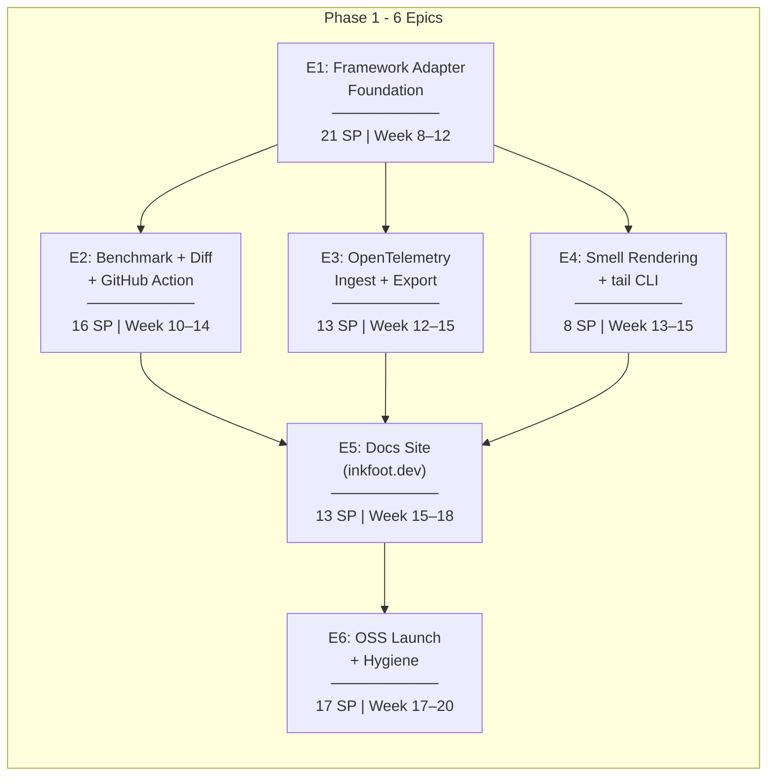
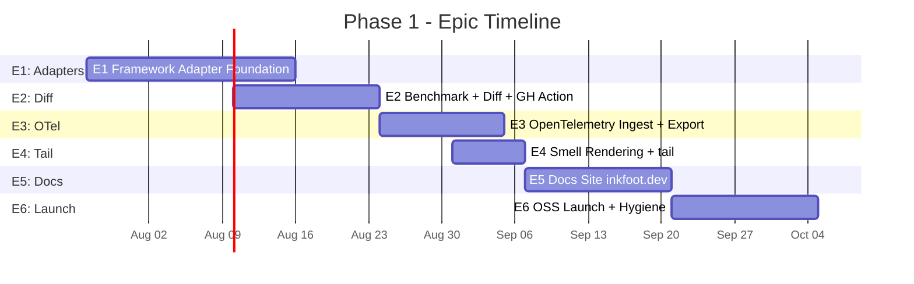
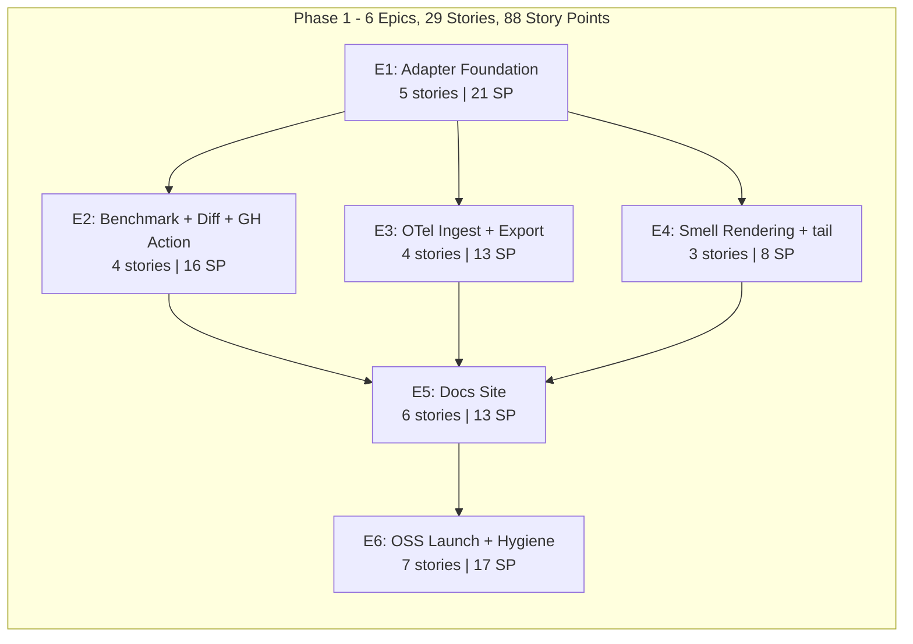

# Inkfoot — Phase 1: Development Epics

> **Phase:** 1 — Explain
> **Theme:** Explain why every token was spent. Ship to the world.
> **Timeline:** Weeks 8–20 (60 working days)
> **Total Story Points:** 88
> **Document Version:** 1.0
> **Last Updated:** 2026-05-25
> **Builds On:** `inkfoot_phase0_development_epics.md` v1.1
> **Aligned With:** `phase-1-explain.md`
>
> **Outcome gate:** entered only after Phase 0 go-signal. Public OSS
> launch on PyPI with framework adapters, OTel compatibility, CI cost
> review, and a docs site. Go/no-go at 8-weeks-post-launch on adoption
> signal (§13).

---

## Epic Overview

> **Unit convention.** Gantt bar durations (`Nd`) are **calendar days**;
> per-epic "Sprint" headers below (e.g. "Week 8–12 (Days 1–20)") are
> **working days** at 5/week. Same convention as Phase 0 — see Phase 0
> epics doc for rationale.

---

## Story Point Scale

Same scale as Phase 0 — kept here for convenience.

| Points | Effort | Example |
|---|---|---|
| 1 | Trivial (< 1 hour) | Add a config field, write a single test |
| 2 | Small (1–3 hours) | Implement a single utility function with tests |
| 3 | Medium (3–6 hours) | Implement a class with 3–5 methods and unit tests |
| 5 | Large (1–1.5 days) | Build a full module with multiple classes and tests |
| 8 | XL (1.5–2.5 days) | Complex feature with edge cases, integration test setup |
| 13 | XXL (3–4 days) | Multi-file feature with significant complexity |

---

## E1: Framework Adapter Foundation

**Goal:** Land Pattern C (framework adapters) for the four agent frameworks that cover the bulk of mid-2026 Python agent code: LangGraph, OpenAI Agents SDK, Anthropic Agent SDK, and raw-SDK Pattern B. Each adapter unlocks per-node attribution and the capability surface that Phase 2's modification policies depend on.

**Total Story Points:** 21
**Sprint:** Week 8–12 (Days 1–20)
**Dependencies:** Phase 0 (all epics)

---

### E1-S1: `FrameworkAdapter` Protocol + Adapter Registry

**Story:** As a developer, I need a small Protocol that every adapter implements + a global registry so `instrument()` can detect the active framework.

**Story Points:** 3

**Tasks:**

| # | Task | File(s) | Details |
|---|---|---|---|
| T1 | `FrameworkAdapter` Protocol | `inkfoot/adapters/base.py` | Per phase-1-explain §4.1: `name`, `detect()`, `instrument(target, **kwargs)`, `supported_policies()`, `shutdown()`. |
| T2 | Adapter registry | `inkfoot/adapters/_registry.py` | Globally cache the active adapter; expose `get_active_adapter()`. |
| T3 | Capability propagation | `inkfoot/policy/__init__.py` | When a Pattern-C adapter is active, the capability check uses the adapter's `supported_policies()`, not Pattern A's default. |
| T4 | Unit tests | `tests/unit/test_adapter_protocol.py` | Stub adapter passes the Protocol; registry returns the active one; capability check uses the adapter's surface. |

**Acceptance Criteria:**
- [ ] An adapter implementing the Protocol passes a `runtime_checkable` test.
- [ ] Registering two adapters of the same `name` is rejected.
- [ ] Capability check on a stub adapter that reports `LazyToolExposure` as supported lets the policy register cleanly.

---

### E1-S2: LangGraph Adapter (the headline)

**Story:** As a LangGraph user, I need `inkfoot.langgraph.instrument(graph)` to wrap my `StateGraph` and produce per-node attribution.

**Story Points:** 8

**Tasks:**

| # | Task | File(s) | Details |
|---|---|---|---|
| T1 | Entry-point wrapping | `inkfoot/adapters/langgraph.py` | Monkey-patch `StateGraph.invoke / ainvoke / stream / astream` to scope a `RunContext` around the entire graph execution. |
| T2 | Per-node wrapping | `inkfoot/adapters/langgraph.py` | For each compiled node function, install a wrapper that emits `node_enter` / `node_exit` events with `metadata.node_name`. |
| T3 | Tool-registry capture | `inkfoot/adapters/langgraph.py` | Snapshot the graph's tools array at compile time; expose the fingerprint to the ledger via `InMemoryRunState.tools_fingerprint`. |
| T4 | Per-node metadata in ledger | `inkfoot/normalise/anthropic.py`, `inkfoot/normalise/openai.py` | When a Pattern-C node-name metadata field is set on the current run, pass it through into `NeutralCall.metadata["node_name"]`. |
| T5 | `inkfoot report --group-by node` | `inkfoot/cli/report.py` | New `--group-by node` slice that aggregates ledger fields by node_name. |
| T6 | Unit tests | `tests/unit/test_langgraph_adapter.py` | Stub StateGraph; entry-point wrap intercepts; per-node events emitted in order; tools fingerprint stable across nodes. |
| T7 | Integration test | `tests/integration/test_langgraph_e2e.py` | A real `langgraph` v0.x stub graph runs end-to-end and produces the right event sequence. |
| T8 | Optional install | `pyproject.toml` | `inkfoot[langgraph]` extra installs `langgraph` as a peer dependency (with version pin). |

**Acceptance Criteria:**
- [ ] `inkfoot.langgraph.instrument(graph)` is idempotent.
- [ ] Each node execution emits exactly one `node_enter` + one `node_exit` event.
- [ ] `inkfoot report --run <id> --group-by node` shows per-node ledger totals.
- [ ] Tools fingerprint is stable across nodes that share the tools array.

---

### E1-S3: OpenAI Agents SDK Adapter

**Story:** As an OpenAI Agents SDK user, I need `inkfoot.openai_agents.instrument()` to wrap `Agent.run` and the tool-dispatch layer.

**Story Points:** 5

**Tasks:**

| # | Task | File(s) | Details |
|---|---|---|---|
| T1 | `Agent.run` + `run_async` wrapping | `inkfoot/adapters/openai_agents.py` | Scope a `RunContext` around the agent loop. |
| T2 | Tool-dispatch hook | `inkfoot/adapters/openai_agents.py` | Emit a `tool_dispatched` event with `tool_name`, `tool_args_hash`, `dispatch_latency_ms`. |
| T3 | Capability declaration | `inkfoot/adapters/openai_agents.py` | `supported_policies()` returns all policies declared as Pattern C (including the modification policies that arrive in Phase 2). |
| T4 | Unit + integration tests | `tests/unit/test_openai_agents_adapter.py`, `tests/integration/test_openai_agents_e2e.py` | Stub agent + real-SDK integration tests. |

**Acceptance Criteria:**
- [ ] `inkfoot.openai_agents.instrument()` wraps `Agent.run` and `Agent.run_async`.
- [ ] Each tool dispatch emits a `tool_dispatched` event with latency.
- [ ] The adapter reports Pattern-C-compatible policy support.

---

### E1-S4: Anthropic Agent SDK Adapter

**Story:** As an Anthropic Agent SDK user, I need `inkfoot.anthropic_agent.instrument()` for the same coverage Phase 1 gives the other frameworks.

**Story Points:** 3

**Tasks:**

| # | Task | File(s) | Details |
|---|---|---|---|
| T1 | Adapter implementation | `inkfoot/adapters/anthropic_agent.py` | Mirror OpenAI Agents adapter; wrap the Anthropic Agent SDK's run + tool-dispatch. Pin against the latest stable SDK version. |
| T2 | Unit + integration tests | `tests/unit/test_anthropic_agent_adapter.py`, `tests/integration/test_anthropic_agent_e2e.py` | Same shape as OpenAI Agents adapter tests. |
| T3 | Optional install | `pyproject.toml` | `inkfoot[anthropic-agent]` extra. |

**Acceptance Criteria:**
- [ ] Adapter installs and intercepts Anthropic Agent runs.
- [ ] Tool dispatch + run-entry events emit correctly.

---

### E1-S5: Pattern B Promotion — `@agent_run` Ergonomics

**Story:** As a raw-SDK user (no framework), I need the `@agent_run` decorator promoted to the documented integration shape + two new ergonomic helpers: `tag_node(name)` and `checkpoint(label)`.

**Story Points:** 2

**Tasks:**

| # | Task | File(s) | Details |
|---|---|---|---|
| T1 | `inkfoot.tag_node(name)` | `inkfoot/run.py` | Manual analogue of Pattern-C node attribution; sets `node_name` on the current call's metadata. |
| T2 | `inkfoot.checkpoint(label)` | `inkfoot/run.py` | Emits a `checkpoint` event so reports can show time spent between checkpoints. |
| T3 | Docs update | (Phase 0 docs) | `@agent_run` becomes the canonical "no framework" path in the README + quickstart. |
| T4 | Unit tests | `tests/unit/test_pattern_b.py` | Both helpers emit their events; checkpoint deltas are computable. |

**Acceptance Criteria:**
- [ ] `inkfoot.tag_node("retrieval")` causes the next LLM call's ledger metadata to carry `node_name="retrieval"`.
- [ ] `inkfoot.checkpoint("after-vector-search")` produces a `checkpoint` event.
- [ ] `@agent_run` is documented in the new Phase-1 quickstart.

---

## E2: Benchmark + Diff + GitHub Action

**Goal:** Ship the **CI cost-review workflow** — `inkfoot benchmark` runs scenario suites and emits a JSON artefact; `inkfoot diff` compares two artefacts and produces a markdown + JSON report; the `inkfoot/diff-action` GitHub Action wraps it for one-line CI integration. This is the most-seen artefact of the product post-launch.

**Total Story Points:** 16
**Sprint:** Week 10–14 (Days 11–25)
**Dependencies:** E1 (adapters for live runs)

---

### E2-S1: `inkfoot benchmark` Scenario Runner

**Story:** As CI, I need a CLI that discovers `.py` scenarios in a directory and runs each one under instrumentation, emitting a JSON artefact.

**Story Points:** 5

**Tasks:**

| # | Task | File(s) | Details |
|---|---|---|---|
| T1 | Scenario discovery | `inkfoot/benchmark/scenario.py` | Walks a directory; each `.py` file exporting `INKFOOT_SCENARIO` + `run(fixture)` is loaded. |
| T2 | Scenario runner | `inkfoot/benchmark/runner.py` | Per phase-1-explain §4.3: for each scenario × each fixture, scope an `agent_run`, call `run(fixture)`, capture events. Live LLM calls (per ADR-1-4). |
| T3 | Benchmark JSON schema | `inkfoot/benchmark/schema.py` | Per phase-1-explain §4.3: `schema_version`, per-scenario aggregates (p50/p95, mean_calls, mean_cache_hit_rate, smells_seen). Pydantic v2 model. |
| T4 | `inkfoot benchmark` CLI | `inkfoot/cli/benchmark.py` | Args: `<scenarios-dir> --output PATH --scenarios-only NAME`. Writes the JSON. |
| T5 | Unit + integration tests | `tests/unit/test_benchmark_schema.py`, `tests/integration/test_benchmark_runner.py` | Schema round-trip; runner against a fixture scenario; JSON matches the schema. |

**Acceptance Criteria:**
- [ ] `inkfoot benchmark tests/agent_scenarios --output out.json` produces a schema-valid JSON.
- [ ] Each scenario's `runs` count equals `len(fixtures) × runs_per_fixture`.
- [ ] Live LLM calls happen (verified by stubbing the provider and asserting the stub was called).

---

### E2-S2: `inkfoot diff` Comparison + Markdown Output

**Story:** As a CI consumer, I need `inkfoot diff baseline.json current.json` to produce a structured comparison + a markdown PR comment + a JSON output for downstream scripts.

**Story Points:** 5

**Tasks:**

| # | Task | File(s) | Details |
|---|---|---|---|
| T1 | Comparison engine | `inkfoot/diff/compare.py` | Per-scenario delta on cost, cache hit rate, LLM calls, outcome rate, smells; verdict ladder (`ok` / `warn` / `fail`) per the thresholds in phase-1-explain §4.4. |
| T2 | Markdown renderer | `inkfoot/diff/render_markdown.py` | Matches the architecture-doc §4.8 example: per-scenario table, regressions section, contract-violations section, verdict line. |
| T3 | JSON renderer | `inkfoot/diff/render_json.py` | Same data, JSON-shaped, for CI consumers (badge scripts etc.). |
| T4 | Threshold config | `inkfoot/diff/thresholds.py` | `--thresholds tight|default|loose` presets per phase-1-explain §4.4. |
| T5 | `inkfoot diff` CLI | `inkfoot/cli/diff.py` | Args: `<baseline> <current> [--format json|markdown] [--thresholds NAME]`. Exit code 0/1/2 per verdict. |
| T6 | Unit tests | `tests/unit/test_diff_compare.py`, `tests/unit/test_diff_render.py` | Synthetic baseline/current pairs; each verdict tier reachable; markdown matches a snapshot fixture. |

**Acceptance Criteria:**
- [ ] On a current.json with +51% cost vs baseline, the verdict is `fail` and exit code is 2.
- [ ] Markdown output matches the snapshot fixture byte-for-byte.
- [ ] JSON output is parseable by a downstream `jq` query for badge generation.

---

### E2-S3: GitHub Action — `inkfoot/diff-action`

**Story:** As a GitHub user, I need a one-line composite action that runs `inkfoot benchmark` + `inkfoot diff` and posts a sticky PR comment.

**Story Points:** 5

**Tasks:**

| # | Task | File(s) | Details |
|---|---|---|---|
| T1 | Composite action | (`inkfoot/diff-action` repo) `action.yml` | Inputs: `scenarios`, `baseline-artifact`, `fail-threshold`. Steps: setup-python, install inkfoot, download baseline, run benchmark + diff, post sticky comment. |
| T2 | Sticky-comment logic | (`inkfoot/diff-action` repo) `post_comment.py` | Per ADR-1-6: identify own comment via hidden HTML marker; update on push. Requires `pull-requests: write` permission. |
| T3 | Artefact upload | `action.yml` | Uploads `current.json` for use as the next baseline. |
| T4 | End-to-end test | `inkfoot/diff-action/.github/workflows/e2e.yml` | A reference repo runs the action on a real PR with a real LLM key (test-account, capped spend). |
| T5 | Marketplace publish | (process) | Publish to GitHub Marketplace; versioned tags (`v1.0.0`, `v1`). |

**Acceptance Criteria:**
- [ ] A PR to the reference repo gets exactly one comment per push (subsequent pushes update, not append).
- [ ] On regression, the build fails with exit 2.
- [ ] The action is listed on GitHub Marketplace.

---

### E2-S4: GitLab + Bitbucket CLI Snippets (Docs-only)

**Story:** As a non-GitHub user, I need copy-paste snippets in the docs that show how to wire the CLI into GitLab CI / Bitbucket Pipelines.

**Story Points:** 1

**Tasks:**

| # | Task | File(s) | Details |
|---|---|---|---|
| T1 | GitLab CI snippet | (docs) `recipes/ci-gitlab.md` | `inkfoot benchmark` + `inkfoot diff` in `.gitlab-ci.yml`. |
| T2 | Bitbucket snippet | (docs) `recipes/ci-bitbucket.md` | Same for `bitbucket-pipelines.yml`. |

**Acceptance Criteria:**
- [ ] Both recipes published on `inkfoot.dev`.
- [ ] Both snippets tested against a sample repo.

---

## E3: OpenTelemetry Ingest + Export

**Goal:** Make Inkfoot bidirectionally OTel-compatible: ingest GenAI-shaped spans from external collectors and convert them into NeutralCall events; export Inkfoot events as OTel spans + logs to any OTel backend (Honeycomb, Grafana Tempo, Datadog). This positions Inkfoot as "the agent-cost layer that fits your existing telemetry pipeline."

**Total Story Points:** 13
**Sprint:** Week 12–15 (Days 21–30)
**Dependencies:** E1 (adapters for end-to-end)

---

### E3-S1: OTel GenAI Conventions Mapping

**Story:** As an OTel-compatible bridge, I need a versioned mapping table from OpenTelemetry GenAI attributes to Inkfoot's `NeutralCall` + ledger.

**Story Points:** 3

**Tasks:**

| # | Task | File(s) | Details |
|---|---|---|---|
| T1 | Mapping table | `inkfoot/otel/mapping.py` | Per phase-1-explain §4.2.1: `gen_ai.system` → provider; `gen_ai.usage.input_tokens` decomposes into all 13 input-side ledger fields (the corrected, *_tokens-suffixed names); `gen_ai.usage.output_tokens` → output_tokens; `inkfoot.cause.*` extension attributes preserved on export. |
| T2 | Version pinning | `inkfoot/otel/conventions.py` | Pin against OTel GenAI conventions vN; document the pin; bump independently of the library SemVer. |
| T3 | Unit tests | `tests/unit/test_otel_mapping.py` | Round-trip: NeutralCall → OTel attrs → NeutralCall; field-by-field assertion. |

**Acceptance Criteria:**
- [ ] Mapping covers all 14 ledger fields (the 13 input-side + output_tokens).
- [ ] `inkfoot.estimation_flags` and `inkfoot.estimated_nanodollars` extension attrs round-trip.
- [ ] Bump test: changing the pinned OTel version requires explicit code change (not auto-pulled).

---

### E3-S2: OTel Ingest — Local Receiver

**Story:** As an existing OTel pipeline operator, I need to point my collector at Inkfoot's local ingest endpoint to forward GenAI spans.

**Story Points:** 5

**Tasks:**

| # | Task | File(s) | Details |
|---|---|---|---|
| T1 | Local HTTP listener | `inkfoot/otel/ingest.py` | OTLP HTTP receiver on port 4318 (configurable). |
| T2 | Span → NeutralCall translation | `inkfoot/otel/ingest.py` | Use the §4.2.1 mapping in reverse; populate `NeutralCall`. |
| T3 | Deduplication | `inkfoot/otel/ingest.py` | Per ADR-1-2: key on `(span_id, response_id)`; drop duplicates if the SDK shim already captured the same call. |
| T4 | `inkfoot.instrument(otel_ingest_port=...)` | `inkfoot/instrument.py` | Optional ingest start; default off. |
| T5 | Integration test | `tests/integration/test_otel_ingest.py` | OTLP collector → ingest → stored events. |

**Acceptance Criteria:**
- [ ] A reference OTel collector configured to export GenAI spans to `http://localhost:4318` lands events in Inkfoot's local storage.
- [ ] Duplicate `(span_id, response_id)` events from both the shim and OTel are deduplicated.
- [ ] Ingest is opt-in (port not opened unless flag set).

---

### E3-S3: OTel Export — Forward to Any Collector

**Story:** As an Inkfoot user with an existing OTel backend, I need to forward Inkfoot events as OTel spans to my collector.

**Story Points:** 3

**Tasks:**

| # | Task | File(s) | Details |
|---|---|---|---|
| T1 | Event-to-span translator | `inkfoot/otel/export.py` | `llm_call` events → OTel spans; smells / outcomes → OTel logs. Extension attrs carry the full ledger. |
| T2 | OTLP exporter | `inkfoot/otel/export.py` | Batched OTLP HTTP/gRPC export. Honors `otel_export_endpoint` kwarg. |
| T3 | Integration test | `tests/integration/test_otel_export.py` | Honeycomb or Grafana Tempo (testcontainer) receives the exported spans. |

**Acceptance Criteria:**
- [ ] An OTel collector backend receives one span per Inkfoot `llm_call` event.
- [ ] Extension attrs preserve all 14 ledger fields.
- [ ] Failed export logs a WARN and continues; never blocks the agent.

---

### E3-S4: OTel Docs + Recipe

**Story:** As a new OTel-aware user, I need a single doc page showing how to wire ingest + export against the most common collectors.

**Story Points:** 2

**Tasks:**

| # | Task | File(s) | Details |
|---|---|---|---|
| T1 | OTel integration page | (docs) `concepts/otel.md` | Mapping table; collector YAML for ingest; client code for export. |
| T2 | Worked example | (docs) `recipes/otel-honeycomb.md` | End-to-end: existing app with OTel auto-instrumentation → Inkfoot ingest → Honeycomb. |

**Acceptance Criteria:**
- [ ] Doc page covers ingest, export, and the mapping table.
- [ ] Worked example reproducible from copy-paste.

---

## E4: Smell Rendering Inline + `inkfoot tail`

**Goal:** Promote the Phase-0 smell engine from "only on demand" to inline in every `inkfoot report` invocation, add aggregate-level smell evaluation, and ship `inkfoot tail` for live event observation.

**Total Story Points:** 8
**Sprint:** Week 13–15 (Days 24–30)
**Dependencies:** Phase 0 E4 (smell engine)

---

### E4-S1: Inline Smell Rendering in `inkfoot report`

**Story:** As an engineer running `inkfoot report --run <id>`, I want detected smells to render inline under the attribution bar chart by default.

**Story Points:** 3

**Tasks:**

| # | Task | File(s) | Details |
|---|---|---|---|
| T1 | Renderer integration | `inkfoot/cli/report.py` | After the attribution chart, evaluate smells via `SmellEngine.evaluate` and render the stanza. |
| T2 | `--no-smells` flag | `inkfoot/cli/report.py` | Power-user opt-out. |
| T3 | Unit tests | `tests/unit/test_report_smells.py` | Smells render inline; opt-out hides them. |

**Acceptance Criteria:**
- [ ] `inkfoot report --run <id>` includes the smells stanza without an extra flag.
- [ ] `--no-smells` hides the stanza.

---

### E4-S2: Aggregate Smell Evaluation

**Story:** As an engineer running `inkfoot report --task <name> --last 30d`, I want cross-run smells (e.g., "this task hits oversized-tool-result-recycled in 60% of runs") surfaced.

**Story Points:** 3

**Tasks:**

| # | Task | File(s) | Details |
|---|---|---|---|
| T1 | `SmellEngine.evaluate_aggregate` integration | `inkfoot/cli/report.py` | Pass aggregate runs to the engine; surface cross-run findings. |
| T2 | Aggregate smell rendering | `inkfoot/cli/report.py` | New stanza "Aggregate smells (last 30d):" with hit counts + percentage. |
| T3 | Unit tests | `tests/unit/test_report_aggregate_smells.py` | Aggregate smell visible across 100 fixture runs. |

**Acceptance Criteria:**
- [ ] Aggregate view shows smell hit counts per task.
- [ ] Percentage of runs that triggered each smell is shown.

---

### E4-S3: `inkfoot tail` Live Event Tail

**Story:** As a developer debugging an agent, I want to tail events in real time to see what my agent is doing.

**Story Points:** 2

**Tasks:**

| # | Task | File(s) | Details |
|---|---|---|---|
| T1 | `inkfoot tail` CLI | `inkfoot/cli/tail.py` | Args: `--task NAME --since 10m`. Streams events as they're inserted (polls every 200 ms). |
| T2 | Output format | `inkfoot/cli/tail.py` | One line per event: timestamp, kind, run_id (short), key fields. |
| T3 | Unit + integration tests | `tests/unit/test_tail.py`, `tests/integration/test_tail.py` | Polling correctly picks up new events; `--task` filter works. |

**Acceptance Criteria:**
- [ ] `inkfoot tail` shows events within 1 s of insertion.
- [ ] `--task` filter narrows the stream.

---

## E5: Docs Site (inkfoot.dev)

**Goal:** Ship `inkfoot.dev` — a static site with quickstart, three concept pages (causal token ledger, cost smells, accuracy posture), three recipes, four framework guides, the OTel page, CLI reference, and Python API reference. The docs site is the artefact that determines whether the OSS launch lands.

**Total Story Points:** 13
**Sprint:** Week 15–18 (Days 30–40)
**Dependencies:** E1–E4 (all implementation done before docs)

---

### E5-S1: mkdocs-material Setup + Deploy Pipeline

**Story:** As the docs site, I need an mkdocs-material project that auto-deploys to `inkfoot.dev` on push to main.

**Story Points:** 2

**Tasks:**

| # | Task | File(s) | Details |
|---|---|---|---|
| T1 | mkdocs config | `mkdocs.yml`, `docs/` | mkdocs-material theme; minimal CSS overrides for brand. |
| T2 | CI deploy | `.github/workflows/docs.yml` | On push to main → build + deploy to Cloudflare Pages (or GitHub Pages). |
| T3 | Domain | (operational) | Point `inkfoot.dev` at the static host. |

**Acceptance Criteria:**
- [ ] `inkfoot.dev` serves the homepage with the value prop above the fold.
- [ ] Every commit to main triggers a redeploy within 5 minutes.

---

### E5-S2: Quickstart Page

**Story:** As a first-time visitor, I need a quickstart that takes me from `pip install` to first report in under 5 minutes.

**Story Points:** 3

**Tasks:**

| # | Task | File(s) | Details |
|---|---|---|---|
| T1 | Quickstart copy | `docs/quickstart.md` | `pip install inkfoot` → 5 lines of code → first report. |
| T2 | Sample agent code | `docs/quickstart.md` | A working 20-line agent that produces output a new user can compare against. |
| T3 | First-run troubleshooting | `docs/quickstart.md` | Common errors + fixes (anthropic key not set, etc.). |

**Acceptance Criteria:**
- [ ] An unfamiliar developer (timed) gets from "click quickstart" to "first report rendered" in < 5 minutes.

---

### E5-S3: Concept Pages — Ledger, Smells, Accuracy

**Story:** As a curious reader, I need three concept pages explaining the load-bearing ideas.

**Story Points:** 3

**Tasks:**

| # | Task | File(s) | Details |
|---|---|---|---|
| T1 | Causal Token Ledger | `docs/concepts/causal-token-ledger.md` | The 14 fields explained with examples. The "13 input causes + output" framing per ADR-0-9. |
| T2 | Cost Smells | `docs/concepts/cost-smells.md` | Each Phase-0 smell with trigger, detection logic, remediation. |
| T3 | Pricing Data + Accuracy | `docs/concepts/accuracy.md` | What's exact, what's estimated; the `estimation_flags` mechanism; the validation-corpus methodology. |

**Acceptance Criteria:**
- [ ] All three concept pages live on `inkfoot.dev/concepts/`.
- [ ] Each page is reachable from the homepage in one click.

---

### E5-S4: Recipes — Find Expensive Agent / Cache Misses / CI Setup

**Story:** As an engineer with a problem, I need three task-oriented recipes that walk me through a real workflow.

**Story Points:** 2

**Tasks:**

| # | Task | File(s) | Details |
|---|---|---|---|
| T1 | "Find your most expensive agent" | `docs/recipes/find-expensive-agent.md` | Walk through `inkfoot report --group-by task`; identify the most-expensive task; drill into its smells. |
| T2 | "Spot cache-miss patterns" | `docs/recipes/spot-cache-misses.md` | Use the `unstable-prompt-prefix` smell + `--group-by task`. |
| T3 | "Set up CI cost review" | `docs/recipes/set-up-ci.md` | The GitHub Action walkthrough end-to-end. |

**Acceptance Criteria:**
- [ ] All three recipes published; each is < 10 minutes to follow.
- [ ] Each recipe ends with a concrete next step.

---

### E5-S5: Framework Guides — LangGraph / OpenAI Agents / Anthropic Agent / Raw SDK

**Story:** As a user of framework X, I need a page that shows me the exact way to integrate Inkfoot with X.

**Story Points:** 2

**Tasks:**

| # | Task | File(s) | Details |
|---|---|---|---|
| T1 | LangGraph guide | `docs/frameworks/langgraph.md` | `inkfoot.langgraph.instrument(graph)` + per-node attribution recipe. |
| T2 | OpenAI Agents SDK guide | `docs/frameworks/openai-agents.md` | Same shape. |
| T3 | Anthropic Agent SDK guide | `docs/frameworks/anthropic-agent.md` | Same shape. |
| T4 | Raw SDK (Pattern A + B) guide | `docs/frameworks/raw-sdk.md` | `@agent_run` + `tag_node` + `checkpoint`. |

**Acceptance Criteria:**
- [ ] All four guides live; each has a working code sample.
- [ ] OTel page links across to the frameworks guides where relevant.

---

### E5-S6: CLI + Python API Reference

**Story:** As a power user, I need a reference page for every CLI command + every public Python name.

**Story Points:** 1

**Tasks:**

| # | Task | File(s) | Details |
|---|---|---|---|
| T1 | CLI reference | `docs/reference/cli.md` | Every command + flag, generated from `typer`'s help output. |
| T2 | Python API reference | `docs/reference/api.md` | Auto-generated from docstrings via `mkdocstrings`. |

**Acceptance Criteria:**
- [ ] Every public CLI command has a doc page.
- [ ] Every public Python name has a doc entry.

---

## E6: OSS Launch + Hygiene

**Goal:** Land the public OSS release: PyPI, GitHub mirror, launch blog post, OSS hygiene (LICENSE, CoC, contribution guide, issue templates, CI matrix), and the launch outreach (HN, framework communities, conference CFP).

**Total Story Points:** 17
**Sprint:** Week 17–20 (Days 35–50)
**Dependencies:** E1–E5

---

### E6-S1: Public PyPI Release + Extras

**Story:** As a new user, I need `pip install inkfoot` (public PyPI) + the documented extras.

**Story Points:** 3

**Tasks:**

| # | Task | File(s) | Details |
|---|---|---|---|
| T1 | PyPI release pipeline | `.github/workflows/release.yml` | On tag push, build + upload to PyPI. Use trusted-publisher auth. |
| T2 | Extras declared | `pyproject.toml` | `inkfoot[langgraph]`, `[openai-agents]`, `[anthropic-agent]`, `[postgres]`, `[cloud]`, `[lint]` (later phases), `[all]`. |
| T3 | Release notes | `CHANGELOG.md` | Conventional changelog from Phase 0 → Phase 1. |
| T4 | Smoke test | `.github/workflows/release-smoke.yml` | Post-release, install from PyPI in a clean container and run a hello-world. |

**Acceptance Criteria:**
- [ ] `pip install inkfoot` from public PyPI works on Python 3.10/3.11/3.12.
- [ ] All documented extras install cleanly.
- [ ] Smoke test passes post-release.

---

### E6-S2: OSS Hygiene

**Story:** As a community contributor, I need a CoC, a contribution guide, issue templates, and a security policy so contributing is friction-free.

**Story Points:** 2

**Tasks:**

| # | Task | File(s) | Details |
|---|---|---|---|
| T1 | LICENSE | `LICENSE` | Apache 2.0 (already in Phase 0). |
| T2 | Contributing guide | `CONTRIBUTING.md` | Repo-cloning, dev setup, test pattern, PR checklist. |
| T3 | Code of Conduct | `CODE_OF_CONDUCT.md` | Contributor Covenant 2.1. |
| T4 | Issue templates | `.github/ISSUE_TEMPLATE/` | Bug, feature, smell-rule proposal. |
| T5 | Security policy | `SECURITY.md` | How to report; expected response time. |

**Acceptance Criteria:**
- [ ] All hygiene files present.
- [ ] GitHub auto-detects them and surfaces in repo UI.

---

### E6-S3: Public GitHub Mirror + Branch Strategy

**Story:** As the GitHub-hosting strategy, I need a public mirror with the right branch protections + a clear release workflow.

**Story Points:** 2

**Tasks:**

| # | Task | File(s) | Details |
|---|---|---|---|
| T1 | Public GitHub repo | `github.com/inkfoot/inkfoot` | Create + push initial code. |
| T2 | Branch protection | (settings) | Require PR review, passing CI, signed commits on `main`. |
| T3 | Release workflow | (existing E6-S1 pipeline) | Tag on `main` triggers release. |

**Acceptance Criteria:**
- [ ] Repo public on GitHub.
- [ ] Main is protected; direct pushes blocked.

---

### E6-S4: CI Matrix Across Python Versions

**Story:** As CI, I need to test against Python 3.10 / 3.11 / 3.12 on every PR.

**Story Points:** 2

**Tasks:**

| # | Task | File(s) | Details |
|---|---|---|---|
| T1 | Matrix config | `.github/workflows/ci.yml` | Job per Python version; run unit + integration tests. |
| T2 | Live-LLM marker | `tests/conftest.py` | `@pytest.mark.live_anthropic` / `live_openai` skipped without credentials; weekly cron runs them. |

**Acceptance Criteria:**
- [ ] CI passes on all three Python versions.
- [ ] Live-LLM tests run weekly via cron.

---

### E6-S5: Launch Blog Post — "We Measured Our Own Agents and Learned X"

**Story:** As the launch narrative, I need a single blog post with real numbers from Phase 0 that justifies why anyone should pay attention.

**Story Points:** 3

**Tasks:**

| # | Task | File(s) | Details |
|---|---|---|---|
| T1 | Draft | `docs/blog/we-measured-our-own-agents.md` | Real Phase-0 numbers from Sleuth + internal tooling; what we found, what we fixed, what surprised us. |
| T2 | Review | (process) | Two-engineer review for accuracy + voice. |
| T3 | Cross-post | (outreach) | Publish on `inkfoot.dev/blog`, the company blog, and the Substack. |

**Acceptance Criteria:**
- [ ] Blog post live at `inkfoot.dev/blog/we-measured-our-own-agents/`.
- [ ] At least three concrete numbers from real Phase-0 data.
- [ ] Two-engineer review sign-off.

---

### E6-S6: Launch Outreach

**Story:** As the launch, I need parallel outreach on multiple channels so a flat first wave doesn't tank the launch.

**Story Points:** 3

**Tasks:**

| # | Task | File(s) | Details |
|---|---|---|---|
| T1 | HN submission | (process) | Show HN post; coordinated time; founders responsive in comments. |
| T2 | LangChain / framework community outreach | (process) | DMs / issues / Slack to LangChain, OpenAI, Anthropic devrel. |
| T3 | Conference talk CFP | (process) | Submit to PyCon, AI Engineer World's Fair, or equivalent. |
| T4 | Adoption telemetry (opt-in) | `inkfoot/_telemetry.py` | Per ADR-1-* (TBD; ask before launch): privacy-preserving install pings. Opt-in only. |

**Acceptance Criteria:**
- [ ] At least three launch channels active on launch day.
- [ ] At least one external reach event hit (HN front page, LangChain roundup, Anthropic blog, or conference acceptance).

---

### E6-S7: External-User Tracking Through 8-Week Go/No-Go

**Story:** As the Phase-1 go/no-go, I need to track three external users with runs > 7 days post-install through the 8-week window.

**Story Points:** 2

**Tasks:**

| # | Task | File(s) | Details |
|---|---|---|---|
| T1 | Adoption dashboard | `docs/internal/adoption-tracking.md` | Manual log of every external user we know of; their install date; last-seen activity. |
| T2 | Outreach to early users | (process) | DMs / emails to users showing up in the opt-in telemetry. |
| T3 | Go/no-go decision doc | `docs/internal/phase-1-go-no-go.md` | At the 8-week mark, fill in the three thresholds (≥ 500 stars OR ≥ 100 installs/day OR ≥ 5 contributors). Sign-off required for Phase 2 trigger. |

**Acceptance Criteria:**
- [ ] Adoption tracker exists and is updated weekly.
- [ ] Go/no-go doc filled in at the 8-week mark with explicit yes/no.

---

## Architecture-epic ↔ implementation-epic mapping

This doc's `E1`–`E6` consolidate the architecture's fifteen `EX*`
epics (see `phase-1-explain.md` §"Suggested epic breakdown"). Use this
table to trace from the phase architecture into the implementation
breakdown:

| This doc | Covers (from `phase-1-explain.md`) |
|---|---|
| **E1: Framework Adapter Foundation** | `EX1` (LangGraph) + `EX2` (OpenAI Agents SDK) + `EX3` (Anthropic Agent SDK) + `EX4` (raw-SDK Pattern B promotion) |
| **E2: Benchmark + Diff + GitHub Action** | `EX5` (`inkfoot benchmark`) + `EX6` (`inkfoot diff`) + `EX7` (`inkfoot/diff-action`) |
| **E3: OTel Ingest + Export** | `EX8` (OTel ingest) + `EX9` (OTel export) |
| **E4: Smell Rendering + `inkfoot tail`** | `EX14` (smell rendering inline in `inkfoot report`) + `EX15` (`inkfoot tail`) |
| **E5: Docs Site (`inkfoot.dev`)** | `EX10` (docs site) |
| **E6: OSS Launch + Hygiene** | `EX11` (launch blog post) + `EX12` (OSS hygiene) + `EX13` (adoption telemetry) |

---

## Summary

| Epic | Stories | Story Points | Weeks | Key Deliverable |
|---|---|---|---|---|
| E1: Framework Adapter Foundation | 5 | 21 | 8–12 | LangGraph + OpenAI Agents + Anthropic Agent adapters + Pattern B promotion |
| E2: Benchmark + Diff + GH Action | 4 | 16 | 10–14 | `inkfoot benchmark`, `inkfoot diff`, GitHub Action, sticky PR comment |
| E3: OTel Ingest + Export | 4 | 13 | 12–15 | Bidirectional OTel + GenAI mapping table |
| E4: Smell Rendering + tail | 3 | 8 | 13–15 | Inline smells in reports + `inkfoot tail` live event tail |
| E5: Docs Site | 6 | 13 | 15–18 | `inkfoot.dev` with quickstart, concepts, recipes, framework guides, reference |
| E6: OSS Launch + Hygiene | 7 | 17 | 17–20 | PyPI release, GitHub repo, blog post, outreach, adoption tracking |
| **Total** | **29** | **88** | **12 weeks** | **Phase 1 complete — public OSS launch with CI cost review** |

---

## Risks & Trade-offs (Phase 1-wide)

| Risk | Affected Epic | Mitigation |
|---|---|---|
| Launch doesn't get traction (flat first wave) | E6-S6 | Multiple parallel launch channels; pivot positioning if first wave flat; don't burn all channels at once |
| Framework adapter scope creep (4 adapters at quality > 4 at half-quality) | E1 | Ship LangGraph + OpenAI Agents at quality first; Anthropic SDK + raw-SDK as second wave inside the phase |
| OTel mapping drift (GenAI conventions still evolving in 2026) | E3-S1 | Pin against a specific OTel spec version; track upstream; `inkfoot.*` namespace gives extension room |
| GitHub Action breaks on a major Actions API change | E2-S3 | Composite-action design minimizes surface; tag versions explicitly (`v1`, `v1.0.0`) |
| An incumbent ships causal attribution mid-Phase-1 | E6-S5 | Speed; lean into Phase 2/3 USPs (Token Contracts + Replay + lint) as the harder-to-copy combination |
| Live-LLM CI cost surprises users (noisy PR triggers $5 of LLM spend) | E2-S3 | Path-filter the workflow to PRs touching agent code; default to small scenario sets; surface CI cost prominently in diff output |
| Docs site is forgettable — quickstart works but the why isn't compelling | E5, E6-S5 | Launch blog post is the front door, not the docs; blog post is a permanent doc, not one-time |

---

## Out-of-Scope Reminders (deferred to later phases)

- **Token Contracts (YAML + CI gate)** — **Phase 2**.
- **Modification policies** (`LazyToolExposure`, `CheapSummariser`) — **Phase 2**.
- **More framework adapters** (Pydantic AI, CrewAI) — **Phase 2**.
- **Provider expansion** (Gemini, Bedrock, OpenAI-compat) — **Phase 2**.
- **Postgres storage backend** — **Phase 2**.
- **Cloud infrastructure / Cost Replay Engine / static analyzer / invoice reconciliation** — **Phase 3**.
- **TypeScript SDK** — **Phase 4**.
- **IAM / SSO / SOC 2 / self-hosted** — **Phase 5**.

---

*Phase 2 turns the library from profiler into enforcer — Token Contracts, modification policies, multi-provider expansion. Phase 2 epic doc unlocks only after Phase 1's go/no-go gate passes at the 8-week mark.*
