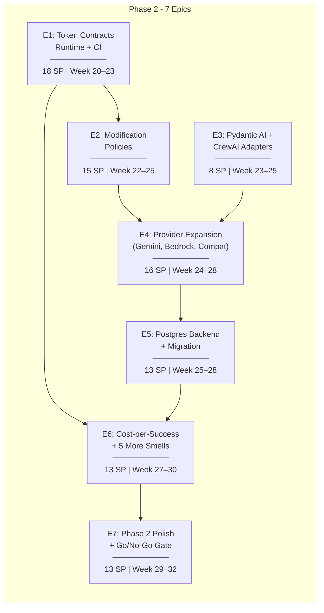
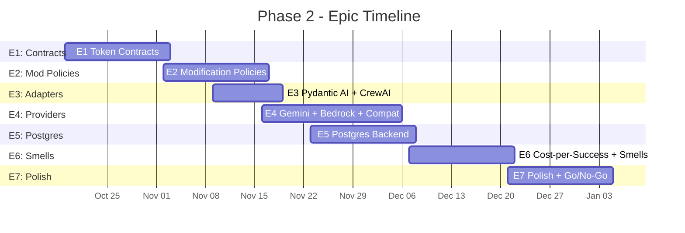
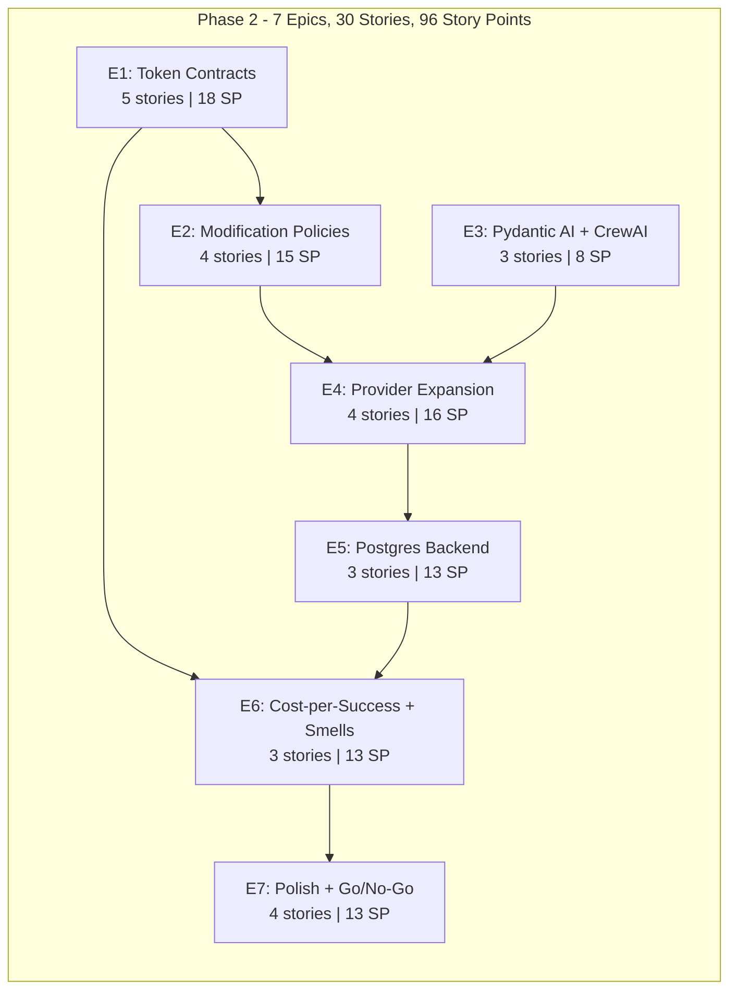

# Inkfoot — Phase 2: Development Epics

> **Phase:** 2 — Enforce
> **Theme:** Enforce contracts before waste happens. Stop being a passive profiler.
> **Timeline:** Weeks 20–32 (60 working days)
> **Total Story Points:** 96
> **Document Version:** 1.0
> **Last Updated:** 2026-05-25
> **Builds On:** `inkfoot_phase1_development_epics.md` v1.0
> **Aligned With:** `phase-2-enforce.md`
>
> **Outcome gate:** entered only after Phase 1 go-signal (one of: ≥ 500
> GitHub stars, ≥ 100 PyPI installs/day, or ≥ 5 external contributors).
> Phase 2 → Phase 3 go/no-go at 8-weeks-post-Phase-2-launch (§14).

---

## Epic Overview

---

## Story Point Scale

| Points | Effort | Example |
|---|---|---|
| 1 | Trivial (< 1 hour) | Add a config field, write a single test |
| 2 | Small (1–3 hours) | Implement a single utility function with tests |
| 3 | Medium (3–6 hours) | Implement a class with 3–5 methods and unit tests |
| 5 | Large (1–1.5 days) | Build a full module with multiple classes and tests |
| 8 | XL (1.5–2.5 days) | Complex feature with edge cases, integration test setup |
| 13 | XXL (3–4 days) | Multi-file feature with significant complexity |

---

## E1: Token Contracts — Runtime + CI

**Goal:** Ship the Token Contract YAML schema, the runtime `ContractEnforcer` with its degrade ladder, `inkfoot contract draft` (history-based YAML generator), and `inkfoot contract check` (CI gate composing with Phase-1 `inkfoot diff`). This is the load-bearing Phase-2 deliverable and the switching-cost moat.

**Total Story Points:** 18
**Sprint:** Week 20–23 (Days 1–15)
**Dependencies:** Phase 1 (`inkfoot diff` for CI integration)

---

### E1-S1: Contract YAML Schema + Loader

**Story:** As a developer, I need a Pydantic v2 schema for Token Contract YAML files + a loader that catches typos and impossible thresholds at load time.

**Story Points:** 3

**Tasks:**

| # | Task | File(s) | Details |
|---|---|---|---|
| T1 | `Contract` schema | `inkfoot/contracts/schema.py` | Pydantic models per phase-2-enforce §4.1: `Contract(schema_version, task, budget, outcome, degrade, overrides)`. `BudgetClause`, `OutcomeClause`, `DegradeStep` sub-models. `extra="forbid"` everywhere. |
| T2 | YAML loader | `inkfoot/contracts/loader.py` | `load_contract(path) → Contract`. Catches missing fields, wrong types, `at_percent` outside 1–100, `switch_to_cheap_model` action without `cheap_model` declared. |
| T3 | Directory loader | `inkfoot/contracts/loader.py` | `load_contracts_dir(path) → dict[task, Contract]`; rejects duplicate task names with clear error. |
| T4 | `schema_version` handling | `inkfoot/contracts/loader.py` | Accept current schema_version (1) + N-1; reject everything else with a clear "upgrade your contracts" message. |
| T5 | Unit tests | `tests/unit/test_contracts_loader.py` | Valid contract loads; missing field rejected; wrong type rejected; `at_percent=150` rejected; duplicate task name rejected. |

**Acceptance Criteria:**
- [ ] `load_contract("path/to/triage.yaml")` returns a `Contract` for a valid file.
- [ ] Loading a contract with `at_percent=150` raises a `ValidationError` with line/column info.
- [ ] Two files declaring the same task raise on `load_contracts_dir`.

---

### E1-S2: `ContractEnforcer` — Runtime Degrade Ladder

**Story:** As the LLM-call hot path, I need a `ContractEnforcer` that estimates per-call cost before each call, fires the degrade ladder, and emits `contract_violation` events.

**Story Points:** 5

**Tasks:**

| # | Task | File(s) | Details |
|---|---|---|---|
| T1 | `ContractEnforcer` class | `inkfoot/contracts/enforcer.py` | Per phase-2-enforce §4.2. Loads contract on `RunContext.start`; on each `before_call`, estimates the projected total and evaluates the degrade ladder. |
| T2 | Pre-call cost estimator | `inkfoot/contracts/enforcer.py` | Tokenises request messages + tools; multiplies by model input price; output estimated from per-task moving average (default 500). Pessimistic-by-default. |
| T3 | Degrade actions | `inkfoot/contracts/enforcer.py` | `warn` (log + event), `switch_to_cheap_model` (rewrite the `model` kwarg + event), `block` (raise `PolicyBlocked`). Actions defined as a fixed enum (ADR-2-3). |
| T4 | `contract_violation` events | `inkfoot/contracts/enforcer.py` | Per-violation event with `level`, `action`, `clause_name`, `projected_value`, `threshold`. |
| T5 | Outcome-window evaluation | `inkfoot/contracts/enforcer.py` | At `set_outcome` time, evaluate the trailing-window outcome rate against the contract's `required_success_rate`; emit `contract_violation` event with `level="outcome"` if below; **never blocks** (advisory only per §4.4.1). |
| T6 | Unit tests | `tests/unit/test_contracts_enforcer.py` | Degrade ladder fires at 80%/90%/100%; `switch_to_cheap_model` rewrites the model param; block raises `PolicyBlocked`; outcome-window evaluation is advisory. |
| T7 | Integration test | `tests/integration/test_contracts_runtime.py` | Real Anthropic stub + a real contract YAML → expected `contract_violation` events sequence. |

**Acceptance Criteria:**
- [ ] Pre-call cost estimate is within 30% of actual on a 4-turn fixture run.
- [ ] `switch_to_cheap_model` rewrites the `model` kwarg to the contract's `cheap_model` (or `CAPABILITIES.cheap_model_for_summariser` fallback).
- [ ] `block` action raises `PolicyBlocked`; the SDK call is not made.
- [ ] Outcome window check **does not** raise `PolicyBlocked` — emits event only.

---

### E1-S3: `inkfoot contract draft`

**Story:** As a developer with a history of runs but no contract yet, I want `inkfoot contract draft --task <name> --window 30d` to produce a starting-point YAML.

**Story Points:** 3

**Tasks:**

| # | Task | File(s) | Details |
|---|---|---|---|
| T1 | History query | `inkfoot/contracts/draft.py` | Select runs by `(task, window)`; compute p50/p95/p99 over `total_nanodollars`, llm_calls, max tool result tokens, cache hit rate. |
| T2 | YAML template | `inkfoot/contracts/draft.py` | Per phase-2-enforce §4.3: `max_nanodollars` = p95 + 10% headroom; `max_llm_calls` = p99 + 1; `cache_hit_rate_min` = p25; `required_success_rate` = observed - 1pp tolerance. |
| T3 | Output rendering | `inkfoot/contracts/draft.py` | Pretty-printed YAML with header comment showing source window + outlier count. |
| T4 | `inkfoot contract draft` CLI | `inkfoot/cli/contract.py` | Args: `--task NAME --window 30d --output PATH`. |
| T5 | Unit tests | `tests/unit/test_contract_draft.py` | Synthetic 100-run history → expected draft contract; edge cases (< 20 runs → warning; single outlier → flagged in comment). |

**Acceptance Criteria:**
- [ ] `inkfoot contract draft --task triage --window 30d` produces a valid YAML.
- [ ] The draft loads cleanly via the loader (round-trip).
- [ ] Outlier runs > 10× p50 are listed in a header comment, not silently included.

---

### E1-S4: `inkfoot contract check` CI Gate

**Story:** As CI, I need `inkfoot contract check ./contracts --against current.json` to evaluate contracts against a benchmark JSON and emit exit-code-driven verdicts.

**Story Points:** 5

**Tasks:**

| # | Task | File(s) | Details |
|---|---|---|---|
| T1 | Contract evaluation against benchmark | `inkfoot/contracts/check.py` | For each contract task name, find matching scenario in `current.json`; evaluate every budget clause against the scenario's p95 stats. |
| T2 | Advisory outcome-clause display | `inkfoot/contracts/check.py` | Per §4.4.1: outcome clauses appear in the output as advisory but never fail the build. |
| T3 | Exit-code contract | `inkfoot/contracts/check.py` | `0` (all met) / `1` (soft warning at 90%+) / `2` (any violation). |
| T4 | Markdown + JSON renderers | `inkfoot/contracts/check.py` | Per phase-2-enforce §4.4 sample output. JSON variant for PR-comment composition with `inkfoot diff`. |
| T5 | `inkfoot contract check` CLI | `inkfoot/cli/contract.py` | Args: `[DIR] --against <benchmark.json> --format markdown|json`. |
| T6 | Composition with `inkfoot diff` | `inkfoot/cli/diff.py` | When both run in the same CI step, combine outputs into a single sticky PR comment. |
| T7 | Unit + integration tests | `tests/unit/test_contract_check.py`, `tests/integration/test_ci_combined.py` | Per-contract evaluation; combined diff+check PR comment matches snapshot. |

**Acceptance Criteria:**
- [ ] On a benchmark that violates the `cache_hit_rate_min` clause, exit code is 2.
- [ ] Outcome clauses appear in the report tagged "(advisory)".
- [ ] When run alongside `inkfoot diff`, the combined PR comment contains both sections.

---

### E1-S5: Contract Schema Versioning + Deprecation

**Story:** As contracts evolve over time, I need versioning + a documented 6-month deprecation window.

**Story Points:** 2

**Tasks:**

| # | Task | File(s) | Details |
|---|---|---|---|
| T1 | `CONTRACT_SCHEMA_VERSION` constant | `inkfoot/contracts/schema.py` | Current version; loader accepts current + N-1. |
| T2 | `contracts/CHANGELOG.md` | (docs) | Append-only log of schema-version changes; migration steps per bump. |
| T3 | Loader version warning | `inkfoot/contracts/loader.py` | When loading N-1 schema, emit a one-time WARN per process pointing at the changelog. |

**Acceptance Criteria:**
- [ ] Loading a contract with `schema_version: 0` emits a deprecation WARN.
- [ ] Loading `schema_version: -1` raises with "schema too old" + changelog link.

---

## E2: Modification Policies — `LazyToolExposure` + `CheapSummariser`

**Goal:** Ship the two modification policies that have been refused at Phase-0 registration since day one. Both require Pattern C framework adapters (Phase 1) to land cleanly. CheapSummariser also ships its first-class A/B trust-mode (per §4.6.1).

**Total Story Points:** 15
**Sprint:** Week 22–25 (Days 8–25)
**Dependencies:** E1 (`ContractEnforcer` for budget integration), Phase 1 E1 (framework adapters)

---

### E2-S1: `LazyToolExposure` — Heuristic Classifier + Tool Set Narrowing

**Story:** As a Pattern-C agent, I need `LazyToolExposure(stale_after_turns=N)` to narrow the tools list per turn based on a heuristic classifier so I'm not sending 3000 tokens of tool defs every turn.

**Story Points:** 5

**Tasks:**

| # | Task | File(s) | Details |
|---|---|---|---|
| T1 | `LazyToolExposure` policy class | `inkfoot/policy/lazy_tool_exposure.py` | `SUPPORTED_PATTERNS = {Pattern.C}`. Constructor: `stale_after_turns: int = 3`. |
| T2 | Heuristic classifier | `inkfoot/policy/lazy_tool_exposure.py` | Per phase-2-enforce §4.5: keep tools called in recent N turns; keep tools mentioned in question; keep tools tagged `core`; drop the rest. |
| T3 | Tool-set rewriting | `inkfoot/policy/lazy_tool_exposure.py` | `before_call` rewrites the tools kwarg in-place. Stale-after-N restoration window so a missed restoration recovers on the next turn. |
| T4 | Metrics | `inkfoot/policy/lazy_tool_exposure.py` | Emit `lazy_tool_dropped` events with the dropped names; `lazy_tool_restored` when a previously-dropped tool comes back. |
| T5 | Unit tests | `tests/unit/test_lazy_tool_exposure.py` | Recent tools never dropped; tools tagged `core` never dropped; stale-after-N restoration. |
| T6 | Integration test | `tests/integration/test_lazy_tool_exposure_e2e.py` | LangGraph + stub Anthropic → tools list shrinks; agent recovers when it needs a dropped tool. |

**Acceptance Criteria:**
- [ ] On Pattern A, registering `LazyToolExposure` raises `PolicyNotSupported`.
- [ ] On Pattern C with `stale_after_turns=3`, a tool not called in 3 turns is dropped from the next call.
- [ ] When the agent emits text referencing a dropped tool, the next turn restores it.

---

### E2-S2: `CheapSummariser` — Tool-Result Compression

**Story:** As a Pattern-C agent, I need `CheapSummariser(threshold_tokens=1500)` to intercept oversized tool results and replace them with a Haiku-summarised version.

**Story Points:** 5

**Tasks:**

| # | Task | File(s) | Details |
|---|---|---|---|
| T1 | `CheapSummariser` policy class | `inkfoot/policy/cheap_summariser.py` | `SUPPORTED_PATTERNS = {Pattern.C}`. Args: `threshold_tokens`, `max_summary_tokens`, `preserve_for_replay`, `ab_mode`, `ab_sample_rate`. |
| T2 | Provider-cheap-model routing | `inkfoot/policy/cheap_summariser.py` | Use `CAPABILITIES.cheap_model_for_summariser` from the active provider (ADR-2-5). Fallback: mechanical truncation if none declared. |
| T3 | Tool-result interception | `inkfoot/policy/cheap_summariser.py` | After a tool returns, if token count > threshold, call the cheap model with a summariser prompt + the user's original question. Replace the conversation-state tool result with the summary. |
| T4 | `preserve_for_replay` | `inkfoot/policy/cheap_summariser.py` | When True, raw result persists in `events.payload_json` while the LLM sees only the summary. |
| T5 | Summariser cost in `TokenUsage` | `inkfoot/policy/cheap_summariser.py` | The Haiku call's tokens land in `ledger.summariser_tokens`. |
| T6 | Unit + integration tests | `tests/unit/test_cheap_summariser.py`, `tests/integration/test_cheap_summariser_e2e.py` | Below-threshold passes through unchanged; over-threshold summarises; `summariser_tokens` populated; `preserve_for_replay` keeps raw in events. |

**Acceptance Criteria:**
- [ ] Tool result of 12,500 tokens summarised to ≤ 600 tokens.
- [ ] `ledger.summariser_tokens` reflects the Haiku call's input + output.
- [ ] With `preserve_for_replay=True`, `events.payload_json` for the tool_result event contains the raw output.

---

### E2-S3: CheapSummariser A/B Mode (Trust Mechanism)

**Story:** As an operator opting into `CheapSummariser`, I need an A/B mode that compares summarised vs raw outcomes per task so I can build trust before flipping it on for everyone.

**Story Points:** 3

**Tasks:**

| # | Task | File(s) | Details |
|---|---|---|---|
| T1 | A/B branch selection | `inkfoot/policy/cheap_summariser.py` | Per §4.6.1: when `ab_mode=True`, with probability `ab_sample_rate`, run both A (raw) and B (summarised) branches; persist both as paired events. |
| T2 | A/B paired-run worker | `inkfoot/policy/_ab_pair_worker.py` | Background worker that joins paired runs by tag and computes the per-task quality-delta metric (success-rate drop, quality_score delta). |
| T3 | Quality regression smell | `inkfoot/smells/summariser_quality_regression.py` | Fires when per-task quality drop exceeds threshold (default 5pp). Auto-disables `CheapSummariser` for that task. |
| T4 | Per-task kill-switch | `inkfoot/policy/cheap_summariser.py` | `inkfoot.tag("disable_summariser", True)` or tenant-config flag disables the policy for that task. |
| T5 | Unit + integration tests | `tests/unit/test_cheap_summariser_ab.py` | Paired runs land; quality-delta computed; auto-disable triggers. |

**Acceptance Criteria:**
- [ ] With `ab_mode=True, ab_sample_rate=0.10`, roughly 10% of summarisation decisions produce paired A/B runs.
- [ ] Quality regression smell fires when per-task success-rate drop > 5pp.
- [ ] Auto-disable kill-switch takes effect on the next run of the same task.

---

### E2-S4: Modification-Policy Capability Wiring

**Story:** As the capability matrix, I need both modification policies to declare themselves as Pattern-C-only and refuse cleanly on Pattern A/B.

**Story Points:** 2

**Tasks:**

| # | Task | File(s) | Details |
|---|---|---|---|
| T1 | Capability declaration | `inkfoot/policy/lazy_tool_exposure.py`, `inkfoot/policy/cheap_summariser.py` | `SUPPORTED_PATTERNS = {Pattern.C}` on both. |
| T2 | Adapter capability propagation | `inkfoot/adapters/langgraph.py`, `inkfoot/adapters/openai_agents.py`, `inkfoot/adapters/anthropic_agent.py`, `inkfoot/adapters/pydantic_ai.py`, `inkfoot/adapters/crewai.py` | Each adapter's `supported_policies()` returns the union of base Phase-0 policies + the two new modification policies. |
| T3 | Registration tests | `tests/unit/test_modification_policy_registration.py` | Pattern A rejects both; Pattern C accepts both. |

**Acceptance Criteria:**
- [ ] On Pattern A (`inkfoot.instrument()` without an adapter), both policies raise `PolicyNotSupported` at registration.
- [ ] On Pattern C (any framework adapter), both policies register cleanly.

---

## E3: Pydantic AI + CrewAI Adapters

**Goal:** Two more Pattern C framework adapters round out the Python framework coverage. Each follows the Phase-1 pattern (entry-point wrap, per-node/per-task metadata, capability declaration).

**Total Story Points:** 8
**Sprint:** Week 23–25 (Days 13–20)
**Dependencies:** Phase 1 E1 (adapter pattern)

---

### E3-S1: Pydantic AI Adapter

**Story:** As a Pydantic AI user, I need `inkfoot.pydantic_ai.instrument()` matching the Phase 1 adapter pattern.

**Story Points:** 3

**Tasks:**

| # | Task | File(s) | Details |
|---|---|---|---|
| T1 | Adapter implementation | `inkfoot/adapters/pydantic_ai.py` | Wrap Pydantic AI's `Agent.run` / `Agent.run_sync`. Emit per-step events. |
| T2 | Capability declaration | `inkfoot/adapters/pydantic_ai.py` | Pattern C; all modification policies supported. |
| T3 | Optional install | `pyproject.toml` | `inkfoot[pydantic-ai]` extra. |
| T4 | Unit + integration tests | `tests/unit/test_pydantic_ai_adapter.py`, `tests/integration/test_pydantic_ai_e2e.py` | Stub + real-SDK tests. |

**Acceptance Criteria:**
- [ ] `inkfoot.pydantic_ai.instrument()` wraps the supported entry points.
- [ ] Per-step events emit with sensible metadata.

---

### E3-S2: CrewAI Adapter

**Story:** As a CrewAI user, I need `inkfoot.crewai.instrument()` covering the `Crew` + `Agent` + `Task` shape.

**Story Points:** 3

**Tasks:**

| # | Task | File(s) | Details |
|---|---|---|---|
| T1 | Adapter implementation | `inkfoot/adapters/crewai.py` | Wrap `Crew.kickoff` + per-Agent/Task hooks. Multi-agent attribution via `metadata.agent_name` + `metadata.task_name`. |
| T2 | Capability declaration | `inkfoot/adapters/crewai.py` | Pattern C. |
| T3 | Optional install | `pyproject.toml` | `inkfoot[crewai]` extra. |
| T4 | Tests | `tests/unit/test_crewai_adapter.py`, `tests/integration/test_crewai_e2e.py` | Per-agent + per-task attribution verified. |

**Acceptance Criteria:**
- [ ] Multi-agent crew produces per-agent ledger slices in `inkfoot report --group-by metadata.agent_name`.

---

### E3-S3: Contract Test Harness Extension

**Story:** As CI, I need the framework-adapter contract test harness extended to cover the two new adapters.

**Story Points:** 2

**Tasks:**

| # | Task | File(s) | Details |
|---|---|---|---|
| T1 | Parametrise existing harness | `tests/contract/test_framework_adapter_contract.py` | Add Pydantic AI + CrewAI to the parametrised matrix. |
| T2 | Live-LLM weekly cron | `.github/workflows/live-tests.yml` | All 5 Python adapters run against real LLMs weekly. |

**Acceptance Criteria:**
- [ ] All 5 Python adapters (LangGraph, OpenAI Agents, Anthropic Agent, Pydantic AI, CrewAI) pass the parametrised contract test.
- [ ] Weekly cron runs the live-LLM matrix and posts results to a status page.

---

## E4: Provider Expansion — Gemini, Bedrock, OpenAI-Compat

**Goal:** Expand the provider matrix from 2 (Anthropic + OpenAI from Phase 0) to 5+: add Gemini, AWS Bedrock (Converse API), and OpenAI-compat (vLLM, Together, Fireworks, Groq, Ollama). Capability flags carry the per-provider variance; the loop never branches on provider.

**Total Story Points:** 16
**Sprint:** Week 24–28 (Days 18–35)
**Dependencies:** E2 (modification policies use per-provider cheap_model_for_summariser)

---

### E4-S1: `GeminiProvider` + `cache_resource` Style

**Story:** As a Gemini user, I need full provider support — translator, capability declaration, cache_resource style for prompt caching.

**Story Points:** 5

**Tasks:**

| # | Task | File(s) | Details |
|---|---|---|---|
| T1 | `GeminiProvider` class | `inkfoot/providers/gemini.py` | Uses `google-generativeai`. `CAPABILITIES` per phase-2-enforce §4.7.1. |
| T2 | `map_usage` translator | `inkfoot/providers/gemini.py` | Gemini's `usageMetadata` → `TokenUsage` neutral shape. Per §4.7.1: first call → `cache_creation_tokens`; subsequent calls → `cache_read_tokens`. |
| T3 | `CachedContent` integration | `inkfoot/providers/gemini.py` | When `CacheControlPlacer` is active on Gemini, create/reuse a `CachedContent` resource keyed on system block + tools fingerprint. |
| T4 | Optional install | `pyproject.toml` | `inkfoot[gemini]` extra. |
| T5 | Tests | `tests/unit/test_gemini_provider.py`, `tests/integration/test_gemini_e2e.py` | Capability declaration; usage translation; cache resource creation; live-LLM smoke. |

**Acceptance Criteria:**
- [ ] Gemini calls produce a complete `TokenUsage` with the cache fields populated correctly.
- [ ] `CacheControlPlacer` on Gemini creates a `CachedContent` resource on first call; subsequent calls reference it.
- [ ] Live-LLM test passes weekly.

---

### E4-S2: `BedrockProvider` (Converse API)

**Story:** As an AWS-bound enterprise user, I need Bedrock support via the Converse API covering Anthropic, Llama, Titan, Mistral, and Cohere model families.

**Story Points:** 5

**Tasks:**

| # | Task | File(s) | Details |
|---|---|---|---|
| T1 | `BedrockProvider` class | `inkfoot/providers/bedrock.py` | Uses `boto3` against the Converse API. |
| T2 | Per-family capability lookup | `inkfoot/providers/bedrock.py` | `_BEDROCK_MODEL_CAPS` dict per phase-2-enforce §4.7.2 — model family prefix → capabilities. |
| T3 | `map_usage` translator | `inkfoot/providers/bedrock.py` | Bedrock's response shape varies by family; per-family adapters. |
| T4 | Optional install | `pyproject.toml` | `inkfoot[bedrock]` extra (depends on `boto3`). |
| T5 | Tests | `tests/unit/test_bedrock_provider.py`, `tests/integration/test_bedrock_e2e.py` | Per-family capability resolution; usage translation; live integration with `anthropic.claude-3-5-sonnet` on Bedrock. |

**Acceptance Criteria:**
- [ ] `BedrockProvider("anthropic.claude-3-5-sonnet-...")` declares the Anthropic family's caching capabilities.
- [ ] `BedrockProvider("meta.llama-3.2-...")` declares no caching.
- [ ] Live-LLM test passes against a real Bedrock account weekly.

---

### E4-S3: `OpenAICompatProvider`

**Story:** As the long-tail integration story, I need one provider class for OpenAI-compatible endpoints (vLLM, Together, Fireworks, Anyscale, DeepInfra, Groq, LM Studio, Ollama).

**Story Points:** 3

**Tasks:**

| # | Task | File(s) | Details |
|---|---|---|---|
| T1 | `OpenAICompatProvider` class | `inkfoot/providers/openai_compat.py` | Takes `base_url` + `model` + `api_key`. Conservative default capabilities (no caching, no PDFs, tool use yes). |
| T2 | Per-`base_url` capability override | `inkfoot/providers/openai_compat.py` | Operator config: `capabilities={...}` on instantiation. |
| T3 | Pricing default | `inkfoot/pricing.py` | `("openai_compat", "*") → all zeros` — self-hosted = free at the provider boundary; operators override per (base_url, model). |
| T4 | Tests | `tests/unit/test_openai_compat_provider.py`, `tests/integration/test_openai_compat_ollama.py` | Capability default; capability override; live test against a local Ollama instance. |

**Acceptance Criteria:**
- [ ] `OpenAICompatProvider(base_url="http://localhost:11434/v1", model="llama3.2")` works against a running Ollama.
- [ ] Conservative defaults: tool use yes, no caching.
- [ ] Operator-supplied `capabilities` override is honored.

---

### E4-S4: Provider Abstraction Refactor

**Story:** As the codebase, I need Phase 0's shim-only code refactored into proper provider classes implementing the abstraction the new providers already use.

**Story Points:** 3

**Tasks:**

| # | Task | File(s) | Details |
|---|---|---|---|
| T1 | `LLMProvider` ABC | `inkfoot/providers/base.py` | Extracted from Phase 0 shim. `PROVIDER_TYPE`, `DEFAULT_MODEL`, `CAPABILITIES`, `map_usage`. |
| T2 | `AnthropicProvider` extraction | `inkfoot/providers/anthropic.py` | Phase 0 shim becomes a formal provider class with all the same behaviour. |
| T3 | `OpenAIProvider` extraction | `inkfoot/providers/openai.py` | Same for OpenAI. |
| T4 | Provider registry | `inkfoot/providers/_registry.py` | All providers registered by type string. |
| T5 | Tests | `tests/unit/test_provider_abstraction.py` | All providers pass a uniform contract test. |

**Acceptance Criteria:**
- [ ] All 5 providers (Anthropic, OpenAI, Gemini, Bedrock, OpenAI-Compat) pass the same parametrised contract test.
- [ ] Phase 0 callers' behaviour unchanged after the refactor.

---

## E5: Postgres Backend + Migration

**Goal:** Add a Postgres storage backend behind the existing `Storage` Protocol; multi-process aggregator via Postgres advisory locks; `inkfoot migrate --to postgres` for SQLite → Postgres migration on existing installs.

**Total Story Points:** 13
**Sprint:** Week 25–28 (Days 22–35)
**Dependencies:** E4 (provider abstraction stabilises before storage refactor)

---

### E5-S1: `PostgresStorage` Implementation

**Story:** As a multi-process deployment, I need a Postgres storage backend implementing the same `Storage` Protocol as SQLite.

**Story Points:** 5

**Tasks:**

| # | Task | File(s) | Details |
|---|---|---|---|
| T1 | `PostgresStorage` class | `inkfoot/storage/postgres.py` | Same Protocol surface as SQLite. Uses `psycopg[binary]` + `psycopg-pool`. |
| T2 | Schema migration | `inkfoot/storage/postgres_migrations.py` | Forward-only DDL targeting Postgres; same logical shape as SQLite (`runs`, `events`, `event_contents`). |
| T3 | Connection pool | `inkfoot/storage/postgres.py` | `psycopg_pool.AsyncConnectionPool` + sync pool (mirrors Sleuth's two-pool pattern). |
| T4 | Optional install | `pyproject.toml` | `inkfoot[postgres]` extra. |
| T5 | Tests | `tests/unit/test_postgres_storage.py`, `tests/integration/test_postgres_storage.py` | Testcontainer Postgres; schema apply; round-trip; contract test against the Protocol. |

**Acceptance Criteria:**
- [ ] `PostgresStorage` passes the same contract tests as `SQLiteStorage`.
- [ ] Schema migration is idempotent on Postgres.
- [ ] Connection pool tunable via env vars (`INKFOOT_PG_POOL_MIN`/`MAX`).

---

### E5-S2: Multi-Process Aggregator with Advisory Locks

**Story:** As a multi-process deployment, I need exactly one aggregator running at a time, coordinated via Postgres advisory locks.

**Story Points:** 5

**Tasks:**

| # | Task | File(s) | Details |
|---|---|---|---|
| T1 | `inkfoot aggregator-worker` CLI | `inkfoot/cli/aggregator_worker.py` | Standalone process; acquires `pg_advisory_lock(hash('inkfoot_aggregator'))` for the duration of a sweep. |
| T2 | Lock contention handling | `inkfoot/storage/postgres_aggregator.py` | Multiple workers contending see one sweeper; others wait. |
| T3 | Health check | `inkfoot/cli/aggregator_worker.py` | `--health` flag prints last-sweep timestamp for liveness probes. |
| T4 | Tests | `tests/integration/test_postgres_aggregator.py` | Two workers spawned; only one sweeps at a time; lock released on crash via session-level lock semantics. |

**Acceptance Criteria:**
- [ ] Two aggregator processes started simultaneously — only one sweeps; the other waits.
- [ ] Killing the active aggregator releases the lock; the waiter takes over within 1 s.
- [ ] Health check reports a recent sweep timestamp.

---

### E5-S3: `inkfoot migrate --to postgres`

**Story:** As a SQLite-backed installation, I need a one-command migration to Postgres.

**Story Points:** 3

**Tasks:**

| # | Task | File(s) | Details |
|---|---|---|---|
| T1 | Migration runner | `inkfoot/cli/migrate.py` | Per phase-2-enforce §4.9: open SQLite + Postgres connections; CREATE SCHEMA on PG; batched copy of `runs` (1000/batch) and `events` (10000/batch); rename SQLite to `.migrated`. |
| T2 | Progress reporting | `inkfoot/cli/migrate.py` | Per-batch progress to stderr; final summary with row counts. |
| T3 | Idempotency | `inkfoot/cli/migrate.py` | Safe to re-run after a partial migration (resume from last successful batch). |
| T4 | Tests | `tests/integration/test_migrate_to_postgres.py` | 100k-event corpus migrates cleanly; resume after simulated interrupt works. |

**Acceptance Criteria:**
- [ ] `inkfoot migrate --to postgres --dsn postgresql://...` migrates a SQLite store on a 100k-event corpus in under 60 s.
- [ ] Migration is resumable after interrupt.
- [ ] SQLite is renamed (not deleted) to preserve a manual rollback.

---

## E6: Cost-per-Success Reporting + 5 More Cost Smells

**Goal:** Promote outcome tracking from "captured in Phase 0" to "headline metric in Phase 2 reports." Add the second wave of cost smells informed by Phase-0 + Phase-1 internal usage.

**Total Story Points:** 13
**Sprint:** Week 27–30 (Days 30–40)
**Dependencies:** E5 (Postgres backend stabilises before reporting changes)

---

### E6-S1: Cost-per-Success Promotion in Reports

**Story:** As an engineer reading `inkfoot report`, I want **cost-per-success** to be the headline column, with uninstrumented-outcome runs in a separate visible bucket.

**Story Points:** 5

**Tasks:**

| # | Task | File(s) | Details |
|---|---|---|---|
| T1 | New columns in aggregate view | `inkfoot/reports/cost_per_success.py` | Per phase-2-enforce §4.10: `cost/success` + `cost/accepted_answer` columns; the existing `avg_$` / `p95_$` stay but cost-per-success becomes the leftmost emphasis. |
| T2 | Uninstrumented bucket | `inkfoot/reports/cost_per_success.py` | Runs without `set_outcome` show in their own row (`uninstrumented`); not silently dropped. |
| T3 | Docs update | (docs) `concepts/cost-per-success.md` | Concept page explaining why this is the headline; surface the requirement to call `set_outcome`. |
| T4 | Helper for common outcome patterns | `inkfoot/outcomes/_heuristics.py` | `set_outcome_from_heuristic()` helper for common patterns (LangGraph END state → success, etc.) |
| T5 | Tests | `tests/unit/test_cost_per_success.py` | Synthetic 100-run fixture renders the headline column; uninstrumented bucket visible. |

**Acceptance Criteria:**
- [ ] `inkfoot report --last 30d --group-by task` shows `cost/success` as a prominent column.
- [ ] Tasks with zero outcome tags show in the uninstrumented bucket, not silently averaged.
- [ ] Docs explain the requirement clearly.

---

### E6-S2: Tag-Based Report Groupings

**Story:** As an operator with custom tags, I want `inkfoot report --group-by tag.<name>` to slice the report by tag value.

**Story Points:** 3

**Tasks:**

| # | Task | File(s) | Details |
|---|---|---|---|
| T1 | `--group-by tag.<name>` flag | `inkfoot/cli/report.py` | Aggregate by tag value (from `user_tag` events). |
| T2 | Tag rollup helper | `inkfoot/reports/tag_groupby.py` | Postgres-friendly query that groups by tag value with default-bucket handling. |
| T3 | Tests | `tests/unit/test_tag_groupby.py` | 1000-run fixture with tags renders the right per-tag rollup. |

**Acceptance Criteria:**
- [ ] `inkfoot report --group-by tag.customer_tier` returns one row per distinct value.
- [ ] Runs without the tag show in an `unknown` bucket.

---

### E6-S3: Five Additional Smells

**Story:** As the recommendation engine, I need the second wave of cost smells: `tool-schema-drift`, `cost-skewed-by-outlier`, `unbounded-conversation-history`, `over-instrumented-retries`, `summariser-not-firing`.

**Story Points:** 5

**Tasks:**

| # | Task | File(s) | Details |
|---|---|---|---|
| T1 | `tool-schema-drift` | `inkfoot/smells/tool_schema_drift.py` | Trigger: tool schema fingerprint changes mid-run. |
| T2 | `cost-skewed-by-outlier` | `inkfoot/smells/cost_skewed_by_outlier.py` | Trigger: a single run > 10× p50 of its task. |
| T3 | `unbounded-conversation-history` | `inkfoot/smells/unbounded_conversation_history.py` | Trigger: run carries > 50k tokens of memory. |
| T4 | `over-instrumented-retries` | `inkfoot/smells/over_instrumented_retries.py` | Trigger: SDK retries firing > 3× per call on average. |
| T5 | `summariser-not-firing` | `inkfoot/smells/summariser_not_firing.py` | Trigger: tool_result_tokens consistently > 2k AND no summariser configured. |
| T6 | Tests + fixtures | `tests/unit/test_smells/`, `tests/fixtures/smells/` | Positive + negative fixtures for each. |

**Acceptance Criteria:**
- [ ] `len(DEFAULT_SMELLS) == 10` after merge.
- [ ] All five new smells fire on their positive fixtures and stay silent on negatives.

---

## E7: Phase 2 Polish + Go/No-Go Gate

**Goal:** End-of-phase polish: documentation pass, performance budget reaffirmation, public Postgres-migration runbook, and the Phase-2 → Phase-3 go/no-go decision doc.

**Total Story Points:** 13
**Sprint:** Week 29–32 (Days 40–60)
**Dependencies:** E1–E6

---

### E7-S1: Phase 2 Documentation Pass

**Story:** As the documentation surface, I need the docs site updated to reflect every Phase 2 capability.

**Story Points:** 5

**Tasks:**

| # | Task | File(s) | Details |
|---|---|---|---|
| T1 | Token Contracts guide | `docs/concepts/token-contracts.md` | Authoring, draft-then-edit workflow, CI gating, per-tier overrides. |
| T2 | Modification policies guide | `docs/concepts/modification-policies.md` | LazyToolExposure + CheapSummariser; A/B mode story. |
| T3 | Provider matrix page | `docs/reference/provider-matrix.md` | Which features work with which provider × model. |
| T4 | Postgres migration runbook | `docs/operations/postgres-migration.md` | Step-by-step SQLite → Postgres. |
| T5 | CLI reference update | `docs/reference/cli.md` | New commands: `contract draft`, `contract check`, `migrate`, `tail`. |

**Acceptance Criteria:**
- [ ] All five new doc pages published on inkfoot.dev.
- [ ] Provider matrix table renders all 5 providers × all capability flags.

---

### E7-S2: Performance Budget Reaffirmation

**Story:** As CI, I need updated benchmark assertions for the Phase 2 surfaces.

**Story Points:** 3

**Tasks:**

| # | Task | File(s) | Details |
|---|---|---|---|
| T1 | Contract enforcer benchmark | `tests/benchmarks/test_contract_enforcer_perf.py` | `before_call` budget < 50 µs. |
| T2 | LazyToolExposure benchmark | `tests/benchmarks/test_lazy_tool_exposure_perf.py` | Classifier overhead < 100 µs. |
| T3 | Postgres write benchmark | `tests/benchmarks/test_postgres_perf.py` | Event insert < 5 ms p95 on testcontainer Postgres. |
| T4 | Postgres aggregator benchmark | `tests/benchmarks/test_postgres_aggregator_perf.py` | 50 dirty runs swept in < 200 ms. |

**Acceptance Criteria:**
- [ ] All four benchmarks pass on CI's reference hardware.
- [ ] Regression beyond budget fails the PR.

---

### E7-S3: Phase 2 Exit-Criteria Test Suite

**Story:** As the Phase 2 DoD, I need every Phase 2 acceptance criterion encoded as an automated test so "Phase 2 done" is a CI run, not a judgment call.

**Story Points:** 3

**Tasks:**

| # | Task | File(s) | Details |
|---|---|---|---|
| T1 | Exit-criteria test suite | `tests/integration/test_phase2_exit_criteria.py` | One test per DoD item from phase-2-enforce §11. |
| T2 | Contract-test matrix across adapters × providers | `tests/contract/test_phase2_matrix.py` | All 5 adapters × all 5 providers (where compatible). |
| T3 | Coverage check | `tests/integration/test_phase2_exit_criteria.py::test_coverage_floor` | Pytest-cov over Phase 2 modules ≥ 80%. |

**Acceptance Criteria:**
- [ ] Every Phase 2 DoD checkbox has a corresponding test.
- [ ] Coverage floor met across all new Phase 2 modules.

---

### E7-S4: Go/No-Go Decision Doc

**Story:** As the Phase-2 → Phase-3 transition, I need a written go/no-go decision filled in at the 8-week-post-launch mark.

**Story Points:** 2

**Tasks:**

| # | Task | File(s) | Details |
|---|---|---|---|
| T1 | Decision template | `docs/internal/phase-2-go-no-go.md` | Per phase-2-enforce §12: ≥ 2000 stars AND ≥ 50 weekly active installs AND ≥ 1 company emailing about commercial options. |
| T2 | Sign-off | (process) | Two-engineer sign-off. |

**Acceptance Criteria:**
- [ ] Decision doc filled in at the 8-week mark.
- [ ] All three thresholds answered with yes/no + supporting numbers.

---

## Summary

| Epic | Stories | Story Points | Weeks | Key Deliverable |
|---|---|---|---|---|
| E1: Token Contracts | 5 | 18 | 20–23 | YAML schema, runtime enforcer, draft, CI gate |
| E2: Modification Policies | 4 | 15 | 22–25 | LazyToolExposure + CheapSummariser + A/B mode |
| E3: Pydantic AI + CrewAI | 3 | 8 | 23–25 | Two more Pattern-C adapters + contract test matrix |
| E4: Provider Expansion | 4 | 16 | 24–28 | Gemini + Bedrock + OpenAI-Compat + provider abstraction refactor |
| E5: Postgres Backend | 3 | 13 | 25–28 | PostgresStorage + multi-process aggregator + migration CLI |
| E6: Cost-per-Success + Smells | 3 | 13 | 27–30 | Headline metric, tag groupings, 5 more smells |
| E7: Polish + Go/No-Go | 4 | 13 | 29–32 | Docs, benchmarks, exit-criteria tests, decision doc |
| **Total** | **26** | **96** | **12 weeks** | **Phase 2 complete — profiler becomes enforcer** |

---

## Risks & Trade-offs (Phase 2-wide)

| Risk | Affected Epic | Mitigation |
|---|---|---|
| Contract DSL feature creep | E1 | Strict schema; reject extensions; revisit with explicit ADRs in later phases |
| Cost-per-success outcome-tag adoption gap | E6 | Surface uninstrumented bucket; helper for common patterns; doc warning |
| CheapSummariser quality regression | E2-S3 | A/B mode as first-class trust mechanism; auto-disable per task |
| Postgres backend write-race regression | E5-S2 | Two-tier writes from Phase 0 anticipate this; PG advisory lock fuzz tests |
| Provider matrix scope (5 in one phase ambitious) | E4 | OpenAICompat covers ~50 long-tail backends in one class; only 4 direct integrations |
| Schema-version churn (contracts get v2 before customers settle on v1) | E1-S5 | 6-month deprecation window; loader accepts N + N-1 |
| LazyToolExposure mis-routes critical tools | E2-S1 | Stale-after-N restoration window; `core` tag for must-keep tools; metric on restoration rate |

---

## Out-of-Scope Reminders (deferred to later phases)

- **Cloud infrastructure / Cost Replay Engine / static analyzer / invoice reconciliation** — **Phase 3**.
- **TypeScript port** — **Phase 4**.
- **Community Cost Smell Library + estimated_savings worker** — **Phase 4**.
- **Anomaly-based alerting; Slack + PagerDuty delivery** — **Phase 4**.
- **Multi-user IAM / SSO / SOC 2 / self-hosted Cloud** — **Phase 5**.

---

*Phase 3 takes the OSS foundation into Cloud — at least one paying customer plus the three structural USPs (Replay Engine + static analyzer + invoice reconciliation). Phase 3 epic doc unlocks only after Phase 2's go/no-go gate passes at the 8-week mark.*
