# Phase 2 — Enforce (detailed design)

**Theme:** *Enforce contracts before waste happens. Stop being a passive profiler.*
**Status:** approved scope; entered only after Phase 1 go-signal.
**Weeks:** 20–32 (12 weeks).
**Companion docs:**
- [Roadmap §4](../../roadmap-inkfoot.md#4-phase-2--enforce-weeks-2032)
- [Architecture §4.5, §4.6, §4.7](../../architecture-inkfoot.md)
- [Phase 1 detailed design](../phase1/phase-1-explain.md) — the framework
  adapter foundation Phase 2 builds on.

---

## 1. Context

Phase 1 made Inkfoot publicly usable: framework adapters,
`inkfoot diff` in CI, OTel compatibility, a launch. Phase 2 turns
the library from a *profiler* into an *enforcer*: declarative
**Token Contracts** in YAML, runtime enforcement with a `degrade`
ladder, CI gates via `inkfoot contract check`, and the **modification
policies** (`LazyToolExposure`, `CheapSummariser`) that Phase 0's
capability matrix has been refusing since day one.

Phase 2 also expands the provider matrix in earnest: Gemini, AWS
Bedrock (via the Converse API), and an OpenAI-compatible adapter
that unlocks the long tail (vLLM, Together, Fireworks, Groq, Ollama)
in one class. Two more framework adapters (Pydantic AI, CrewAI)
round out the framework coverage. A **Postgres** storage backend
joins SQLite. **Cost-per-success** is promoted from "captured in
Phase 0, computed in Phase 1, hidden until Phase 2" to **the
headline metric** in `inkfoot report`.

Strategically, Phase 2 is the **switching-cost moat**. Once a team
has 50 contracts declared per-agent, per-task, per-tier, leaving
Inkfoot means re-implementing those contracts in a competitor's
DSL.

## 2. Goals & non-goals (phase-scoped)

### Goals

- **Token Contracts work end-to-end** — YAML → runtime enforcement
  → CI gate.
- **Modification policies actually modify** — `LazyToolExposure`
  re-shapes the tools list per turn; `CheapSummariser` intercepts
  oversized tool results and compresses them; both gated to Pattern
  C adapters.
- **Six providers supported, not two.** Anthropic + OpenAI (Phase 0)
  + Gemini + Bedrock + OpenAI-compat + (any provider behind the
  compat adapter via `base_url`).
- **Five additional cost smells** validated against the corpus we
  built up in Phases 0–1.
- **Postgres backend** with mechanical SQLite → Postgres migration.
- **Cost-per-success is the documented headline metric** —
  `inkfoot report` leads with it; the docs lead with it.

### Non-goals

- Cloud infrastructure — Phase 3.
- Cost Replay Engine — Phase 3.
- Static analyzer (`inkfoot lint`) — Phase 3.
- Invoice reconciliation — Phase 3.
- TypeScript port — Phase 4.
- Community Cost Smell Library — Phase 4.
- Anomaly-based alerting — Phase 4. **Threshold-based alerts also
  ship in Phase 3 with Cloud**, not Phase 2; Phase 2's runtime
  enforcement of contracts emits `contract_violation` events but
  doesn't deliver them as alerts to Slack/PagerDuty/email — that
  delivery layer is Cloud-side. See the capability matrix in
  `phases/README.md` for the authoritative phase placement.
- IAM / SSO / SOC 2 — Phase 5.

## 3. High-level shape — Phase 2 only

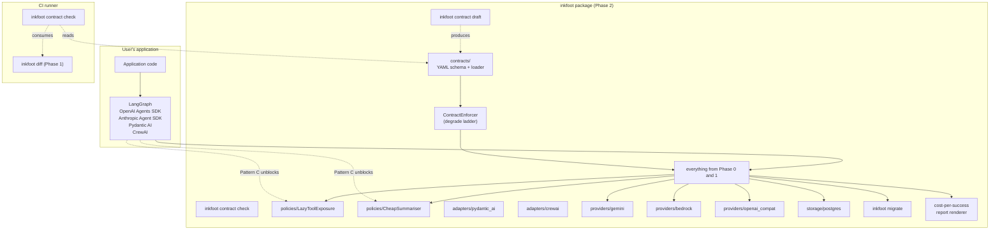

What's new vs Phase 1:

| New component | Responsibility |
|---|---|
| `contracts/` | YAML loader, schema validator, resolver |
| `ContractEnforcer` | Runtime evaluation of contract clauses against `RunContext` state; emits `contract_violation` events; triggers the `degrade` ladder |
| `inkfoot contract draft` | Generates a contract YAML from observed history (p95 + headroom) |
| `inkfoot contract check` | CI gate: load contracts + compare to a benchmark JSON; exit 2 on violation |
| `LazyToolExposure` | Modification policy; narrows the tools list per turn based on classifier output |
| `CheapSummariser` | Modification policy; intercepts oversized tool results; compresses via a per-provider cheap model |
| Pydantic AI / CrewAI adapters | Two more Pattern C adapters |
| Gemini / Bedrock / OpenAI-compat providers | The provider matrix expansion |
| Postgres backend + `inkfoot migrate` | Multi-process / multi-host installs |
| Cost-per-success report renderer | New columns in `inkfoot report`; the docs headline |

---

## 4. Components — detailed design

### 4.1 Token Contracts — YAML schema

The contract DSL stays narrow on purpose. The grammar:

```yaml
# .inkfoot/contracts/customer-support-triage.yaml
schema_version: 1
task: customer-support-triage

# Budget clauses — evaluated per-run.
budget:
  max_nanodollars: 50_000_000            # $0.05
  max_llm_calls: 8
  max_tool_result_tokens: 1500
  cache_hit_rate_min: 0.70
  max_run_duration_seconds: 30

# Outcome clauses — evaluated across a window of runs.
outcome:
  required_success_rate: 0.95
  measure_window_runs: 100               # most-recent N runs of this task

# Degrade ladder — actions at budget percentages.
degrade:
  - at_percent: 80
    action: warn
  - at_percent: 90
    action: switch_to_cheap_model
  - at_percent: 100
    action: block

# Optional per-tier overrides (resolved against the run's metadata.tenant_tier).
overrides:
  free_tier:
    budget:
      max_nanodollars: 10_000_000        # $0.01
```

The schema validator (Pydantic v2-based) catches typos, missing
fields, and impossible thresholds (e.g., `at_percent` outside 1–100;
a `switch_to_cheap_model` action when no cheap-model fallback is
configured) at load time.

**Resolution order** when a run lacks a per-tier override:

1. `overrides.<tier>.<field>` if the run's metadata names a matching
   tier.
2. `<field>` at the top level.
3. Default (the field doesn't apply to this run).

**Where contracts live.** A contract file is loaded by:

- `inkfoot.instrument(contracts=["./contracts/triage.yaml"])` at
  init time, or
- A directory passed via `INKFOOT_CONTRACTS_DIR` env var, or
- `inkfoot contract check` reading from `.inkfoot/contracts/*.yaml`
  in CI.

The architecture deliberately stays file-based (Git-versioned)
rather than database-stored. The contract is **code**.

### 4.2 `ContractEnforcer` — runtime

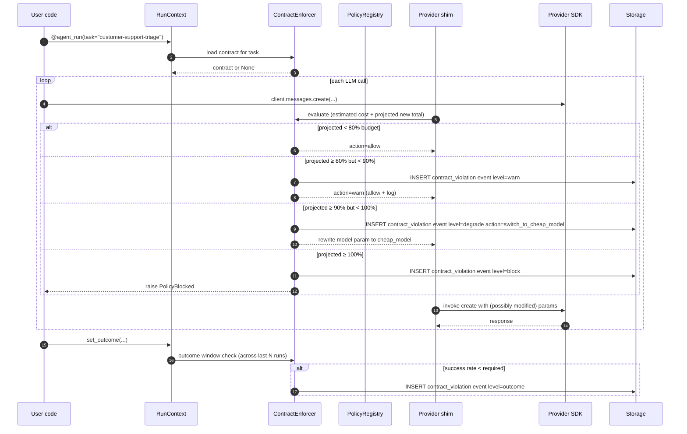

The degrade ladder is **deterministic** — each contract specifies
the action at each percentage; the enforcer never improvises.
Actions:

| Action | What happens |
|---|---|
| `warn` | Log + `contract_violation` event with `level=warn`. Call proceeds unmodified. |
| `switch_to_cheap_model` | The `model` kwarg is rewritten to the contract's `cheap_model` (or the provider's `CAPABILITIES.cheap_model_for_summariser` if none specified). `level=degrade` event recorded. |
| `block` | Raise `PolicyBlocked` from the shim. `level=block` event recorded. |

**Cost estimation for the projected-spend check.** Before each call,
the enforcer needs to estimate "what will this call cost?" without
making it. The estimator:

1. Tokenises the request's messages + tools.
2. Multiplies by the model's input price.
3. Estimates output tokens by the moving average across recent runs
   of the same task, defaulting to 500 if no history.

Estimation is intentionally pessimistic-by-default; better to warn
slightly too early than to miss a budget.

### 4.3 `inkfoot contract draft`

Writing contracts from scratch is hard. The draft command produces a
starting point from observed history:

```
$ inkfoot contract draft --task customer-support-triage --window 30d --output ./contracts/triage.yaml

  Analysing 412 runs of task 'customer-support-triage' over 30 days...

  Suggested contract:
    budget:
      max_nanodollars: 41_000_000      # p95 + 10% headroom
      max_llm_calls: 6                  # p99 + 1
      max_tool_result_tokens: 1_200     # observed p95
      cache_hit_rate_min: 0.72          # observed p25
      max_run_duration_seconds: 28      # p95 + 10%
    outcome:
      required_success_rate: 0.93       # observed minus 1pp tolerance
      measure_window_runs: 100

  Outliers above budget: 3 runs (0.7%)
  See: inkfoot report --task customer-support-triage --above-budget

  Written to ./contracts/triage.yaml
```

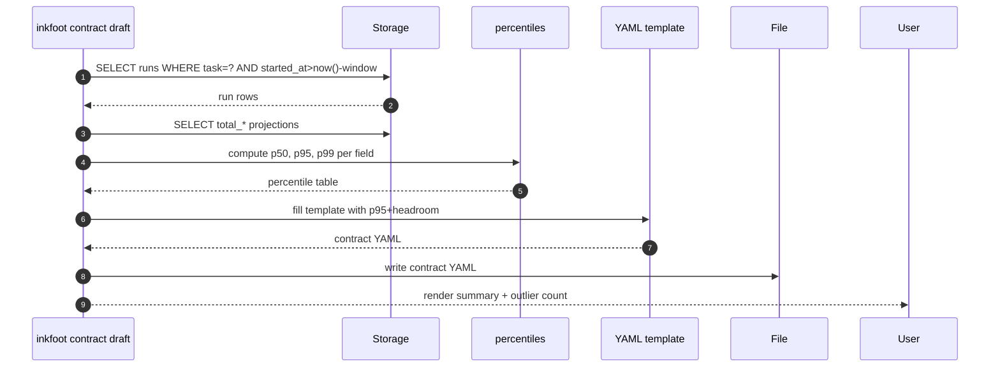

**Draft, not commit.** The output is a starting point; humans edit
before committing. The docs make this clear.

### 4.4 `inkfoot contract check` (CI gate)

Composes with the Phase-1 `inkfoot diff`. In CI:

```bash
inkfoot benchmark ./tests/agent_scenarios --output current.json
inkfoot contract check ./contracts/ --against current.json
inkfoot diff baseline.json current.json
```

`contract check` reads every contract file in the directory, finds
the matching benchmark scenario by task name, and evaluates the
contract's budget clauses against the benchmark's per-scenario
stats. Output:

```
$ inkfoot contract check ./contracts/ --against current.json

  Contract: customer-support-triage
    budget.max_nanodollars:    41_000_000 → measured p95 38_400_000 OK
    budget.max_llm_calls:               6 → measured p95 5.2 OK
    budget.cache_hit_rate_min:       0.72 → measured 0.47 ❌
    budget.max_run_duration_seconds:   28 → measured 22.1 OK

  Contract: email-summary
    [all clauses OK]

  Verdict: 1 contract violated. CI exit code: 2.
```

Exit-code contract:

- `0` — all contracts met.
- `1` — soft warnings (clause at 90%+ of threshold but not over).
- `2` — at least one contract violated.

The CI integration is: `inkfoot diff` flags PR-level regressions
against baseline; `inkfoot contract check` flags absolute violations
of the team-agreed contract. Both can fail the build; the second is
the harder gate.

#### 4.4.1 What `contract check` evaluates — and what it doesn't

The CI gate evaluates **budget clauses** against benchmark stats:
`max_nanodollars`, `max_llm_calls`, `max_tool_result_tokens`,
`cache_hit_rate_min`, `max_run_duration_seconds`.

The **outcome clauses** (`required_success_rate`,
`measure_window_runs`) are declared in the YAML but are **advisory
in Phase 2 CI** — the gate does not fail the build on outcome
shortfall. Reason: a benchmark scenario doesn't measure outcome
quality the same way production does (the scenario's
`expected_outcome` is hand-set; production outcomes come from
`set_outcome()` calls inside real agents). Treating outcome shortfall
as a CI failure would either rubber-stamp every benchmark or punish
PRs for unrelated quality drift.

Where outcomes *are* checked:

| Surface | Check | Action |
|---|---|---|
| CI (`inkfoot contract check`) | Outcome clauses parsed; surfaced as **advisory** in the report | Never fails build |
| Runtime | Outcome clauses evaluated over the trailing window (`measure_window_runs`) per task | Emits `contract_violation` event (`level=outcome`); never blocks the run |
| Reports (`inkfoot report`) | Surfaces tasks whose recent outcome rate is below contract floor | Visible alert in the dashboard / CLI |

True outcome enforcement (paired before/after benchmark runs with
quality scoring) requires deeper test infrastructure than Phase 2
ships; flagged in §14 as an open question and tracked for Phase 4+.
The YAML field exists from Phase 2 so contracts are forward-stable.

### 4.5 `LazyToolExposure` — modification policy

Today's loops typically expose every enabled tool on every turn. For
a 5-tool agent that's ~3000 tokens of tool definitions sent every
turn. `LazyToolExposure(stale_after_turns=N)` narrows the exposed
tool set per turn based on a small classifier:

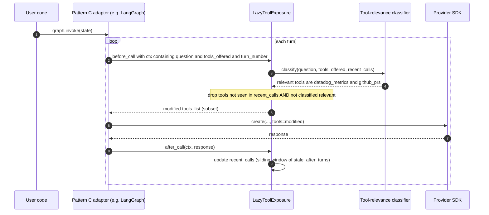

**The classifier** is heuristic in Phase 2:

- Tools called in the most recent `stale_after_turns` turns are
  always kept.
- Tools whose names appear in the user's question are kept.
- Tools tagged as `core` in the framework adapter's metadata are
  always kept.
- Everything else is dropped from the current turn's tools list.

When the model needs a dropped tool, it gracefully says so ("I'd
need to look up X but don't see that tool available"); the next
turn's classifier sees that signal in the assistant text and
restores the tool. The policy keeps a stale-after-N moving window
so the tool isn't immediately re-dropped.

**Why this is Pattern C-only.** Pattern A (monkey-patched SDK)
cannot reliably mutate the `tools` kwarg on the create call — the
agent's loop may have cached the tools list earlier. Pattern C
(framework adapter) has the framework's tool registry in hand.

### 4.6 `CheapSummariser` — modification policy

Oversized tool results live forever in conversation history (they're
sent to the model every subsequent turn). `CheapSummariser` intercepts
results above a token threshold and replaces them with a compressed
summary produced by the provider's cheap model:

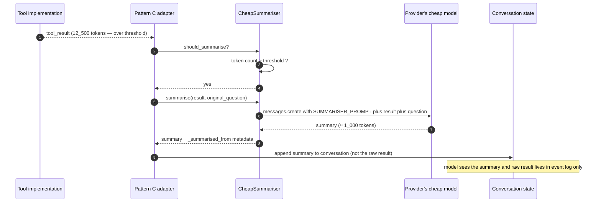

`CheapSummariser(threshold_tokens=1500, max_summary_tokens=600,
preserve_for_replay=True)`:

| Knob | Meaning |
|---|---|
| `threshold_tokens` | Tool results below this size pass through unchanged |
| `max_summary_tokens` | Upper bound on the summariser's output |
| `preserve_for_replay` | When `True`, the raw result is still stored in `events.payload_json` for future Phase-3 replay; the LLM sees only the summary |

**Provider-cheap-model routing.** Phase 0's `Capabilities` matrix
declares each provider's cheap model:

| Provider | Cheap model |
|---|---|
| Anthropic | `claude-haiku-4-5` |
| OpenAI | `gpt-4o-mini` |
| Gemini | `gemini-1.5-flash` |
| Bedrock | `meta.llama-3.2-3b-instruct` (or model-family-appropriate) |
| OpenAI-compat | configurable per-`base_url` |

The summariser uses the *same provider as the active investigation*
to avoid credential proliferation. If the provider has no cheap-model
declared, `CheapSummariser` falls back to mechanical truncation
(first N tokens + marker).

#### 4.6.1 A/B mode — the trust mechanism

`CheapSummariser` modifies what the model sees mid-run. The risk is
real: a bad summary causes downstream quality regression that
shouldn't be invisible. Phase 2 ships an **A/B mode** as the
opt-in trust mechanism:

```python
CheapSummariser(
    threshold_tokens=1500,
    max_summary_tokens=600,
    preserve_for_replay=True,
    ab_mode=True,                   # NEW — opt-in for the first month per task
    ab_sample_rate=0.10,            # 10% of triggers run both branches
)
```

When `ab_mode=True`, on each summarisation decision the policy:

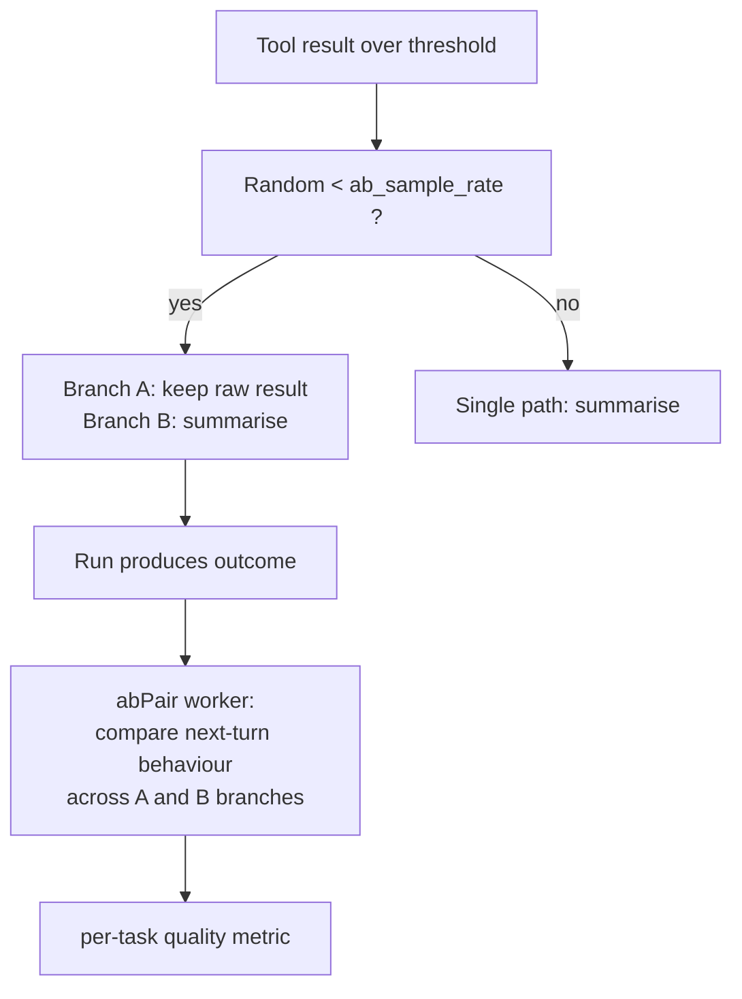

The A/B comparison metric: across paired A/B runs of the same task,
does the summarised branch (B) reach the same outcome (success rate,
quality_score) within tolerance? When the gap exceeds the
per-tenant threshold (default 5pp success-rate drop), the policy
fires a `summariser_quality_regression` smell and auto-disables
itself for that task pending operator review.

The kill-switch is per-task config: a task can opt out of
`CheapSummariser` via `inkfoot.tag("disable_summariser", True)` or
via a tenant-config flag. Documented in the operator guide.

This sub-section was previously only mentioned in the §10 risk row;
it's now first-class because the modification-policy promise of
Phase 2 ("policies actually modify") depends on customer trust in
the modification quality.

### 4.7 Provider expansion

The `LLMProvider` interface (sketched in Phase 0's architecture) gains
three concrete classes in Phase 2.

#### 4.7.1 `GeminiProvider`

Uses `google-generativeai`. Capability declaration:

```python
class GeminiProvider(LLMProvider):
    PROVIDER_TYPE = "gemini"
    DEFAULT_MODEL = "gemini-1.5-pro"
    CAPABILITIES = Capabilities(
        supports_tool_use=True,
        supports_image_input=True,
        supports_document_block=True,
        supports_prompt_cache=True,
        prompt_cache_style="cache_resource",
        cache_read_price_ratio=0.25,
        cache_write_price_ratio=1.0,
        supports_response_format_json=True,
        cheap_model_for_summariser="gemini-1.5-flash",
    )

    def map_usage(self, raw): ...    # gemini's usageMetadata → TokenUsage
```

Gemini's `cache_resource` style (`CachedContent` API objects) is
different from Anthropic's marker-based caching. Phase 0's
`CacheControlPlacer` policy is provider-aware: on Gemini it
creates/reuses cache resources; on Anthropic it places markers; on
OpenAI it does nothing (caching is automatic).

**How Gemini's cache semantics map to the Phase-0 ledger fields.** The
ledger fields `cache_creation_tokens` and `cache_read_tokens` were
designed against Anthropic's per-call cache-write / cache-read
billing. Gemini's model is different:

- **First call** that creates a `CachedContent` resource: the
  request body costs the full input price; Gemini also returns the
  cached-portion size separately as `cachedContentTokenCount`. We
  attribute the cached-portion to `cache_creation_tokens` (a
  one-time write) and the remainder to the matching cause categories
  (`system_static_tokens`, etc.).
- **Subsequent calls** referencing the cached resource: the cached
  portion is billed at the cache-read price; we attribute its tokens
  to `cache_read_tokens`. The non-cached parts of the request go
  to the relevant cause categories as usual.
- **Cache resource lifetime billing.** Gemini also charges per-hour
  for stored cache resources (a small ambient cost). This is
  cache-resource-only, not per-call, so it doesn't appear in the
  per-call ledger; it lands as a separate `cache_resource_overhead`
  line in the Phase-3 reconciliation report.

The capability matrix records this for callers that care, but the
**reporting and smells layer treats all three providers uniformly**
via the neutral `cache_*_tokens` fields. A future provider whose
caching model doesn't fit (token-banded? subscription-based?) would
extend `Capabilities.prompt_cache_style` with a new enum value and
adjust the mapping; the ledger fields themselves stay stable.

#### 4.7.2 `BedrockProvider`

Uses `boto3` against the Bedrock Converse API. One class covers
Claude, Llama, Titan, Mistral, Cohere on AWS:

```python
class BedrockProvider(LLMProvider):
    PROVIDER_TYPE = "bedrock"
    DEFAULT_MODEL = "anthropic.claude-3-5-sonnet-20241022-v2:0"

    # Capabilities depend on the underlying model family
    def get_capabilities(self) -> Capabilities:
        return _BEDROCK_MODEL_CAPS[self._model_family()]
```

`_BEDROCK_MODEL_CAPS` is a dict keyed by model-family prefix:

| Family prefix | Caching | Document blocks |
|---|---|---|
| `anthropic.` | explicit markers | yes |
| `meta.llama` | none | no |
| `amazon.titan` | none | no |
| `mistral.` | none | no |
| `cohere.` | none | no |

#### 4.7.3 `OpenAICompatProvider`

The long-tail unlocker. One class for vLLM, Together, Fireworks,
Anyscale, DeepInfra, Groq, LM Studio, Cerebras, Ollama, and any
future endpoint that accepts OpenAI Chat Completions requests:

```python
class OpenAICompatProvider(LLMProvider):
    PROVIDER_TYPE = "openai_compat"

    def __init__(self, *, credentials, model, base_url, capabilities=None):
        self._base_url = base_url
        self._caps = capabilities or _conservative_compat_caps()
```

`_conservative_compat_caps()` returns:

```python
Capabilities(
    supports_tool_use=True,
    supports_image_input=False,
    supports_document_block=False,
    supports_prompt_cache=False,
    prompt_cache_style="none",
    cache_read_price_ratio=1.0,
    cache_write_price_ratio=1.0,
    supports_response_format_json=False,
    cheap_model_for_summariser=None,  # fall back to truncation
)
```

Operators override per-`base_url` in config when they know better
(e.g., Together.AI's `together.xai-grok-3` has tool use; Cerebras
doesn't have caching).

### 4.8 Pydantic AI + CrewAI adapters

Two more Pattern C adapters. Internals mirror Phase 1's LangGraph
and OpenAI Agents SDK adapters: detect framework structure (Pydantic
AI's `Agent` class; CrewAI's `Crew` + `Agent` + `Task`); wrap entry
points; emit framework-native event metadata.

The contract-test harness from Phase 1 extends to cover the two new
adapters automatically; no new test infrastructure.

### 4.9 Postgres storage backend

Same schema as SQLite; same `Storage` Protocol. The migration path:

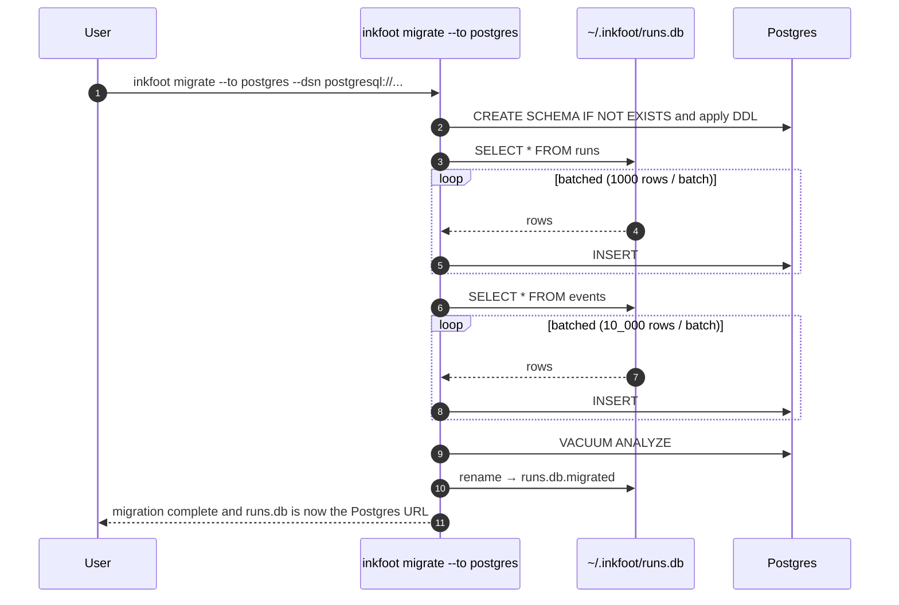

The aggregator worker is now a **separate process** when storage is
Postgres (multi-process safe). Coordination via PG advisory locks:
the aggregator holds `pg_advisory_lock(hash('inkfoot_aggregator'))`
for the duration of a sweep; multiple processes contending see one
sweeper, others wait.

### 4.10 Cost-per-success report renderer

The Phase 0 captured outcome; Phase 1 stored it; Phase 2 promotes
**cost-per-success** to the headline metric:

```
$ inkfoot report --last 30d --group-by task

  task                          runs   avg_$    p95_$    success%  cost/success
  customer-support-triage        412   $0.041   $0.083    93.2%    $0.044
  email-summary                  138   $0.083   $0.291    97.1%    $0.085
  pricing-research                22   $0.412   $1.180    81.8%    $0.504
                                                                     ^^^^^^
                                                                     headline
```

The docs and marketing surface **cost-per-success** as *the* number
to track. Raw cost without outcome is misleading; raw success rate
without cost is incomplete. The product's job is to surface both
together.

Reports also gain "uninstrumented-outcome" buckets — runs with no
`set_outcome` call appear as a separate row so the team can see how
much of their data is in the dark.

### 4.11 Five additional cost smells

| Smell ID | Trigger | Recommendation | Suggested policy |
|---|---|---|---|
| `tool-schema-drift` | Tool schema fingerprint changes mid-run | Stabilise tool ordering; avoid mid-run tool additions | `LazyToolExposure` with reset-on-detection |
| `cost-skewed-by-outlier` | A single run is > 10× p50 of its task | Investigate outlier; possibly enforce `BudgetCap` | `BudgetCap` |
| `unbounded-conversation-history` | Run carries > 50k tokens of memory | Add memory compression; truncate older turns | (manual) |
| `over-instrumented-retries` | SDK retries firing > 3× per call on average | Tune backoff; circuit-break upstream | `RetryThrottle` |
| `summariser-not-firing` | Tool result tokens consistently > 2k but no summariser configured | Enable `CheapSummariser(threshold_tokens=1500)` | `CheapSummariser` |

The data sources for these were Phase 0's internal corpus and
Phase 1's broader corpus from early external users; that's the
honest validation that they're worth shipping.

---

## 5. Module structure delta

```
inkfoot/
├── ... (Phase 0 + 1 unchanged) ...
├── contracts/
│   ├── __init__.py
│   ├── schema.py               # Pydantic models
│   ├── loader.py               # YAML reader, schema validator
│   ├── enforcer.py             # ContractEnforcer (runtime)
│   ├── draft.py                # inkfoot contract draft
│   └── check.py                # inkfoot contract check
├── policy/
│   ├── ... (Phase 0 entries unchanged) ...
│   ├── lazy_tool_exposure.py   # LazyToolExposure
│   └── cheap_summariser.py     # CheapSummariser
├── providers/
│   ├── __init__.py
│   ├── base.py                 # LLMProvider ABC + Capabilities
│   ├── anthropic.py            # refactor — Phase 0 shim → provider class
│   ├── openai.py               # ditto
│   ├── gemini.py
│   ├── bedrock.py
│   └── openai_compat.py
├── adapters/
│   ├── ... (Phase 1 entries unchanged) ...
│   ├── pydantic_ai.py
│   └── crewai.py
├── storage/
│   ├── ... (Phase 0 entries unchanged) ...
│   ├── postgres.py             # PostgresStorage
│   └── postgres_aggregator.py  # separate-process aggregator with advisory locks
├── smells/
│   ├── ... (Phase 0 entries unchanged) ...
│   ├── tool_schema_drift.py
│   ├── cost_skewed_by_outlier.py
│   ├── unbounded_conversation_history.py
│   ├── over_instrumented_retries.py
│   └── summariser_not_firing.py
├── reports/
│   ├── __init__.py
│   ├── cost_per_success.py     # the new headline renderer
│   └── tag_groupby.py          # tag-based slices
└── cli/
    ├── ... (Phase 0 + 1 entries unchanged) ...
    ├── contract.py             # contract draft / check
    └── migrate.py              # storage migration
```

The Phase-0 `shims/` directory's content moves into `providers/`
(now an LLM-provider abstraction, not just monkey-patches). The
provider abstraction was implicit in Phase 0; Phase 2 makes it
explicit because that's where the long tail of providers actually
lands.

---

## 6. Public API surface (Phase 2 additions)

```python
# Contracts
inkfoot.instrument(..., contracts=["path/to/contracts/"])
# or env: INKFOOT_CONTRACTS_DIR=...

# Modification policies
from inkfoot.policy import LazyToolExposure, CheapSummariser

# Provider-aware framework wiring (unchanged signature; new providers detected)
import inkfoot.langgraph
inkfoot.langgraph.instrument(graph)  # detects Gemini / Bedrock / compat automatically

# Provider override (rare; for OpenAI-compat)
from inkfoot.providers import OpenAICompatProvider
inkfoot.instrument(
    providers={"my-vllm": OpenAICompatProvider(
        credentials={"api_key": "..."},
        model="meta-llama/Llama-3.1-8B-Instruct",
        base_url="https://my-vllm.internal/v1",
        capabilities=Capabilities(supports_tool_use=True, ...),
    )},
)
```

CLI additions:

```
inkfoot contract draft --task NAME [--window 30d] [--output PATH]
inkfoot contract check [DIR] --against BENCHMARK.json
inkfoot migrate --to postgres --dsn DSN
inkfoot report --group-by tag.<NAME>
```

---

## 7. Critical end-to-end flows

### 7.1 Request blocked by contract

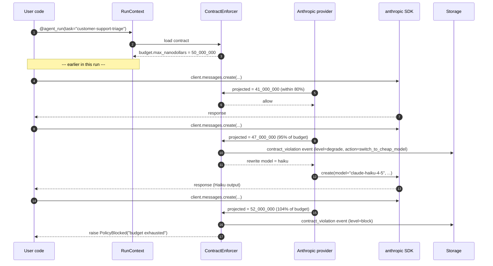

### 7.2 `LazyToolExposure` on a LangGraph node

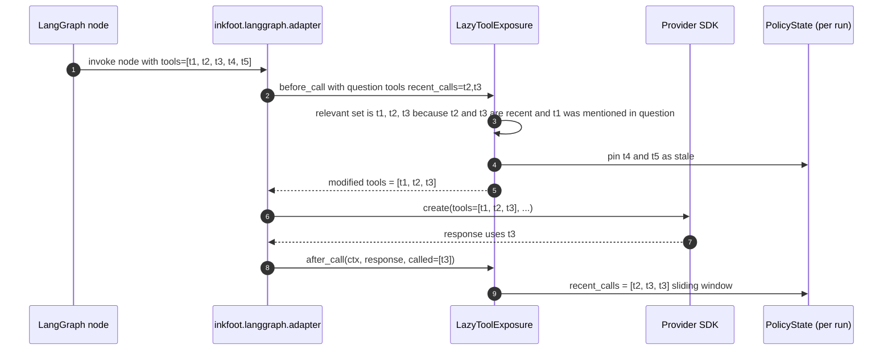

### 7.3 `CheapSummariser` intercepting a tool result

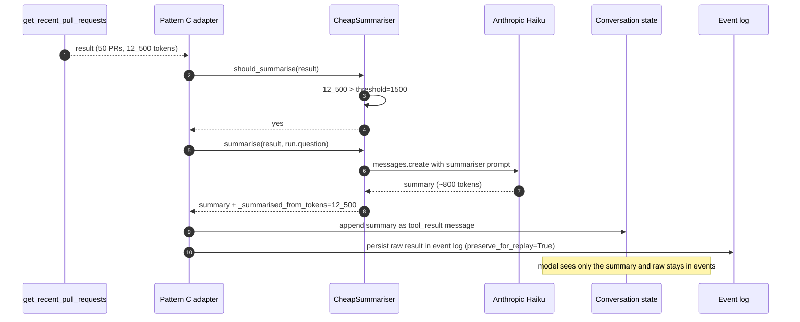

### 7.4 Contract check in CI

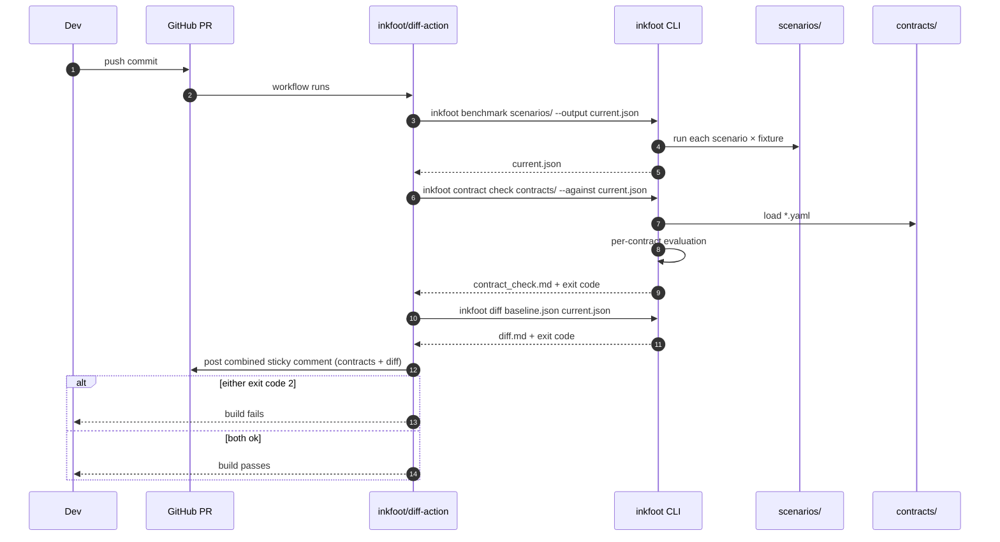

---

## 8. ADRs — Phase 2

### ADR-2-1: Token Contracts are YAML files in source control, not database records

**Status:** Accepted.
**Context:** Contracts could live in the application database, in a
config service, or in source control. Each has different invariants.
**Decision:** Contracts are YAML files in the application's source
control, loaded at instrument-time or via CLI. Treated as code.
**Alternatives considered:**
- *Database-stored.* Loses version history; hard to review in PRs;
  needs a separate UI.
- *Config service.* Premature complexity; introduces a runtime
  dependency.
**Consequences:** Contract changes go through PR review like any
code change. `inkfoot diff` can compare the *behaviour under* the
contracts of two commits.

### ADR-2-2: Schema versioning on every contract file

**Status:** Accepted.
**Decision:** Every contract YAML has `schema_version: N` at the
top. Inkfoot accepts the current and previous major schemas;
breaking changes get a 6-month deprecation window.
**Consequences:** Schema migrations are tracked in
`contracts/CHANGELOG.md` in the OSS repo; teams upgrade contracts
explicitly.

### ADR-2-3: Degrade ladder actions are a fixed enum

**Status:** Accepted.
**Context:** The degrade ladder could be free-form (arbitrary
callbacks) or a fixed enum.
**Decision:** **Fixed enum.** Actions are `warn`, `switch_to_cheap_model`,
`block`. Adding a new action requires a new schema version.
**Alternatives considered:**
- *Free-form Python callbacks.* Powerful but breaks the
  configuration-not-code property. The whole point of the contract
  is that it lives outside the application code.
- *Plugin system.* Defer until customer demand surfaces.
**Consequences:** Some use cases (e.g., "page on-call when over
budget") require a separate notification policy rather than a
contract-action. Acceptable.

### ADR-2-4: `LazyToolExposure` uses a heuristic classifier, not an LLM

**Status:** Accepted.
**Context:** The classifier could be heuristic (keyword + history)
or LLM-based (a small classification call before each turn).
**Decision:** Heuristic in Phase 2. LLM-based classification is a
Phase-4 follow-up if data warrants it.
**Why:** Phase 2 ships modification policies for the first time;
adding "another LLM call per turn" complicates the latency and cost
story. Heuristic is good-enough at the 80% level. LLM-classifier
upgrade is one swap.
**Consequences:** Some edge cases route incorrectly. Mitigation: the
policy keeps a stale-after-N window so a missed restoration recovers
on the next turn.

### ADR-2-5: `CheapSummariser` uses the same provider as the active investigation

**Status:** Accepted.
**Context:** The summariser could use a fixed cheap provider (e.g.,
always Anthropic Haiku) or the same provider as the main
investigation.
**Decision:** **Same provider, cheap model in that provider's family.**
**Alternatives considered:**
- *Fixed cheap provider (Anthropic Haiku regardless of main provider).*
  Pros: cheapest possible. Cons: forces two providers to be
  configured; complicates the credential model.
- *Per-policy provider override.* Power feature; deferred until
  asked.
**Consequences:** Providers without a `cheap_model_for_summariser`
fall back to mechanical truncation. The OpenAI-compat provider is
the common case; operators set the cheap model per-`base_url`.

### ADR-2-6: Aggregator worker is a separate process under Postgres

**Status:** Accepted.
**Context:** SQLite supports an in-process aggregator (Phase 0).
Postgres-backed deployments often run multiple processes (worker
pools); the aggregator can't be a thread in each one.
**Decision:** Under Postgres, the aggregator is a **separate
process** coordinated by Postgres advisory locks.
**Alternatives considered:**
- *Thread in every process (without locking).* Multiple aggregators
  doing the same work; harmless but wasteful and produces deadlock
  potential on the dirty-flag.
- *External cron triggered process.* Indirection for no benefit.
**Consequences:** Operators must run `inkfoot aggregator-worker` as
a separate process under Postgres mode. Documented in the migration
runbook.

### ADR-2-7: Contract overrides resolve by run metadata, not by user

**Status:** Accepted.
**Context:** Per-tier overrides need a way to know which tier a run
is in. Two ways: look up by user identity, or carry tier on the run.
**Decision:** **Carry on the run.** The application populates
`run.metadata["tenant_tier"]` (or similar) when starting the run;
the contract resolver reads that.
**Alternatives considered:**
- *User-table lookup.* Tightly couples to a user model we don't yet
  have (Phase 5).
**Consequences:** Until the user provides the tier metadata, all
runs resolve against top-level (default) contract clauses.

---

## 9. Cross-cutting concerns

### 9.1 Performance budgets (deltas)

| Operation | Budget (p95) |
|---|---|
| Contract evaluation (per call) | < 50 µs |
| `LazyToolExposure` classifier | < 100 µs |
| `CheapSummariser` LLM call | governed by the cheap model's latency (~0.5–1 s for Haiku); the policy is async-friendly |
| Postgres event insert | < 5 ms (p95, RDS-class hardware) |
| Postgres aggregator sweep (50 dirty runs) | < 200 ms |

### 9.2 Testing strategy

- **Contract loader tests** — Pydantic schema; positive + negative.
- **Enforcer tests** — synthesised RunContext; assert degrade ladder
  triggers correctly.
- **Modification-policy tests** — `LazyToolExposure` invariants
  (recent tools never dropped); `CheapSummariser` integration with
  a fake cheap model.
- **Provider contract tests** — same matrix as Phase 1, extended to
  Gemini + Bedrock + OpenAI-compat; live tests behind
  `@pytest.mark.live_<provider>`.
- **Postgres backend** — Docker-Compose Postgres; integration tests
  parameterised over SQLite vs Postgres.

### 9.3 Documentation

`inkfoot.dev` (from Phase 1) gains:

- A whole **"Token Contracts" guide** (the load-bearing new
  concept): authoring, draft-then-edit workflow, CI gating, per-tier
  overrides.
- A **modification-policies guide** with concrete examples per
  framework.
- **Provider matrix**: which features work with which provider × model.
- **Migration runbook**: SQLite → Postgres step-by-step.

### 9.4 Versioning

Phase 2 lands `1.1.x` (minor bump from Phase 1's `1.0`). The contract
schema is `schema_version: 1`. Breaking changes to the schema
require a `2.0` of the schema, not a major bump of the library.

---

## 10. Risks & mitigations

| Risk | Likelihood | Impact | Mitigation |
|---|---|---|---|
| **Contract DSL feature creep.** People will ask for arbitrary expressions, time-of-day budgets, per-customer overrides. | High | Medium | Strict schema; reject extensions in Phase 2; reconsider feature-by-feature in later phases with explicit ADRs |
| **Cost-per-success promotion exposes our outcome-tagging gap.** Most runs lack outcome tags → metric is undefined for most data. | Medium | Medium | Report surfaces uninstrumented-outcome runs as a separate bucket; docs prominently flag the requirement; helper `set_outcome_from_heuristic()` provided for common patterns |
| **`CheapSummariser` quality regression.** Bad summaries cost downstream accuracy. | Medium | Medium | Per-run summariser-quality metric; A/B mode that records both the summary and the raw next-turn behaviour; kill-switch flag |
| **Postgres backend introduces a write-race regression.** | Low | High | Two-tier write semantics from Phase 0 already anticipate this; aggregator is single-writer (PG advisory lock); fuzz tests run against multi-process workloads |
| **Provider matrix scope.** Five providers in one phase is ambitious. | Medium | Medium | OpenAICompatProvider covers ~50 backends in one class; only Anthropic + OpenAI + Bedrock + Gemini get direct integrations |
| **Schema-version churn.** Contracts get a v2 before customers have settled into v1. | Medium | Low | Six-month deprecation window per ADR-2-2; the loader accepts current + previous; CI lint catches stale schemas |
| **`LazyToolExposure` mis-routes critical tools.** Model can't find what it needs; loop stalls or fails. | Medium | High | Stale-after-N restoration window; metric on "tool restored after exclusion" rate; explicit `core` tag for tools that must never be dropped |

---

## 11. Definition of done

- [ ] Token Contracts work end-to-end: YAML → runtime enforcement
      → CI gate.
- [ ] All Phase-2 framework adapters (LangGraph, OpenAI Agents SDK,
      Anthropic Agent SDK, Pydantic AI, CrewAI) pass the
      contract-test harness against real LLM APIs (CI weekly).
- [ ] All Phase-2 provider implementations (Gemini, Bedrock,
      OpenAI-compat) pass the contract-test harness.
- [ ] `LazyToolExposure` and `CheapSummariser` work end-to-end via
      framework adapters; refuse cleanly on Pattern A.
- [ ] Cost-per-success appears in `inkfoot report` and is the
      promoted headline number in docs.
- [ ] At least **10 external users** have starred *and* opened a
      real issue or PR.
- [ ] Postgres backend has a migration path with documented
      runbook; SQLite → Postgres migration tested on a 100k-event
      corpus.
- [ ] `inkfoot contract draft` produces a sensible draft from a
      real-world fixture (≥ 100-run history).
- [ ] CI in this repo includes `inkfoot contract check` as a
      required gate.

## 12. Go/no-go signal — Phase 2 → Phase 3

Phase 2 → Phase 3 at the 8-week mark post-launch if **all three** of:

- ≥ 2000 GitHub stars, **AND**
- ≥ 50 weekly active installs (PyPI estimate), **AND**
- ≥ 1 company has emailed asking about commercial options.

If only two of three: slow-roll Phase 3; deepen Phase 2. The Cloud
bet is premature without the OSS retention signal.

If none or one: stop and reshape. Cloud built for an OSS user base
that doesn't exist is the canonical OSS-to-SaaS failure mode.

## 13. Suggested epic breakdown — prefix `EN`

| Epic | Title |
|---|---|
| **EN1** | Token Contract YAML schema + parser + validation |
| **EN2** | Runtime contract enforcement + degrade ladder |
| **EN3** | `inkfoot contract draft` |
| **EN4** | `inkfoot contract check` CI gate + integration with `inkfoot diff` |
| **EN5** | `LazyToolExposure` (Pattern C only; heuristic classifier) |
| **EN6** | `CheapSummariser` (Pattern C only; provider-cheap-model routing) |
| **EN7** | Pydantic AI framework adapter |
| **EN8** | CrewAI framework adapter |
| **EN9** | Gemini provider (translator + `cache_resource` cache style) |
| **EN10** | AWS Bedrock provider (Converse API; multi-model family) |
| **EN11** | OpenAI-compatible provider (one class; per-`base_url` capability overrides) |
| **EN12** | Postgres storage backend + `inkfoot migrate --to postgres` |
| **EN13** | Five additional cost smells |
| **EN14** | Cost-per-success report promotion (new columns; uninstrumented bucket; docs update) |
| ~~**EN15**~~ | ~~`inkfoot tail` live event tail~~ — **shipped in Phase 1 as EX15** (see phase-1-explain §"Suggested epic breakdown"); listed here for the original numbering only and **not** delivered again in Phase 2. |
| **EN16** | Provider abstraction refactor (Phase 0's shims become formal provider classes) |

EN1 + EN2 + EN3 + EN4 are the contracts critical path. EN5 + EN6
unlock the modification-policy promise from Phase 1. EN9 + EN10 +
EN11 expand the provider matrix. EN12 + EN14 are the
single-developer-readable wins.

## 14. Open questions

- **Should contracts be per-task or per-(task, tenant)?** Phase 2:
  per-task at the file level; tenant overrides resolve by metadata
  (ADR-2-7). When IAM lands in Phase 5, tenants become first-class
  but the schema doesn't change.
- **`switch_to_cheap_model` on a provider with no obvious cheap
  family member (e.g., Bedrock-Mistral).** Decision: fall through
  to `block`; surface a clear log line; document the fallback path.
- **`inkfoot contract draft` and adversarial history.** If the
  observed history was already abnormal, the draft inherits the
  abnormality. Mitigation: surface the source window prominently;
  suggest narrower windows for noisy datasets.
- **Postgres backend default vs SQLite default.** Phase 2 keeps
  SQLite as the default (zero-config local). Phase 3 Cloud forces
  Postgres. Self-hosted-OSS-but-Postgres-backed users are the
  middle ground; documented as the recommendation for any
  multi-process deployment.
- **Contract schema extension policy.** Six-month deprecation
  window is the published policy; whether to accept community PRs
  extending the schema before Phase 4's community phase is an open
  question.
