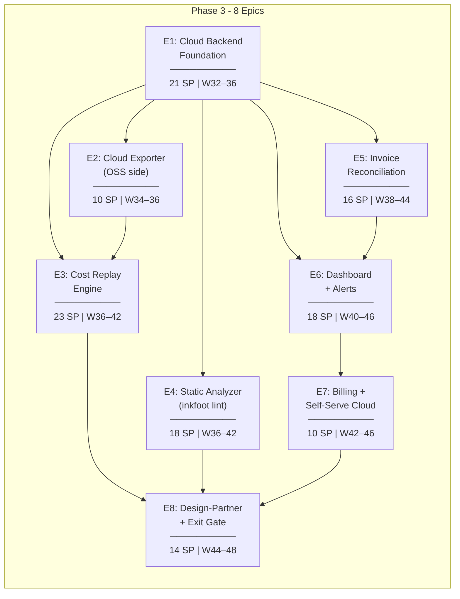
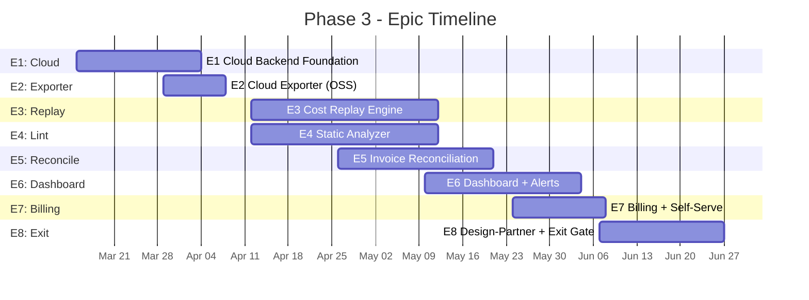
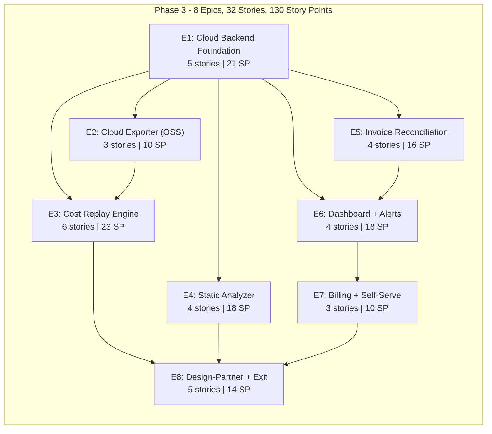

# Inkfoot — Phase 3: Development Epics

> **Phase:** 3 — Prove
> **Theme:** Prove savings against outcome quality and provider invoices. Build a business.
> **Timeline:** Weeks 32–48 (80 working days)
> **Total Story Points:** 130
> **Document Version:** 1.0
> **Last Updated:** 2026-05-25
> **Builds On:** `inkfoot_phase2_development_epics.md` v1.0
> **Aligned With:** `phase-3-prove.md`
>
> **Outcome gate:** entered only after Phase 2 go-signal. Cloud beta with
> 5–10 design partners, at least one paying customer, three USPs shipped
> (Replay Engine, static analyzer, invoice reconciliation). Phase 3 →
> Phase 4 go/no-go at phase exit on paying-customer count + ARR + testimonials.

---

## Epic Overview

---

## Story Point Scale

| Points | Effort |
|---|---|
| 1 | Trivial (< 1 hour) |
| 2 | Small (1–3 hours) |
| 3 | Medium (3–6 hours) |
| 5 | Large (1–1.5 days) |
| 8 | XL (1.5–2.5 days) |
| 13 | XXL (3–4 days) |

---

## E1: Cloud Backend Foundation

**Goal:** Stand up the Cloud — ingestion service, Postgres with tenancy, Redis broker, workers, customer-credential vault (KMS), per-tenant API-key authentication. After this epic, OSS events can flow to Cloud and be queried back.

**Total Story Points:** 21
**Sprint:** Week 32–36 (Days 1–20)
**Dependencies:** Phase 2 (Postgres backend pattern, provider abstraction)

---

### E1-S1: New Repo + Cloud Service Skeleton

**Story:** As the Cloud codebase, I need a separate `inkfoot-cloud` repo with FastAPI + Postgres + Redis service skeleton.

**Story Points:** 3

**Tasks:**

| # | Task | File(s) | Details |
|---|---|---|---|
| T1 | New repo bootstrap | `inkfoot-cloud/` | FastAPI app + pyproject + Dockerfile + docker-compose for local dev (Postgres + Redis). |
| T2 | Health endpoint | `inkfoot-cloud/api/health.py` | `GET /health` returns DB + Redis status. |
| T3 | OpenAPI doc | `inkfoot-cloud/api/__init__.py` | Auto-generated `/docs` via FastAPI. |
| T4 | CI pipeline | `inkfoot-cloud/.github/workflows/ci.yml` | Test on Python 3.11/3.12; testcontainers PG + Redis. |

**Acceptance Criteria:**
- [ ] `docker compose up -d` brings up Cloud + dependencies locally.
- [ ] `GET /health` returns 200 with both subsystems "ok".

---

### E1-S2: Cloud Postgres Schema + Tenancy

**Story:** As Cloud Postgres, I need the schema from phase-3-prove §4.3 — tenants, api_keys, customer_credentials, alerts, reconciliations — plus tenant_id on the OSS-shared `runs` / `events`.

**Story Points:** 5

**Tasks:**

| # | Task | File(s) | Details |
|---|---|---|---|
| T1 | Alembic baseline | `inkfoot-cloud/alembic/versions/0001_initial.py` | Tenants + api_keys + customer_credentials + reconciliations + alerts. |
| T2 | Extend `runs` + `events` with `tenant_id` | `inkfoot-cloud/alembic/versions/0001_initial.py` | NOT NULL `tenant_id` FK; index `(tenant_id, created_at DESC)` on runs. |
| T3 | App-code scoping | `inkfoot-cloud/db/scope.py` | Helper `scope_tenant(query, tenant_id)` that every query passes through; type-checked. |
| T4 | RLS deferred to Phase 5 | (doc note) | Phase 3 enforces in app code (ADR-3-5); Phase 5 adds Postgres RLS as defense-in-depth. |
| T5 | Tests | `tests/integration/test_cloud_schema.py` | testcontainer Postgres; migration up/down clean; tenant scoping correct. |

**Acceptance Criteria:**
- [ ] All tables exist with documented indexes.
- [ ] `scope_tenant` applies a `WHERE tenant_id = ?` clause to every query.

---

### E1-S3: Ingestion Service + Redis Broker

**Story:** As the ingest path, I need `POST /api/v1/events` to validate, authenticate, and enqueue events to Redis for async writes to Postgres.

**Story Points:** 5

**Tasks:**

| # | Task | File(s) | Details |
|---|---|---|---|
| T1 | `POST /api/v1/events` | `inkfoot-cloud/api/ingest.py` | Accepts JSONL batches; validates `schema_version`; enforces per-tenant rate limit. |
| T2 | API key auth | `inkfoot-cloud/auth/api_key.py` | `Authorization: Bearer tw_live_<...>`. Tenant ID encoded in key prefix; secret SHA-256 + pepper. |
| T3 | Redis enqueue | `inkfoot-cloud/queue/redis_broker.py` | `LPUSH` per-tenant key; bounded queue with overflow alarm. |
| T4 | Ingestion worker | `inkfoot-cloud/workers/ingestion.py` | Consumes Redis, writes to Postgres in batches of 500. Dead-letter on validation failure. |
| T5 | Tests | `tests/integration/test_ingest.py` | testcontainer PG + Redis; batch round-trip; dead-letter for bad batches. |

**Acceptance Criteria:**
- [ ] `POST /api/v1/events` with valid auth returns 202 with `events_accepted=N`.
- [ ] Median ingest latency < 100 ms (excluding network).
- [ ] Malformed batch → 422 with detail; ingestion worker dead-letters it.

---

### E1-S4: Customer Credential Vault (Envelope Encryption + KMS)

**Story:** As the secure-storage layer, I need per-tenant DEK + KMS-wrapped envelope encryption per phase-3-prove §4.4.4 + ADR-3-4.

**Story Points:** 5

**Tasks:**

| # | Task | File(s) | Details |
|---|---|---|---|
| T1 | KMS client | `inkfoot-cloud/vault/kms_client.py` | Pluggable backend (AWS KMS in Phase 3; Azure Key Vault + GCP KMS interfaces lay for Phase 5). |
| T2 | Per-tenant DEK generation | `inkfoot-cloud/vault/encrypt.py` | On tenant creation, generate DEK; wrap via KMS; persist `wrapped_dek`. |
| T3 | Encrypt-on-write / decrypt-on-replay | `inkfoot-cloud/vault/encrypt.py` | AES-GCM with the unwrapped DEK; decrypt only at replay start, zero from RAM at end. |
| T4 | Per-tenant audit log | `inkfoot-cloud/vault/audit.py` | Every decrypt logged: timestamp, replay_id, requesting worker; visible to the tenant in dashboard. |
| T5 | `POST /api/v1/credentials` | `inkfoot-cloud/api/credentials.py` | Store provider credentials; encrypted server-side; return only an opaque handle. |
| T6 | Tests | `tests/integration/test_vault.py` | Round-trip encrypt + decrypt; KMS unavailable → write fails atomically (no half-encrypted row). |

**Acceptance Criteria:**
- [ ] Stored credentials are unreadable without KMS access.
- [ ] Per-decrypt audit log visible in the dashboard.
- [ ] KMS-unreachable write fails before persistence.

---

### E1-S5: Query API + Pagination

**Story:** As the dashboard frontend, I need the per-tenant query API for runs + events + aggregates.

**Story Points:** 3

**Tasks:**

| # | Task | File(s) | Details |
|---|---|---|---|
| T1 | `GET /api/v1/runs` | `inkfoot-cloud/api/runs.py` | Paginated; per-tenant scope; filters by task, status, time window. |
| T2 | `GET /api/v1/runs/{id}` | `inkfoot-cloud/api/runs.py` | Full detail incl. ledger totals + smells. |
| T3 | `GET /api/v1/runs/{id}/events` | `inkfoot-cloud/api/runs.py` | Event timeline. |
| T4 | `GET /api/v1/aggregates` | `inkfoot-cloud/api/aggregates.py` | Time-series + group-by (task, model, tag). |
| T5 | Tests | `tests/integration/test_query_api.py` | Pagination, scoping, time-window. |

**Acceptance Criteria:**
- [ ] `GET /api/v1/runs?limit=50` honors pagination via `next_cursor`.
- [ ] Cross-tenant data leak attempts are blocked at app-code scoping.
- [ ] p95 query latency < 500 ms on a 100k-event corpus.

---

## E2: Cloud Exporter (OSS Side)

**Goal:** OSS library gains a background CloudExporter that batches events and POSTs to Cloud Ingest. Fails open, never blocks the agent thread.

**Total Story Points:** 10
**Sprint:** Week 34–36 (Days 15–25)
**Dependencies:** E1-S3 (ingest endpoint exists)

---

### E2-S1: Background Daemon Thread + Bounded Queue

**Story:** As the OSS library, I need a daemon thread that batches events and uploads to Cloud without ever blocking the agent.

**Story Points:** 5

**Tasks:**

| # | Task | File(s) | Details |
|---|---|---|---|
| T1 | `CloudExporter` class | `inkfoot/cloud_exporter/thread.py` | Daemon thread; flush every 5s or 100 events. |
| T2 | Bounded queue | `inkfoot/cloud_exporter/queue.py` | Max 10k events; overflow drops oldest + emits metric. |
| T3 | Batch format | `inkfoot/cloud_exporter/batch.py` | JSONL with `schema_version` header. |
| T4 | Fail-open semantics | `inkfoot/cloud_exporter/thread.py` | Cloud unreachable → events stay in local storage; resume from `last_uploaded_seq` on recovery. |
| T5 | Unit tests | `tests/unit/test_cloud_exporter.py` | Never blocks producer; overflow drops correctly; resume from sequence. |

**Acceptance Criteria:**
- [ ] Producer-side latency unaffected even when Cloud is unreachable for 5 minutes.
- [ ] Overflow metric increments when queue exceeds 10k.
- [ ] After Cloud recovers, queued events upload successfully.

---

### E2-S2: Auth + Retry/Backoff

**Story:** As the exporter, I need API-key auth + exponential backoff on transient failures + dead-letter handling on permanent failures.

**Story Points:** 3

**Tasks:**

| # | Task | File(s) | Details |
|---|---|---|---|
| T1 | API-key config | `inkfoot/instrument.py` | `inkfoot.instrument(cloud_api_key="tw_...")`. |
| T2 | Backoff on 5xx / network | `inkfoot/cloud_exporter/thread.py` | Exponential backoff to 60s ceiling; never blocks producer. |
| T3 | Dead-letter on 4xx | `inkfoot/cloud_exporter/thread.py` | Log + drop batch; surface in `inkfoot report`. |
| T4 | Tests | `tests/unit/test_cloud_exporter_retry.py` | 5xx triggers retry; 4xx dead-letters. |

**Acceptance Criteria:**
- [ ] 5xx triggers retry; 4xx doesn't.
- [ ] Dead-letter event appears in local storage with the bad-batch reason.

---

### E2-S3: Tests + Docs

**Story:** As QA, I need integration tests + a docs page covering the Cloud exporter.

**Story Points:** 2

**Tasks:**

| # | Task | File(s) | Details |
|---|---|---|---|
| T1 | Integration test | `tests/integration/test_cloud_export_e2e.py` | Real Cloud (local docker-compose) → OSS exporter ships → query API confirms. |
| T2 | Docs | `docs/concepts/cloud-exporter.md` | Privacy posture (metadata only by default); how to enable; quota tracking. |

**Acceptance Criteria:**
- [ ] Integration test green.
- [ ] Docs page published.

---

## E3: Cost Replay Engine

**Goal:** The headline Phase-3 capability. Re-run the LLM turns of a recorded run under a different policy stack, using recorded tool results as fixtures, producing real cost numbers with honest divergence flagging.

**Total Story Points:** 23
**Sprint:** Week 36–42 (Days 22–50)
**Dependencies:** E1 (Cloud foundation + vault), E2 (events flowing), Phase 0 ADR-0-9 (event_contents schema)

---

### E3-S1: Replay-Capture Verification + Refusal Path

**Story:** As the Replay API, I need to verify the requested run was captured with `capture_mode='replay'` and refuse cleanly if not.

**Story Points:** 3

**Tasks:**

| # | Task | File(s) | Details |
|---|---|---|---|
| T1 | Capture-mode check | `inkfoot-cloud/replay/eligibility.py` | Query the run + check at least one `event_contents` row exists. |
| T2 | Refusal response | `inkfoot-cloud/api/replay.py` | Return 422 with the docs link to ADR-0-9. |
| T3 | UI indicator | `inkfoot-cloud/frontend/RunDetail.tsx` | Per-run "Replay-capable: yes/no" label. |
| T4 | Tests | `tests/integration/test_replay_eligibility.py` | Metadata-only run → refused; replay-mode run → accepted. |

**Acceptance Criteria:**
- [ ] Replay requests against a metadata-only run return 422 with a clear message.
- [ ] The per-run UI indicator is visible.

---

### E3-S2: Replay Worker — Event Reconstruction

**Story:** As the replay worker, I need to load the original run's events + content and rebuild the message-state per turn.

**Story Points:** 5

**Tasks:**

| # | Task | File(s) | Details |
|---|---|---|---|
| T1 | Event + content loader | `inkfoot-cloud/replay/loader.py` | Join `events` and `event_contents`; rebuild per-turn message-state. |
| T2 | Tool-result fixtures | `inkfoot-cloud/replay/fixtures.py` | Map (turn_index, tool_use_id) → recorded result so the replay doesn't re-call the tool. |
| T3 | Per-turn state machine | `inkfoot-cloud/replay/state.py` | Walks the original turn list; applies policies; calls LLM; compares to original. |
| T4 | Tests | `tests/integration/test_replay_loader.py` | Synthetic 5-turn run rebuilds correctly. |

**Acceptance Criteria:**
- [ ] Original event order preserved.
- [ ] Tool-result fixtures keyed correctly across composite-PK cases.

---

### E3-S3: Policy-Stack Application + LLM Calls

**Story:** As the replay worker, I need to apply the new policy stack the customer wants to test and make real LLM calls using their stored credentials.

**Story Points:** 5

**Tasks:**

| # | Task | File(s) | Details |
|---|---|---|---|
| T1 | Policy-stack constructor | `inkfoot-cloud/replay/policy_stack.py` | Build the requested stack from the API request body. |
| T2 | Credential decrypt + LLM call | `inkfoot-cloud/replay/llm.py` | Decrypt customer credentials at replay start; call LLM via the appropriate provider; record `TokenUsage`. |
| T3 | Cost recording | `inkfoot-cloud/replay/llm.py` | Same ledger semantics as live runs; events emitted with `run_kind='replay'`. |
| T4 | Audit log emission | `inkfoot-cloud/vault/audit.py` | Every credential decrypt logged. |
| T5 | Tests | `tests/integration/test_replay_llm.py` | Stub LLM + real vault; ledger populates correctly; credentials zeroed at end. |

**Acceptance Criteria:**
- [ ] Replay LLM cost lands on `runs` with `run_kind='replay'` and `parent_run_id=original`.
- [ ] Customer credentials are zeroed from process memory after the replay completes.

---

### E3-S4: Divergence Detection

**Story:** As the honest replay, I need to detect when the agent picks different tools under the new policy stack and flag the run as divergent rather than claiming a saving.

**Story Points:** 5

**Tasks:**

| # | Task | File(s) | Details |
|---|---|---|---|
| T1 | Per-turn tool comparison | `inkfoot-cloud/replay/divergence.py` | Compare new turn's tool calls to original; flag mismatch. |
| T2 | Divergence flag persistence | `inkfoot-cloud/replay/divergence.py` | Set `runs.divergence_flag=1` (Phase 0 schema column from E1-S3). |
| T3 | Replay completion behaviour | `inkfoot-cloud/replay/state.py` | Stop replay at divergence; mark turn where it happened. |
| T4 | UI rendering | `inkfoot-cloud/frontend/ReplayView.tsx` | Per phase-3-prove §4.4.2: cost comparison for matching prefix + honest "agent diverged at turn N" note. |
| T5 | Tests | `tests/integration/test_replay_divergence.py` | Synthetic divergence + agreement scenarios. |

**Acceptance Criteria:**
- [ ] Replay where the agent picks a different tool at turn 3 ends with `divergence_flag=1`.
- [ ] UI shows the prefix-only cost comparison + the divergence note.

---

### E3-S5: Replay API Endpoints

**Story:** As the API consumer, I need `POST /api/v1/replay` to start a replay + polling endpoints.

**Story Points:** 3

**Tasks:**

| # | Task | File(s) | Details |
|---|---|---|---|
| T1 | `POST /api/v1/replay` | `inkfoot-cloud/api/replay.py` | Body: `{run_id, policies}`. Returns 202 + `replay_id`. |
| T2 | `GET /api/v1/replay/{id}` | `inkfoot-cloud/api/replay.py` | Status + results. |
| T3 | Completion notification | `inkfoot-cloud/notifications/email.py` | Email on replay complete. |
| T4 | Tests | `tests/integration/test_replay_api.py` | End-to-end via API. |

**Acceptance Criteria:**
- [ ] Full replay completes within 2 minutes for a 10-turn original run.
- [ ] Email notification arrives within 30 s of completion.

---

### E3-S6: `inkfoot replay` CLI Shortcut

**Story:** As a CLI user, I need `inkfoot replay <run-id> --with-policy ...` as a shortcut to the Cloud API.

**Story Points:** 2

**Tasks:**

| # | Task | File(s) | Details |
|---|---|---|---|
| T1 | `inkfoot replay` CLI | `inkfoot/cli/replay.py` | POSTs to Cloud; polls until terminal; renders comparison. |
| T2 | Tests | `tests/unit/test_cli_replay.py` | Mocked Cloud; happy + divergent paths. |

**Acceptance Criteria:**
- [ ] `inkfoot replay 01HZ... --with-policy CheapSummariser(1200)` matches the architecture-doc §4.9 sample output.

---

## E4: Static Analyzer (`inkfoot lint`)

**Goal:** Read-only AST analysis of agent source code with 8 launch rules. Ships in OSS (ADR-3-3), not Cloud-gated.

**Total Story Points:** 18
**Sprint:** Week 36–42 (Days 22–50)
**Dependencies:** Phase 0 + 1 (ledger + adapter understanding informs rule design)

---

### E4-S1: AST Walker + Rule Framework

**Story:** As `inkfoot lint`, I need an AST walker + a rule framework so each rule is a small Python module.

**Story Points:** 5

**Tasks:**

| # | Task | File(s) | Details |
|---|---|---|---|
| T1 | `LintRule` Protocol | `inkfoot/lint/__init__.py` | Per phase-3-prove §4.5.1: id, severity, title, description, check(tree, source, path). |
| T2 | AST helpers | `inkfoot/lint/ast_helpers.py` | Common helpers (find function calls by name, find f-strings, etc.) reused across rules. |
| T3 | Runner | `inkfoot/lint/runner.py` | Walks a directory; runs every rule; aggregates findings. |
| T4 | Caching | `inkfoot/lint/runner.py` | Per-file hash → cached findings; skip unchanged files in CI. |
| T5 | Tests | `tests/unit/test_lint_runner.py` | Synthetic rule fires on synthetic AST; caching works. |

**Acceptance Criteria:**
- [ ] `LintRule.check` is the only entry point a rule author needs to implement.
- [ ] Cache hit on an unchanged file skips rule execution.

---

### E4-S2: 8 Launch Rules

**Story:** As the launch rule set, I need the 8 rules from phase-3-prove §4.5.1.

**Story Points:** 8

**Tasks:**

| # | Task | File(s) | Details |
|---|---|---|---|
| T1 | `tool-schema-in-loop` | `inkfoot/lint/rules/tool_schema_in_loop.py` | Critical: tool defs constructed inside the loop. |
| T2 | `system-prompt-timestamp` | `inkfoot/lint/rules/system_prompt_timestamp.py` | Critical: `time.time()` / `datetime.now()` in a system-block string. |
| T3 | `mutable-system-prefix` | `inkfoot/lint/rules/mutable_system_prefix.py` | Warn: system message built from f-string with run-varying inputs. |
| T4 | `unbounded-retry-loop` | `inkfoot/lint/rules/unbounded_retry_loop.py` | Critical: `while True:` over LLM calls without cap or backoff. |
| T5 | `tool-result-without-size-check` | `inkfoot/lint/rules/tool_result_without_size_check.py` | Warn. |
| T6 | `model-from-user-input` | `inkfoot/lint/rules/model_from_user_input.py` | Critical. |
| T7 | `tools-added-mid-conversation` | `inkfoot/lint/rules/tools_added_mid_conversation.py` | Warn. |
| T8 | `missing-outcome-tag` | `inkfoot/lint/rules/missing_outcome_tag.py` | Info. |
| T9 | Rule tests | `tests/unit/test_lint_rules/`, `tests/fixtures/lint/` | Positive + negative fixture per rule. |

**Acceptance Criteria:**
- [ ] All 8 rules fire on their positives, silent on negatives.
- [ ] Each finding has a one-line remediation + docs URL.

---

### E4-S3: CLI + CI Integration

**Story:** As CI, I need `inkfoot lint .` with the right exit-code contract and PR-comment composition.

**Story Points:** 3

**Tasks:**

| # | Task | File(s) | Details |
|---|---|---|---|
| T1 | `inkfoot lint` CLI | `inkfoot/cli/lint.py` | Args: `<path> --max-severity warn|critical`. Exit code 0/1/2. |
| T2 | Markdown rendering | `inkfoot/lint/render_markdown.py` | Per the architecture-doc §4.5.1 sample output. |
| T3 | Composition with `inkfoot diff` | `inkfoot/diff/compose.py` | Combined PR comment: lint + diff + contract check. |
| T4 | Tests | `tests/integration/test_lint_ci.py` | End-to-end CI flow on a reference repo. |

**Acceptance Criteria:**
- [ ] Exit code 2 on `critical` finding; 1 on `warn` with `--max-severity warn`.
- [ ] Combined PR comment renders all three sections (lint + diff + contracts).

---

### E4-S4: Reference-Repo Validation

**Story:** As proof the rules work in the wild, I need the lint to run cleanly on LangGraph, OpenAI Agents SDK, and Anthropic Agent SDK reference repos.

**Story Points:** 2

**Tasks:**

| # | Task | File(s) | Details |
|---|---|---|---|
| T1 | Reference-repo test | `tests/integration/test_lint_reference_repos.py` | Clones each reference repo at a pinned commit; runs lint; expects zero criticals. |
| T2 | Pin update process | (docs) | Quarterly pin refresh; CI tracks the rate of new findings. |

**Acceptance Criteria:**
- [ ] Zero `critical` findings on each pinned reference repo.
- [ ] PR-friendly diff when the pin updates and a new rule fires.

---

## E5: Invoice Reconciliation

**Goal:** Pull Anthropic + OpenAI usage APIs; match against observed Inkfoot events; produce matched / unattributed-invoice / unobserved-event buckets; FOCUS-spec CSV/Parquet export.

**Total Story Points:** 16
**Sprint:** Week 38–44 (Days 30–55)
**Dependencies:** E1 (Cloud Postgres for events)

---

### E5-S1: Anthropic Usage API Pull

**Story:** As the reconciler, I need to pull Anthropic's usage line items for a (tenant, period).

**Story Points:** 5

**Tasks:**

| # | Task | File(s) | Details |
|---|---|---|---|
| T1 | `AnthropicUsageClient` | `inkfoot-cloud/pricing/anthropic_usage.py` | GET line items by API key + date range. |
| T2 | Pagination + rate-limit handling | `inkfoot-cloud/pricing/anthropic_usage.py` | Cursor-based pagination; 429 backoff. |
| T3 | Normalised line-item shape | `inkfoot-cloud/pricing/types.py` | `InvoiceLineItem(provider, api_key, day, model, input_tokens, output_tokens, total_usd)`. |
| T4 | Tests | `tests/integration/test_anthropic_usage_client.py` | Recorded responses; pagination round-trip. |

**Acceptance Criteria:**
- [ ] Pull a 30-day window in < 60 s for a typical workspace.

---

### E5-S2: OpenAI Usage API Pull

**Story:** As the reconciler, I need the same for OpenAI's usage endpoints.

**Story Points:** 3

**Tasks:**

| # | Task | File(s) | Details |
|---|---|---|---|
| T1 | `OpenAIUsageClient` | `inkfoot-cloud/pricing/openai_usage.py` | OpenAI's usage endpoints. |
| T2 | Normalised mapping | `inkfoot-cloud/pricing/openai_usage.py` | → `InvoiceLineItem` shape. |
| T3 | Tests | `tests/integration/test_openai_usage_client.py` | Recorded responses; normalisation correct. |

**Acceptance Criteria:**
- [ ] OpenAI's per-day line items map onto the normalised shape with no field-shape divergence.

---

### E5-S3: Matching Algorithm + Three-Bucket Reconciliation

**Story:** As the reconciler, I need to match per `(api_key_hash, day, model)` and produce matched / unattributed-invoice / unobserved-event buckets.

**Story Points:** 5

**Tasks:**

| # | Task | File(s) | Details |
|---|---|---|---|
| T1 | Matching algorithm | `inkfoot-cloud/reconcile/matcher.py` | Per phase-3-prove §4.6.3: day-granularity matching. |
| T2 | Three buckets | `inkfoot-cloud/reconcile/matcher.py` | matched = min(provider, observed); unattributed = max(0, provider - observed); unobserved = max(0, observed - provider). |
| T3 | Reconciliation row + line-items persistence | `inkfoot-cloud/reconcile/persistence.py` | Write to `reconciliations` + `reconciliation_line_items`. |
| T4 | Tests | `tests/integration/test_reconcile_matcher.py` | Synthetic provider + event corpus; expected buckets. |

**Acceptance Criteria:**
- [ ] Three buckets sum to total observed + total unattributed (no double-count).
- [ ] Day-granularity matching is deterministic.

---

### E5-S4: FOCUS-Spec Export

**Story:** As a FinOps tool consumer, I need a FOCUS-spec CSV/Parquet export so I can ingest into Apptio / Vantage / CloudHealth.

**Story Points:** 3

**Tasks:**

| # | Task | File(s) | Details |
|---|---|---|---|
| T1 | FOCUS-spec exporter | `inkfoot-cloud/focus_export/exporter.py` | CSV + Parquet output matching FOCUS v1.x spec. |
| T2 | Schema conformance test | `tests/integration/test_focus_export.py` | Validate against published FOCUS schema. |

**Acceptance Criteria:**
- [ ] Export passes FOCUS v1.x conformance.
- [ ] Both CSV and Parquet outputs round-trip cleanly.

---

## E6: Dashboard + Threshold Alerts

**Goal:** React-based dashboard showing causal attribution, time-series, cost-per-task, cost-per-success, tag rollups, plus threshold-based alerting with email delivery (Slack + PagerDuty are Phase 4).

**Total Story Points:** 18
**Sprint:** Week 40–46 (Days 40–60)
**Dependencies:** E1 (query API), E5 (reconciliation for invoice tab)

---

### E6-S1: Dashboard React Skeleton + Auth

**Story:** As the dashboard, I need a React app with login (API-key based for Phase 3) + tenant-scoped routing.

**Story Points:** 5

**Tasks:**

| # | Task | File(s) | Details |
|---|---|---|---|
| T1 | React + Vite scaffold | `inkfoot-cloud/frontend/` | Vite + React 18 + TS. |
| T2 | API-key login | `inkfoot-cloud/frontend/auth/` | Per ADR-3-5: API-key only in Phase 3; full IAM Phase 5. |
| T3 | Tenant-scoped router | `inkfoot-cloud/frontend/router.tsx` | URL contains workspace id; queries scoped accordingly. |
| T4 | Tests | `inkfoot-cloud/frontend/tests/` | Playwright smoke. |

**Acceptance Criteria:**
- [ ] Login via API key works end-to-end.

---

### E6-S2: Causal Attribution + Cost Views

**Story:** As an engineer, I want the causal attribution bar chart + per-task / per-time-series views.

**Story Points:** 5

**Tasks:**

| # | Task | File(s) | Details |
|---|---|---|---|
| T1 | Attribution chart | `frontend/components/AttributionChart.tsx` | Per phase-3-prove §4.4-style horizontal bar chart with ledger fields. |
| T2 | Time-series view | `frontend/views/TimeSeries.tsx` | Cost over time; per-task overlay. |
| T3 | Cost-per-task table | `frontend/views/CostPerTask.tsx` | Sortable; click into task detail. |
| T4 | Tests | `frontend/tests/views.spec.ts` | Snapshot rendering. |

**Acceptance Criteria:**
- [ ] Dashboard renders on a 1000-run corpus in < 2 s p95.

---

### E6-S3: Run Detail + Replay Trigger

**Story:** As an engineer viewing a run, I need a detail page with the event timeline + a "Replay with policy" affordance.

**Story Points:** 3

**Tasks:**

| # | Task | File(s) | Details |
|---|---|---|---|
| T1 | Run detail page | `frontend/views/RunDetail.tsx` | Per-event list; metadata; replay-capable indicator. |
| T2 | Policy picker UI | `frontend/components/PolicyPicker.tsx` | Modal to select a policy stack for replay. |
| T3 | Tests | `frontend/tests/RunDetail.spec.ts` | Replay trigger calls API. |

**Acceptance Criteria:**
- [ ] Replay-capable indicator visible; trigger leads to the Replay API.

---

### E6-S4: Threshold-Based Alerting (Email Only)

**Story:** As an operator, I want to set threshold alerts (cost-per-task > $X; cache hit rate < Y) and receive email when they fire.

**Story Points:** 5

**Tasks:**

| # | Task | File(s) | Details |
|---|---|---|---|
| T1 | Alert rule CRUD API | `inkfoot-cloud/api/alerts.py` | POST/GET/PATCH/DELETE `/api/v1/alerts`. |
| T2 | Evaluation worker | `inkfoot-cloud/workers/alerter.py` | Every 5 min: evaluate rules against recent runs; fire if exceeded; cooldown 1h per rule. |
| T3 | Email delivery | `inkfoot-cloud/notifications/email.py` | SMTP outbound; per-tenant configurable. |
| T4 | Rule editor UI | `frontend/views/AlertEditor.tsx` | Form to create/edit threshold rules. |
| T5 | Tests | `tests/integration/test_alerts.py` | Rule fires; email delivered. |

**Acceptance Criteria:**
- [ ] Threshold rule fires within 5 min of breach.
- [ ] Email contains a deep link to the relevant runs.

---

## E7: Billing + Self-Serve Cloud

**Goal:** Stripe billing for the Free / Pro / Team tiers + quota enforcement.

**Total Story Points:** 10
**Sprint:** Week 42–46 (Days 50–65)
**Dependencies:** E1 (Cloud foundation), E6 (dashboard for upgrade flow)

---

### E7-S1: Stripe Wiring + Subscription Lifecycle

**Story:** As Cloud's billing layer, I need Stripe subscription creation + webhooks for upgrade/downgrade/cancel.

**Story Points:** 5

**Tasks:**

| # | Task | File(s) | Details |
|---|---|---|---|
| T1 | Stripe client | `inkfoot-cloud/billing/stripe_client.py` | Customer + subscription create. |
| T2 | Webhook handler | `inkfoot-cloud/api/stripe_webhooks.py` | Subscription created/updated/cancelled → tenant plan transition. |
| T3 | Tier-to-features map | `inkfoot-cloud/billing/tiers.py` | Free / Pro / Team feature flags per phase-3-prove §4.8. |
| T4 | Tests | `tests/integration/test_stripe.py` | Mocked Stripe (use the `stripe-mock` testcontainer). |

**Acceptance Criteria:**
- [ ] Subscription create → tenant `plan` transitions correctly.
- [ ] Cancel → revert to Free at period end.

---

### E7-S2: Quota Enforcement

**Story:** As the ingest endpoint, I need per-tier quota enforcement.

**Story Points:** 3

**Tasks:**

| # | Task | File(s) | Details |
|---|---|---|---|
| T1 | Per-tier quotas | `inkfoot-cloud/billing/quota.py` | Free: 10k hard cap; Pro/Team: soft cap with overage emails. |
| T2 | Ingest check | `inkfoot-cloud/api/ingest.py` | Reject 429 on Free overage; allow Pro/Team with warning. |
| T3 | Tests | `tests/integration/test_quota.py` | Free hits cap → 429; Pro continues. |

**Acceptance Criteria:**
- [ ] Free tier rejects events past 10k/month.
- [ ] Pro overage emails fire at 90% / 100% / 110%.

---

### E7-S3: Pricing Page + Upgrade Flow

**Story:** As a Free user, I want to see pricing and click upgrade.

**Story Points:** 2

**Tasks:**

| # | Task | File(s) | Details |
|---|---|---|---|
| T1 | Pricing page | `frontend/views/Pricing.tsx` | Per phase-3-prove §4.8 table. |
| T2 | Upgrade button → Stripe Checkout | `frontend/views/Upgrade.tsx` | Redirect to Stripe-hosted Checkout. |

**Acceptance Criteria:**
- [ ] Free user can click upgrade → reach paid state in one round trip.

---

## E8: Design-Partner Onboarding + Phase 3 Exit Gate

**Goal:** Founder-led design-partner cohort of 5–10; one paying customer by phase end; written testimonials; encoded exit-criteria test suite.

**Total Story Points:** 14
**Sprint:** Week 44–48 (Days 60–80)
**Dependencies:** E1–E7

---

### E8-S1: Design-Partner Onboarding Playbook

**Story:** As the design-partner motion, I need a written playbook so founders run consistent onboarding across the cohort.

**Story Points:** 3

**Tasks:**

| # | Task | File(s) | Details |
|---|---|---|---|
| T1 | Playbook doc | `docs/internal/design-partner-playbook.md` | Onboarding checklist; weekly check-in template; clear success metric per partner. |
| T2 | Partner tracker | `docs/internal/design-partners.md` | Confidential roster + status. |

**Acceptance Criteria:**
- [ ] Playbook covers initial outreach → install → first replay → first reconciliation.
- [ ] Tracker is updated weekly.

---

### E8-S2: Per-Partner Weekly Digest Email

**Story:** As a design partner, I want a weekly digest of cost trends + smells caught + replay savings.

**Story Points:** 3

**Tasks:**

| # | Task | File(s) | Details |
|---|---|---|---|
| T1 | Digest builder | `inkfoot-cloud/notifications/weekly_digest.py` | Per-tenant aggregate over past 7d. |
| T2 | Email template | `inkfoot-cloud/notifications/templates/weekly_digest.html` | Branded; deep-links into the dashboard. |

**Acceptance Criteria:**
- [ ] Digest sends Monday 9am tenant-local time.
- [ ] Includes the top 3 smells + their estimated savings.

---

### E8-S3: First-Paying-Customer Conversion Funnel

**Story:** As the business hypothesis, I need to track the conversion funnel from design-partner → paying customer.

**Story Points:** 3

**Tasks:**

| # | Task | File(s) | Details |
|---|---|---|---|
| T1 | Funnel tracker | `docs/internal/conversion-funnel.md` | Status per partner: design-partner → trial → Pro / Team. |
| T2 | Outreach script | `docs/internal/conversion-script.md` | When and how to ask for the upgrade. |

**Acceptance Criteria:**
- [ ] At least one paying customer by phase end.
- [ ] Funnel tracker shows the conversion status for every partner.

---

### E8-S4: Written Testimonials

**Story:** As Phase 3 evidence, I need ≥ 2 written testimonials saying what Inkfoot found that the customer wouldn't have.

**Story Points:** 2

**Tasks:**

| # | Task | File(s) | Details |
|---|---|---|---|
| T1 | Testimonial outreach | (process) | Ask design partners; capture quotes with permission. |
| T2 | Storage | `docs/internal/testimonials.md` | Confidential. |

**Acceptance Criteria:**
- [ ] ≥ 2 testimonials with explicit permission to use post-launch.

---

### E8-S5: Phase 3 Exit-Criteria Test Suite

**Story:** As the Phase 3 DoD, I need automated tests asserting every Phase 3 acceptance criterion.

**Story Points:** 3

**Tasks:**

| # | Task | File(s) | Details |
|---|---|---|---|
| T1 | Exit-criteria tests | `tests/integration/test_phase3_exit.py` | One per DoD item from phase-3-prove §11. |
| T2 | Replay e2e | `tests/integration/test_phase3_exit.py::test_replay_e2e` | Recorded run → replay → divergence-flag verified. |
| T3 | Reconciliation e2e | `tests/integration/test_phase3_exit.py::test_reconcile_e2e` | Mocked usage API + real events → all 3 buckets populated. |
| T4 | Uptime measurement | `docs/internal/uptime-tracking.md` | 4-week 99.5% uptime measurement. |

**Acceptance Criteria:**
- [ ] Every DoD checkbox has a test.
- [ ] Uptime ≥ 99.5% over 4 consecutive weeks before phase exit.

---

## Summary

| Epic | Stories | Story Points | Weeks | Key Deliverable |
|---|---|---|---|---|
| E1: Cloud Backend Foundation | 5 | 21 | 32–36 | Ingestion + Postgres + workers + vault |
| E2: Cloud Exporter (OSS) | 3 | 10 | 34–36 | Background daemon with fail-open |
| E3: Cost Replay Engine | 6 | 23 | 36–42 | Honest replay with divergence flag |
| E4: Static Analyzer | 4 | 18 | 36–42 | `inkfoot lint` + 8 launch rules |
| E5: Invoice Reconciliation | 4 | 16 | 38–44 | Anthropic + OpenAI + FOCUS export |
| E6: Dashboard + Alerts | 4 | 18 | 40–46 | React dashboard + threshold email alerts |
| E7: Billing + Self-Serve | 3 | 10 | 42–46 | Stripe + tier quotas |
| E8: Design-Partner + Exit | 5 | 14 | 44–48 | Onboarding playbook + ≥ 1 paying customer + exit tests |
| **Total** | **34** | **130** | **16 weeks** | **Phase 3 complete — Cloud beta with paying customers** |

---

## Risks & Trade-offs (Phase 3-wide)

| Risk | Affected Epic | Mitigation |
|---|---|---|
| Replay credential leak | E1-S4, E3-S3 | ADR-3-4 vault design; KMS audit log; per-decrypt audit trail |
| Static analyzer scope creep | E4 | Ship 5 well-tuned rules first; Phase 3 scope acceptable to slip by 4 weeks if quality at stake |
| Provider invoice API instability | E5 | Versioned adapter per provider; graceful degradation; weekly contract tests |
| Replay divergence framing erodes trust | E3-S4 | ADR-3-1 honest framing prominent in docs; show divergence rate as a corpus statistic |
| Cloud infra cost exceeds revenue early | E7-S2 | Strict free-tier limits; design partners on Pro from day one |
| Customer credential storage trust | E1-S4 | SOC 2 in Phase 5; per-tenant audit log visible to customer |

---

## Out-of-Scope Reminders (deferred to later phases)

- **TypeScript SDK** — **Phase 4**.
- **Community Cost Smell Library + estimated_savings worker** — **Phase 4**.
- **Anomaly-based alerting + Slack + PagerDuty** — **Phase 4**.
- **Bedrock + Gemini invoice reconciliation** — **Phase 4**.
- **Full IAM / SSO / SOC 2 / self-hosted / EU region** — **Phase 5**.

---

*Phase 4 compounds the moats — TypeScript port mirrors the Python SDK; the Cost Smell Library opens to community contribution with estimated-savings data; anomaly alerts complement threshold alerts; reconciliation extends to Bedrock + Gemini; the dashboard adds tag rollups + cohort analysis. Phase 4 unlocks only after Phase 3's go/no-go gate (≥ 3 paying customers + ≥ $5k ARR + ≥ 2 testimonials).*
