# Phase 3 — Prove (detailed design)

**Theme:** *Prove savings against outcome quality and provider invoices. Build a business.*
**Status:** approved scope; entered only after Phase 2 go-signal.
**Weeks:** 32–48 (16 weeks).
**Companion docs:**
- [Roadmap §5](../../roadmap-inkfoot.md#5-phase-3--prove-weeks-3248)
- [Architecture §4.9, §4.10, §4.13–§4.15](../../architecture-inkfoot.md)
- [Phase 2 detailed design](../phase2/phase-2-enforce.md) — the OSS foundation
  Cloud builds on.

---

## 1. Context

Phases 0–2 built a credible OSS profiler + enforcer. Phase 3 asks
the business question: *will anyone pay?* The honest answer comes
from getting **at least one paying customer** at phase end, against
a Cloud product that lights up three new structural capabilities
simultaneously:

- The **Cost Replay Engine** — re-run a recorded run's LLM turns
  under a different policy stack, using recorded tool results as
  fixtures. Real LLM calls, real cost numbers, honest divergence
  flagging.
- The **static analyzer** (`inkfoot lint`) — read-only AST analysis
  of agent source code for cost smells *before* runtime.
- **Invoice reconciliation** for Anthropic + OpenAI — match the
  provider's billing API line-items against Inkfoot's observed
  events. Surface unattributed-spend (provider charges we didn't
  see) and unobserved-spend (events the invoice doesn't show) so
  finance and engineering see the same number.

Strategically, Phase 3 ships **two of the three structural USPs**:
the Cost Replay Engine and the static analyzer × runtime ×
reconciliation combination. Competitors with summary-only event
storage cannot replay; competitors with runtime-only signal can't
do lint × runtime; competitors without invoice integration are
selling to engineering, not finance.

## 2. Goals & non-goals

### Goals

- **Cloud beta** with 5–10 design partners running production
  workloads against it.
- **At least one paying customer** at phase end (Pro or Team tier).
- **Cost Replay Engine** works end-to-end with honest divergence
  signalling — never claim a saving that depends on the agent
  picking different tools.
- **Static analyzer** ships 8 lint rules, runs cleanly on the
  LangGraph + OpenAI Agents SDK + Anthropic Agent SDK reference
  repos.
- **Invoice reconciliation** for Anthropic + OpenAI produces a
  finance-grade report: matched / unattributed-invoice /
  unobserved-events, plus a FOCUS-spec CSV/Parquet export.
- **Threshold-based alerting** works; one design partner has it
  delivering alerts in production.

### Non-goals

- **TypeScript port** — Phase 4.
- **Cost Smell Library (community)** — Phase 4.
- **Anomaly-based alerting** — Phase 4 (threshold-based here).
- **Slack / PagerDuty integrations** — Phase 4 (email-only in Phase 3).
- **Multi-tenant IAM, SSO, SAML, RBAC** — Phase 5.
- **SOC 2 Type 2** — Phase 5.
- **Self-hosted Cloud distribution** — Phase 5.
- **EU data residency** — Phase 5.
- **Invoice reconciliation for Bedrock + Gemini** — Phase 4.

## 3. High-level shape — Phase 3 only

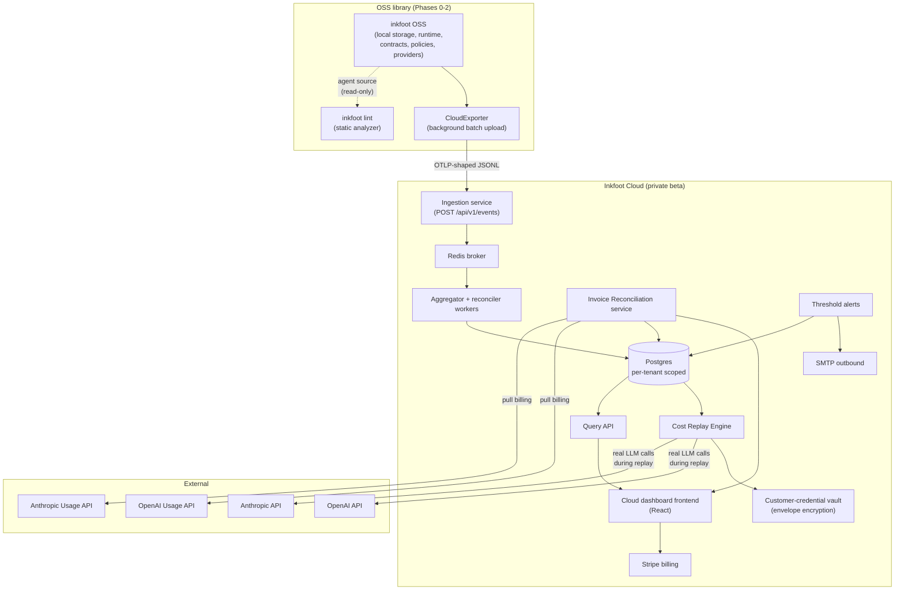

What's new vs Phase 2:

| New component | Responsibility |
|---|---|
| `inkfoot lint` | Read-only AST analyzer for agent source code; 8 launch rules; CI integration alongside `inkfoot diff` |
| `CloudExporter` | Background thread in OSS lib; batches events; fails open; never blocks the agent thread |
| Cloud Ingestion service | Multi-tenant event endpoint with per-tenant API keys; validates schema; enqueues into Redis |
| Redis broker | Decouple ingestion from workers; absorb bursts |
| Workers (aggregator + reconciler + replay-runner) | Same worker pattern as Sleuth's worker design |
| Cloud Postgres | Tenant-scoped runs/events; application-code scoping (RLS in Phase 5) |
| Customer-credential vault | Per-tenant envelope encryption for LLM credentials used during replay |
| Query API + dashboard | The cloud surface end-users see |
| Cost Replay Engine | The headline Phase-3 capability |
| Invoice Reconciliation service | Pulls provider usage APIs; matches against events; finance-grade report |
| Threshold alerts | Per-tenant rule definition; evaluation worker; SMTP delivery |
| Stripe billing | Free/Pro/Team tiers with metered ingestion |

---

## 4. Components — detailed design

### 4.1 `CloudExporter` (OSS library side)

The exporter is the single bridge between local Inkfoot installs and
Cloud. Its design constraints (in priority order):

1. **Never block the agent thread.** All work happens in a daemon
   thread; if the thread dies, the agent keeps running.
2. **Fail open.** If Cloud is unreachable, events stay in local
   SQLite/Postgres; the next successful flush catches up.
3. **Bounded memory.** A queue cap (default 10k events); on
   overflow, drop oldest and emit a `cloud_exporter_overflow` metric
   visible in `inkfoot report`.
4. **Resumable.** Persist the last-uploaded-event sequence so a
   restart picks up cleanly.

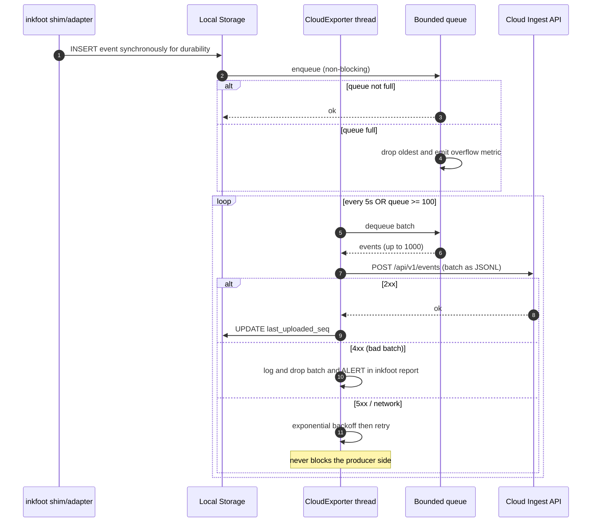

The exporter is opt-in: `inkfoot.instrument(cloud_api_key="tw_...")`.

### 4.2 Cloud ingestion service

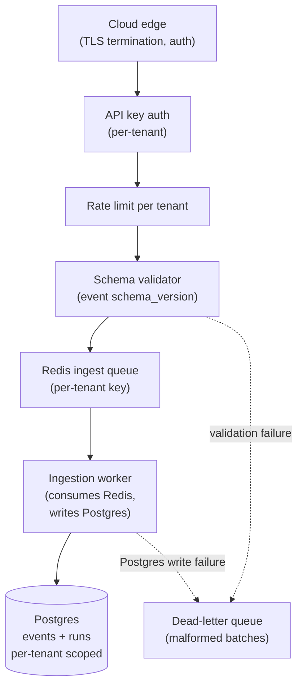

**Why a broker?** The ingest endpoint receives bursty traffic
(thousands of events arriving from CI runs). Writing each one
synchronously to Postgres is fine at low load but doesn't scale.
Redis decouples the API latency from Postgres write latency; ingest
workers drain the queue at Postgres-sustainable speed.

**Per-tenant API keys.** Phase 3 uses a single per-tenant API key
model (full IAM is Phase 5). The key prefix encodes the tenant id;
the secret part is hashed at rest. Format: `tw_live_<base32>` (mimics
Stripe / GitHub PAT shape; familiar to engineers).

**Schema validation.** Every event must declare `schema_version` in
the JSONL header line. The ingestor accepts current and N-1. Older
schemas are rejected with a clear error pointing at a migration
guide. The schema versioning was set up in Phase 0; Phase 3 enforces
it at the Cloud boundary.

### 4.3 Cloud Postgres schema

The schema is **the same as local**, extended with tenancy and
Cloud-specific tables:

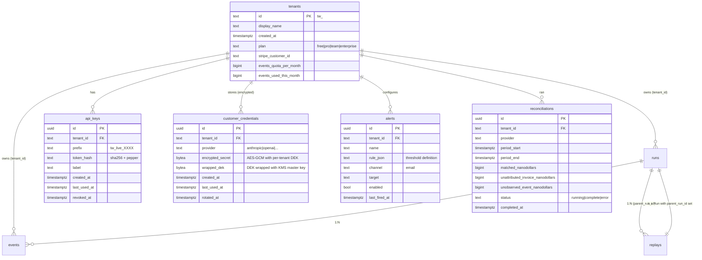

The pre-existing `runs` and `events` tables (from Phase 0) gain a
`tenant_id` column; every query is scoped to the requesting tenant
in application code. Phase 5 adds Postgres row-level security as
defense-in-depth.

### 4.4 Cost Replay Engine

The headline Phase-3 capability. Architecture §4.9 and ADR-009 set
the framing; this section is the implementation detail.

#### 4.4.1 What "replay" means

Given a recorded run with N LLM turns, the replay engine:

1. Loads the original event sequence from Cloud Postgres.
2. Constructs the messages history that was sent to the LLM on each
   turn (because the event log captured each `NeutralCall.request`).
3. Loads the **new** policy stack the user is testing.
4. Re-walks each turn:
   - Applies the new policy stack to the message state.
   - Calls the LLM provider with the modified state, using the
     customer's stored credentials.
   - When the original turn dispatched a tool, the replay does NOT
     re-call the tool — it uses the recorded `tool_result` as a
     fixture.
   - Records a divergence flag if the new LLM response calls a
     different tool than the original.
5. Records the replay as a new `runs` row with `parent_run_id`
   pointing at the original.

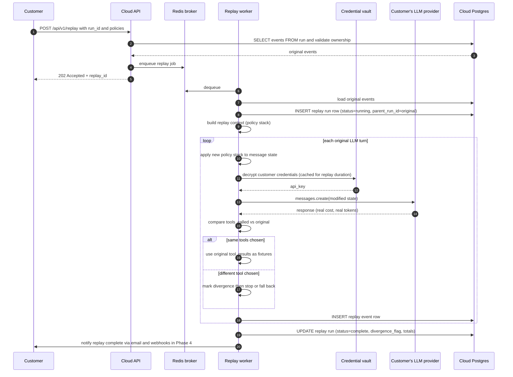

#### 4.4.2 Divergence handling

When the new LLM response calls a different tool than the original
(or skips a tool the original called), the replay is **flagged**, not
broken. The UI shows:

```
Replay 01HZ... of run 01HV... (customer-support-triage)

  Original policy stack: BudgetCap(50_000_000)
  Replayed policy stack: BudgetCap(50_000_000) + LazyToolExposure(stale_after_turns=2) + CheapSummariser(threshold=1200)

  Turn 1: same tool chosen (datadog_metrics)
  Turn 2: same tool chosen (github_pr_lookup)
  Turn 3: ⚠ DIVERGENCE — original called `search_customer_history`, replay called `datadog_logs`
  Turn 4: not replayed (divergence at turn 3)

  Cost comparison (turns 1-3 only, since divergence at 3):
    Original: $0.018  (turns 1-3)
    Replay:   $0.014  (turns 1-3)
    Delta:    -$0.004 (-22%)

  ⚠ The full-run comparison cannot be made because the agent diverged.
  This is honest: under the new policy stack, the agent picked
  different tools, so the original's downstream cost is not
  directly comparable.
```

The divergence-honesty framing is the trust differential against
competitors that claim "simulation" features producing single numbers.
See ADR-3-1.

#### 4.4.3 Replay-engine cost attribution

Replays cost real LLM money on Inkfoot's infrastructure. Two
decisions in ADR-3-2:

1. **Replays count against the customer's monthly events quota.** A
   replay generates events just like a live run does. **The
   accounting is 1:1** — each event emitted by the replay engine
   (including its own `replay_call` events) consumes one event from
   the tenant's quota. No multiplier. If a customer's original run
   emitted 12 events, replaying it under one policy stack also
   emits ~12 events; replaying it under three different policy
   stacks emits ~36 events. The pricing tables (§4.8) are
   denominated in raw events; replays are not "free" but are also
   not separately metered.
2. **The LLM-call cost during replay is borne by the customer's
   credentials** — we don't pay for replays.

This keeps Cloud's unit economics clean: Cloud is a per-event SaaS;
the LLM provider sees the customer as the spender.

**Replay capture prerequisite.** Replay only works for runs recorded
with **`capture_mode="replay"`** (see Phase 0 §5.5.1 and ADR-0-9).
Runs recorded with the default `capture_mode="metadata"` have no
stored content; the replay engine will refuse them with a clear
error pointing at the docs: *"This run was captured in metadata mode;
the original message stream wasn't stored. Replay requires
`capture_mode='replay'`. New runs captured under this mode will be
replayable; historical metadata-mode runs cannot be retroactively
replayed."*

This is the **honest framing** the architecture's ADR-0-9 commits to.
The Cloud UI surfaces it explicitly on the per-run view: a
"Replay-capable: yes/no" indicator, with a link to the setting that
controls the flag for new runs.

#### 4.4.4 Customer-credential vault

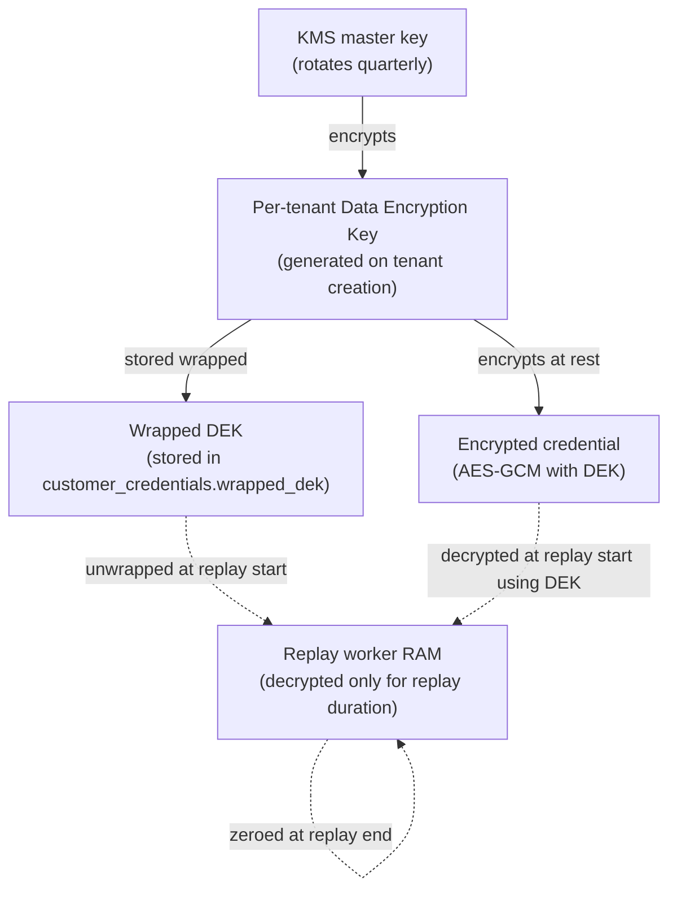

The threat model:

- Postgres dump → attacker has `encrypted_secret` + `wrapped_dek` but
  no KMS access. Can't decrypt.
- Postgres dump + KMS access → attacker can decrypt, but every
  decrypt operation is logged to a per-tenant audit log
  (`replay_credential_access`) visible in the dashboard.
- Compromised replay worker RAM → exposes credentials of replays
  currently in flight. Mitigation: replay workers are short-lived
  (one replay per worker invocation); RAM is zeroed at completion.

### 4.5 Static analyzer (`inkfoot lint`)

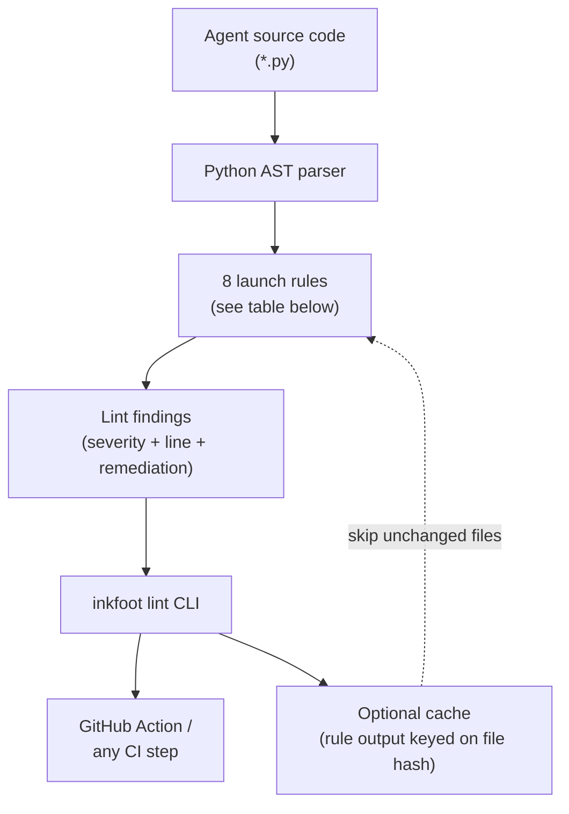

#### 4.5.1 Launch rules

| Rule | What it detects | Severity |
|---|---|---|
| `tool-schema-in-loop` | Tool definitions constructed inside the agent loop body (cache-breaker) | **Critical** |
| `system-prompt-timestamp` | `time.time()` / `datetime.now()` inside a string that lands in the system message | **Critical** |
| `mutable-system-prefix` | System message built from f-string with run-varying inputs | **Warn** |
| `unbounded-retry-loop` | `while True:` over LLM calls with no cap or backoff | **Critical** |
| `tool-result-without-size-check` | Tool result passed to model with no length check or summariser | **Warn** |
| `model-from-user-input` | Model parameter derived from user input (cache-breaker + safety risk) | **Critical** |
| `tools-added-mid-conversation` | Tools list mutated inside the loop | **Warn** |
| `missing-outcome-tag` | `@agent_run` decorator present but no `set_outcome()` call in the function body | **Info** |

Each rule is a small Python module implementing:

```python
class LintRule(Protocol):
    id: str
    severity: Literal["info", "warn", "critical"]
    title: str
    description: str
    def check(self, tree: ast.AST, source: str, path: Path) -> Iterable[Finding]: ...
```

Findings carry source location, a one-line remediation hint, and a
link to the rule docs:

```
$ inkfoot lint backend/agents/
  backend/agents/triage.py:42  WARN  unstable-prompt-prefix
    System prompt includes f-string with time.time(). This will
    invalidate the prompt cache on every call.
    Fix: build the prompt once, outside the loop, or move the
    timestamp into a user message.
    Docs: https://inkfoot.dev/lint/system-prompt-timestamp

  backend/agents/triage.py:78  CRITICAL  tool-schema-in-loop
    `build_tools()` is called inside the while-loop body. Tool
    definitions in the prompt prefix will change every iteration,
    preventing any cache benefit.
    Fix: build tools once, before the loop.
    Docs: https://inkfoot.dev/lint/tool-schema-in-loop

Found 2 issues (1 warn, 1 critical) in backend/agents/triage.py
Exit code: 2 (--max-severity=warn)
```

#### 4.5.2 Why the static + runtime + replay combination is the moat

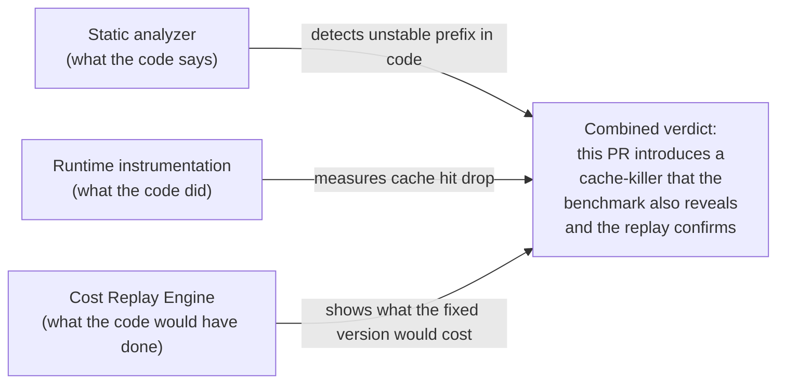

A competitor with only one of the three (Langfuse: runtime;
hypothetical static-only tool: static; nobody: replay) cannot
reproduce the combined verdict. See ADR-3-3.

### 4.6 Invoice reconciliation

#### 4.6.1 What "reconcile" means

For each (provider, tenant, billing-period) tuple, produce three
buckets:

| Bucket | Meaning |
|---|---|
| **Matched** | Inkfoot saw the event and the provider's invoice has a line item that matches by API key + date + (where possible) model |
| **Unattributed invoice** | The provider's invoice has a line item Inkfoot did NOT observe an event for. Possible causes: agents not instrumented; calls bypassing Inkfoot; out-of-band test runs |
| **Unobserved event** | Inkfoot observed an event the provider's invoice doesn't list. Possible causes: test runs against mock providers Inkfoot didn't tag as mock; deduplication gaps; the invoice lag window |

The honest framing: this is **finance-grade**. Engineers see costs;
CFOs see the invoice. Reconciliation is the conversation those two
groups have together.

#### 4.6.2 Reconciliation flow

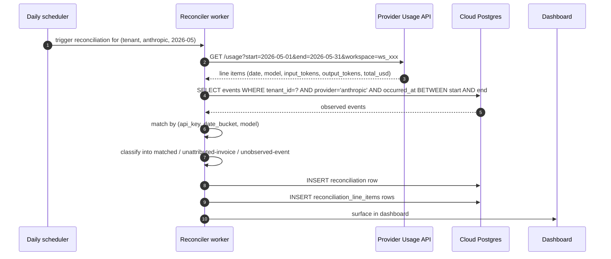

#### 4.6.3 Matching algorithm

Match key: `(api_key_hash, day_bucket, model)`.

- Provider's line items are bucketed to UTC-day granularity (most
  providers report daily).
- Inkfoot events bucketed identically.
- For each `(api_key_hash, day, model)` triple:
  - **matched** = `min(provider_total, observed_total)`
  - **unattributed_invoice** = `max(0, provider_total - observed_total)`
  - **unobserved_event** = `max(0, observed_total - provider_total)`

Some providers (Anthropic) report by workspace, not by API key.
Configurable mapping per provider.

#### 4.6.4 FOCUS-spec export

The FinOps FOCUS spec (https://focus.finops.org/) is the open
standard for cloud cost data. Inkfoot Cloud exports reconciliation
data in FOCUS CSV/Parquet so finance teams can pipe it into Apptio,
Vantage, CloudHealth, etc., without translation:

```csv
BillingPeriodStart,BillingPeriodEnd,ServiceName,Region,ResourceId,ResourceType,UsageQuantity,UsageUnit,ListPrice,ListCost,BilledCost,Tags,...
2026-05-01,2026-05-31,Anthropic,n/a,ws_xxx/customer-support-triage,LLM Task,412,run,0.041,16.892,16.892,"{task:customer-support-triage,team:support}",...
```

### 4.7 Threshold-based alerting

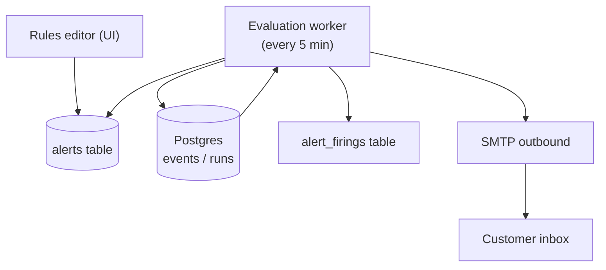

Phase 3 rules are simple thresholds: cost-per-task in last hour
exceeds X; cache hit rate in last hour below Y; contract violation
fires more than Z times. Anomaly-based alerts (3σ) are Phase 4.

Email-only delivery in Phase 3. Slack + PagerDuty arrive in Phase 4.

### 4.8 Stripe billing + pricing tiers

| Tier | Price | Limits |
|---|---|---|
| Free | $0 | 10k events/mo, 7-day retention, 1 workspace |
| Pro | $39/mo | 250k events/mo, 30-day retention, alerts |
| Team | $249/mo | 2.5M events/mo, 90-day retention, **Cost Replay Engine**, **static analyzer in CI**, **invoice reconciliation** |
| Enterprise | Contact | Custom volume, custom retention, SSO, multi-user, self-host option |

The tier breakpoints are strawman; design-partner conversations
adjust them. Stripe-self-serve for Free → Pro → Team; Enterprise is
contract-and-invoice.

**Important constraint — Phase 3 auth is single-user-per-workspace.**
Real multi-user (multiple seats; multiple workspaces per
organisation; roles) requires the IAM stack that lands in Phase 5
(see ADR-3-5). The Phase 3 Pro / Team tiers therefore quantify the
**ingest volume + retention + feature set**, not seats or workspaces.
The roadmap previously listed "5 seats" and "unlimited workspaces"
on Team — those move to Phase 5's Enterprise tier once IAM exists
to enforce them. Phase 3 customers operate one workspace per tenant
with one human user; Phase 5 lifts the constraint without changing
the tier prices.

**Invoice reconciliation placement.** Reconciliation sits at the
**Team** tier (not Pro). Reasoning: Pro is the "see your spend"
upgrade from Free; Team is the "reconcile against the provider
invoice + replay + lint" upgrade from Pro. The roadmap (§5)
contained an internal contradiction here — the pricing table listed
reconciliation under Pro, but the same section said reconciliation
was the Pro→Team upgrade hook. This phase doc is now the
authoritative placement: **reconciliation is Team-tier and up**. The
roadmap pricing table is corrected to match.

**Quota enforcement.** The ingest endpoint checks
`tenants.events_used_this_month` against
`tenants.events_quota_per_month` before enqueuing. Overage:

| Tier | Overage behaviour |
|---|---|
| Free | Hard cap; events rejected with 429 |
| Pro | Soft cap; events accepted; in-app prompt to upgrade; email at 90% / 100% / 110% |
| Team | Soft cap; same as Pro plus account manager outreach |
| Enterprise | Contractual; no automated enforcement |

---

## 5. Module structure delta

```
# OSS (new)
inkfoot/
├── ... (Phase 0+1+2 unchanged) ...
├── cloud_exporter/
│   ├── __init__.py
│   ├── thread.py             # background daemon
│   ├── queue.py              # bounded queue + overflow metric
│   └── batch.py              # JSONL batch construction
├── lint/
│   ├── __init__.py
│   ├── runner.py             # inkfoot lint CLI
│   ├── ast_helpers.py
│   └── rules/
│       ├── tool_schema_in_loop.py
│       ├── system_prompt_timestamp.py
│       ├── mutable_system_prefix.py
│       ├── unbounded_retry_loop.py
│       ├── tool_result_without_size_check.py
│       ├── model_from_user_input.py
│       ├── tools_added_mid_conversation.py
│       └── missing_outcome_tag.py

# New repo: inkfoot-cloud/
inkfoot-cloud/
├── api/
│   ├── ingest.py             # POST /api/v1/events
│   ├── query.py              # GET /api/v1/runs, /events, etc.
│   ├── replay.py             # POST /api/v1/replay
│   ├── reconcile.py          # GET /api/v1/invoices/reconcile
│   ├── alerts.py             # CRUD /api/v1/alerts
│   └── auth.py               # API key auth
├── workers/
│   ├── ingestion_worker.py
│   ├── aggregator_worker.py
│   ├── replay_worker.py
│   ├── reconciler_worker.py
│   └── alerter_worker.py
├── vault/
│   ├── encrypt.py
│   ├── kms_client.py
│   └── audit.py
├── pricing/                   # provider invoice API clients
│   ├── anthropic_usage.py
│   └── openai_usage.py
├── focus_export/
│   └── exporter.py
├── billing/
│   └── stripe_client.py
├── db/
│   ├── migrations/
│   └── models.py
└── frontend/                  # React dashboard
```

---

## 6. Public interfaces

### 6.1 OSS additions (Phase 3)

```python
inkfoot.instrument(
    ...,
    cloud_api_key: str | None = None,
    cloud_endpoint: str = "https://api.inkfoot.dev",
)
```

CLI:

```
inkfoot lint <path>                 # static analyzer
inkfoot lint --max-severity warn .  # CI gate
inkfoot replay <run-id>             # CLI shortcut to Cloud API
  --with-policy NAME [args]
  --against-policy NAME [args]
```

### 6.2 Cloud API (v1)

| Method | Path | Purpose |
|---|---|---|
| `POST` | `/api/v1/events` | Batch ingest |
| `GET` | `/api/v1/runs` | List runs (paginated, per-tenant) |
| `GET` | `/api/v1/runs/{id}` | Run detail |
| `GET` | `/api/v1/runs/{id}/events` | Event timeline |
| `GET` | `/api/v1/aggregates` | Time-series + group-by |
| `POST` | `/api/v1/replay` | Trigger replay |
| `GET` | `/api/v1/replay/{id}` | Poll replay status + results |
| `GET` | `/api/v1/invoices/reconcile` | Latest reconciliation report |
| `POST` | `/api/v1/invoices/reconcile` | Trigger reconciliation for period |
| `POST` | `/api/v1/alerts` | Create alert |
| `GET` | `/api/v1/alerts` | List alerts |
| `PATCH` | `/api/v1/alerts/{id}` | Edit alert |
| `DELETE` | `/api/v1/alerts/{id}` | Delete alert |
| `POST` | `/api/v1/credentials` | Store provider credentials (encrypted server-side) |

Auth: `Authorization: Bearer tw_live_<...>`. Per-tenant API keys.

---

## 7. Critical end-to-end flows

### 7.1 Customer signs up → first event → first replay

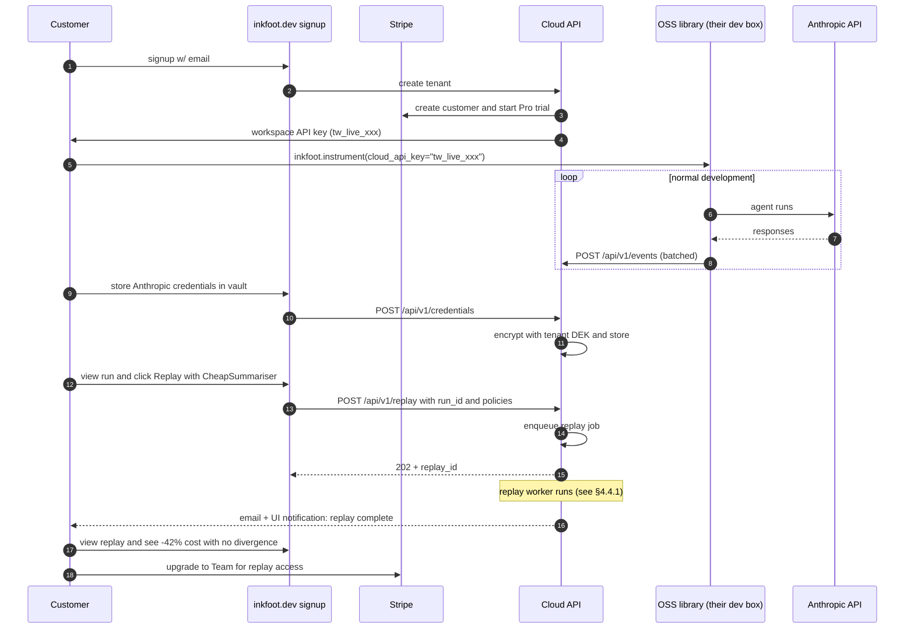

### 7.2 Static analyzer + diff + contract check in CI

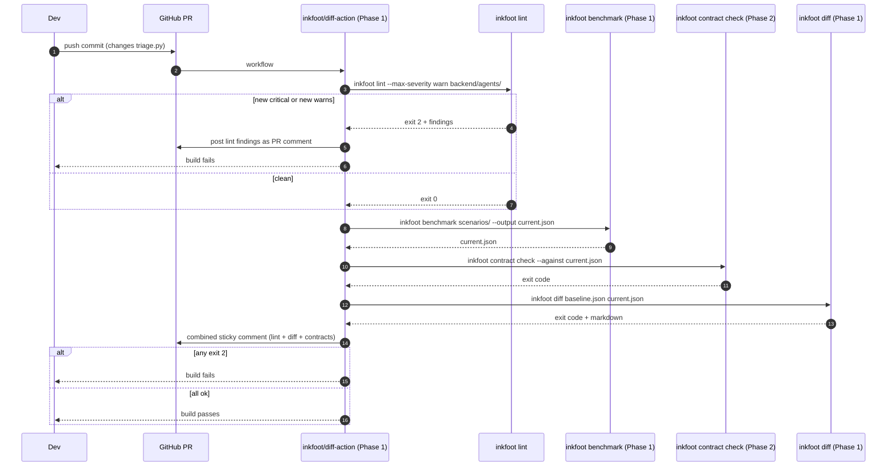

### 7.3 Invoice reconciliation (monthly)

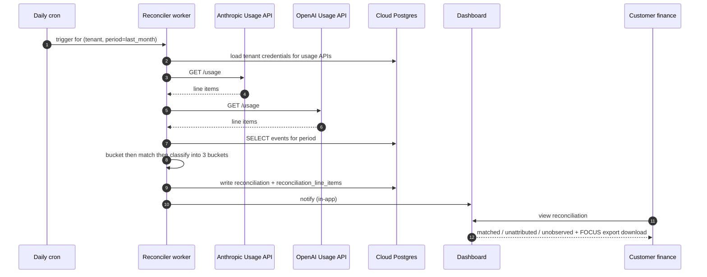

---

## 8. ADRs — Phase 3

### ADR-3-1: Honest divergence flagging in the Replay Engine

**Status:** Accepted.
**Context:** The market wants "what would this run cost differently?"
Many competitors will offer modelled simulations producing a single
clean number. Real LLM replays diverge sometimes — under a new
policy the model picks different tools.
**Decision:** Always flag divergence; never claim a saving for a
divergent replay. Show the cost comparison for the prefix where the
agent's behaviour matched; clearly state that the post-divergence
behaviour is *not directly comparable*.
**Alternatives considered:**
- *Hide divergence; report a single number.* Quick win in
  marketing; trust collapses on inspection.
- *Refuse to render any number on divergent replays.* Loses signal
  for the customer who wants to see "where did it diverge and why?".
**Consequences:** Some replays produce ambiguous savings. Trust
differential against simulation-based competitors. Documentation
explains the divergence concept up front.

### ADR-3-2: Replay infrastructure cost model

**Status:** Accepted.
**Decision:**
- Replays count against the customer's monthly events quota.
- The LLM API calls during replay are billed to the customer's
  provider account via their stored credentials.
- Inkfoot Cloud bears only the compute cost of running the replay
  worker.
**Why:** Keeps Cloud unit economics clean. The customer paying for
their own LLM usage during replay also removes our exposure to
spend abuse.
**Consequences:** Replay isn't free for customers; the docs explain
this. Per-tenant monthly replay-LLM-spend cap option to prevent
runaway replays.

### ADR-3-3: Static analyzer is in OSS, not Cloud-only

**Status:** Accepted.
**Decision:** `inkfoot lint` ships in the OSS library. CI integration
works without Cloud.
**Why:** The static + runtime + replay combination is the moat. The
*static* piece works best as an OSS reach: every engineer encounters
it; the lint becomes the cost-smell mental model for the whole
ecosystem. Cloud-gating the analyzer would weaken adoption.
**Alternatives considered:**
- *Cloud-only lint (premium feature).* Pricing-friendly but adoption-
  hostile. Worth more long-term as an OSS contributor magnet.
**Consequences:** Cloud's Team-tier differentiator is the lint
*running in CI managed by us*, plus aggregated lint metrics across
multiple repos. The lint *engine* is open.

### ADR-3-4: Customer-credential vault: envelope encryption + KMS

**Status:** Accepted.
**Context:** Cost Replay requires customer LLM credentials in our
infrastructure. The threat model needs to be explicit.
**Decision:** Envelope encryption with a per-tenant DEK; DEK is
wrapped by a KMS-managed master key. Decrypt only at replay start;
zero from RAM at replay end. Every decrypt logged to a per-tenant
audit log.
**Alternatives considered:**
- *Plaintext in DB with column encryption.* Single point of failure
  on key rotation; weak.
- *Per-replay user-prompted re-entry of credentials.* UX-hostile;
  defeats the "background replay" pattern.
- *Customer-side replay (Cloud orchestrates; LLM call happens in
  customer infra).* Architecturally cleaner but requires customer
  to run a worker — adoption barrier.
**Consequences:** KMS dependency. SOC 2 (Phase 5) inherits from this
posture. Audit log visible to customers in dashboard ("who at
Inkfoot accessed your credentials? Nobody. Every replay log
recorded.")

### ADR-3-5: API key auth in Phase 3; full IAM in Phase 5

**Status:** Accepted.
**Decision:** Phase 3 Cloud uses per-tenant API keys. Single-user-per-
workspace. SSO, SAML, RBAC all wait for Phase 5.
**Why:** Time-to-market. The customers in Phase 3 are design
partners and the first paying users; they will accept the API-key
model. Full IAM is expensive and gates Phase 5 enterprise contracts,
not Phase 3 design partnerships.
**Consequences:** Phase 5 IAM lands with a migration: API keys become
one of several credential types; existing keys keep working; SSO
joins as an additional path.

### ADR-3-6: Reconciliation matching at day granularity

**Status:** Accepted.
**Context:** Provider usage APIs typically report at daily granularity.
Matching at finer resolution requires per-request IDs the providers
don't reliably expose.
**Decision:** Match at `(api_key, day, model)` granularity. Accept
"matched" as approximate to within a day.
**Alternatives considered:**
- *Per-request matching via response headers.* Not all providers
  expose unique billing IDs in the response.
- *Hour-level matching.* Provider APIs don't always support it;
  precision benefit is marginal.
**Consequences:** Reconciliation reports surface "as of date"
prominently; never claim live precision.

### ADR-3-7: FOCUS-spec export as the finance integration mechanism

**Status:** Accepted.
**Decision:** Use the open FOCUS spec (https://focus.finops.org/) as
the canonical export format for reconciliation data. CSV + Parquet.
**Why:** FOCUS is the FinOps community's open standard; FinOps tools
(Apptio, Vantage, CloudHealth) accept it natively. Building per-tool
custom exports is unbounded work.
**Consequences:** Customers using a FOCUS-aware tool can ingest
Inkfoot reconciliation data with no custom mapping. Customers using a
non-FOCUS tool may need a one-off transform; documented.

---

## 9. Cross-cutting concerns

### 9.1 Performance budgets

| Operation | Budget (p95) |
|---|---|
| Cloud event ingest API | < 100 ms (excluding network) |
| Cloud Postgres event insert | < 5 ms |
| Replay worker LLM-call overhead vs raw SDK | < 50 ms per turn |
| Reconciliation worker per tenant | < 30 s for monthly period |
| Dashboard p95 query latency | < 2 s |
| 99.5% uptime over 4 consecutive weeks before phase exit |

### 9.2 Reliability invariants

1. **Cloud exporter never blocks** the OSS-side agent thread (§4.1).
2. **Ingest is fail-soft** at the Cloud edge: a malformed batch is
   dead-lettered, not rejected wholesale; valid events in the same
   batch are accepted.
3. **Vault writes are atomic**: if KMS is unreachable, the credential
   write fails before persistence (don't end up with a half-encrypted
   row).
4. **Replays are resumable** for transient errors (network blip mid-
   replay); resume from the last completed turn.

### 9.3 Privacy

The privacy posture from Phase 0 ("metadata only by default") extends
to Cloud:

- The OSS exporter ships *event metadata* (NeutralCall + ledger). No
  prompt or response content uploaded.
- Cost Replay requires content. Customers must opt in **at two
  levels** — and the UX deliberately surfaces the decision twice:

  1. **At the OSS library** — `capture_mode="replay"` on
     `inkfoot.instrument(...)` (Phase 0 §5.5.1). This is what
     causes the local SQLite to start storing message streams.
  2. **At the Cloud workspace** — a workspace-level setting
     `cloud_content_upload_enabled: bool` (per workspace, not
     per-call). Disabled by default. Toggling it to `true`
     surfaces a **confirm-and-acknowledge dialog**:

     > Enabling content upload means Inkfoot Cloud will store the
     > prompts your agents send to LLM providers and the responses
     > they receive, including any user inputs they contain. This is
     > required for the Cost Replay Engine. You can disable this at
     > any time, after which new events will be uploaded as metadata
     > only. Previously-uploaded content will be deleted within 30
     > days. [Confirm enable] [Cancel]

  The two-level model is deliberate: a developer running OSS locally
  may want replay-capable local capture without ever uploading to
  Cloud. A Cloud-using team may want to upload content for a *single*
  workspace tied to their replay use case while keeping production
  workspaces metadata-only.
- A redaction floor (regex patterns) runs at the exporter boundary
  when content upload is enabled. The redacted-or-not status is
  surfaced on every persisted content row
  (`event_contents.content_redacted` from Phase 0 §5.5.1).

### 9.4 Testing strategy

- Cloud API tests against the actual FastAPI app, with a Postgres
  testcontainer.
- Replay worker tests against a `FakeLLMProvider` to verify the
  replay logic without real API calls; live tests behind
  `@pytest.mark.live_anthropic` for end-to-end validation.
- Lint rule tests with fixture Python files containing positive +
  negative cases per rule.
- Reconciliation tests with recorded provider-API responses.
- End-to-end design-partner sanity check: every design partner
  receives a weekly "what changed" digest from Inkfoot Cloud during
  the beta.

### 9.5 Versioning

Phase 3 lands `1.2.x` on the OSS library (the `CloudExporter` and
`inkfoot lint` are additive). Cloud API is `v1`; breaking changes get
a 6-month deprecation window and version bump.

---

## 10. Risks & mitigations

| Risk | Likelihood | Impact | Mitigation |
|---|---|---|---|
| **Replay credential management goes wrong** | Low | Critical (fatal) | ADR-3-4 vault design; KMS audit logs; per-tenant access trail; threat model documented |
| **Static analyzer scope creep** | Medium | Medium | Ship 5 well-tuned rules first; Phase 3 scope acceptable to slip 4 weeks if rule quality at stake |
| **Provider invoice API instability** | Medium | Medium | Versioned adapter per provider; graceful degradation ("could not reconcile"); contract tests weekly |
| **Replay divergence framing erodes trust** | Medium | Medium | ADR-3-1 honest framing in docs and launch; show divergence rate as a corpus statistic |
| **Cloud infra cost exceeds revenue early** | Medium | High | Strict free-tier limits; design partners on Pro from day one |
| **"Simulation" market pressure** | Medium | Medium | ADR-3-1 honest framing; lean into "we measure, we don't model" |
| **Customer credential leak** | Low | Critical | Envelope encryption; KMS; never log; quarterly rotation; SOC 2 in Phase 5 inherits this |

---

## 11. Definition of done

- [ ] 5–10 design partners actively using Cloud in production.
- [ ] **One paying customer (Pro or Team) at phase end.**
- [ ] Cost Replay Engine works end-to-end with divergence flagging.
- [ ] Invoice reconciliation works for Anthropic + OpenAI.
- [ ] FOCUS-spec export validated against the FinOps spec.
- [ ] Static analyzer: 8 rules; runs cleanly on the LangGraph,
      OpenAI Agents SDK, Anthropic SDK reference repos.
- [ ] Median event ingestion latency < 500 ms.
- [ ] Dashboard p95 query latency < 2 s.
- [ ] 99.5% uptime over 4 consecutive weeks before phase exit.
- [ ] Stripe billing wired up; the $0 → $39 → $249 transition works
      end-to-end.
- [ ] Cloud exporter in OSS library fails open under simulated
      Cloud-unreachable conditions.

## 12. Go/no-go signal — Phase 3 → Phase 4

Phase 3 → Phase 4 if all of:

- ≥ 3 paying customers at phase exit, **AND**
- Combined ARR > $5k, **AND**
- ≥ 2 written testimonials.

**One paying customer but no others:** value, not viability. Slow
Phase 4; deepen Phase 3; investigate pricing or positioning friction.

**Zero paying customers:** SaaS thesis is wrong. Three options: OSS
+ consulting; support contracts; acquire-hire.

## 13. Suggested epic breakdown — prefix `PR`

| Epic | Title |
|---|---|
| **PR1** | Cloud ingestion service (`POST /api/v1/events`; per-tenant API keys; schema validation; rate limits) |
| **PR2** | Cloud Postgres schema + tenancy + migration framework |
| **PR3** | Cloud exporter in OSS (background thread; batched POST; fail-open; bounded queue) |
| **PR4** | **Cost Replay Engine** core (events → message state; policy stack application; LLM call; divergence detection; replay-as-child-run persistence) |
| **PR5** | Replay API endpoints + polling/notification |
| **PR6** | Customer-credential vault (envelope encryption; KMS; audit log) |
| **PR7** | **Static analyzer** (`inkfoot lint`) with 8 launch rules |
| **PR8** | Static analyzer CI integration (exit codes; PR comment; combined with `inkfoot diff`) |
| **PR9** | **Invoice reconciliation** for Anthropic Usage API |
| **PR10** | Invoice reconciliation for OpenAI Usage API |
| **PR11** | Reconciliation UX (matched / unattributed / unobserved; drill-down) |
| **PR12** | **FOCUS-spec export** (CSV + Parquet) |
| **PR13** | Cloud dashboard frontend (React; causal attribution; cost-per-task; cost-per-success; time-series). Per-tag rollups + cohort analysis are Phase 4 (CO12 / Attribution v2). |
| **PR14** | Threshold-based alerting (rules; evaluation worker; SMTP delivery) |
| **PR15** | Stripe billing wiring; quota enforcement |
| **PR16** | API key management UI |
| **PR17** | Marketing site + pricing page |
| **PR18** | Design-partner onboarding playbook (founder-led; weekly check-in) |

## 14. Open questions

- **Pricing.** $39 / $249 are strawman; design-partner conversations
  set the real ones.
- **Replay credential UX.** Per-workspace credential entry is the
  default; should we support OAuth flows for the providers that
  offer them (Anthropic Console OAuth)? Default: API-key entry in
  Phase 3; OAuth Phase 4+.
- **Static analyzer cross-framework rules.** Per-framework rule
  sets or unified? Default: unified rule set; per-framework config
  if needed.
- **Reconciliation freshness.** Provider billing APIs lag by 24–48
  hours; should reconciliation be "yesterday's spend" or live?
  Default: explicit "as of" date prominent; never claim live.
- **Design-partner SOC 2 ask.** Some design partners will ask about
  SOC 2 before Phase 5. Default: be honest — "in progress, on the
  Phase-5 roadmap, not yet"; surface privacy posture instead.
