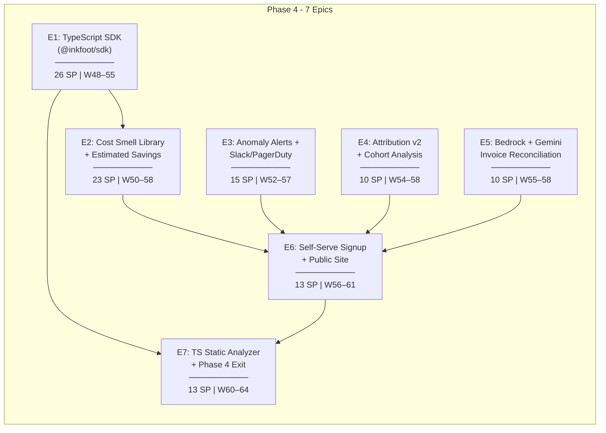
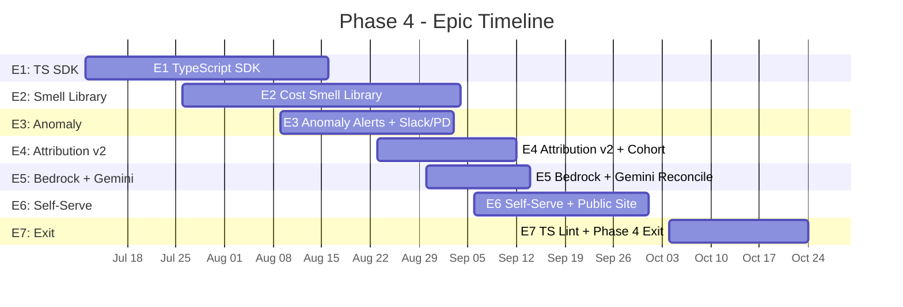
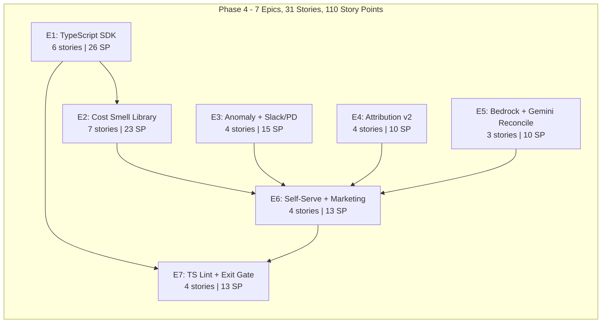

# Inkfoot — Phase 4: Development Epics

> **Phase:** 4 — Compound
> **Theme:** Make the moats compound. TypeScript port, community Smell Library, Cloud GA.
> **Timeline:** Weeks 48–64 (80 working days)
> **Total Story Points:** 110
> **Document Version:** 1.0
> **Last Updated:** 2026-05-25
> **Builds On:** `inkfoot_phase3_development_epics.md` v1.0
> **Aligned With:** `phase-4-compound.md`
>
> **Outcome gate:** entered only after Phase 3 go-signal (≥ 3 paying
> customers + > $5k ARR + ≥ 2 testimonials). Phase 4 → Phase 5 gates on
> growth trajectory (≥ 15% MoM MRR + ≥ 1 Team-tier customer for ≥ 3
> months + enterprise-adjacent sales conversations).

---

## Epic Overview

---

## Story Point Scale

| Points | Effort |
|---|---|
| 1 | Trivial (< 1 hour) |
| 2 | Small (1–3 hours) |
| 3 | Medium (3–6 hours) |
| 5 | Large (1–1.5 days) |
| 8 | XL (1.5–2.5 days) |
| 13 | XXL (3–4 days) |

---

## E1: TypeScript SDK (`@inkfoot/sdk`)

**Goal:** Mirror Python's Pattern A + B + two Pattern C adapters (Vercel AI SDK + LangChain.js) in TypeScript. Wire format identical; Cloud ingest can't tell which language produced a batch. Per ADR-4-1, it's a **mirror, not a port**.

**Total Story Points:** 26
**Sprint:** Week 48–55 (Days 1–35)
**Dependencies:** Phase 3 (Cloud ingest accepts the same JSONL shape)

---

### E1-S1: TypeScript Monorepo Setup

**Story:** As the TypeScript codebase, I need a `@inkfoot` npm scope with `packages/sdk`, `packages/vercel`, `packages/langchain-js`, `packages/eslint-plugin`.

**Story Points:** 3

**Tasks:**

| # | Task | File(s) | Details |
|---|---|---|---|
| T1 | Monorepo with pnpm workspaces | `inkfoot-ts/pnpm-workspace.yaml`, `inkfoot-ts/packages/*` | TS 5.x; strict mode. |
| T2 | Shared eslint + prettier | `inkfoot-ts/.eslintrc.json`, `.prettierrc` | Shared via the eslint plugin extension. |
| T3 | CI matrix | `.github/workflows/ts-ci.yml` | Node 20 + 22; tests on every PR. |
| T4 | npm scope reservation | (operational) | Reserve `@inkfoot` scope. |

**Acceptance Criteria:**
- [ ] `pnpm install` succeeds; `pnpm test` runs all packages.
- [ ] All packages publish under `@inkfoot/*`.

---

### E1-S2: Pattern A SDK Shims (openai + anthropic + google)

**Story:** As a TS user, I need `import inkfoot from "@inkfoot/sdk"` + `inkfoot.instrument()` monkey-patching the three SDKs.

**Story Points:** 8

**Tasks:**

| # | Task | File(s) | Details |
|---|---|---|---|
| T1 | `inkfoot.instrument()` entry point | `packages/sdk/src/instrument.ts` | Args mirror Python; detect installed SDKs. |
| T2 | OpenAI shim | `packages/sdk/src/shims/openai.ts` | Wrap `openai.chat.completions.create`. |
| T3 | Anthropic shim | `packages/sdk/src/shims/anthropic.ts` | Wrap `@anthropic-ai/sdk` Messages.create. |
| T4 | Google shim | `packages/sdk/src/shims/google.ts` | Wrap `@google/generative-ai` GenerativeModel.generateContent. |
| T5 | Hook isolation | `packages/sdk/src/_isolation.ts` | Same invariant as Python ADR-0-3: try/catch every callback; never throw into user code. |
| T6 | Tests | `packages/sdk/tests/shims.spec.ts` | Stub SDKs; round-trip; isolation fuzz test. |

**Acceptance Criteria:**
- [ ] Each shim emits one event per LLM call.
- [ ] Hook-isolation fuzz survives 1000 random exception injections.
- [ ] Idempotent: calling `instrument()` twice does not double-patch.

---

### E1-S3: TS Ledger + Translators

**Story:** As the TS ledger, I need the same 14-field shape + per-provider translators producing wire-identical NeutralCall events.

**Story Points:** 5

**Tasks:**

| # | Task | File(s) | Details |
|---|---|---|---|
| T1 | `CausalTokenLedger` interface | `packages/sdk/src/ledger.ts` | 14-field TS interface; matches Python field names exactly. |
| T2 | OpenAI translator | `packages/sdk/src/normalise/openai.ts` | usage.* → ledger. |
| T3 | Anthropic translator | `packages/sdk/src/normalise/anthropic.ts` | Same. |
| T4 | Google translator | `packages/sdk/src/normalise/google.ts` | Same. |
| T5 | Tokeniser | `packages/sdk/src/tokenisers.ts` | js-tiktoken for OpenAI; @anthropic-ai/tokenizer if present; fallback with estimation flag. |
| T6 | Wire-format conformance test | `packages/sdk/tests/wire_conformance.spec.ts` | Same fixture JSON serialised in Python + TS must be identical bytes. |

**Acceptance Criteria:**
- [ ] Field-name and value-shape match Python ledger 1:1.
- [ ] Wire-format conformance test passes — Python + TS produce byte-identical event JSON for the same fixture.

---

### E1-S4: TS Storage (better-sqlite3) + Cloud Exporter

**Story:** As TS Storage, I need a SQLite backend (better-sqlite3) + a Cloud exporter mirroring the Python design.

**Story Points:** 5

**Tasks:**

| # | Task | File(s) | Details |
|---|---|---|---|
| T1 | better-sqlite3 backend | `packages/sdk/src/storage/sqlite.ts` | Same schema as Python; synchronous API maps cleanly to the event-write pattern. |
| T2 | Schema migrations | `packages/sdk/src/storage/migrations.ts` | Same DDL as Python. |
| T3 | Cloud exporter | `packages/sdk/src/cloud_exporter.ts` | Background worker thread (Node `worker_threads`); fail-open; bounded queue. |
| T4 | Tests | `packages/sdk/tests/storage.spec.ts` | Round-trip; exporter never blocks. |

**Acceptance Criteria:**
- [ ] Schema is byte-identical to Python's.
- [ ] Exporter ships events to a local Cloud testcontainer.

---

### E1-S5: Pattern B Decorator + Run Scoping

**Story:** As a TS user, I need `agent_run` + `set_outcome` + `tag` matching Python's API names exactly.

**Story Points:** 2

**Tasks:**

| # | Task | File(s) | Details |
|---|---|---|---|
| T1 | `agent_run(opts, fn)` | `packages/sdk/src/run.ts` | Awaitable wrapper; current-run tracked via AsyncLocalStorage. |
| T2 | `set_outcome` / `tag` / `tag_retrieval` | `packages/sdk/src/run.ts` | Same names as Python. |
| T3 | Tests | `packages/sdk/tests/run.spec.ts` | Async-correct current-run. |

**Acceptance Criteria:**
- [ ] API surface names match Python letter-for-letter.
- [ ] Async nested coroutines see the same current-run.

---

### E1-S6: Vercel AI SDK Adapter (Pattern C)

**Story:** As a Vercel AI SDK user, I need `@inkfoot/sdk-vercel` wrapping `streamText` / `generateText` / `useChat`.

**Story Points:** 3

**Tasks:**

| # | Task | File(s) | Details |
|---|---|---|---|
| T1 | Adapter | `packages/vercel/src/index.ts` | Wraps Vercel AI SDK entry points; per-call metadata. |
| T2 | Tests | `packages/vercel/tests/adapter.spec.ts` | Stub + real-SDK tests. |
| T3 | Quickstart docs | `docs/frameworks/vercel-ai-sdk.md` | Code sample + recipe. |

**Acceptance Criteria:**
- [ ] Adapter wraps Vercel SDK entry points; emits per-call events.

---

## E2: Cost Smell Library + Estimated Savings Engine

**Goal:** Ship `library.inkfoot.dev` — community-contributed cost smells with **estimated potential savings** computed by a monthly verification worker against an anonymised opt-in corpus. Per ADR-4-8: this is "estimated", not "verified".

**Total Story Points:** 23
**Sprint:** Week 50–58 (Days 11–50)
**Dependencies:** E1 (Cloud Postgres for the corpus)

---

### E2-S1: Smell-Definition YAML Schema (Open Repo)

**Story:** As a community contributor, I need a YAML schema for smell definitions + a public repo where I PR new smells.

**Story Points:** 3

**Tasks:**

| # | Task | File(s) | Details |
|---|---|---|---|
| T1 | New repo `cost-smells` | `github.com/inkfoot/cost-smells` | Public; Apache 2.0. |
| T2 | YAML schema | `cost-smells/schema/smell.schema.json` | Per phase-4-compound §4.2.1. Fields: id, severity, description, detection (language/query/trigger), recommendation, suggested_policy, `estimated_savings` (auto-filled by the worker), `evidence_kind`. |
| T3 | Lint bot | `cost-smells/.github/workflows/lint.yml` | Validates new smell PRs against the schema. |
| T4 | CONTRIBUTING.md | `cost-smells/CONTRIBUTING.md` | Publish criteria: O(events × constant) detection; ≥ 3 positive + 3 negative fixtures; one-sentence remediation; suggested_policy references a real policy. |

**Acceptance Criteria:**
- [ ] Schema lint bot fires on every PR.
- [ ] Lint catches missing fields, wrong types, slow queries.

---

### E2-S2: Verification Corpus + Anonymisation

**Story:** As Cloud's verification mechanism, I need an opt-in corpus of anonymised ledger shapes that the worker can query.

**Story Points:** 5

**Tasks:**

| # | Task | File(s) | Details |
|---|---|---|---|
| T1 | Per-tenant opt-in | `inkfoot-cloud/library/opt_in.py` | Workspace setting `contribute_to_corpus: bool` (default false). |
| T2 | Anonymiser worker | `inkfoot-cloud/library/anonymiser.py` | Nightly batch over opt-in events; strip tenant id; bucket by ledger shape; persist to a separate corpus DB. |
| T3 | Right-to-withdraw | `inkfoot-cloud/library/opt_in.py` | Toggle off → tenant's contributions removed within 30 days. |
| T4 | k-anonymity floor | `inkfoot-cloud/library/corpus_query.py` | Per ADR-4-8: a published number requires ≥ 20 distinct contributing tenants. |
| T5 | Tests | `tests/integration/test_corpus.py` | Anonymisation strips tenant id; right-to-withdraw works. |

**Acceptance Criteria:**
- [ ] Opt-in default off.
- [ ] Tenant id is not present in any corpus row.
- [ ] Withdraw → contribution gone within 30 days.

---

### E2-S3: Estimated-Savings Verification Worker

**Story:** As the verification worker, I need to compute the estimated savings impact for each candidate smell via simulation against the corpus, then open a PR updating the smell file.

**Story Points:** 5

**Tasks:**

| # | Task | File(s) | Details |
|---|---|---|---|
| T1 | Worker | `inkfoot-cloud/library/verification_worker.py` | Monthly job per smell: query corpus for matches; simulate recommendation; compute savings delta. |
| T2 | Auto-PR | `inkfoot-cloud/library/auto_pr.py` | Open a PR to `cost-smells` updating `estimated_savings` + `evidence_kind: simulation`. |
| T3 | `evidence_kind` enum | `cost-smells/schema/smell.schema.json` | Per ADR-4-8: simulation / replay_pair / production_pair. Phase 4 default: simulation. |
| T4 | Tests | `tests/integration/test_verification_worker.py` | Synthetic corpus + smell → expected estimated_savings; PR creation mocked. |

**Acceptance Criteria:**
- [ ] Worker runs monthly; opens PRs without manual intervention.
- [ ] `evidence_kind` carries through into the YAML.

---

### E2-S4: Library Distribution Site (library.inkfoot.dev)

**Story:** As an OSS or Cloud user, I want a website I can browse smells on with their estimated-savings stats.

**Story Points:** 3

**Tasks:**

| # | Task | File(s) | Details |
|---|---|---|---|
| T1 | Static site generator | `cost-smells/site/` | mkdocs or similar — one page per smell + index. |
| T2 | Per-smell page | `cost-smells/site/_template/smell.md.j2` | Detection rule, recommendation, estimated_savings + evidence_kind label. |
| T3 | Deploy pipeline | `cost-smells/.github/workflows/deploy.yml` | On merge to main → deploy. |
| T4 | Tests | (manual) | Spot-check after first deploy. |

**Acceptance Criteria:**
- [ ] `library.inkfoot.dev` lives; per-smell pages render with evidence-kind label.

---

### E2-S5: OSS + Cloud Auto-Pull of Evidence-Bearing Smells

**Story:** As OSS / Cloud, I need to auto-pull evidence-bearing smells from the library so users get fresh smell detection without upgrading.

**Story Points:** 3

**Tasks:**

| # | Task | File(s) | Details |
|---|---|---|---|
| T1 | OSS bundled snapshot | `inkfoot/library/_snapshot.json` | Frozen at package release; refreshed on `pip install --upgrade`. |
| T2 | Cloud pull worker | `inkfoot-cloud/library/pull_worker.py` | Pulls from `library.inkfoot.dev` API daily; refreshes the active smell set per tenant. |
| T3 | Library distribution API | `inkfoot-cloud/api/library.py` | `GET /api/v1/library/smells` (list); `GET /api/v1/library/smells/{id}` (detail). |
| T4 | Tests | `tests/integration/test_library_pull.py` | Cloud picks up a new smell within 24h of merge. |

**Acceptance Criteria:**
- [ ] Cloud auto-pull happens within 24h of a library merge.
- [ ] OSS bundled snapshot is reasonably current at release time.

---

### E2-S6: Private Smells

**Story:** As a Cloud customer, I want to author private smells visible only to my workspace.

**Story Points:** 2

**Tasks:**

| # | Task | File(s) | Details |
|---|---|---|---|
| T1 | `POST /api/v1/library/smells/private` | `inkfoot-cloud/api/library.py` | Per-tenant authored YAML; stored in tenant scope; never published. |
| T2 | Tests | `tests/integration/test_private_smells.py` | Private smells visible to author; invisible to other tenants. |

**Acceptance Criteria:**
- [ ] Cross-tenant access to private smells returns 404.

---

### E2-S7: First 20 Community-Contributed Smells

**Story:** As the Phase-4 DoD, I need ≥ 20 community-contributed smells with `estimated_savings` data.

**Story Points:** 2

**Tasks:**

| # | Task | File(s) | Details |
|---|---|---|---|
| T1 | Outreach to OSS adopters | (process) | Encourage smell contributions; pair-author with the highest-engagement issue authors. |
| T2 | Smell-tracker dashboard | `docs/internal/smell-tracker.md` | Count of contributed smells; evidence-kind breakdown. |

**Acceptance Criteria:**
- [ ] ≥ 20 community-contributed smells in `cost-smells` at Phase 4 exit.

---

## E3: Anomaly Alerts + Slack/PagerDuty

**Goal:** Per-tenant baseline learning + 3σ anomaly detection + Slack + PagerDuty alert delivery.

**Total Story Points:** 15
**Sprint:** Week 52–57 (Days 25–45)
**Dependencies:** E1 (TS SDK adds new event volume), Phase 3 E6 (threshold alerts + email delivery)

---

### E3-S1: Baseline Learner (Daily Batch)

**Story:** As the anomaly evaluator, I need rolling 28-day baselines per (tenant, task).

**Story Points:** 3

**Tasks:**

| # | Task | File(s) | Details |
|---|---|---|---|
| T1 | Baseline learner | `inkfoot-cloud/alerts/baseline_learner.py` | Per (tenant, task): rolling p50/p95/stddev over prior 28d (excluding last 24h). |
| T2 | `task_baselines` table | `inkfoot-cloud/alembic/versions/0xxx_baselines.py` | Per-task baseline rows. |
| T3 | Tests | `tests/integration/test_baseline_learner.py` | Synthetic 60-day run history → expected baselines. |

**Acceptance Criteria:**
- [ ] Baselines update daily.
- [ ] Tasks with < 50 baseline runs are excluded from the table (per ADR-4-3).

---

### E3-S2: Anomaly Evaluator + Sustained-Trigger Logic

**Story:** As the alerter, I need 3σ deviation detection with the safeguards from ADR-4-3 (sustained-trigger + volume gate + cooldown + quiet hours + manual suppression).

**Story Points:** 5

**Tasks:**

| # | Task | File(s) | Details |
|---|---|---|---|
| T1 | Anomaly evaluator | `inkfoot-cloud/alerts/anomaly_evaluator.py` | Every 5 min: compare current p95 to baseline + 3σ; fire if sustained over 2 windows. |
| T2 | Cooldown | `inkfoot-cloud/alerts/anomaly_evaluator.py` | No more than 1 alert per task per hour. |
| T3 | Quiet hours | `inkfoot-cloud/alerts/anomaly_evaluator.py` | Per-tenant config: 22:00-08:00 local. |
| T4 | Manual suppression | `inkfoot-cloud/alerts/anomaly_evaluator.py` | Dismissed alert → mark task "noisy"; auto-suppress. |
| T5 | Tests | `tests/integration/test_anomaly_evaluator.py` | All five controls verified. |

**Acceptance Criteria:**
- [ ] Anomaly fires only after 2 consecutive 5-min windows over threshold.
- [ ] Tasks with < 50 baseline runs never get anomaly alerts.

---

### E3-S3: Slack OAuth Integration

**Story:** As a Slack user, I need to install the Inkfoot Slack app and pick a channel per alert rule.

**Story Points:** 5

**Tasks:**

| # | Task | File(s) | Details |
|---|---|---|---|
| T1 | Slack OAuth flow | `inkfoot-cloud/integrations/slack.py` | Per ADR-4-4: OAuth-installed app, not webhook URLs. |
| T2 | Per-channel config | `inkfoot-cloud/api/integrations.py` | Per-alert-rule: which channel. |
| T3 | Slack-app review submission | (operational) | Submit to Slack for app review. |
| T4 | Tests | `tests/integration/test_slack_delivery.py` | Stub Slack API; alert delivers to the right channel. |

**Acceptance Criteria:**
- [ ] OAuth-install + channel-pick works end-to-end.
- [ ] Alert delivered to the specified channel.

---

### E3-S4: PagerDuty Integration

**Story:** As an on-call team, I need PagerDuty Events v2 routing-key delivery.

**Story Points:** 2

**Tasks:**

| # | Task | File(s) | Details |
|---|---|---|---|
| T1 | PagerDuty client | `inkfoot-cloud/integrations/pagerduty.py` | Events v2 enqueue API. |
| T2 | Routing-key config | `inkfoot-cloud/api/integrations.py` | Paste routing key per alert rule. |
| T3 | Tests | `tests/integration/test_pagerduty.py` | Mocked PD; severity mapping correct. |

**Acceptance Criteria:**
- [ ] Critical alerts page on-call within 1 minute.

---

## E4: Cost Attribution v2 (Tag Rollups + Cohort)

**Goal:** Per-tag rollups, cohort analysis, percentile breakdowns in the dashboard.

**Total Story Points:** 10
**Sprint:** Week 54–58 (Days 30–48)
**Dependencies:** Phase 3 E6 (dashboard foundation)

---

### E4-S1: Tag Rollup Query API

**Story:** As the dashboard, I need a tag-rollup endpoint.

**Story Points:** 3

**Tasks:**

| # | Task | File(s) | Details |
|---|---|---|---|
| T1 | `GET /api/v1/aggregates?group_by=tag.<name>` | `inkfoot-cloud/api/aggregates.py` | Per-tag-value rollup. |
| T2 | Query optimisation | `inkfoot-cloud/db/queries/tag_groupby.sql` | Index on `(tenant_id, tag_key, tag_value)` in a denormalised events_tags table. |
| T3 | Tests | `tests/integration/test_tag_rollup.py` | Performance + correctness. |

**Acceptance Criteria:**
- [ ] p95 query latency < 1 s for 100k events.

---

### E4-S2: Cohort Analysis

**Story:** As a product analyst, I need to view metric trends per signup-week cohort or per custom-tag cohort.

**Story Points:** 3

**Tasks:**

| # | Task | File(s) | Details |
|---|---|---|---|
| T1 | Cohort query | `inkfoot-cloud/api/aggregates.py` | `?cohort=signup_week&period=12w&measure=cost_per_success`. |
| T2 | Frontend cohort chart | `frontend/views/CohortChart.tsx` | Line per cohort over time. |

**Acceptance Criteria:**
- [ ] 12-week cohort over a 1000-run corpus renders in < 2 s.

---

### E4-S3: Percentile Breakdowns

**Story:** As an engineer, I want every metric in the dashboard to support per-percentile slicing.

**Story Points:** 2

**Tasks:**

| # | Task | File(s) | Details |
|---|---|---|---|
| T1 | Percentile API params | `inkfoot-cloud/api/aggregates.py` | `?percentile=p50,p95,p99` on every aggregate. |
| T2 | UI toggles | `frontend/components/PercentileToggle.tsx` | Quick switch per chart. |

**Acceptance Criteria:**
- [ ] All three percentiles available per metric.

---

### E4-S4: Saved Views

**Story:** As a power user, I want to save a dashboard configuration and share the URL.

**Story Points:** 2

**Tasks:**

| # | Task | File(s) | Details |
|---|---|---|---|
| T1 | Saved view CRUD API | `inkfoot-cloud/api/saved_views.py` | Per-tenant; visible to all workspace users (Phase 4 still single-user-per-workspace; the saved view's owner is the workspace owner). |
| T2 | URL persistence | `frontend/utils/url_state.ts` | View config encoded into the URL hash for shareability. |

**Acceptance Criteria:**
- [ ] Saved view URL renders the same chart for any visitor with workspace access.

---

## E5: Bedrock + Gemini Invoice Reconciliation

**Goal:** Extend Phase 3's reconciliation framework to Bedrock (via AWS Cost Explorer + customer-side tagging per ADR-4-6) and Gemini (via Google Cloud Billing).

**Total Story Points:** 10
**Sprint:** Week 55–58 (Days 35–50)
**Dependencies:** Phase 3 E5

---

### E5-S1: Bedrock Cost Explorer Client

**Story:** As the reconciler, I need a Bedrock client that pulls from AWS Cost Explorer filtered by `inkfoot:tenant` tag.

**Story Points:** 5

**Tasks:**

| # | Task | File(s) | Details |
|---|---|---|---|
| T1 | `BedrockUsageClient` | `inkfoot-cloud/pricing/bedrock_usage.py` | `boto3` AWS Cost Explorer; tag-filtered query per ADR-4-6. |
| T2 | Untagged-spend detection | `inkfoot-cloud/pricing/bedrock_usage.py` | Surface "untagged Bedrock spend" as a known bucket. |
| T3 | Operator runbook | `docs/operations/bedrock-tagging.md` | Customer-side tag setup. |
| T4 | Tests | `tests/integration/test_bedrock_usage.py` | Mocked Cost Explorer; tag filtering. |

**Acceptance Criteria:**
- [ ] Tag-filtered Bedrock usage pulled cleanly.
- [ ] Untagged spend visible as its own bucket.

---

### E5-S2: Gemini Cloud Billing Client

**Story:** As the reconciler, I need a Gemini client that pulls from Google Cloud Billing per project.

**Story Points:** 3

**Tasks:**

| # | Task | File(s) | Details |
|---|---|---|---|
| T1 | `GeminiUsageClient` | `inkfoot-cloud/pricing/gemini_usage.py` | Cloud Billing API; per-project per-model line items. |
| T2 | Normalised mapping | (existing `InvoiceLineItem`) | Onto the same shape. |
| T3 | Tests | `tests/integration/test_gemini_usage.py` | Mocked Cloud Billing; mapping correct. |

**Acceptance Criteria:**
- [ ] Gemini usage pulled into the standard line-item shape.

---

### E5-S3: Reconciliation Coverage for All Four Providers

**Story:** As the reconciliation report, I need all four providers (Anthropic + OpenAI + Bedrock + Gemini) covered.

**Story Points:** 2

**Tasks:**

| # | Task | File(s) | Details |
|---|---|---|---|
| T1 | Unified reconciliation report | `inkfoot-cloud/reconcile/multi_provider.py` | Combined buckets across providers. |
| T2 | Dashboard tab | `frontend/views/Reconciliation.tsx` | Tabs per provider + a unified view. |

**Acceptance Criteria:**
- [ ] Unified report shows all four providers in one view.
- [ ] Per-provider drill-down works.

---

## E6: Self-Serve Signup + Public Marketing Surface

**Goal:** Self-serve signup with email verification + Stripe; public roadmap + status page + insights blog.

**Total Story Points:** 13
**Sprint:** Week 56–61 (Days 40–55)
**Dependencies:** E1–E5

---

### E6-S1: Self-Serve Signup + Email Verification + Minimum Users Schema

**Story:** As a Cloud signup, I need email + password signup → email verification → first event without a sales call. Per Phase 4 §4.7.1, also need the minimum users/credentials table.

**Story Points:** 5

**Tasks:**

| # | Task | File(s) | Details |
|---|---|---|---|
| T1 | `users` table migration | `inkfoot-cloud/alembic/versions/0xxx_users.py` | Per phase-4-compound §4.7.1: id, email (UQ), email_verified, password_hash (argon2id), display_name, tenant_id (FK), created_at, last_login_at. |
| T2 | Signup flow | `inkfoot-cloud/api/signup.py` | Email + password; pending_verification → active. |
| T3 | Email verification | `inkfoot-cloud/api/verify.py` | Token-based; signed; 24h expiry. |
| T4 | Per-IP signup rate limit | `inkfoot-cloud/api/signup.py` | 5/hour per IP. |
| T5 | Tests | `tests/integration/test_signup.py` | Happy path + rate-limit + auto-delete-inactive. |

**Acceptance Criteria:**
- [ ] Signup → verification → first event works in < 5 min.
- [ ] 90-day inactive Free workspaces auto-deleted (with email warning).

---

### E6-S2: Public Roadmap + Status Page

**Story:** As a customer or contributor, I want a public roadmap I can vote on + a public status page.

**Story Points:** 3

**Tasks:**

| # | Task | File(s) | Details |
|---|---|---|---|
| T1 | Roadmap site | `inkfoot.dev/roadmap` | Votable items; all votes equal (per ADR open question). |
| T2 | Status page | `status.inkfoot.dev` | Third-party hosted (e.g., StatusPage). |
| T3 | Incident publishing | (process) | Outage → status page within 5 min of detection. |

**Acceptance Criteria:**
- [ ] Roadmap site live + votable.
- [ ] Status page covers Cloud API + dashboard + ingest endpoint.

---

### E6-S3: `inkfoot.dev/insights` Case Studies

**Story:** As a marketing surface, I want anonymised case studies with per-post consent (ADR-4-5).

**Story Points:** 3

**Tasks:**

| # | Task | File(s) | Details |
|---|---|---|---|
| T1 | Consent flow | `inkfoot-cloud/insights/consent.py` | Per-customer per-post consent; revocable. |
| T2 | k-anonymity check | `inkfoot-cloud/insights/anonymise.py` | ≥ 5 tenants required for any aggregate number. |
| T3 | Withdrawal SLA | (process) | Take down within 24h of consent withdrawal. |
| T4 | First two case studies | `inkfoot.dev/insights/*` | Two posts shipped at Phase 4 launch. |

**Acceptance Criteria:**
- [ ] Two case studies live with explicit consent.
- [ ] k-anonymity floor (≥ 5 tenants) verified before each publish.

---

### E6-S4: Inbound Marketing Blog (5 Posts)

**Story:** As the marketing surface, I need 5 published blog posts on FinOps patterns.

**Story Points:** 2

**Tasks:**

| # | Task | File(s) | Details |
|---|---|---|---|
| T1 | Editorial calendar | `docs/internal/blog-plan.md` | 5 posts over Phase 4. |
| T2 | Posts | `inkfoot.dev/blog/*` | One per month. |

**Acceptance Criteria:**
- [ ] 5 published blog posts by Phase 4 exit.

---

## E7: TypeScript Static Analyzer + Phase 4 Exit Gate

**Goal:** TypeScript port of `inkfoot lint` (CLI + ESLint plugin) covering LangChain.js + Vercel AI SDK patterns + Phase 4 exit-criteria test suite + go/no-go decision doc.

**Total Story Points:** 13
**Sprint:** Week 60–64 (Days 60–80)
**Dependencies:** E1 (TS SDK foundation)

---

### E7-S1: TS Static Analyzer Engine

**Story:** As `inkfoot lint` for TS, I need an AST walker via `@typescript-eslint/parser`.

**Story Points:** 5

**Tasks:**

| # | Task | File(s) | Details |
|---|---|---|---|
| T1 | TS AST walker | `packages/sdk/src/lint/runner.ts` | Per phase-4-compound §4.9. |
| T2 | Shared rule shape with Python | `packages/sdk/src/lint/types.ts` | Same `LintRule` shape as Python. |
| T3 | CLI | `packages/sdk/src/bin/inkfoot-lint-ts.ts` | `inkfoot lint --lang ts <path>`. |
| T4 | Tests | `packages/sdk/tests/lint.spec.ts` | Walker + a no-op rule. |

**Acceptance Criteria:**
- [ ] CLI runs over a TS source tree and emits findings.

---

### E7-S2: 8 TS Lint Rules (Mirror of Python)

**Story:** As the launch rule set, I need the 8 Python rules ported to TS where they apply, plus TS-specific ones (e.g., `useEffect`-with-agent-loop).

**Story Points:** 5

**Tasks:**

| # | Task | File(s) | Details |
|---|---|---|---|
| T1 | Port 6 Python rules | `packages/sdk/src/lint/rules/*` | Tool-schema-in-loop, system-prompt-timestamp, mutable-system-prefix, unbounded-retry-loop, tool-result-without-size-check, model-from-user-input. |
| T2 | Two TS-specific rules | `packages/sdk/src/lint/rules/*` | `react-effect-with-agent-loop`, `nextjs-route-without-runspec`. |
| T3 | Per-rule positive/negative fixtures | `packages/sdk/tests/fixtures/lint/` | Standard pattern. |

**Acceptance Criteria:**
- [ ] All 8 rules fire on positives; silent on negatives.

---

### E7-S3: ESLint Plugin

**Story:** As a TS team already using ESLint, I want `eslint-plugin-inkfoot` so I can drop our rules into their existing config.

**Story Points:** 2

**Tasks:**

| # | Task | File(s) | Details |
|---|---|---|---|
| T1 | ESLint plugin shell | `packages/eslint-plugin/src/index.ts` | Standard ESLint plugin shape. |
| T2 | Rule reuse | `packages/eslint-plugin/src/rules/*.ts` | Re-export the lint rules with ESLint signatures. |
| T3 | Tests | `packages/eslint-plugin/tests/*.spec.ts` | ESLint's `RuleTester`. |

**Acceptance Criteria:**
- [ ] `npm install eslint-plugin-inkfoot` + extend config → rules fire.

---

### E7-S4: Phase 4 Exit Criteria Tests + Go/No-Go Doc

**Story:** As the Phase-4 DoD, I need automated tests for every Phase 4 acceptance criterion + a go/no-go decision doc.

**Story Points:** 1

**Tasks:**

| # | Task | File(s) | Details |
|---|---|---|---|
| T1 | Exit-criteria tests | `tests/integration/test_phase4_exit.py` | One per DoD item from phase-4-compound §11. |
| T2 | Go/no-go decision doc | `docs/internal/phase-4-go-no-go.md` | Per phase-4-compound §12: MRR MoM growth ≥ 15%; ≥ 1 Team-tier customer for ≥ 3 months; enterprise-adjacent sales conversations. |

**Acceptance Criteria:**
- [ ] Every Phase 4 DoD checkbox has a test.
- [ ] Go/no-go doc filled in with sign-off at phase exit.

---

## Summary

| Epic | Stories | Story Points | Weeks | Key Deliverable |
|---|---|---|---|---|
| E1: TypeScript SDK | 6 | 26 | 48–55 | Wire-identical TS port + Vercel adapter |
| E2: Cost Smell Library | 7 | 23 | 50–58 | library.inkfoot.dev + estimated-savings worker + 20 community smells |
| E3: Anomaly Alerts + Slack/PD | 4 | 15 | 52–57 | 3σ alerts + multi-channel delivery |
| E4: Attribution v2 | 4 | 10 | 54–58 | Tag rollups + cohort + percentiles + saved views |
| E5: Bedrock + Gemini Reconcile | 3 | 10 | 55–58 | Four-provider unified reconciliation |
| E6: Self-Serve + Marketing | 4 | 13 | 56–61 | Signup + roadmap + status + insights blog |
| E7: TS Lint + Exit | 4 | 13 | 60–64 | TS lint + ESLint plugin + Phase 4 exit gate |
| **Total** | **32** | **110** | **16 weeks** | **Phase 4 complete — Cloud GA + ≥ 15 paying customers + $20k+ MRR** |

---

## Risks & Trade-offs (Phase 4-wide)

| Risk | Affected Epic | Mitigation |
|---|---|---|
| Cost Smell Library coordination cost | E2 | Part-time community manager; rubric in CONTRIBUTING.md; reject low-quality early |
| TS SDK priority vs Python depth | E1 | Phase 4 only after Phase 3 validates Python; Pattern A + B + 2 adapters is the launch slice |
| Insights privacy attack | E6-S3 | Per-post consent; k-anonymity ≥ 5; legal review |
| Anomaly alert false-positive flood | E3-S2 | ADR-4-3 sustained-trigger + volume gate; manual suppression |
| Self-serve signup abuse | E6-S1 | Email verification; per-IP rate limit; auto-delete inactive Free workspaces |
| Incumbent ships a Smell Library | E2 | Estimated-savings data is the moat; lean on `evidence_kind` honesty |
| Bedrock reconciliation gap (untagged) | E5-S1 | Documented; surface untagged bucket explicitly |

---

## Out-of-Scope Reminders (deferred to later phases)

- **Full multi-tenant IAM** — **Phase 5**.
- **SSO / SAML / RBAC** — **Phase 5**.
- **SOC 2 Type 2 audit** — **Phase 5**.
- **Self-hosted Cloud distribution** — **Phase 5**.
- **EU data residency** — **Phase 5**.
- **Annual / invoiced billing flow** — **Phase 5**.
- **Postgres RLS** — **Phase 5**.

---

*Phase 5 makes Inkfoot procurement-ready — full IAM, SSO, RBAC, audit, SOC 2, self-hosted Cloud, EU region. Phase 5 unlocks only after Phase 4's go/no-go (MRR growing ≥ 15% MoM AND ≥ 1 Team-tier customer ≥ 3 months AND enterprise-adjacent sales conversations).*
