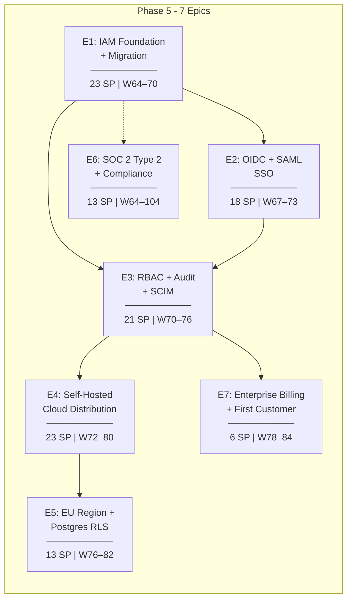
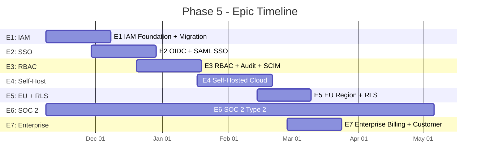
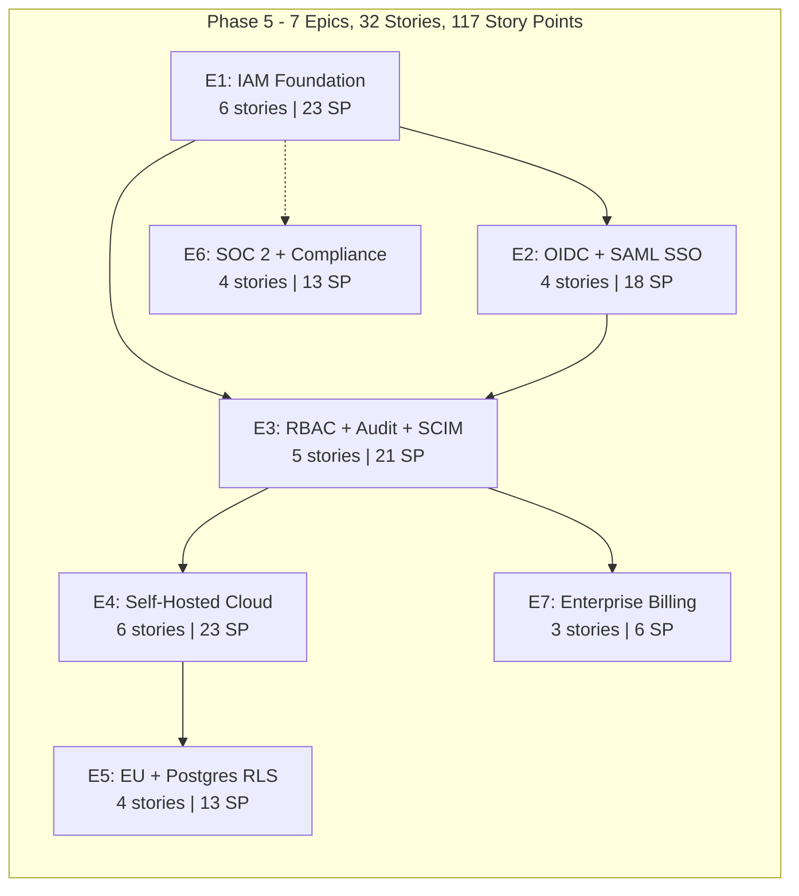

# Inkfoot — Phase 5: Development Epics

> **Phase:** 5 — Enterprise
> **Theme:** Become a credible enterprise procurement candidate.
> **Timeline:** Calendar weeks **64–104** elapsed (E6 SOC 2 Type 2 runs the full 40-week observation window and dominates the tail). Focused-dev burn ≈ **80 working days** for the 117 SP across E1–E5 + E7 — those finish around week 84; E6 then runs in parallel as evidence collection rather than active development. "Phase exit" means the **last milestone in this doc lands**, not the last calendar week elapses.
> **Total Story Points:** 117
> **Document Version:** 1.0
> **Last Updated:** 2026-05-25
> **Builds On:** `inkfoot_phase4_development_epics.md` v1.0
> **Aligned With:** `phase-5-enterprise.md`
>
> **Outcome gate:** entered only after Phase 4 go-signal (MRR MoM ≥ 15%
> + ≥ 1 Team-tier customer for ≥ 3 months + enterprise-adjacent sales
> conversations). Phase 5 is **demand-driven** — items beyond the
> ones in this doc ship only when a paying enterprise prospect asks
> for them with revenue commitment. Phase 5 transitions into normal
> SaaS scale-up operations once the milestones in §13 are met.

---

## Epic Overview

> **Unit convention.** Gantt bar durations (`Nd`) are **calendar days**;
> per-epic "Sprint" headers below are **working days** at 5/week. Same
> convention as Phase 0 — see Phase 0 epics doc for rationale. Note
> E6 (SOC 2) intentionally overlaps E1–E5 as evidence collection
> rather than active development; see §"Timeline" at the top of this
> doc.

---

## Story Point Scale

| Points | Effort |
|---|---|
| 1 | Trivial (< 1 hour) |
| 2 | Small (1–3 hours) |
| 3 | Medium (3–6 hours) |
| 5 | Large (1–1.5 days) |
| 8 | XL (1.5–2.5 days) |
| 13 | XXL (3–4 days) |

---

## E1: IAM Foundation + Migration

**Goal:** Land the full IAM schema (tenants, memberships, identities, sessions, audit_events) and migrate both Phase-3 API-key workspaces and Phase-4 self-serve users into it. Per phase-5-enterprise §4.1.

**Total Story Points:** 23
**Sprint:** Week 64–70 (Days 1–30)
**Dependencies:** Phase 4 (self-serve users table per §4.7.1)

---

### E1-S1: IAM Schema Migration

**Story:** As Cloud Postgres, I need the full IAM schema from phase-5-enterprise §4.1 added in one Alembic migration.

**Story Points:** 5

**Tasks:**

| # | Task | File(s) | Details |
|---|---|---|---|
| T1 | Alembic IAM migration | `inkfoot-cloud/alembic/versions/0xxx_iam.py` | tenants (enriched: slug, region, mode, plan); memberships; identities; sessions; audit_events; scim_clients; sso_providers. |
| T2 | Indexes | (same file) | sessions(token_hash) UNIQUE; identities by (kind, subject); memberships(tenant_id) + (user_id, tenant_id) UNIQUE. |
| T3 | Tests | `tests/integration/test_iam_schema.py` | testcontainer PG; up + down clean. |

**Acceptance Criteria:**
- [ ] All tables created with documented indexes.
- [ ] `down` migration removes them cleanly.

---

### E1-S2: Phase-3 API-Key Migration

**Story:** As the existing Phase-3 customers, I need their API keys migrated into the new IAM model without disrupting access.

**Story Points:** 5

**Tasks:**

| # | Task | File(s) | Details |
|---|---|---|---|
| T1 | Migration runner | `inkfoot-cloud/iam/migration_phase5.py` | Per phase-5-enterprise §4.1.1: create users for each tenant owner; create memberships; create identities of kind=api_key from existing api_keys; backfill tenant_id on runs/events. |
| T2 | Idempotency | (same file) | Safe to re-run after partial migration. |
| T3 | Audit row per migrated user | (same file) | Emit audit_events row so the audit trail starts at Phase 5 day one. |
| T4 | Tests | `tests/integration/test_iam_migration_phase3.py` | Existing Phase-3 corpus migrates; old API keys still work. |

**Acceptance Criteria:**
- [ ] Migration is idempotent.
- [ ] Old API keys still authenticate post-migration.
- [ ] One audit row emitted per migrated user.

---

### E1-S3: Phase-4 Self-Serve User Migration

**Story:** As Phase-4 self-serve users (per Phase 4 §4.7.1), I need their accounts merged into the new IAM model without forced password reset.

**Story Points:** 3

**Tasks:**

| # | Task | File(s) | Details |
|---|---|---|---|
| T1 | Migration runner | `inkfoot-cloud/iam/migration_phase5.py` (continued) | Per phase-5-enterprise §4.1.2: Phase-4 users → IAM users + identities of kind=password + memberships. Argon2id hash carries over (matches new identities table). |
| T2 | Audit row per migrated user | (same file) | Same as E1-S2. |
| T3 | Tests | `tests/integration/test_iam_migration_phase4.py` | Phase-4 password login still works post-migration. |

**Acceptance Criteria:**
- [ ] No forced password reset for Phase-4 users.
- [ ] Login with old credentials succeeds after migration.

---

### E1-S4: Session Model + Cookie Management

**Story:** As the auth layer, I need server-side opaque sessions with cookie issuance + renewal + revocation.

**Story Points:** 5

**Tasks:**

| # | Task | File(s) | Details |
|---|---|---|---|
| T1 | Session create | `inkfoot-cloud/auth/session.py` | 256-bit token; hashed with pepper; stored in sessions table. |
| T2 | Cookie issuance | `inkfoot-cloud/auth/cookies.py` | HttpOnly, Secure, SameSite=Lax (relax to Strict for non-SSO paths). |
| T3 | Renewal | `inkfoot-cloud/auth/session.py` | Bump last_seen_at; re-issue cookie when within 7 days of expiry. |
| T4 | Revoke + list-my-sessions | `inkfoot-cloud/auth/session.py` | `POST /auth/sessions/{id}/revoke`; `GET /auth/sessions`. |
| T5 | Tests | `tests/integration/test_sessions.py` | Cookie lifecycle round-trip; revoke works. |

**Acceptance Criteria:**
- [ ] Session cookies HttpOnly + Secure.
- [ ] Revoke ends the session within 5 min.

---

### E1-S5: Password Login + Logout + `auth/me`

**Story:** As an existing user, I need password login + logout + `GET /auth/me`.

**Story Points:** 3

**Tasks:**

| # | Task | File(s) | Details |
|---|---|---|---|
| T1 | `POST /auth/login` | `inkfoot-cloud/api/auth.py` | Verify password; mint session; return cookie. |
| T2 | `POST /auth/logout` | `inkfoot-cloud/api/auth.py` | Revoke current session. |
| T3 | `GET /auth/me` | `inkfoot-cloud/api/auth.py` | Returns current principal. |
| T4 | Tests | `tests/integration/test_password_login.py` | Round-trip. |

**Acceptance Criteria:**
- [ ] Password login works against the migrated Phase-4 user.
- [ ] Logout revokes the cookie immediately.

---

### E1-S6: `CurrentUser` + `ActiveTenant` Dependencies

**Story:** As every protected route, I need `Depends(CurrentUser)` + `Depends(ActiveTenant)` that resolve session → user → active-tenant.

**Story Points:** 2

**Tasks:**

| # | Task | File(s) | Details |
|---|---|---|---|
| T1 | `CurrentUser` dependency | `inkfoot-cloud/auth/dependencies.py` | Reads cookie; loads session; returns Principal. |
| T2 | `ActiveTenant` dependency | `inkfoot-cloud/auth/dependencies.py` | Picks tenant from header or session default. |
| T3 | Tests | `tests/integration/test_dependencies.py` | Unprotected vs protected; multi-tenant user switching. |

**Acceptance Criteria:**
- [ ] Unauthenticated request to protected route → 401.
- [ ] User in multiple tenants can switch via header.

---

## E2: OIDC + SAML SSO

**Goal:** Ship OIDC SSO (Google, Azure Entra, Okta) + SAML SSO with identity-linking rules per phase-5-enterprise §4.2 / §4.3. Per ADR-3-5: API keys still work alongside.

**Total Story Points:** 18
**Sprint:** Week 67–73 (Days 15–45)
**Dependencies:** E1 (IAM schema + sessions)

---

### E2-S1: SSO Provider Configuration UI + Storage

**Story:** As a workspace owner, I need to configure an OIDC or SAML provider for my tenant.

**Story Points:** 3

**Tasks:**

| # | Task | File(s) | Details |
|---|---|---|---|
| T1 | `POST /api/v1/tenants/{id}/sso_providers` | `inkfoot-cloud/api/tenants.py` | CRUD for sso_providers. |
| T2 | Frontend config UI | `frontend/views/SSOConfig.tsx` | Form per provider kind. |
| T3 | Tests | `tests/integration/test_sso_config.py` | CRUD works; owner-only access. |

**Acceptance Criteria:**
- [ ] Owner can configure an OIDC provider; non-owners get 403.

---

### E2-S2: OIDC Auth Router (Google + Azure Entra + Okta)

**Story:** As an OIDC SSO user, I need `/auth/sso/start` → IdP → `/auth/sso/callback` → session.

**Story Points:** 8

**Tasks:**

| # | Task | File(s) | Details |
|---|---|---|---|
| T1 | OIDC client | `inkfoot-cloud/auth/oidc.py` | `authlib`-based; per-IdP config from sso_providers. |
| T2 | State + nonce | (same file) | Signed state with tenant id + return URL; nonce for replay protection. |
| T3 | `/auth/sso/start` | `inkfoot-cloud/api/auth.py` | Build IdP authorize URL; 302. |
| T4 | `/auth/sso/callback` | `inkfoot-cloud/api/auth.py` | Token exchange; verify id_token via JWKS; identity-linking. |
| T5 | Identity-linking rules | `inkfoot-cloud/auth/identity_linking.py` | Per phase-5-enterprise §4.2: auto-link only on `email_verified=true` + matching email. |
| T6 | Per-IdP integration tests | `tests/integration/test_oidc_google.py`, `test_oidc_azure.py`, `test_oidc_okta.py` | Mocked IdPs per family. |

**Acceptance Criteria:**
- [ ] Full OIDC code flow works against Google + Azure Entra + Okta.
- [ ] Identity-linking refuses to link on unverified email.
- [ ] State + nonce verified.

---

### E2-S3: SAML 2.0 SSO

**Story:** As an enterprise SAML user, I need `/auth/saml/start` → IdP → `/auth/saml/acs` → session.

**Story Points:** 5

**Tasks:**

| # | Task | File(s) | Details |
|---|---|---|---|
| T1 | SAML client | `inkfoot-cloud/auth/saml.py` | `python3-saml`-based; AuthnRequest signing; SAMLResponse validation (signature + audience + recipient + NotOnOrAfter). |
| T2 | `/auth/saml/start` | `inkfoot-cloud/api/auth.py` | Build signed AuthnRequest; 302 with SAMLRequest. |
| T3 | `/auth/saml/acs` | `inkfoot-cloud/api/auth.py` | Validate SAMLResponse; identity-linking. |
| T4 | Tests | `tests/integration/test_saml.py` | One reference IdP (Okta IDP-initiated). |

**Acceptance Criteria:**
- [ ] SAML signature validation correct.
- [ ] AuthnRequest signed with our SP cert.

---

### E2-S4: Cross-IdP Identity-Linking Edge Cases

**Story:** As a user that exists in two SSO providers, I need merge / link UX so I'm not duplicated across providers.

**Story Points:** 2

**Tasks:**

| # | Task | File(s) | Details |
|---|---|---|---|
| T1 | Link-existing-identity flow | `inkfoot-cloud/api/auth.py` | When a verified email matches an existing user, prompt to link the new identity. |
| T2 | Settings → identities page | `frontend/views/Identities.tsx` | List + add + remove identities. |
| T3 | Tests | `tests/integration/test_identity_linking.py` | Verified email auto-links; unverified rejects. |

**Acceptance Criteria:**
- [ ] User with both Google + Okta identities sees them in Settings.
- [ ] Removing one identity doesn't lock the user out (last-identity protection).

---

## E3: RBAC + Audit + SCIM

**Goal:** Make `RequireRole` real enforcement (was a Phase-3/4 no-op stub); ship the audit-log writer + query API + export; SCIM provisioning for directory-managed customers.

**Total Story Points:** 21
**Sprint:** Week 70–76 (Days 30–60)
**Dependencies:** E1 (IAM schema), E2 (SSO for SCIM linkage)

---

### E3-S1: RBAC Enforcement

**Story:** As every protected route, I need `Depends(RequireRole(...))` that actually checks the membership.role against the role hierarchy.

**Story Points:** 5

**Tasks:**

| # | Task | File(s) | Details |
|---|---|---|---|
| T1 | `RequireRole` real implementation | `inkfoot-cloud/auth/rbac.py` | Replace the Phase-3/4 no-op stub. Loads membership; checks role; raises 403 if insufficient. |
| T2 | Role-permissions map | `inkfoot-cloud/auth/permissions.py` | Per phase-5-enterprise §4.4 table: owner/admin/member/viewer. |
| T3 | Wiring on every protected route | `inkfoot-cloud/api/*.py` | Add `Depends(RequireRole("admin"))` etc. on every route per the permissions table. |
| T4 | Tests | `tests/integration/test_rbac.py` | Per role × every protected route → expected 200/403 matrix. |

**Acceptance Criteria:**
- [ ] Viewer cannot invite users → 403.
- [ ] Admin can manage connectors → 200.
- [ ] Owner can change billing → 200.

---

### E3-S2: Audit Log Writer + Async Queue

**Story:** As every privileged action, I need an audit_events row written via an async queue so the hot path isn't blocked.

**Story Points:** 5

**Tasks:**

| # | Task | File(s) | Details |
|---|---|---|---|
| T1 | Audit decorator | `inkfoot-cloud/audit/decorator.py` | `@audit(action="iam.user.invited", target_kind="user")` on routes. Captures actor, target, before/after, ip, ua. |
| T2 | Async writer | `inkfoot-cloud/audit/writer.py` | Per phase-5-enterprise §4.6: enqueue to Redis; worker drains in batches; at-least-once. |
| T3 | Audit-events partitioning | `inkfoot-cloud/alembic/versions/0xxx_audit_partition.py` | Partition by month; old partitions retention-policy-driven. |
| T4 | Tests | `tests/integration/test_audit.py` | Privileged action emits an audit row asynchronously. |

**Acceptance Criteria:**
- [ ] Audit row visible within 30 s of the action.
- [ ] Hot-path latency unaffected by audit writes.
- [ ] At-least-once semantics: duplicate rows possible, deduplicated by `id`.

---

### E3-S3: Audit Query API + Export

**Story:** As a customer auditor, I want to filter the audit log + export to CSV / JSON.

**Story Points:** 3

**Tasks:**

| # | Task | File(s) | Details |
|---|---|---|---|
| T1 | `GET /api/v1/audit` | `inkfoot-cloud/api/audit.py` | Filters: action, actor, target_kind, time-range. Paginated. RBAC: admin+. |
| T2 | `GET /api/v1/audit/export` | `inkfoot-cloud/api/audit.py` | Streams CSV / JSON for the given filter. |
| T3 | Tests | `tests/integration/test_audit_query.py` | Filters work; export is streaming. |

**Acceptance Criteria:**
- [ ] Audit log retains ≥ 1 year (configurable per tenant).
- [ ] Export of 100k rows streams without OOM.

---

### E3-S4: SCIM v2 Provisioning (Users)

**Story:** As a customer's IdP admin, I need SCIM v2 endpoints so I can provision/deprovision users.

**Story Points:** 5

**Tasks:**

| # | Task | File(s) | Details |
|---|---|---|---|
| T1 | SCIM client setup | `inkfoot-cloud/scim/routes.py` | `POST /api/v1/tenants/{id}/scim_clients` for per-tenant bearer token. |
| T2 | `POST /scim/v2/Users` | `inkfoot-cloud/scim/routes.py` | Create user + identity + membership. |
| T3 | `PATCH /scim/v2/Users/{id}` | (same) | Update display name / email (re-verification required). |
| T4 | `DELETE /scim/v2/Users/{id}` | (same) | Soft-delete; revoke sessions. |
| T5 | `GET /scim/v2/Users` | (same) | Standard SCIM filter syntax. |
| T6 | Per-IdP smoke tests | `tests/integration/test_scim_okta.py`, `test_scim_azure.py` | Reference IdPs. |

**Acceptance Criteria:**
- [ ] Okta + Azure Entra can provision a user end-to-end.
- [ ] Deprovision revokes sessions immediately.

---

### E3-S5: SCIM Group → Role Mapping (Opt-In)

**Story:** As an admin who manages roles in IdP groups, I want a per-tenant SCIM-group → Inkfoot-role mapping.

**Story Points:** 3

**Tasks:**

| # | Task | File(s) | Details |
|---|---|---|---|
| T1 | Mapping CRUD | `inkfoot-cloud/scim/group_mapping.py` | Per-tenant `(idp_group_name, inkfoot_role)` rows. |
| T2 | SCIM group ops | `inkfoot-cloud/scim/routes.py` | `POST /scim/v2/Groups`; opt-in per tenant (per ADR-5-8). |
| T3 | Setup-wizard | `frontend/views/SCIMSetup.tsx` | Per ADR-5-3: explicit per-tenant configuration. |

**Acceptance Criteria:**
- [ ] Group ops disabled by default; opt-in per tenant.
- [ ] Mapping changes audited.

---

## E4: Self-Hosted Cloud Distribution

**Goal:** Ship Docker Compose + Helm chart so customers can run Inkfoot in their own VPC. Per ADR-5-1: same codebase, flag-gated.

**Total Story Points:** 23
**Sprint:** Week 72–80 (Days 40–80)
**Dependencies:** E1, E2, E3 (full IAM is the gate to enterprise self-host)

---

### E4-S1: License Key Verifier

**Story:** As the self-hosted gate, I need offline-verifiable license keys per ADR-5-6.

**Story Points:** 5

**Tasks:**

| # | Task | File(s) | Details |
|---|---|---|---|
| T1 | Key issuance | (internal tooling) | Inkfoot's private key signs license payloads (tenant_id, plan, expiry). |
| T2 | Verifier | `inkfoot-cloud/license/verifier.py` | Bundled public key; verifies offline at boot. |
| T3 | Read-only mode on expiry | `inkfoot-cloud/license/enforcement.py` | Expired → no new event ingest, but existing data remains readable. |
| T4 | Tests | `tests/integration/test_license.py` | Valid + expired + tampered. |

**Acceptance Criteria:**
- [ ] Expired license → pod boots in read-only mode with clear log line.
- [ ] Tampered license → pod refuses to start.

---

### E4-S2: Customer-Provided KMS Integration

**Story:** As a self-hosted customer, I need to point Inkfoot at my own KMS (AWS / GCP / Vault).

**Story Points:** 5

**Tasks:**

| # | Task | File(s) | Details |
|---|---|---|---|
| T1 | KMS abstraction | `inkfoot-cloud/kms/client.py` | Interface common to AWS KMS, GCP KMS, Vault Transit. |
| T2 | AWS KMS impl | `inkfoot-cloud/kms/aws.py` | Existing implementation extended. |
| T3 | GCP KMS impl | `inkfoot-cloud/kms/gcp.py` | New. |
| T4 | Vault Transit impl | `inkfoot-cloud/kms/vault.py` | New. |
| T5 | Tests | `tests/integration/test_kms.py` | Each backend round-trips a DEK envelope. |

**Acceptance Criteria:**
- [ ] Customer can configure KMS via values.yaml.
- [ ] All three KMS backends pass the contract test.

---

### E4-S3: Docker Compose Distribution

**Story:** As a small-deployment self-hoster, I need a Docker Compose file that runs the full stack.

**Story Points:** 3

**Tasks:**

| # | Task | File(s) | Details |
|---|---|---|---|
| T1 | Compose file | `inkfoot-cloud/self_hosted/compose/docker-compose.yml` | api + workers + Postgres + Redis. |
| T2 | Initial-setup script | `inkfoot-cloud/self_hosted/compose/setup.sh` | Generate first owner user + first license. |
| T3 | Operator docs | `docs/operations/self-hosted-compose.md` | End-to-end guide. |

**Acceptance Criteria:**
- [ ] `docker compose up -d` works in a fresh customer VPC.
- [ ] Setup script creates the first owner.

---

### E4-S4: Helm Chart Distribution

**Story:** As a Kubernetes-deploying self-hoster, I need a Helm chart.

**Story Points:** 5

**Tasks:**

| # | Task | File(s) | Details |
|---|---|---|---|
| T1 | Helm chart | `inkfoot-cloud/self_hosted/helm/` | Standard chart: api Deployment, workers Deployment, Service, Ingress, secrets. |
| T2 | values.yaml | `inkfoot-cloud/self_hosted/helm/values.yaml.example` | Per phase-5-enterprise §6.2: license_key, KMS config, Postgres URL, Redis URL, SMTP, SSO providers, retention. |
| T3 | OCI registry publish | (operational) | Publish to Inkfoot's OCI registry. |
| T4 | Tests | `tests/integration/test_helm.py` | `helm install` against a kind cluster; readiness probe passes. |

**Acceptance Criteria:**
- [ ] Helm install works on kind + GKE + EKS.

---

### E4-S5: Signed Images + SBOM

**Story:** As a customer security review, I need cosign-signed images + an SBOM per release.

**Story Points:** 3

**Tasks:**

| # | Task | File(s) | Details |
|---|---|---|---|
| T1 | cosign signing in CI | `.github/workflows/release-image.yml` | Sign images on tag push. |
| T2 | SBOM generation | (same file) | CycloneDX or SPDX. |
| T3 | Helm chart verification policy | `inkfoot-cloud/self_hosted/helm/templates/_helpers.tpl` | `imagePullPolicy` + sigstore verification. |

**Acceptance Criteria:**
- [ ] Each released image is cosign-signed.
- [ ] SBOM downloadable from the release.

---

### E4-S6: Self-Hosted Quarterly Drill

**Story:** As release hygiene, I need a quarterly self-host install drill to catch divergence between managed + self-hosted.

**Story Points:** 2

**Tasks:**

| # | Task | File(s) | Details |
|---|---|---|---|
| T1 | Drill runbook | `docs/internal/self-host-drill.md` | Quarterly install in a clean environment; sanity test; report findings. |
| T2 | CI smoke against compose | `.github/workflows/self-host-smoke.yml` | Every PR runs the compose stack and basic smoke. |

**Acceptance Criteria:**
- [ ] First drill complete; report captured.

---

## E5: EU Region + Postgres RLS

**Goal:** EU region (Frankfurt) as an independent deployment with no cross-region transfer; Postgres RLS as defense-in-depth on tenant isolation.

**Total Story Points:** 13
**Sprint:** Week 76–82 (Days 60–90)
**Dependencies:** E1–E4 (multi-region + IAM combined)

---

### E5-S1: EU Region Deployment

**Story:** As an EU customer, I need to create my tenant in the EU region with no cross-region data transfer.

**Story Points:** 5

**Tasks:**

| # | Task | File(s) | Details |
|---|---|---|---|
| T1 | Infra setup (Frankfurt) | (Terraform / cloud-specific) | Postgres + Redis + KMS in eu-central-1. |
| T2 | Region selection at tenant create | `inkfoot-cloud/api/signup.py` | `region: us|eu` field; immutable per phase-5-enterprise §4.8. |
| T3 | DNS-based routing | `inkfoot-cloud/region/router.py` | Tenant slug → region; route at the edge. |
| T4 | Cross-region guard | `inkfoot-cloud/region/guard.py` | Pod refuses to start if `INKFOOT_REGION` doesn't match the DB. |
| T5 | Tests | `tests/integration/test_eu_region.py` | EU tenant → EU API; US-routing rejected. |

**Acceptance Criteria:**
- [ ] EU tenant data lives only in EU region.
- [ ] Mis-configured pod refuses to start.

---

### E5-S2: No-Cross-Region-Migration Documentation

**Story:** As an honest constraint, I need the "no migration path" to appear in customer-facing docs.

**Story Points:** 2

**Tasks:**

| # | Task | File(s) | Details |
|---|---|---|---|
| T1 | Docs page | `docs/operations/regions.md` | Per ADR-5-4: regions are independent; no migration; pick at workspace creation. |
| T2 | Pricing page note | `inkfoot.dev/pricing` | Region selection callout at signup. |

**Acceptance Criteria:**
- [ ] Docs explain "no cross-region migration" prominently.

---

### E5-S3: Postgres Row-Level Security

**Story:** As defense-in-depth on tenant isolation, I need Postgres RLS on every tenanted table.

**Story Points:** 5

**Tasks:**

| # | Task | File(s) | Details |
|---|---|---|---|
| T1 | RLS migration | `inkfoot-cloud/alembic/versions/0xxx_rls.py` | `ENABLE ROW LEVEL SECURITY` + tenant-isolation policy per tenanted table. |
| T2 | `SET app.tenant_id` middleware | `inkfoot-cloud/db/rls_session.py` | After auth, before queries: set on the connection. |
| T3 | App-code scoping retained | (unchanged) | Both layers run; both must be correct (per ADR-5-2). |
| T4 | Tests | `tests/integration/test_rls.py` | Forgetting to set tenant_id → query returns nothing (RLS blocks). |

**Acceptance Criteria:**
- [ ] Forgetting `app.tenant_id` results in empty queries (defense in depth works).
- [ ] No measurable hot-path latency increase from RLS (< 1 ms p95).

---

### E5-S4: Tenant Data Export + Deletion

**Story:** As GDPR compliance, I need "give me everything you have" + "delete my tenant" endpoints.

**Story Points:** 1

**Tasks:**

| # | Task | File(s) | Details |
|---|---|---|---|
| T1 | `POST /api/v1/tenants/{id}/data_export` | `inkfoot-cloud/api/data_export.py` | Streams CSV/JSON; per-request retention. |
| T2 | `DELETE /api/v1/tenants/{id}` | `inkfoot-cloud/api/tenants.py` | Soft-delete with 30-day hard-delete window. |
| T3 | Tests | `tests/integration/test_data_export.py` | Export contains all rows; deletion timeline honored. |

**Acceptance Criteria:**
- [ ] Data export turnaround ≤ 30 days per GDPR.
- [ ] Tenant deletion hard-deletes within 30 days (90 for backups).

---

## E6: SOC 2 Type 2 + Compliance

**Goal:** Pass a SOC 2 Type 2 audit. Phase 5 starts the readiness work in week 64 and the audit completes around week 100 (6-month observation period). Per ADR-5-5: SOC 2 first; ISO 27001 only on specific customer demand.

**Total Story Points:** 13
**Sprint:** Week 64–104 (the long arc)
**Dependencies:** E1–E5 (all controls touch the IAM + Cloud surface)

---

### E6-S1: SOC 2 Readiness Assessment

**Story:** As the audit prep, I need a gap analysis against the SOC 2 trust services criteria.

**Story Points:** 3

**Tasks:**

| # | Task | File(s) | Details |
|---|---|---|---|
| T1 | Engage auditor | (operational) | Sign-on with an SOC 2 auditor at week 64. |
| T2 | Gap analysis | `docs/internal/soc2-gaps.md` | Per phase-5-enterprise §4.11 control areas. |
| T3 | Remediation plan | `docs/internal/soc2-remediation.md` | Prioritised; owners per item. |

**Acceptance Criteria:**
- [ ] Gap analysis complete by week 68.
- [ ] Remediation plan owners + due dates assigned.

---

### E6-S2: Evidence Collection Pipeline

**Story:** As ongoing audit-readiness, I need an evidence-collection pipeline so the auditor sees real data, not snapshots.

**Story Points:** 5

**Tasks:**

| # | Task | File(s) | Details |
|---|---|---|---|
| T1 | Evidence repo | `compliance/evidence/` | Per-control evidence directory; auto-populated. |
| T2 | Change-management evidence | (process) | Tagged releases; signed commits; PR review evidence. |
| T3 | Access-review evidence | `compliance/access_reviews/` | Quarterly Inkfoot-employee access reviews. |
| T4 | Backup + DR drill evidence | `compliance/backups/` | Quarterly restore drills. |

**Acceptance Criteria:**
- [ ] Evidence repo populated continuously, not bulk-prepared.
- [ ] Quarterly access + DR drill cadence recorded.

---

### E6-S3: SOC 2 Type 1 Audit (Earlier Unlock)

**Story:** As an earlier procurement unlock, I want a Type 1 audit ~3 months in.

**Story Points:** 2

**Tasks:**

| # | Task | File(s) | Details |
|---|---|---|---|
| T1 | Type 1 engagement | (operational) | Auditor performs point-in-time control review. |
| T2 | Customer-facing Type 1 report | (operational) | Available under NDA. |

**Acceptance Criteria:**
- [ ] Type 1 report passed.
- [ ] Available to prospects under NDA.

---

### E6-S4: SOC 2 Type 2 Audit

**Story:** As enterprise procurement, I need a Type 2 audit covering a 6-month observation period.

**Story Points:** 3

**Tasks:**

| # | Task | File(s) | Details |
|---|---|---|---|
| T1 | Observation period | (process) | 6 months of consistent control operation. |
| T2 | Type 2 audit fieldwork | (operational) | Auditor on-site / remote review. |
| T3 | Public summary | (operational) | Type 2 report under NDA. |

**Acceptance Criteria:**
- [ ] Type 2 passed by week 100.

---

## E7: Enterprise Billing + First $100k ARR Customer

**Goal:** Annual / invoiced billing flow + SE playbook + first $100k ARR (or three at $30k each).

**Total Story Points:** 6
**Sprint:** Week 78–84 (Days 70–90)
**Dependencies:** E1–E3 (IAM + RBAC + audit are procurement-blockers)

---

### E7-S1: Invoiced Billing Flow

**Story:** As enterprise procurement, I need an invoiced billing flow (not Stripe-self-serve).

**Story Points:** 3

**Tasks:**

| # | Task | File(s) | Details |
|---|---|---|---|
| T1 | Enterprise plan flag | `inkfoot-cloud/billing/invoiced.py` | `plan='enterprise'` + `stripe_customer_id=NULL` marker. |
| T2 | Invoice generation | `inkfoot-cloud/billing/invoiced.py` | NET 30 / NET 60 templates. |
| T3 | Quota enforcement = contractual | (process) | Ops manually monitors; SE flags overage. |
| T4 | Tests | `tests/integration/test_invoiced_billing.py` | Enterprise plan disables Stripe webhooks; manual flow. |

**Acceptance Criteria:**
- [ ] Enterprise tenant doesn't trigger Stripe.
- [ ] Invoice template renders cleanly per period.

---

### E7-S2: SE Playbook + Reference-Customer Process

**Story:** As enterprise sales, I need a playbook so onboarding is consistent.

**Story Points:** 2

**Tasks:**

| # | Task | File(s) | Details |
|---|---|---|---|
| T1 | SE playbook | `docs/internal/se-playbook.md` | Onboarding sequence per phase-5-enterprise §7.1: legal → MSA + DPA → signature → workspace provision → SSO → SCIM → onboarding complete. |
| T2 | Sample contract templates | `legal/templates/MSA.docx`, `legal/templates/DPA.docx` | Reviewed by counsel. |
| T3 | Reference-customer publishing | `docs/internal/reference-customers.md` | Confidential roster + permission status. |

**Acceptance Criteria:**
- [ ] Playbook covers full procurement sequence.
- [ ] At least one published reference customer (with permission).

---

### E7-S3: Phase 5 Exit Criteria — Business Readiness

**Story:** As the Phase-5 DoD, I need ≥ 1 paying ≥ $100k ARR OR three ≥ $30k each.

**Story Points:** 1

**Tasks:**

| # | Task | File(s) | Details |
|---|---|---|---|
| T1 | ARR tracker | `docs/internal/arr.md` | Per-customer ARR + cumulative. |
| T2 | Phase 5 exit decision doc | `docs/internal/phase-5-exit.md` | Per phase-5-enterprise §11 + §12: procurement / operational / business readiness milestones. |

**Acceptance Criteria:**
- [ ] ARR tracker updated weekly.
- [ ] Exit doc signed off when all three readiness milestones met.

---

## Architecture-epic ↔ implementation-epic mapping

This doc's `E1`–`E7` consolidate the architecture's fourteen `EE*`
epics (see `phase-5-enterprise.md` §"Suggested epic breakdown"). Use
this table to trace from the phase architecture into the
implementation breakdown:

| This doc | Covers (from `phase-5-enterprise.md`) |
|---|---|
| **E1: IAM Foundation + Migration** | `EE1` (IAM schema migration: tenants, memberships, identities, sessions, audit_events) |
| **E2: OIDC + SAML SSO** | `EE2` (OIDC: Google + Entra + Okta) + `EE5` (SAML SSO; SCIM split into E3) |
| **E3: RBAC + Audit + SCIM** | `EE3` (RBAC enforcement) + `EE4` (audit log writer + query + export) + the SCIM-provisioning half of `EE5` |
| **E4: Self-Hosted Cloud Distribution** | `EE6` (Docker Compose + Helm + license verifier; cosign + SBOM) |
| **E5: EU Region + Postgres RLS** | `EE7` (EU region) + `EE8` (Postgres RLS) + `EE11` (per-tenant data export, GDPR-aligned) |
| **E6: SOC 2 Type 2 + Compliance** | `EE9` (SOC 2 Type 2) + `EE12` (HIPAA BAA template + scoping doc) |
| **E7: Enterprise Billing + First $100k ARR Customer** | `EE10` (annual / invoiced billing) + `EE13` (SE playbook) + `EE14` (reference customers / case studies) |

---

## Summary

| Epic | Stories | Story Points | Weeks | Key Deliverable |
|---|---|---|---|---|
| E1: IAM Foundation + Migration | 6 | 23 | 64–70 | Full IAM schema; Phase-3 + Phase-4 user migration |
| E2: OIDC + SAML SSO | 4 | 18 | 67–73 | Google + Entra + Okta OIDC + SAML |
| E3: RBAC + Audit + SCIM | 5 | 21 | 70–76 | Real role enforcement + audit log + SCIM provisioning |
| E4: Self-Hosted Cloud | 6 | 23 | 72–80 | Docker Compose + Helm + cosign-signed images + SBOM |
| E5: EU Region + Postgres RLS | 4 | 13 | 76–82 | Frankfurt region + RLS defense-in-depth |
| E6: SOC 2 Type 2 | 4 | 13 | 64–104 | Type 1 (~mid-phase) + Type 2 (~phase end) |
| E7: Enterprise Billing + First Customer | 3 | 6 | 78–84 | Invoiced billing + SE playbook + first $100k ARR |
| **Total** | **32** | **117** | **Weeks 64–104 elapsed (E6 SOC 2 Type 2 dominates the tail); ~117 SP ≈ ~80 working days of focused dev** | **Phase 5 milestones met — enterprise-procurement-ready** |

---

## Risks & Trade-offs (Phase 5-wide)

| Risk | Affected Epic | Mitigation |
|---|---|---|
| SOC 2 audit slips | E6 | Engage auditor at week 64; pre-audit readiness; document evidence from Phase 3 forward |
| Self-hosted code diverges from managed | E4 | ADR-5-1 same codebase; quarterly drill |
| SSO integration edge cases (Azure Entra group claims, Okta App-Launch) | E2 | Start Google (cleanest); validate Entra + Okta against a real customer IdP before broader launch |
| EU operational complexity (cross-region traffic) | E5 | Fully independent regions; no migration; documented |
| Pricing power vs procurement negotiation | E7 | Tie Enterprise pricing to invoice-reconciled savings the CFO can see |
| HIPAA scope creep | (cross-cutting) | Metadata-only posture narrows BAA scope; refuse PHI-bearing feature requests |
| License-key theft | E4-S1 | Annual licenses; renewal-based rotation |
| SCIM group→role mis-mapping | E3-S5 | Opt-in per tenant; explicit setup wizard; audit-log every group change |

---

## Out-of-Scope Reminders

- **ISO 27001** — only on specific customer demand (per ADR-5-5).
- **HIPAA BAA** — narrow scope only; refuse PHI-bearing feature requests.
- **Per-customer code branches** — flag-gated via tenant config; never per-customer code.
- **Cross-region migration** — accepted constraint per ADR-5-4.

---

*Phase 5 transitions Inkfoot into normal SaaS scale-up operations once the milestones in §13 are met. Continued investment is justified by standard scale-up signals: NRR ≥ 110%, LTV/CAC, magic number — not phase gates.*
